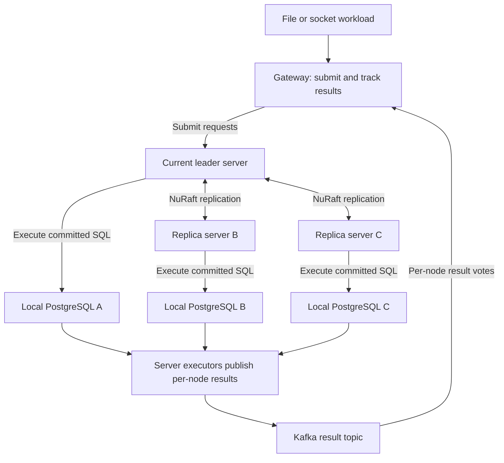
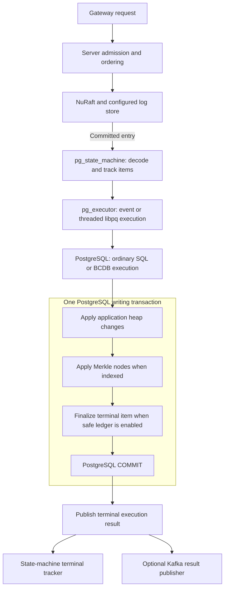
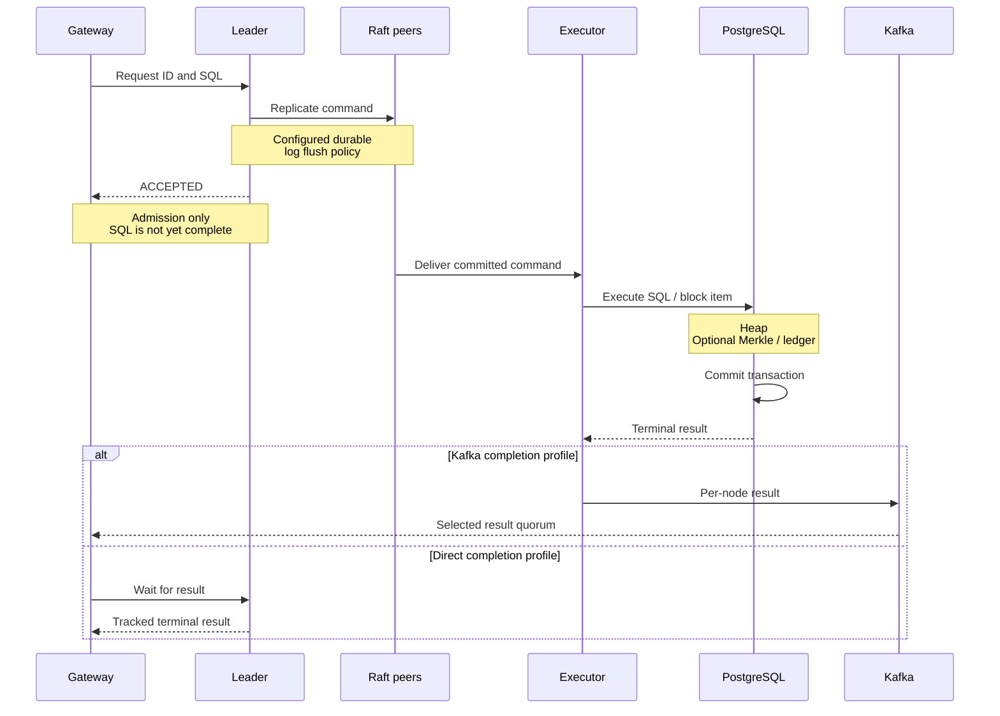
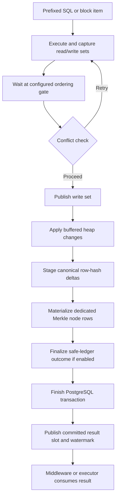
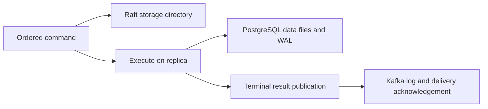
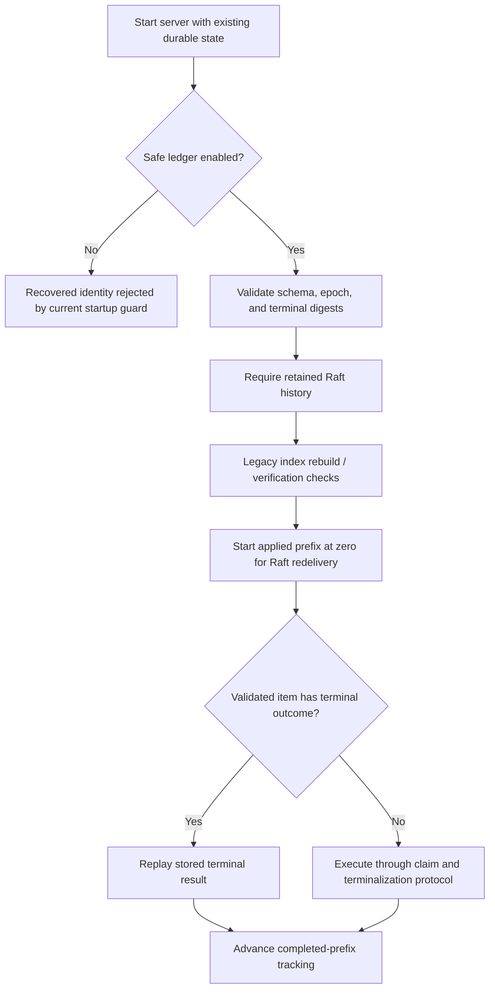
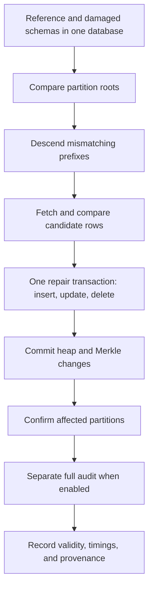

# AriaBC distributed architecture diagrams

Reviewed against the working tree on **2026-09-22**. These diagrams show logical
roles, transaction boundaries, and completion signals. Host addresses, node
counts, thread pools, and durability settings come from the selected deployment
profile; they are not fixed properties of the architecture.

For exact options and source links, see the
[gateway/server architecture](ariabc_pg/ARIABC_PG_ARCHITECTURE.md). For the
PostgreSQL internals, see [BCDB/Merkle flow](ARIABC_BCNDB_MERKLE_FLOW.md) and the
[Merkle implementation reference](MERKLE_INDEX_COMPLETE_DETAILS.md).

## 1. Logical cluster topology

A common deployment is one gateway and three server/database replicas. The
leader is elected; it is not permanently tied to a host. Kafka brokers are a
separate service and can have a different placement from the database replicas.

This shows the Kafka-enabled result path. Direct completion instead uses server
terminal-result waits or fused submit-and-wait replies. Submission policies can
send to multiple nodes, with admission/order handling at the server; the diagram
shows the leader's ordering role, not every socket opened by every policy.

NuRaft replicates commands between servers. It does not replicate PostgreSQL
heap pages. Each committed command is executed against each server's database.
The gateway is not itself a PostgreSQL voting replica, so the four-node runner's
name does not imply four database replicas.

## 2. Inside one replica

Merkle and ledger are independently optional. With an index attached, Merkle
node writes belong to the heap transaction. With safe-ledger execution enabled,
the terminal item is persisted as part of the applicable transaction protocol.
A BCDB block has separately committed items, not one transaction for the whole
block.

The executor's libpq pool, BCDB workers, NuRaft ASIO pool, and gateway client
workers serve different purposes. Changing executor-worker count does not
implicitly change the others. Binary defaults and runner-selected profiles also
differ: the current distributed runner selects event execution, while the
server binary's executor fallback is threaded.

## 3. From request to client completion

The sequence summarizes replicated execution; several entries and transactions
can be in flight concurrently. Raft commit orders application delivery, while
PostgreSQL transaction completion happens later. With asynchronous durable Raft
flush enabled, writes can be coalesced and `fdatasync` completion is reported to
NuRaft. An individual append is not documented as an unconditional synchronous
flush before any replication begins.

| Signal | What it establishes | What still needs separate evidence |
|---|---|---|
| `ACCEPTED` | Submission/admission acknowledgement | Successful SQL execution and replica completion |
| Raft commit | Consensus delivery of an ordered command | Local PostgreSQL application and terminal outcome |
| PostgreSQL terminal success | Local transaction finished through its execution path | Other replicas and final dataset equality |
| Kafka majority result | Matching votes satisfy the selected result policy | Completion/audit of replicas outside that majority |
| All-node post-marker audit | Required replicas reached the barrier and passed configured checks | Any stronger check not included in that audit |

The `majority_async_all3` policy can release client work at majority, then drain
all-three audit work before declaring the run successful. It is not an all-node
barrier at each majority response. Result hash agreement also does not replace a
full database comparison. Kafka divergence reporting does not automatically
launch sparse Merkle repair.

## 4. Deterministic execution and Merkle maintenance

This is the successful writing path with Merkle attached. Read-only, error, and
retry branches have their own handling. In the current default ordering-gate
mode, write-set publication can permit a successor's work before its predecessor
has committed. The committed watermark and result-slot publication remain after
transaction finish. Do not use the published-write-set watermark as proof of
PostgreSQL commit.

Deltas are transaction-local, coalesced by XOR, and applied before commit. The
node relation is `ariabc_internal.merkle_node_<index_oid>`; PostgreSQL MVCC/WAL
handles its writes. There is no deferred Merkle replay worker between commit and
result publication. A rollback rolls back the corresponding heap/node work.
See the [backend flow](ARIABC_BCNDB_MERKLE_FLOW.md) for ordering-gate variants,
subtransaction retry handling, and release/acquire result-slot publication.

## 5. Separate persistence boundaries

| Domain | Persistent state | Boundary / limitation |
|---|---|---|
| Durable Raft store | Identity, server state, membership, manifest, segmented command log | Recovers ordered commands; contains no PostgreSQL data snapshot |
| PostgreSQL | Application heap, dedicated Merkle nodes, optional terminal ledger | Database transaction and configured WAL durability |
| Kafka | Published result records | Producer/broker acknowledgement policy; not a PostgreSQL commit mechanism |

The current durable store uses `--raft-storage-dir`, with `identity.bin`,
`srv_state.bin`, `cluster_config.bin`, `storage_ready.bin`, directory ownership
locking, and `log/manifest.bin`. Segment names follow
`segment_<20-digit-first-index>_g<20-digit-generation>.log`. The default segment
target is 64 MiB. A separate `watermark.bin` is not part of this implementation.
See [durable_state_mgr.cxx](ariabc_pg/src/durable_state_mgr.cxx) and
[durable_log_store.cxx](ariabc_pg/src/durable_log_store.cxx).

Kafka producer defaults differ: `result_fast` uses `acks=1` and zero linger;
`control_durable` uses `acks=all` and 5 ms linger. Linger can be overridden. Topic-leader readiness is
prepared before sending. Neither profile should be silently generalized into
an unconditional all-replica Kafka durability guarantee.

## 6. Safe-ledger restart path

The ledger binds items to an epoch, Raft log index, item ordinal, and manifest
digests. A CLAIMED row is not a successful terminal result. Stored successful
and deterministic-error outcomes have separate replay handling, while
nonterminal failure is not accepted as success.

Safe startup currently requires schema version 4 and retained log history
starting no later than index 1. It does not skip directly to the maximum ledger
index. Leader-assigned ordering is rejected with the safe ledger; use a
compatible preassigned ordering profile. Ordinary ledger-off benchmark defaults
are not a crash-safe restart contract.

NuRaft snapshot callbacks retain metadata rather than a PostgreSQL snapshot,
and durable log compaction is unsupported. The ledger prevents duplicate
application for validated replay identities; it does not make resubmissions
under arbitrary new identities exactly-once. See the
[safe-ledger details](ariabc_pg/ARIABC_PG_ARCHITECTURE.md) before configuring
restart experiments.

## 7. Sparse repair is a separate workflow

This is the current Python recovery benchmark, not an online replica-repair
service. It injects logical row differences through SQL, compares two schemas,
and uses a reference table as the repair source. It does not simulate arbitrary
physical page corruption or transfer a PostgreSQL snapshot between Raft nodes.

The default full audit includes bidirectional row comparison, root equality,
heap/root verification, and schema/index checks. It is outside the sparse
`restore_repair_ms` interval. Skipping that audit leaves targeted confirmation,
not a full equality proof. The [recovery architecture](Dynamic_merkle_docs/RECOVERY_ARCHITECTURE_ANALYSIS.md)
documents batching, statistics barriers, and timing boundaries.

## 8. Match a diagram to the run being evaluated

| Workload / profile | Applicable path |
|---|---|
| Direct `pg` | Local SQL; no distributed command-ordering path |
| Direct `bcdb_det` | Local deterministic execution without Merkle maintenance |
| Direct `bcdb_merkle` | Local deterministic execution with native Merkle maintenance |
| Gateway Raft/Kafka workload | Cluster topology, configured executor, selected result quorum |
| Safe-ledger recovery matrix | Replicated execution plus identity validation and terminal replay |
| Sparse Merkle repair benchmark | Reference/damaged-schema repair and independent audit |

For a distributed correctness claim, retain per-node completion and executor
counters, final audit counters, post-marker roots, process exit status, logs,
and source/build provenance. Require `divergence_count=0`,
`permanent_failures=0`, and the applicable post-marker/Merkle PASS checks.
A topology diagram, nominal worker count, or wrapper completion is not evidence
that a particular run satisfied those conditions.
