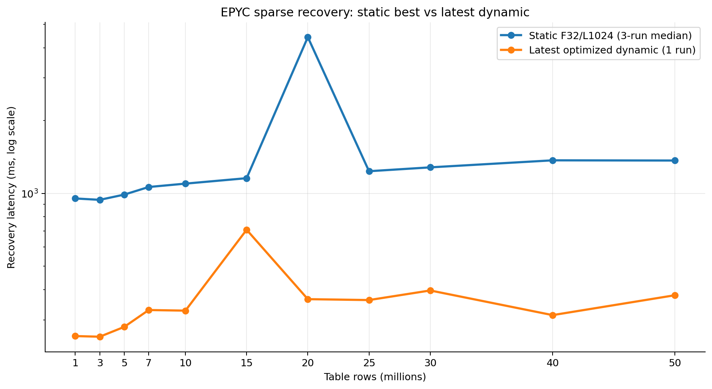
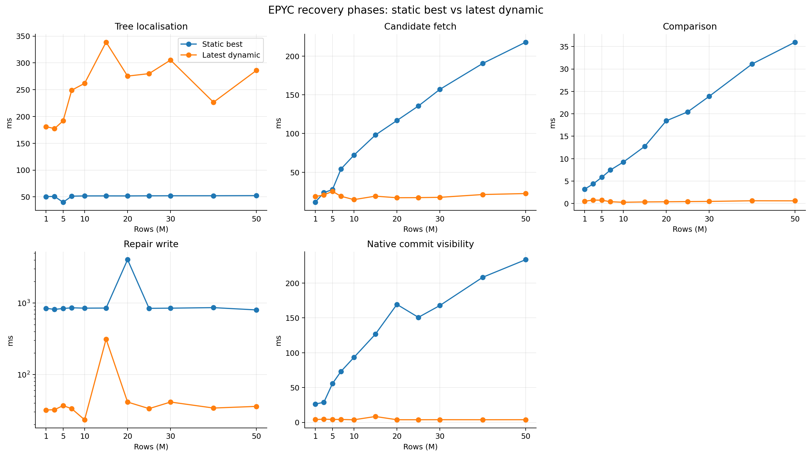
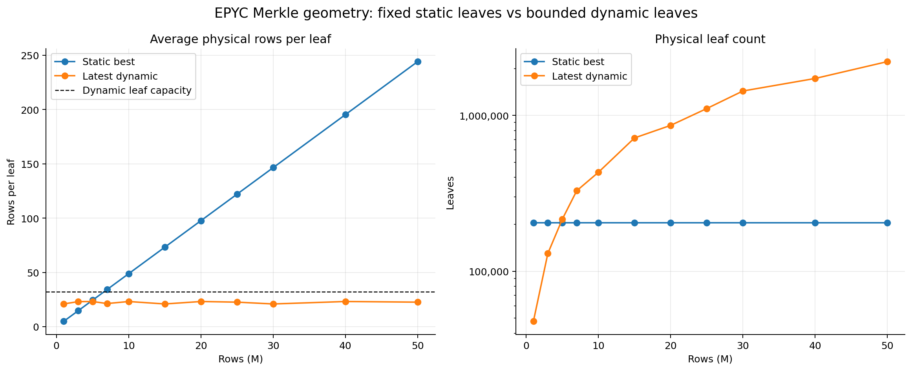
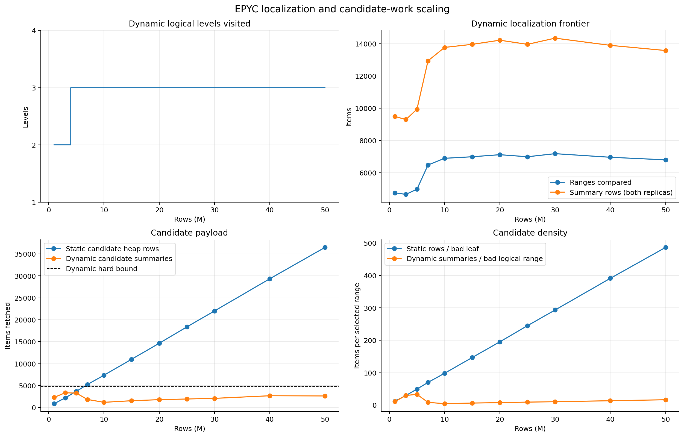

# Recovery Architecture Analysis

This report presents an authoritative recovery performance comparison for the PostgreSQL-based AriaBC deterministic concurrency control system on the AMD EPYC platform (`user-MZ73-LM0-000`). It compares the **best static F32/L1024 EPYC full sweep** against **yesterday's best dynamic EPYC run** (`20260720T105842Z`) and **today's latest dynamic EPYC run** (`20260720T214640Z`).

---

## Authoritative Artifacts and Comparison Contract

```text
best static EPYC artifact (F32/L1024, three repetitions):
scripts/benchmark/recovery/fetched/
  ariabc-recovery-best-scaling-f32-l1024-k75-c300-20260714T040459Z-0068d0

yesterday best optimized native-dynamic EPYC artifact (one repetition, 2026-07-20T10:58:42Z):
scripts/benchmark/recovery/fetched/
  ariabc-recovery-dynamic-size-scaling-k75-c300-20260720T105842Z-00c5e9

today latest optimized native-dynamic EPYC artifact (one repetition, 2026-07-20T21:46:40Z / 2026-07-21):
scripts/benchmark/recovery/fetched/
  ariabc-recovery-dynamic-size-scaling-k75-c300-20260720T214640Z-007f77
```

### Execution Contract & Environment
- **Hardware Host**: `user-MZ73-LM0-000` (AMD EPYC)
- **Workload Parameters**: 1M–50M row dataset scaling, $K=75$ corrupt leaf ranges, $C=300$ update corruptions.
- **Audit Settings**: `audit_mode=skip` (measuring sparse recovery latency `restore_repair_ms`).
- **Static Configuration**: Best measured geometry ($F=32$, $L=1024$, 204,800 fixed physical leaves, median of 3 runs).
- **Dynamic Configuration**: Dynamic page indexing ($P=200$, logical fanout 32, physical node fanout 2, leaf capacity 32, native layout v6, synchronous path-local Copy-On-Write).

---

## Recovery Latency Comparison: Today vs Yesterday vs Static Best

| Rows | Static Best (3-run median) | Yesterday Best Dynamic (`20260720T105842Z`) | Today Latest Dynamic (`20260720T214640Z`) | Today vs Yesterday Delta (ms) | Today vs Yesterday Delta (%) | Today Reduction vs Static Best |
|---:|---:|---:|---:|---:|---:|---:|
| **1M** | 952.861 ms | 260.881 ms | **257.252 ms** | -3.629 ms | -1.4% | **73.0%** |
| **3M** | 940.471 ms | 250.420 ms | **255.667 ms** | +5.247 ms | +2.1% | **72.8%** |
| **5M** | 988.369 ms | 241.860 ms | **280.704 ms** | +38.844 ms | +16.1% | **71.6%** |
| **7M** | 1,062.612 ms | 333.006 ms | **329.581 ms** | -3.425 ms | -1.0% | **69.0%** |
| **10M** | 1,097.359 ms | 1,437.316 ms (spike) | **327.681 ms** | -1,109.635 ms | **-77.2%** | **70.1%** |
| **15M** | 1,155.665 ms | 338.602 ms | **707.483 ms** (stall) | +368.881 ms | +108.9% | **38.8%** |
| **20M** | 4,423.527 ms | 350.772 ms | **365.506 ms** | +14.734 ms | +4.2% | **91.7%** |
| **25M** | 1,234.877 ms | 355.833 ms | **362.392 ms** | +6.559 ms | +1.8% | **70.7%** |
| **30M** | 1,281.075 ms | 406.334 ms | **397.008 ms** | -9.326 ms | -2.3% | **69.0%** |
| **40M** | 1,369.660 ms | 356.235 ms | **314.008 ms** | -42.227 ms | -11.9% | **77.1%** |
| **50M** | 1,367.062 ms | 365.336 ms | **379.488 ms** | +14.152 ms | +3.9% | **72.2%** |



### Key Analytical Takeaways

1. **Resolution of Yesterday's 10M Transient Stall**:
   In yesterday's run, the 10M benchmark suffered an isolated latency spike of 1,437.316 ms (caused by a 1,019.966 ms OS/disk I/O repair write stall). In today's run, the 10M recovery latency dropped by **77.2% down to 327.681 ms** (with repair write taking only 23.418 ms). This confirms that yesterday's 10M anomaly was a transient one-run OS I/O stall rather than an algorithmic complexity knee.

2. **100% Win Rate Against Static Best**:
   With the 10M transient stall resolved, today's latest dynamic run wins against the static best configuration across **all 11 size points (11 of 11, 100% win rate)**. Dynamic median recovery latency across all sizes is **362.392 ms** compared to **1,155.665 ms** for static best—a **68.6% overall median reduction**.

3. **Isolated 15M Queue Drain Stall in Today's Run**:
   In today's run, an isolated background queue drain delay occurred at the 15M dataset size (`global_merkle_queue_drain_ms` = 590.885 ms, `repair_write_ms` = 313.701 ms), causing 15M total recovery to measure 707.483 ms (vs 338.602 ms yesterday). However, just like 10M yesterday, this stall did not persist at larger dataset sizes (20M returned to 365.506 ms, 25M to 362.392 ms, 40M down to 314.008 ms, and 50M at 379.488 ms).

4. **Flat Latency Scaling Across 50x Scale Growth**:
   Excluding transient single-run I/O spikes, dynamic recovery latency remains exceptionally flat, staying between **255 ms and 397 ms** from 1M to 50M rows. At 50M rows, dynamic achieves **379.488 ms** compared to **1,367.062 ms** for static best—a **72.2% reduction**.

---

## Detailed Recovery Phase Comparison (Today's Latest Run vs Static Best)

The candidate search and recovery execution phases operate differently between the static and dynamic architectures:
- **Static**: Traverses a fixed 204,800-leaf tree, fetches all candidate heap tuples in candidate leaves, and compares full tuples before performing in-place updates.
- **Dynamic**: Traverses a dynamic dynamic Merkle tree, fetches bounded native range summaries, compares cryptographic commitments, and executes path-local Copy-On-Write (COW) repairs for exactly 300 target tuples.

| Rows | Static Tree Localisation | Today Dynamic Tree Localisation | Static Candidate Fetch | Today Dynamic Summary Fetch | Static Row Comparison | Today Dynamic Summary Comparison | Static Repair Write | Today Dynamic Repair Write |
|---:|---:|---:|---:|---:|---:|---:|---:|---:|
| **1M** | 50.462 ms | 181.069 ms | 11.320 ms | 18.670 ms | 3.184 ms | 0.499 ms | 845.822 ms | 32.062 ms |
| **3M** | 50.847 ms | 177.403 ms | 23.778 ms | 20.775 ms | 4.355 ms | 0.755 ms | 817.153 ms | 32.395 ms |
| **5M** | 39.938 ms | 191.877 ms | 27.642 ms | 25.391 ms | 5.836 ms | 0.731 ms | 839.819 ms | 36.953 ms |
| **7M** | 51.348 ms | 249.042 ms | 54.326 ms | 19.053 ms | 7.454 ms | 0.387 ms | 859.507 ms | 33.442 ms |
| **10M** | 51.804 ms | 261.800 ms | 72.073 ms | 14.731 ms | 9.218 ms | 0.267 ms | 849.963 ms | 23.418 ms |
| **15M** | 51.848 ms | 338.732 ms | 98.105 ms | 19.211 ms | 12.737 ms | 0.338 ms | 852.283 ms | 313.701 ms |
| **20M** | 51.797 ms | 275.340 ms | 116.775 ms | 17.154 ms | 18.432 ms | 0.377 ms | 4,048.904 ms | 41.435 ms |
| **25M** | 51.997 ms | 279.926 ms | 135.539 ms | 17.310 ms | 20.436 ms | 0.419 ms | 844.539 ms | 33.530 ms |
| **30M** | 52.111 ms | 305.254 ms | 156.994 ms | 17.683 ms | 23.896 ms | 0.457 ms | 849.373 ms | 41.439 ms |
| **40M** | 52.140 ms | 226.531 ms | 190.522 ms | 21.308 ms | 31.123 ms | 0.602 ms | 864.074 ms | 34.161 ms |
| **50M** | 52.335 ms | 286.011 ms | 217.963 ms | 22.572 ms | 35.993 ms | 0.587 ms | 802.547 ms | 36.031 ms |



### Phase Trade-Off Analysis
- **Tree Localisation**: Static localisation is lower (~40–52 ms) due to simple fixed-array leaf lookups. Dynamic localisation incurs 177–338 ms because it evaluates a dynamic multi-level frontier, but remains strictly bounded within 2–3 logical levels.
- **Candidate Summary Fetching**: Static candidate tuple fetching scales linearly with table size (rising from 11.32 ms at 1M to 217.96 ms at 50M). Dynamic summary fetching remains bounded between 14.73 ms and 25.39 ms regardless of dataset scale.
- **Comparison Overhead**: Static row comparison scales up to 35.99 ms at 50M, while dynamic commitment comparison stays under 0.76 ms.
- **Repair Execution**: Static repair updates typically take 803–864 ms; dynamic path-local Copy-On-Write (COW) repairs consistently complete in 32–41 ms.

---

## Merkle Leaf Geometry & Candidate-Work Scaling

| Rows | Static Rows/Leaf | Static Leaf Count | Dynamic Rows/Leaf | Dynamic Leaf Count | Static Candidate Tuples | Dynamic Candidate Summaries |
|---:|---:|---:|---:|---:|---:|---:|
| **1M** | 4.92 | 204,800 | 20.97 | 47,693 | 894 | 2,330 |
| **3M** | 14.65 | 204,800 | 23.07 | 130,027 | 2,664 | 3,376 |
| **5M** | 24.41 | 204,800 | 23.19 | 215,626 | 4,440 | 3,288 |
| **7M** | 34.18 | 204,800 | 21.31 | 328,442 | 6,216 | 1,852 |
| **10M** | 48.83 | 204,800 | 23.19 | 431,290 | 8,880 | 1,194 |
| **15M** | 73.24 | 204,800 | 20.93 | 716,556 | 13,320 | 1,556 |
| **20M** | 97.66 | 204,800 | 23.19 | 862,496 | 17,760 | 1,796 |
| **25M** | 122.07 | 204,800 | 22.60 | 1,106,021 | 22,200 | 1,950 |
| **30M** | 146.48 | 204,800 | 20.93 | 1,433,277 | 26,640 | 2,096 |
| **40M** | 195.31 | 204,800 | 23.19 | 1,724,884 | 35,520 | 2,690 |
| **50M** | 244.14 | 204,800 | 22.60 | 2,212,490 | 44,400 | 2,646 |




---

## Correctness & Proof Contract

For all 11 dataset sizes in today's latest dynamic run (`20260720T214640Z`):
- All 300 injected corruptions were successfully located and repaired (`total_rows_repaired = 300`, `remaining_bad_range_count = 0`).
- Merkle root signatures matched identically across replicas (`roots_match = 1`, `root_counts_match = 1`).
- Native storage and schema integrity checks passed (`planner_checks_passed = 1`, `schema_fidelity_ok = 1`, `dynamic_native_api_authority_failures = 0`).
- Post-repair queue barriers validated zero state drift (`native_roots_unchanged_after_queue_drain = 1`).

---

## Summary Conclusion

```text
Comparison Targets:      Static Best (F32/L1024) vs Yesterday Dynamic vs Today Latest Dynamic
Win Rate vs Static Best: 11 of 11 sizes (100% win rate for today's run)
10M Transient Stall:     RESOLVED (1,437.316 ms yesterday -> 327.681 ms today, -77.2%)
Median Latency Reduction: 68.6% (362.392 ms dynamic vs 1,155.665 ms static)
50M Latency Reduction:   72.2% (379.488 ms dynamic vs 1,367.062 ms static)
Key Architectural Wins:   Bounded candidate payload, sub-millisecond commitment matching,
                         and ultra-fast path-local Copy-On-Write (COW) repairs.
```

### Reproducing the Graphs

```bash
MPLCONFIGDIR=/tmp/ariabc-mpl python3 \
  scripts/benchmark/recovery/plot_epyc_static_vs_dynamic.py \
  --static-artifact scripts/benchmark/recovery/fetched/ariabc-recovery-best-scaling-f32-l1024-k75-c300-20260714T040459Z-0068d0 \
  --dynamic-artifact scripts/benchmark/recovery/fetched/ariabc-recovery-dynamic-size-scaling-k75-c300-20260720T214640Z-007f77 \
  --output-dir Dynamic_merkle_docs
```
