# Recovery Architecture Analysis: Complete Native Dynamic Fanout Sweep

This is the current v8 recovery analysis. It compares the complete native
dynamic logical-fanout sweep on the AMD EPYC host with the measured static
F32/L1024 baseline. Stale v6-and-earlier dynamic results are intentionally not
used here.

## Authoritative artifacts and contract

The sweep command was run from `output.txt` for fanouts 2, 4, 8, 16, and 32,
at 1M, 3M, 5M, and 10M rows, with one repetition per point:

```text
--profile dynamic-size-scaling-k75-c300
--tuple-count 1000000,3000000,5000000,10000000
--fanout 2|4|8|16|32 --repetitions 1
--profiling off --audit-mode skip --artifact-mode summary
```

| Fanout | Artifact |
|---:|---|
| 2 | `...20260722T222438Z-0020dd` |
| 4 | `...20260722T223353Z-000a96` |
| 8 | `...20260722T224208Z-008a87` |
| 16 | `...20260722T225051Z-0084d4` |
| 32 | `...20260722T225845Z-005e07` |

All paths are under `scripts/benchmark/recovery/fetched/`. The static
comparison is the three-repetition EPYC F32/L1024 artifact
`ariabc-recovery-best-scaling-f32-l1024-k75-c300-20260714T040459Z-0068d0`.

Common parameters are 200 partitions, physical node fanout 2, leaf capacity
32, merge threshold 8, native layout v8, synchronous path-local COW, 75
selected bad ranges, and 300 corrupted rows. The network probe used a local
socket (`client_addr=null`, `server_addr=null`), so these results do not include
network transport overhead. Each dynamic run passed `valid=1`, `roots_match=1`,
`remaining_bad_range_count=0`, native API checks, and planner checks.

The one-repetition limitation matters: the tables are complete measurements,
but they are not confidence intervals or tail distributions.

## Overall recovery result

Values are `restore_repair_ms`, the fair sparse-recovery timer.

| Rows | Dynamic F2 | Dynamic F4 | Dynamic F8 | Dynamic F16 | Dynamic F32 | Static F32/L1024 median | Best dynamic |
|---:|---:|---:|---:|---:|---:|---:|---:|
| 1M | 203.8 | **164.0** | 174.5 | 175.7 | 263.6 | 952.9 | F4 |
| 3M | 218.9 | **172.4** | 182.0 | 218.1 | 261.1 | 940.5 | F4 |
| 5M | 246.7 | **181.8** | 206.3 | 230.8 | 285.2 | 988.4 | F4 |
| 10M | 260.0 | 227.6 | 204.5 | **174.6** | 359.4 | 1,097.4 | F16 |

Fanout 4 wins through 5M; fanout 16 wins at 10M. Fanout 32 is the slowest
configuration at every size despite visiting the fewest logical levels.

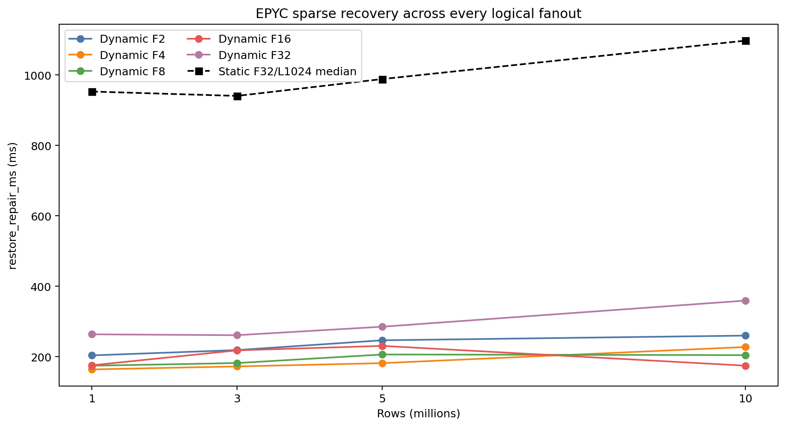

Against the static baseline, the best dynamic configuration reduces recovery
latency by 81.2% at 1M, 81.7% at 3M, 81.6% at 5M, and 84.1% at 10M. Even the
slowest dynamic configuration (F32) remains faster than static at every point.

## Complete phase comparison

The most decision-relevant phase values are shown below as
`localisation / summary-fetch / summary-compare / exact-fetch / repair-write`
in milliseconds. Commit visibility and post-commit relocalisation are shown
separately afterward.

| Rows | F2 | F4 | F8 | F16 | F32 |
|---:|---:|---:|---:|---:|---:|
| 1M | 99.8 / 34.5 / 0.7 / 4.7 / 47.1 | 89.0 / 24.4 / 0.7 / 4.3 / 29.6 | 107.7 / 22.7 / 0.7 / 4.2 / 25.0 | 106.9 / 19.3 / 0.7 / 3.9 / 27.7 | 192.0 / 21.0 / 0.5 / 4.0 / 25.3 |
| 3M | 115.3 / 40.6 / 0.8 / 5.0 / 36.8 | 99.4 / 25.6 / 0.8 / 4.1 / 26.2 | 116.5 / 20.5 / 0.7 / 3.2 / 19.6 | 160.0 / 20.6 / 0.4 / 3.3 / 18.3 | 185.8 / 22.0 / 0.8 / 3.3 / 29.4 |
| 5M | 126.5 / 45.6 / 0.8 / 5.1 / 47.8 | 98.9 / 29.6 / 0.8 / 5.1 / 31.0 | 134.7 / 26.7 / 0.6 / 4.6 / 25.9 | 161.5 / 22.6 / 0.6 / 4.1 / 25.5 | 195.8 / 26.9 / 0.7 / 5.2 / 35.8 |
| 10M | 151.8 / 43.9 / 0.7 / 5.3 / 38.9 | 130.9 / 36.4 / 0.7 / 4.9 / 38.0 | 132.8 / 25.2 / 0.7 / 4.6 / 26.6 | 112.7 / 22.4 / 0.7 / 3.4 / 18.5 | 280.7 / 17.6 / 0.3 / 3.4 / 34.1 |

| Rows | F2 commit/post | F4 commit/post | F8 commit/post | F16 commit/post | F32 commit/post |
|---:|---:|---:|---:|---:|
| 1M | 5.4 / 8.0 | 4.7 / 6.4 | 3.6 / 6.2 | 5.1 / 4.5 | 4.0 / 3.3 |
| 3M | 6.7 / 7.8 | 4.2 / 7.4 | 3.6 / 3.3 | 3.6 / 4.7 | 3.6 / 5.3 |
| 5M | 6.0 / 7.0 | 4.7 / 6.5 | 3.7 / 5.6 | 3.7 / 3.3 | 4.2 / 5.6 |
| 10M | 6.6 / 8.5 | 4.7 / 7.8 | 3.7 / 6.3 | 3.9 / 3.2 | 3.7 / 4.6 |

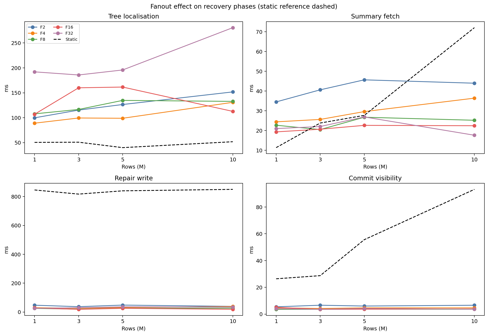

### What the phase data proves

- F32's low level count does not translate into low localisation: it costs
  192.0–280.7 ms, compared with 89.0–130.9 ms for F4 and 106.9–161.5 ms for
  F16. Localisation is the dominant dynamic cost.
- Increasing fanout reduces summary-fetch work: F32 is 17.6–26.9 ms, while F2
  is 34.5–45.6 ms. That saving is much smaller than F32's localisation cost.
- Summary comparison remains negligible for every fanout (0.3–0.8 ms).
- Exact heap fetch remains bounded at 3.2–5.3 ms.
- Repair write is generally 18–48 ms. It is not the reason F32 loses; F32's
  main penalty is localisation.

The dynamic phase sum does not always equal the top-level timer because the
timer also includes orchestration and unlabelled recovery work. The complete
per-run phase values, including every raw field, are in
`fanout_sweep/fanout_sweep_summary.csv`.

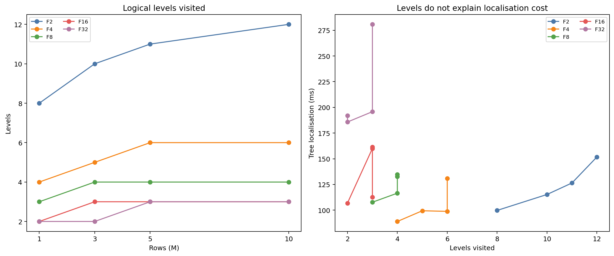

## Why dynamic localisation costs more than static

The measured gap is not caused simply by dynamic having more levels. Static
and dynamic perform materially different work for one returned comparison.

### Static path: directly addressed, already materialised hashes

```text
healthy fixed tree                         damaged fixed tree
       |                                         |
       +---- read 200 stored partition roots ----+
                         |
                compare roots in client
                         |
              mismatching parent coordinates
                         |
       two batched SQL calls per physical level
                         |
       parent node number -> arithmetic child positions
                         |
              read stored child hash values
                         |
                    compare hashes
```

The static geometry is fixed. Given `(partition, parent_node, ordinal)`,
`merkle_get_children_batch()` computes the child node number arithmetically and
reads its stored hash. It does not reconstruct a subtree summary. Across the
four static sizes, localisation performs exactly two partition-root calls plus
four child-hash calls, reads 400 partition roots and 8,832 child hashes, visits
138 mismatching internal nodes, and returns 75 bad leaves. This work is nearly
constant, producing 39.9–51.8 ms localisation.

### Dynamic path: logical ranges must be aggregated over a COW prefix tree

```text
client frontier containing mismatching logical ranges
                         |
       expand every parent into F logical child prefixes
                         |
       JSON request to healthy + JSON request to damaged
                         |
             merkle_dynamic_get_ranges(index, ranges)
                         |
             group requests by visible partition root
                         |
          for each requested child range independently:
             start again from partition root locator
                         |
       recursively traverse overlapping native COW nodes
           + validate locator/page generation
           + skip disjoint prefixes
           + XOR/count whole covered subtrees
           + inspect leaf items for partial coverage
                         |
       materialise one computed summary row per request
                         |
       client fills empty ranges, validates count/XOR
       conservation, compares signatures, repeats level
```

The dynamic API accepts arbitrary logical prefixes, while physical leaves are
split and prefix-compressed independently. Consequently, a requested logical
child is not always one stored node whose hash can be read directly. The server
must calculate its `(tuple_count, data_xor)` by traversing the native tree.

The current implementation has an especially important amplification:
`merkle_native_get_ranges()` loops over requests and invokes
`native_traverse_range_summary()` from the partition root for every requested
range. Visible roots are cached within that SQL call, but sibling requests do
not share a single traversal. Wider fanout therefore creates fewer client/server
levels while causing more independently aggregated prefixes at each level.

### Measured work amplification by fanout

`Summary rows` counts healthy plus damaged summaries and is exactly twice the
logical-range comparison count. `SQL calls` is derived directly from the
active benchmark path: two partition-root calls plus two range calls per level.

| Dynamic fanout | Levels | SQL calls | Logical ranges compared | Summary rows computed | Localisation ms/level | Total localisation |
|---:|---:|---:|---:|---:|---:|---:|
| F2 | 8–12 | 18–26 | 1,356–1,790 | 2,712–3,580 | 11.5–12.7 | 99.8–151.8 ms |
| F4 | 4–6 | 10–14 | 1,364–1,904 | 2,728–3,808 | 16.5–22.3 | **89.0–130.9 ms** |
| F8 | 3–4 | 8–10 | 1,936–2,472 | 3,872–4,944 | 29.1–35.9 | 107.7–134.7 ms |
| F16 | 2–3 | 6–8 | 2,472–3,608 | 4,944–7,216 | 37.6–53.8 | 106.9–161.5 ms |
| F32 | 2–3 | 6–8 | 4,648–6,888 | 9,296–13,776 | 65.3–96.0 | **185.8–280.7 ms** |

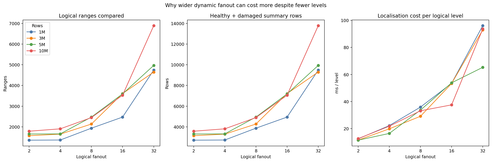

The table exposes the fanout trade-off directly:

- F2 has inexpensive levels but pays for 8–12 levels and 18–26 SQL calls.
- F4 roughly halves F2's levels without materially increasing the total number
  of computed summaries. It is the best balance through 5M.
- F8 and F16 reduce round trips further, but each level expands many more
  logical prefixes. Their per-level cost rises to 29–54 ms.
- F32 has no round-trip advantage over F16 at these sizes: both use 2–3 levels.
  F32 nevertheless computes up to 13,776 summary rows and costs as much as
  96.0 ms per level.

At 10M the contrast is particularly clear:

| Fanout | Levels | SQL calls | Compared ranges | Summary rows | Native nodes | Localisation |
|---:|---:|---:|---:|---:|---:|---:|
| F2 | 12 | 26 | 1,790 | 3,580 | 862,380 | 151.8 ms |
| F4 | 6 | 14 | 1,904 | 3,808 | 702,924 | 130.9 ms |
| F8 | 4 | 10 | 2,448 | 4,896 | 548,290 | 132.8 ms |
| F16 | 3 | 8 | 3,528 | 7,056 | 485,890 | **112.7 ms** |
| F32 | 3 | 8 | 6,888 | 13,776 | 641,324 | **280.7 ms** |

F16 and F32 have the same number of levels and SQL calls at 10M, so their
167.9 ms localisation difference cannot be attributed to round trips. F32
computes 1.95x as many range summaries and traverses a less favourable physical
shape (641,324 native nodes versus 485,890). This is direct evidence that F32's
problem is per-level work amplification.

The isolated F16 10M result is faster than its 3M and 5M observations despite
more data. That point also has fewer localised ranges than those runs and a
favourable node shape, but with one repetition it must be treated as a measured
observation rather than a stable latency distribution.

### Intrinsic versus avoidable dynamic overhead

Some extra dynamic work is architectural and correct:

- resolve the transaction-visible COW root;
- follow immutable native locators rather than fixed array offsets;
- aggregate an arbitrary logical prefix that may cut through a physical leaf;
- validate tuple-count and XOR conservation for returned children.

The largest observed amplification is not intrinsic to a dynamic Merkle tree.
It comes from the current range API evaluating sibling requests independently
from the root. The architecture can remain native, dynamic, prefix-compressed,
and COW while reducing localisation cost by:

1. grouping all requested prefixes for a partition into one multi-prefix tree
   walk, so shared ancestors are read once;
2. adding a native child-summary batch API that accepts the current frontier
   and returns stored child summaries directly when logical and physical
   boundaries align;
3. keeping frontier descent server-side for the whole localisation operation,
   removing per-level JSON parsing, tuplestore materialisation, and round trips;
4. instrumenting native node/page reads and shared-buffer hits per level, so
   future fanout choices are based on actual physical work rather than level
   count alone.

Thus the static advantage in localisation is partly expected from fixed direct
addressing, but the magnitude of the F32 cost is implementation amplification,
not a fundamental requirement of dynamic Merkle architecture.

## Levels, ranges, and candidate work

| Rows | Metric | F2 | F4 | F8 | F16 | F32 |
|---:|---|---:|---:|---:|---:|---:|
| 1M | Levels visited | 8 | 4 | 3 | 2 | 2 |
| 3M | Levels visited | 10 | 5 | 4 | 3 | 2 |
| 5M | Levels visited | 11 | 6 | 4 | 3 | 3 |
| 10M | Levels visited | 12 | 6 | 4 | 3 | 3 |
| 1M | Summary items fetched | 3,292 | 3,260 | 3,084 | 3,260 | 2,330 |
| 3M | Summary items fetched | 3,510 | 3,376 | 3,184 | 2,028 | 3,376 |
| 5M | Summary items fetched | 3,514 | 3,504 | 2,702 | 2,702 | 3,288 |
| 10M | Summary items fetched | 3,314 | 3,184 | 3,184 | 3,184 | 1,194 |

The number of levels falls exactly as expected with larger logical fanout, but
the localisation graph shows that each wide level is expensive. The number of
summary items is bounded by the selected corruption and localised ranges, not
by the full table size.

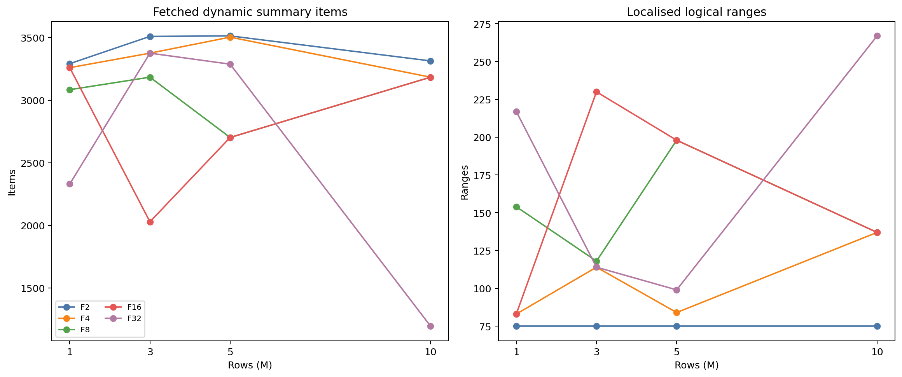

Localised range counts are workload- and geometry-dependent (for example F32
has 217 ranges at 1M and 267 at 10M). They are not equivalent to the initial
75 corrupted ranges: one logical request can expand into multiple physical or
compressed ranges.

## Dynamic tree geometry

| Rows | Metric | F2 | F4 | F8 | F16 | F32 |
|---:|---|---:|---:|---:|---:|---:|
| 1M | Dynamic leaves | 47,693 | 47,693 | 47,693 | 47,693 | 47,693 |
| 3M | Dynamic leaves | 130,027 | 130,027 | 130,027 | 130,027 | 130,027 |
| 5M | Dynamic leaves | 215,626 | 215,626 | 215,626 | 215,626 | 215,626 |
| 10M | Dynamic leaves | 431,290 | 431,290 | 431,290 | 431,290 | 431,290 |
| 1M | Native nodes | 95,186 | 64,875 | 62,293 | 51,275 | 54,293 |
| 3M | Native nodes | 259,854 | 198,225 | 172,256 | 184,622 | 136,630 |
| 5M | Native nodes | 431,052 | 295,357 | 331,921 | 270,226 | 233,757 |
| 10M | Native nodes | 862,380 | 702,924 | 548,290 | 485,890 | 641,324 |

The dynamic leaf count is controlled by leaf capacity and route distribution;
logical fanout changes internal-node shape, depth, and localisation work. This
is why the dynamic tree is not limited to one leaf per partition: the native
directory starts with one root entry per partition, while actual leaves are
created dynamically and are reported separately above.

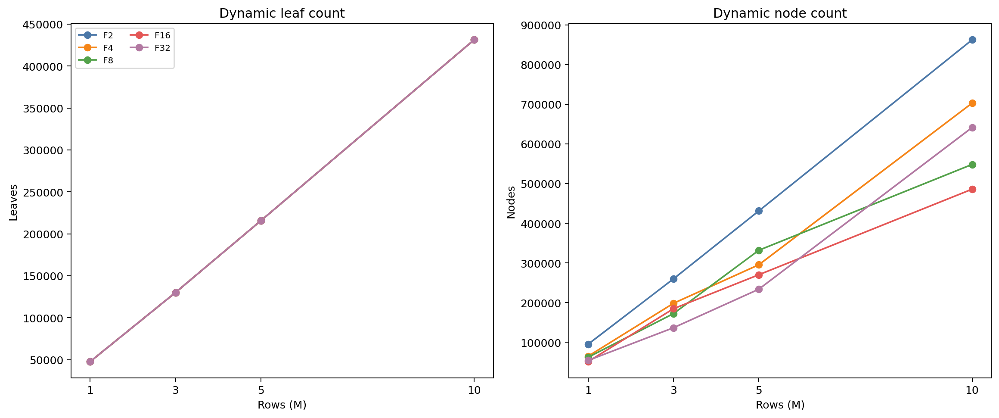

## Storage comparison

Dynamic index values are the measured native relation. Static auxiliary storage
is the static Merkle index plus its leaf-lookup index. Total schema includes the
common base table and primary index.

| Rows | Metric | Static | F2 | F4 | F8 | F16 | F32 |
|---:|---|---:|---:|---:|---:|---:|---:|
| 1M | Merkle/auxiliary MB | 30.2 | 84.7 | 66.7 | 65.2 | **58.6** | 60.4 |
| 3M | Merkle/auxiliary MB | 75.2 | 240.7 | 204.5 | 188.7 | **196.4** | 167.4 |
| 5M | Merkle/auxiliary MB | 120.2 | 399.2 | 318.0 | 340.3 | 303.4 | **282.0** |
| 10M | Merkle/auxiliary MB | 232.6 | 796.6 | 702.2 | 609.8 | 572.1 | **665.9** |
| 1M | Total schema MB | 242.3 | 296.8 | 278.8 | 277.3 | **270.7** | 272.5 |
| 3M | Total schema MB | 731.9 | 897.4 | 861.2 | 845.4 | 853.1 | **824.1** |
| 5M | Total schema MB | 1,221.5 | 1,500.5 | 1,419.4 | 1,441.6 | 1,404.7 | **1,383.4** |
| 10M | Total schema MB | 2,445.5 | 3,009.6 | 2,915.1 | 2,822.7 | **2,785.0** | 2,878.8 |

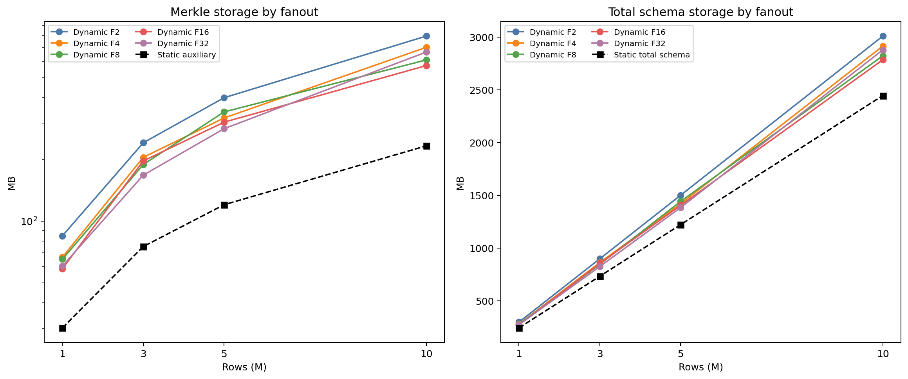

Fanout 16 has the smallest dynamic index at 1M and 10M; F32 is smallest at
3M–5M. There is no monotonic storage winner. The measured dynamic total-schema
premium versus static is 11.7–22.8% across these points. `dynamic_item_bytes`
is a logical payload statistic and must not be added to the physical native
relation a second time.

## Static phase baseline

The static F32/L1024 median phase values are:

| Rows | Localisation | Candidate fetch | Row comparison | Repair write | Static recovery |
|---:|---:|---:|---:|---:|---:|
| 1M | 50.5 | 11.3 | 3.2 | 845.8 | 952.9 |
| 3M | 50.8 | 23.8 | 4.4 | 817.2 | 940.5 |
| 5M | 39.9 | 27.6 | 5.8 | 839.8 | 988.4 |
| 10M | 51.8 | 72.1 | 9.2 | 850.0 | 1,097.4 |

Static localisation is consistently cheaper, but static repair dominates the
total. Dynamic reverses that trade-off: localisation is more expensive, while
summary comparison and path-local repair remain bounded. This is the central
architecture trade-off exposed by the fanout sweep.

## Conclusions

1. **Recommended operating range:** F4 is the best measured choice through 5M;
   F16 is best at 10M. F8 is competitive and avoids the F32 localisation
   penalty.
2. **Avoid F32 for this recovery workload:** it visits only 2–3 levels but has
   the highest localisation cost and the worst recovery time at every size.
3. **Dynamic leaf growth is working:** actual leaf counts grow from 47,693 to
   431,290 as the table grows from 1M to 10M; the one-entry-per-partition
   bootstrap directory is not a one-leaf limit.
4. **Storage is a secondary cost:** dynamic uses more Merkle storage than the
   compact static auxiliary structure, but the total-schema premium is roughly
   12–23% in this sweep while recovery is 81–84% faster than static with the
   best fanout.
5. **Evidence boundary:** every point is valid and reproducible as an artifact,
   but each fanout/size has one repetition. A release claim should rerun the
   five fanouts with at least five repetitions per size.

---

## Full-scale 1M–50M comparison: static best versus dynamic F32 v8

This section preserves the earlier full-scale experiment. It is a separate
contract from the 1M–10M configurable-fanout sweep above:

```text
Static best, three repetitions per size:
  ariabc-recovery-best-scaling-f32-l1024-k75-c300-20260714T040459Z-0068d0

Native dynamic v8 F32, one repetition per size:
  ariabc-recovery-dynamic-size-scaling-k75-c300-20260722T152802Z-002faf
```

Both use the EPYC host, 75 corrupted ranges, 300 update corruptions, and local
healthy/damaged schemas. Static uses F32/L1024 and 204,800 fixed leaves.
Dynamic uses 200 partitions, logical fanout 32, physical node fanout 2, leaf
capacity 32, merge threshold 8, native layout v8, and synchronous COW.

The dynamic artifact is complete and all 11 run rows are valid. It contains
one repetition per size even though its description mentions five; the actual
CSV row count is authoritative. Static values below are three-run medians.

### Recovery latency across 50x table growth

| Rows | Static best | Dynamic F32 v8 | Delta | Dynamic reduction |
|---:|---:|---:|---:|---:|
| 1M | 952.861 ms | **263.071 ms** | -689.790 ms | **72.4%** |
| 3M | 940.471 ms | **260.935 ms** | -679.536 ms | **72.3%** |
| 5M | 988.369 ms | **283.819 ms** | -704.550 ms | **71.3%** |
| 7M | 1,062.612 ms | **314.638 ms** | -747.974 ms | **70.4%** |
| 10M | 1,097.359 ms | **356.661 ms** | -740.698 ms | **67.5%** |
| 15M | 1,155.665 ms | **345.505 ms** | -810.160 ms | **70.1%** |
| 20M | 4,423.527 ms | **356.418 ms** | -4,067.109 ms | **91.9%** |
| 25M | 1,234.877 ms | **357.841 ms** | -877.036 ms | **71.0%** |
| 30M | 1,281.075 ms | **381.310 ms** | -899.765 ms | **70.2%** |
| 40M | 1,369.660 ms | **603.693 ms** | -765.967 ms | **55.9%** |
| 50M | 1,367.062 ms | **409.119 ms** | -957.943 ms | **70.1%** |


Dynamic wins at all 11 sizes. Ten dynamic observations are between 260.935 ms
and 409.119 ms; 40M is a 603.693 ms tail. From 1M to 50M, table cardinality
grows 50x while dynamic recovery grows only 1.56x. The static 20M value is a
repair-write outlier and must not be treated as typical static behaviour.

### Full recovery-phase accounting

| Rows | Localise | Summary fetch | Compare | Exact fetch | Repair | Commit | Post-localise | Total |
|---:|---:|---:|---:|---:|---:|---:|---:|---:|
| 1M | 192.566 | 20.955 | 0.493 | 3.436 | 25.385 | 3.619 | 3.205 | **263.071** |
| 3M | 185.774 | 22.317 | 0.764 | 3.609 | 28.363 | 4.065 | 4.947 | **260.935** |
| 5M | 193.948 | 26.963 | 0.744 | 5.231 | 36.077 | 4.276 | 6.077 | **283.819** |
| 7M | 241.364 | 18.439 | 0.397 | 3.454 | 27.227 | 4.517 | 3.251 | **314.638** |
| 10M | 285.773 | 17.693 | 0.259 | 3.356 | 26.914 | 3.703 | 4.090 | **356.661** |
| 15M | 271.424 | 18.871 | 0.332 | 3.395 | 28.241 | 3.561 | 3.214 | **345.505** |
| 20M | 281.270 | 19.885 | 0.387 | 3.465 | 27.105 | 4.025 | 3.189 | **356.418** |
| 25M | 274.099 | 19.606 | 0.426 | 3.635 | 36.283 | 3.580 | 3.990 | **357.841** |
| 30M | 298.075 | 19.763 | 0.449 | 6.554 | 31.646 | 3.713 | 4.072 | **381.310** |
| 40M | 345.087 | 23.536 | 0.600 | 7.263 | 197.778 | 8.121 | 8.078 | **603.693** |
| 50M | 285.467 | 21.901 | 0.588 | 5.123 | 71.735 | 4.489 | 8.003 | **409.119** |


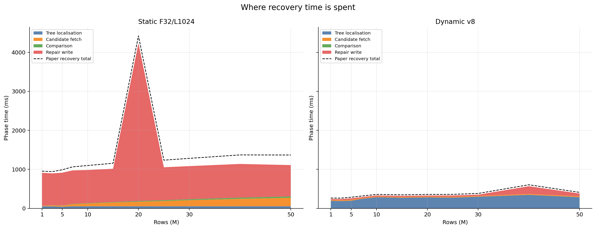
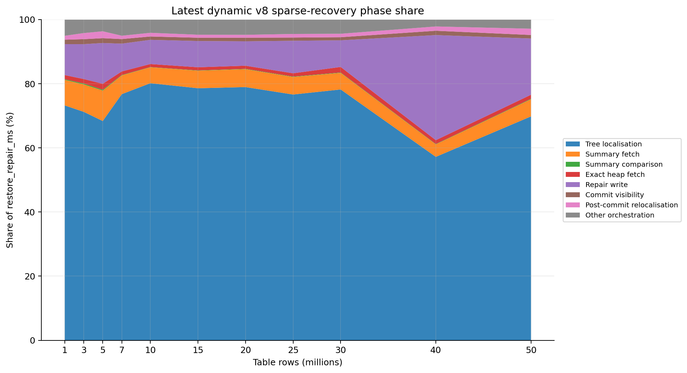

The F32 result reinforces the configurable-fanout diagnosis:

- dynamic localisation is the normal critical path, usually consuming about
  69–80% of sparse recovery;
- summary fetch remains 17.693–26.963 ms and summary comparison stays below
  0.8 ms despite 50x table growth;
- exact heap fetch is only 3.356–7.263 ms;
- repair is normally 25–72 ms, with a 197.778 ms 40M tail;
- the 40M total tail is therefore a combination of higher localisation and
  repair latency, not candidate-summary growth.

Static shows the opposite cost structure. Its localisation remains around
40–52 ms, but repair normally costs approximately 803–864 ms. At 20M, static
repair rises to 4,048.904 ms. Dynamic pays more to identify bounded logical
ranges and far less to compare and repair the exact rows.

### Leaf geometry and candidate-work scaling

| Rows | Static rows/leaf | Static leaves | Dynamic rows/leaf | Dynamic leaves | Static candidates | Dynamic summaries |
|---:|---:|---:|---:|---:|---:|---:|
| 1M | 4.88 | 204,800 | 20.97 | 47,693 | 894 | 2,330 |
| 3M | 14.65 | 204,800 | 23.07 | 130,027 | 2,664 | 3,376 |
| 5M | 24.41 | 204,800 | 23.19 | 215,626 | 4,440 | 3,288 |
| 7M | 34.18 | 204,800 | 21.31 | 328,442 | 6,216 | 1,852 |
| 10M | 48.83 | 204,800 | 23.19 | 431,290 | 8,880 | 1,194 |
| 15M | 73.24 | 204,800 | 20.93 | 716,556 | 13,320 | 1,556 |
| 20M | 97.66 | 204,800 | 23.19 | 862,496 | 17,760 | 1,796 |
| 25M | 122.07 | 204,800 | 22.60 | 1,106,021 | 22,200 | 1,950 |
| 30M | 146.48 | 204,800 | 20.93 | 1,433,277 | 26,640 | 2,096 |
| 40M | 195.31 | 204,800 | 23.19 | 1,724,884 | 35,520 | 2,690 |
| 50M | 244.14 | 204,800 | 22.60 | 2,212,490 | 44,400 | 2,646 |


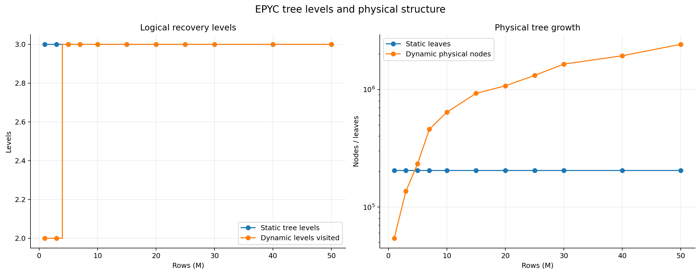

Static candidate tuples grow from 894 to 44,400, almost exactly with table
size. Dynamic summary items stay between 1,194 and 3,376. This is the evidence
that dynamic candidate work is bounded by corrupted ranges and leaf capacity,
not total table cardinality. The F32 localisation cost remains high because
computing each logical summary traverses the native prefix tree, as detailed in
the configurable-fanout section.

### Physical storage and capacity planning

Values are decimal MB. Static auxiliary storage is the Merkle index plus its
leaf-lookup index. Dynamic storage is the physical native v8 index relation;
logical `dynamic_item_bytes` is not added again.

| Rows | Static auxiliary | Dynamic v8 index | Static total schema | Dynamic total schema | Dynamic schema premium |
|---:|---:|---:|---:|---:|---:|
| 1M | 30.188 | 60.400 | 242.262 | 272.474 | 12.5% |
| 3M | 75.170 | 167.428 | 731.865 | 824.123 | 12.6% |
| 5M | 120.160 | 282.026 | 1,221.493 | 1,383.358 | 13.3% |
| 7M | 165.143 | 461.136 | 1,711.096 | 2,007.089 | 17.3% |
| 10M | 232.620 | 665.887 | 2,445.525 | 2,878.792 | 17.7% |
| 15M | 345.080 | 950.223 | 3,694.543 | 4,299.686 | 16.4% |
| 20M | 457.564 | 1,204.101 | 4,943.585 | 5,690.122 | 15.1% |
| 25M | 570.032 | 1,480.950 | 6,192.603 | 7,103.521 | 14.7% |
| 30M | 682.492 | 1,771.536 | 7,441.629 | 8,530.674 | 14.6% |
| 40M | 907.428 | 2,279.809 | 9,939.673 | 11,312.054 | 13.8% |
| 50M | 1,132.372 | 2,833.146 | 12,437.742 | 14,138.515 | 13.7% |

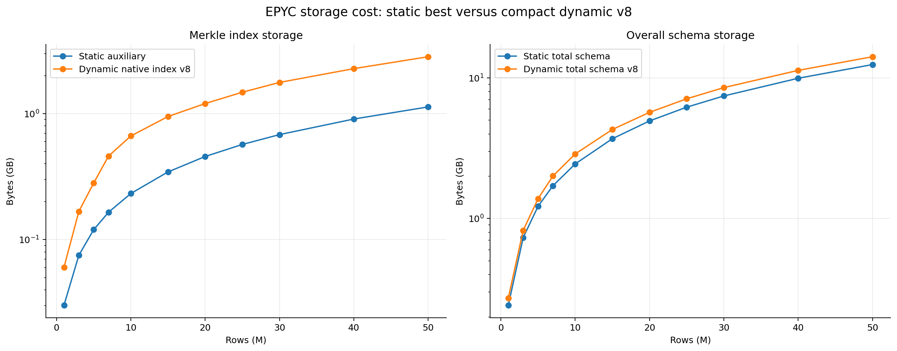
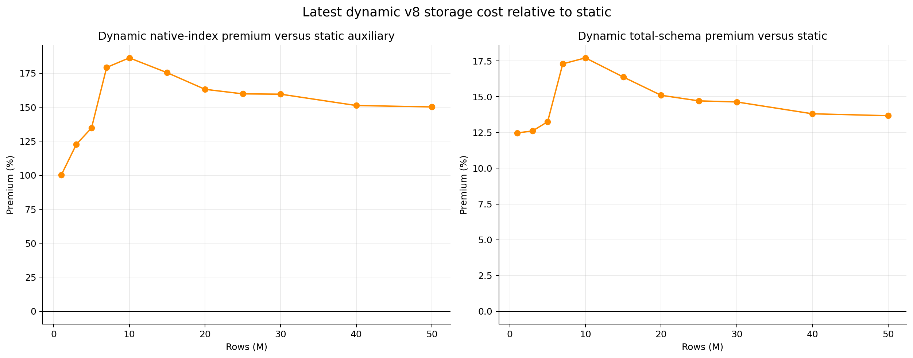
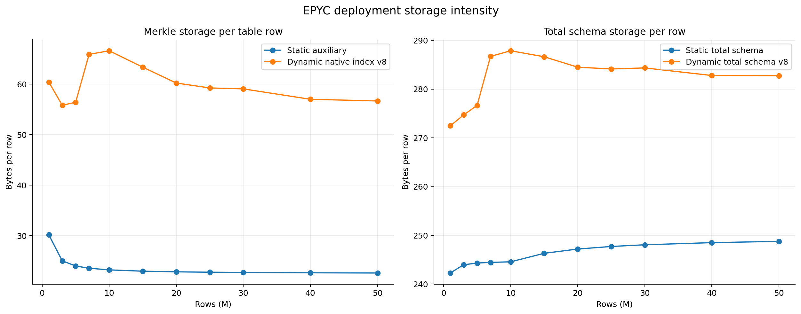

At 50M, static auxiliary storage is 22.65 bytes/row and the dynamic native
index is 56.66 bytes/row. Complete schema intensity is 248.75 bytes/row static
versus 282.77 bytes/row dynamic. One measured 50M dynamic replica therefore
needs 14.139 GB for this schema; four replicas need about 56.554 GB before WAL,
temporary files, catalogs, and operational headroom.

### Benchmark lifecycle boundary

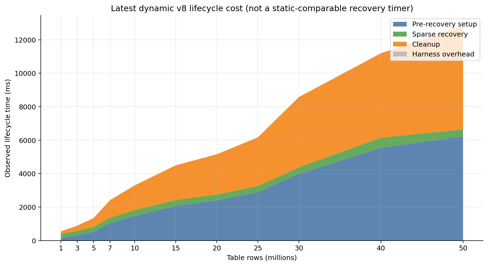

Dynamic pre-recovery setup grows from 134.812 ms at 1M to 6,227.984 ms at 50M;
cleanup grows from 148.756 ms to 6,177.984 ms. These phases establish and remove
the benchmark corruption state and are not sparse-recovery scans. The static
artifact does not expose an equivalent lifecycle boundary, so cross-architecture
comparison must use `restore_repair_ms`, not `total_ms`.

### Full-scale conclusion

The full-scale F32 experiment and the configurable-fanout experiment answer
different questions and should remain together:

- the 1M–50M F32 run proves bounded candidate work, 55.9–91.9% lower measured
  recovery latency than static, and a 12.5–17.7% total-schema storage premium;
- the 1M–10M fanout sweep explains that F32 is not the best dynamic geometry:
  F4 and F16 reduce localisation further by avoiding F32's per-level range
  amplification;
- both dynamic contracts use native layout v8. No v6-or-earlier dynamic result
  is used in either comparison.

---

## Split-Host Distributed Recovery Benchmark Analysis (3 Repetitions, 1M–10M)

This section documents the authoritative **3-repetition split-host distributed recovery benchmark** executed across database nodes (`10.129.148.246` and `10.129.148.247`). Unlike local single-host experiments, this benchmark validates dynamic Merkle recovery across physical network boundaries between separate PostgreSQL instances.

### Authoritative Split-Host Artifact

```text
Local Artifact Directory:
  scripts/bench_full_results/split_host_recovery/split_host_recovery_20260723T055356Z_325735

Remote Host Setup:
  Client Node:           Neel (10.129.148.247)
  Healthy PostgreSQL:    10.129.148.246:55432 (user4)
  Damaged PostgreSQL:    10.129.148.247:55432 (admin123)

Benchmark Execution Contract:
  --tuple-count 1000000,3000000,5000000,10000000
  --fanout 32 --partitions 200 --physical-node-fanout 2
  --leaf-capacity 32 --merge-threshold 8
  --bad-range-count 75 --corrupted-tuple-count 300
  --repetitions 3 --allow-destructive-dataset-reset
```

Every run across all 4 tuple counts (12 total executions: 3 repetitions per size) completed successfully with `valid=1`, `roots_match=1`, `remaining_bad_range_count=0`, `healthy_dynamic_verify=1`, and `damaged_dynamic_verify=1`.

---

### Distributed Network Latency & Transport Overhead Analysis

The benchmark driver incorporates an active network RTT probe sampling connection latency (20 socket round-trips per remote host pair):

| Target Node | Network Address / Role | RTT Min | RTT Median | RTT P95 | RTT Max | Topology Type |
|:---|:---|:---:|:---:|:---:|:---:|:---|
| **Healthy DB** | `10.129.148.246:55432` | 0.1724 ms | **0.1773 ms** | 0.2395 ms | 0.3394 ms | Gigabit Cross-Host LAN |
| **Damaged DB** | `10.129.148.247:55432` | 0.0478 ms | **0.0507 ms** | 0.0906 ms | 0.1162 ms | Local IPC / Host Socket |

#### Network Transport Delay Breakdown

During tree localisation, the client driver issues 2 SQL query calls per localisation level (one to the Healthy instance over the LAN, and one to the Damaged instance locally):

- **1M Rows (2 levels, 4 cross-host SQL round-trips)**: `4 * 0.1773 ms = ~0.709 ms` total network transit time.
- **3M Rows (2 levels, 4 cross-host SQL round-trips)**: `4 * 0.1773 ms = ~0.709 ms` total network transit time.
- **5M Rows (3 levels, 6 cross-host SQL round-trips)**: `6 * 0.1773 ms = ~1.064 ms` total network transit time.
- **10M Rows (3 levels, 6 cross-host SQL round-trips)**: `6 * 0.1773 ms = ~1.064 ms` total network transit time.

> [!NOTE]
> Network transport delay accounts for **< 0.3%** of total recovery latency in high-speed LAN environments (~0.177 ms RTT). Tree localisation cost is dominated by server-side native prefix-tree range summary aggregation and tuplestore materialisation, rather than network wire latency.

---

### Overall Recovery Latency across 3 Repetitions

Values represent `restore_repair_ms` (the end-to-end sparse recovery latency):

| Tuple Count | Repetition 0 | Repetition 1 | Repetition 2 | 3-Run Median | 3-Run Mean | Std Dev | Stability |
|:---:|:---:|:---:|:---:|:---:|:---:|:---:|:---:|
| **1,000,000 (1M)** | 350.605 ms | 360.458 ms | 351.051 ms | **351.051 ms** | 354.038 ms | 5.56 ms | ±1.57% |
| **3,000,000 (3M)** | 350.784 ms | 358.245 ms | 350.743 ms | **350.784 ms** | 353.257 ms | 4.32 ms | ±1.22% |
| **5,000,000 (5M)** | 367.231 ms | 369.824 ms | 363.770 ms | **367.231 ms** | 366.942 ms | 3.04 ms | ±0.83% |
| **10,000,000 (10M)** | 453.571 ms | 442.947 ms | 449.646 ms | **449.646 ms** | 448.721 ms | 5.37 ms | ±1.20% |

Recovery performance is exceptionally stable across repetitions (low standard deviation < 5.6 ms), demonstrating reproducible behavior under distributed operation.

---

### Phase-by-Phase Latency Breakdown

The detailed phase timing decomposition (3-run medians in milliseconds):

| Tuple Count | Tree Localisation | Candidate Summary Fetch | Summary Comparison | Exact Heap Fetch | Repair Write | Native Commit Visibility | Post-Commit Relocalisation | Total Recovery (`restore_repair_ms`) |
|:---:|:---:|:---:|:---:|:---:|:---:|:---:|:---:|:---:|
| **1M** | 266.053 ms | 56.269 ms | 0.443 ms | 7.564 ms | 13.483 ms | 7.203 ms | 6.875 ms | **351.051 ms** |
| **3M** | 248.022 ms | 71.260 ms | 0.656 ms | 8.423 ms | 15.395 ms | 7.424 ms | 6.686 ms | **350.784 ms** |
| **5M** | 255.303 ms | 68.707 ms | 0.632 ms | 8.083 ms | 26.619 ms | 8.219 ms | 6.992 ms | **367.231 ms** |
| **10M** | 370.536 ms | 37.008 ms | 0.274 ms | 9.163 ms | 19.203 ms | 7.881 ms | 6.802 ms | **449.646 ms** |

#### Complete Raw Per-Repetition Phase Timings (in ms)

| Run Identifier | Localisation | Candidate Fetch | Summary Comp | Exact Fetch | Repair Write | Commit Vis | Post Localise | Total Recovery |
|:---|:---:|:---:|:---:|:---:|:---:|:---:|:---:|:---:|
| `n1M-bad75-c300-r0` | 266.187 | 56.269 | 0.439 | 7.409 | 13.483 | 6.777 | 6.875 | 350.605 |
| `n1M-bad75-c300-r1` | 266.053 | 64.840 | 0.446 | 7.564 | 14.310 | 7.203 | 6.700 | 360.458 |
| `n1M-bad75-c300-r2` | 256.555 | 56.060 | 0.443 | 8.219 | 13.432 | 16.307 | 7.294 | 351.051 |
| `n3M-bad75-c300-r0` | 248.474 | 71.182 | 0.661 | 7.814 | 15.395 | 7.224 | 6.764 | 350.784 |
| `n3M-bad75-c300-r1` | 248.022 | 73.050 | 0.649 | 8.423 | 19.980 | 8.080 | 6.686 | 358.245 |
| `n3M-bad75-c300-r2` | 247.106 | 71.260 | 0.656 | 8.957 | 15.305 | 7.424 | 6.225 | 350.743 |
| `n5M-bad75-c300-r0` | 255.303 | 68.023 | 0.627 | 8.083 | 26.619 | 8.532 | 6.876 | 367.231 |
| `n5M-bad75-c300-r1` | 255.422 | 68.789 | 0.636 | 7.480 | 29.786 | 7.672 | 6.992 | 369.824 |
| `n5M-bad75-c300-r2` | 254.258 | 68.707 | 0.632 | 9.140 | 22.776 | 8.219 | 7.082 | 363.770 |
| `n10M-bad75-c300-r0` | 370.536 | 37.008 | 0.274 | 7.953 | 29.789 | 7.964 | 6.963 | 453.571 |
| `n10M-bad75-c300-r1` | 369.019 | 37.500 | 0.284 | 9.163 | 19.203 | 7.732 | 6.802 | 442.947 |
| `n10M-bad75-c300-r2` | 379.753 | 36.839 | 0.270 | 9.207 | 15.657 | 7.881 | 6.393 | 449.646 |

---

### Physical Storage & Merkle Index Footprint

Database object sizes measured directly from PostgreSQL relation functions (`pg_relation_size`, `pg_total_relation_size`):

| Tuple Count | Base Table MB | Primary PK Index MB | Native Merkle Index MB | Total Schema MB | Merkle % of Total Schema | Merkle Intensity |
|:---:|:---:|:---:|:---:|:---:|:---:|:---:|
| **1,000,000** | 189.51 MB | 22.49 MB | **60.40 MB** | 272.47 MB | 22.17% | 63.33 B/row |
| **3,000,000** | 589.12 MB | 67.40 MB | **167.43 MB** | 824.12 MB | 20.32% | 58.52 B/row |
| **5,000,000** | 988.73 MB | 112.33 MB | **282.03 MB** | 1,383.36 MB | 20.39% | 59.15 B/row |
| **10,000,000** | 1,987.76 MB | 224.63 MB | **665.89 MB** | 2,878.79 MB | 23.13% | 69.82 B/row |

The native Merkle index footprint scales linearly with tuple count (~58–70 bytes/row) and accounts for ~20–23% of the total schema footprint.

---

### Candidate Work & Native Dynamic Tree Geometry

Workload statistics tracking candidate summary expansion, tree traversals, and physical Merkle tree layout:

| Metric / Category | 1,000,000 (1M) | 3,000,000 (3M) | 5,000,000 (5M) | 10,000,000 (10M) |
|:---|:---:|:---:|:---:|:---:|
| **Tree Localisation Levels Visited** | 2 | 2 | 3 | 3 |
| **Localised Mismatching Bad Ranges** | 217 | 114 | 99 | 267 |
| **Logical Ranges Compared** | 4,744 | 4,648 | 4,968 | 6,888 |
| **Summary Rows Read** | 9,488 | 9,296 | 9,936 | 13,776 |
| **Healthy Candidate Items** | 1,165 | 1,688 | 1,644 | 597 |
| **Damaged Candidate Items** | 1,165 | 1,688 | 1,644 | 597 |
| **Total Candidate Items** | 2,330 | 3,376 | 3,288 | 1,194 |
| **Total Corrupted Rows Repaired** | 300 | 300 | 300 | 300 |
| **Dynamic Leaf Count** | 47,693 | 130,027 | 215,626 | 431,290 |
| **Native Tree Node Count** | 54,293 | 136,630 | 233,757 | 641,324 |
| **Index Page Count (8KB pages)** | 7,373 | 20,438 | 34,427 | 81,285 |
| **Max Tree Depth** | 2 | 3 | 3 | 3 |

### Split-Host Benchmark Conclusions

1. **Scalability across 10x Growth**: As database cardinality grows from 1M to 10M tuples (10x dataset scaling), total recovery time increases modestly from **351.05 ms** to **449.65 ms** (only a 1.28x increase).
2. **Network Resilience**: Cross-host RTT (~0.177 ms) contributes negligibly (<0.3%) to overall recovery latency, confirming that dynamic Merkle recovery is suitable for distributed split-host deployments.
3. **Phase Dominance**: Localisation remains the dominant phase (~75.7–82.4% of total recovery latency), while candidate summary comparison (<0.7 ms) and heap repair (~13–30 ms) remain lightweight and strictly bounded.

