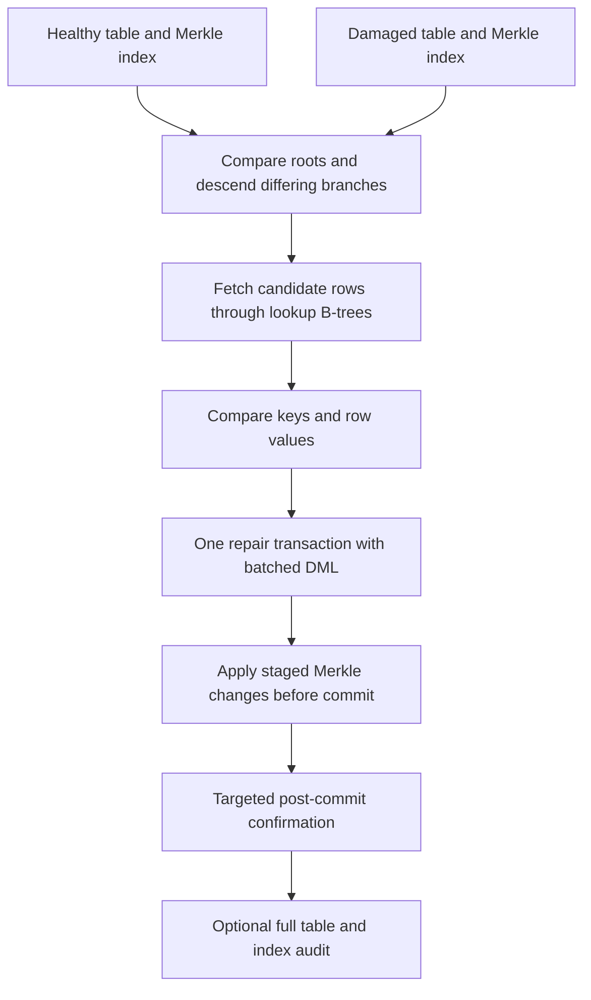

# Dynamic Merkle Recovery Architecture

Source review: **2026-09-22**, against the current working tree, including local
changes. This document describes the native index and the recovery harness.
Measurements and plots belong in individual [run reports](run_reports/); they
are not latency guarantees of the architecture.

## Scope and component boundaries

| Mechanism | Responsibility | Implementation |
|---|---|---|
| Transactional Merkle maintenance | Commit indexed table contents and Merkle nodes together | Native access method and PostgreSQL executor hooks |
| Sparse state repair | Compare a healthy reference with a damaged table and repair differing rows | Python harness issuing SQL |
| Replicated command recovery | Redeliver retained Raft entries and replay or execute ledger items | NuRaft, `ariabc_pg`, and BCDB apply ledger |

The sparse-repair benchmark uses `healthy.usertable` and `damaged.usertable` in
one PostgreSQL database. It does not exercise a network protocol between live
Raft replicas. Corruption is SQL DML with Merkle maintenance enabled, so it
tests divergent table states, not arbitrary damage to heap or index pages.
Remote runner scripts place this benchmark on another host; that alone does
not make its two schemas independent database replicas.

See [the gateway/server architecture](../ariabc_pg/ARIABC_PG_ARCHITECTURE.md)
for replicated execution and restart behavior. Kafka divergence events are
observations; the gateway does not automatically invoke this repair pipeline.

## Native index representation

The access method lives in [src/backend/access/merkle](../src/backend/access/merkle/).
Its format and defaults are declared in
[merkle.h](../src/include/access/merkle.h): index format **10**, routing format
**4**, and row-hash format **1**.

Each index has a metapage and a dedicated ordinary PostgreSQL table named
`ariabc_internal.merkle_node_<index_oid>`. Node storage contains:

- `partition_id`, `node_id`, and `prefix_len`, forming the primary key;
- `is_leaf`, `tuple_count`, and the 32-byte `hash`;
- an additional `(partition_id, prefix_len, node_id)` index and a partial
  partition-root index where `prefix_len = 0`.

The benchmark maintains `ariabc_internal.merkle_node` as a compatibility view
over these tables. It is not the shared physical node table on the normal
current path. Local index OIDs identify storage, not portable replica identity.

Key routing uses a versioned, length-prefixed binary representation hashed with
BLAKE3, including integer keys. `merkle_key_hash()` exposes the eight-byte
routing key used by recovery lookup predicates;
`merkle_partition_for_hash()` derives the partition. Tree descent uses key
prefixes within each partition. Canonical row hashes are BLAKE3-256; node
maintenance uses XOR aggregation of row contributions. These roots are not a
conventional hash-of-concatenated-children construction.

| Native index option | Default |
|---|---:|
| `fanout` | 4 |
| `split_threshold` | 32 |
| `merge_threshold` | 8 |
| `partitions` | 200 |

The maximum routing prefix length is 60 bits. Split and merge logic adapts the
tree to occupancy. Thresholds are triggers, not a guarantee that every query
returns at most `split_threshold` rows: queries can cover both tables,
different topologies, and overlapping ranges. Campaign overrides, including
fanout 32, must be read from their effective configuration.

The current `CREATE INDEX ... USING merkle` options are `fanout`,
`split_threshold`, `merge_threshold`, and `partitions`. Historical labels such
as `fanout_f32_l1024` remain in harness configuration, but are not evidence of a
second fixed-leaf access method or a current `leaves_per_partition` option.

## Transactional maintenance and crash boundary

[merkleinsert.c](../src/backend/access/merkle/merkleinsert.c) and
[nodeModifyTable.c](../src/backend/executor/nodeModifyTable.c) stage insert,
delete, and update contributions. [merkledelta.c](../src/backend/access/merkle/merkledelta.c)
keeps transaction/subtransaction delta maps, coalesces contributions, merges
committed subtransactions, and discards aborted changes.

`merkle_apply_staged_deltas_synchronously()` applies staged changes while the
originating transaction is open. Ordinary SQL reaches this through `PRE_COMMIT`.
The BCDB worker calls it during its apply phase so heap DML and Merkle DML share
the rollback boundary. The worker marker is temporarily disabled while
applying actual Merkle-node mutations, preventing those writes from being
deferred back into the BCDB business write set.

[merkleapply.c](../src/backend/access/merkle/merkleapply.c) sorts work by index
and routing coordinates, resolves leaves through cached routes and dedicated
catalog indexes, coalesces node updates, updates ancestors, and performs guarded
split/merge work. Table changes and node changes commit or abort together.
PostgreSQL WAL and the selected `synchronous_commit`/`fsync` settings govern
crash durability. Synchronous Merkle maintenance and synchronous WAL flushing
are separate properties.

The harness sets `enable_merkle_index=on` and
`merkle_apply_synchronous_direct=on`. In the current backend, staged changes
always use synchronous apply; the retained GUC does not select an asynchronous
queue implementation. Root reads with staged uncommitted deltas are rejected.
Prepared transactions after Merkle updates are also rejected.

### Retained compatibility surfaces

`merkle_apply_until()` returns its argument; `merkle_recovery_status()` reports
`READY` with zero sequence fields. These interfaces do not implement a running
background applier, measure backlog, or independently verify the heap.

The [bootstrap schema](../scripts/distributed/sql/raft_apply_ledger_schema.sql)
still contains apply-state/counter tables and ledger delta columns for schema
compatibility. It removes the retired local delta table only if empty and
removes the old zero-argument pending-apply function with dependency checks.
The active repair path has no `merkle_apply_pending()` drain phase: metadata
work is included in the repair transaction.

## Recovery dataset and lookup indexes

[dataset.py](../scripts/benchmark/recovery/merkle_recovery/dataset.py) creates
matching schemas, loads data, and builds three indexes per table:

1. The `ycsb_key` primary key.
2. `usertable_merkle_idx`, using the native Merkle access method.
3. `usertable_merkle_partition_lookup_idx`, a B-tree beginning with
   `merkle_partition_for_hash(merkle_key_hash(ycsb_key), partitions)` and
   `merkle_key_hash(ycsb_key)`.

The node tables localise differences; the lookup B-tree retrieves full user
rows. Setup checks the actual index method and geometry and analyses derived
tables. Bulk setup and incremental size expansion are available; setup/build
costs are outside the measured repair interval.

Corruption manifests specify selected keys, leaves, and operations. Supported
modes are `mixed`, `update-only`, `delete-only`, `insert-only`, and
`paper-update-only`. Manifests provide reproducibility and validation targets;
localisation discovers differences by comparing trees.

## Recovery pipeline

### 1. Compare roots and localise differing leaves

[localisation.py](../scripts/benchmark/recovery/merkle_recovery/localisation.py)
calls `merkle_get_partition_root_hashes()` for both indexes. Only partitions
with different roots enter the frontier. Coordinates include partition, node
ID, and prefix length, so equal prefixes in different partitions stay distinct.

The current fast path generates candidate coordinates in Python, sends arrays
through `unnest`, and joins the healthy and damaged dedicated node tables in
one SQL query per frontier batch. It prunes matching branches and continues
through differing internal nodes. It also handles unsplit partition roots.
A fallback performs separate queries through the compatibility view.

`--levels-per-batch` controls how many levels are speculatively fetched per
round trip; the CLI default is **1**. Larger values trade fewer round trips for
more candidate nodes. The native descendant helper still exists, but it is not
the active dedicated-table localisation loop.

Some legacy logical counters increment by two for a healthy/damaged pair even
when the fast path issued one joined SQL statement. Use profiling call records
and catalog statistics when interpreting actual statement counts.

### 2. Fetch candidates and compare rows

[repair.py](../scripts/benchmark/recovery/merkle_recovery/repair.py) converts
leaf prefixes to routing-key ranges and fetches full rows from both tables,
including a partition predicate. Batched array queries use the lookup B-tree;
planner preflight checks test suitability for the sparse-repair contract.

The CLI default is **64 leaf IDs per fetch batch**. Python aligns rows by
`ycsb_key` and determines missing rows, extra rows, and differing common rows.
The main runner accumulates repair operations and healthy values across chunks.
Fetch chunking limits each query's result set; it does not make the total
accumulated repair state constant in size.

### 3. Commit repairs and Merkle changes together

[run_merkle_recovery_benchmark.py](../scripts/benchmark/recovery/run_merkle_recovery_benchmark.py)
opens **one explicit `conn.transaction()` for the entire repair write phase**,
despite the connection otherwise being in autocommit mode. It issues batched
inserts, `UPDATE ... FROM (VALUES ...)`, and deletes; helper batch sizes default
to 500 keys. Merkle maintenance runs before this transaction commits.

`repair_write_ms` includes the transaction and commit. Finer timers include SQL
construction, DML wire time, transaction entry, and commit wire time. These are
nested diagnostics and must not all be added to the outer write timer. The CLI
default for `--synchronous-commit` is **on**; record overrides when comparing
campaigns.

### 4. Confirm affected partitions

After commit, localisation runs again with the affected partition set. Matching
roots end the check quickly; remaining differing leaves trigger candidate-row
comparison. Remaining leaf differences or row mismatches invalidate the run.
This is targeted confirmation, not a scan of every user row.

### 5. Run the selected audit

The CLI defaults to `--audit-mode full`.
[verification.py](../scripts/benchmark/recovery/merkle_recovery/verification.py)
checks both directions of `EXCEPT ALL`, root equality, `merkle_verify()` on both
tables, and schema/required-index fidelity. This independent full audit is
outside `restore_repair_ms`.

`--audit-mode skip` retains targeted confirmation and schema checks. Its
placeholder full-audit fields do not prove that the omitted queries ran;
inspect `full_audit_skipped` and `audit_validation_skipped`. Similarly, a
`READY` compatibility response alone does not prove table equality.

## Timing and evidence contract

| Measurement | Boundary |
|---|---|
| `tree_localisation_ms` | Root comparison and differing-node descent |
| `candidate_row_fetch_ms` | Candidate SQL and row transfer |
| `row_comparison_ms` | Python key/value comparison |
| `repair_write_ms` | Batched repair transaction, Merkle maintenance, and commit |
| `targeted_post_repair_confirmation_ms` | Post-commit affected-partition check |
| `restore_repair_ms` | Sparse recovery interval, excluding localisation statistics probes |
| `audit_validation_ms` | Separate full-audit wrapper when enabled |
| `end_to_end_observed_ms` | Wider run interval, including observability and audit overhead |

Recovery observability and orchestration have separate phase fields. There is
no independently timed deferred Merkle apply stage.

[db.py](../scripts/benchmark/recovery/merkle_recovery/db.py) reads native node
index statistics around localisation. PostgreSQL statistics publish
asynchronously, so the harness uses a temporary-table counter barrier with an
idle autocommit connection and `track_counts=on`. Probe cost and its flush-wait
subset are recorded separately; localisation probes and recovery scan-counter
snapshots are outside the sparse-recovery timer. Catalog counters can include
other sessions, so attribution requires an isolated benchmark database.

Acceptance checks include planner suitability, absence of recovery-time user
table sequential scans, sparse candidate counts, targeted confirmation, and
the requested audit. Historical zero counters or skipped-audit placeholders do
not replace these checks. Preserve effective geometry, manifests, source/build
provenance, PostgreSQL settings, per-run validity, profiling mode, and warmup
policy alongside timings.

Dynamic splitting reduces the candidate set when damage is sparse. Actual cost
still depends on tree depth, fanout, damaged partitions/leaves, candidate rows,
round trips, topology changes, and commit I/O. Neither constant-time recovery
nor a fixed latency ceiling follows from the implementation.

## Replicated restart recovery

Safe-ledger execution adds `(epoch, raft_log_index, item_ordinal)` identity and
durable terminal results in `ariabc_internal.raft_apply_item`. The backend
finalises successful or deterministic-error outcomes and can replay stored
terminal results when Raft redelivers an entry. Current successful finalisation
stores no deferred Merkle delta blob; Merkle writes belong to the user
transaction.

Safe startup validates schema version 4, epoch identity, and terminal digests;
it invokes legacy-index rebuild/verification and checks the retained status
interface. It requires retained logs and currently starts the applied prefix
at zero for Raft redelivery and result replay. It does not skip directly to a
maximum ledger index. NuRaft snapshots do not contain PostgreSQL data, and
durable log compaction is unsupported.

These restart mechanics are distinct from choosing a healthy table and issuing
sparse repair DML. The latter is implemented by the harness, with no automatic
online donor-selection, workload-quiescence, or distributed repair coordinator.

## Source and validation entry points

- [Native index build](../src/backend/access/merkle/merklebuild.c),
  [hashing/storage](../src/backend/access/merkle/merkleutil.c), and
  [verification](../src/backend/access/merkle/merkleverify.c).
- [BCDB worker apply](../src/backend/bcdb/worker.c) and
  [terminal ledger](../src/backend/bcdb/raft_apply_ledger.c).
- [Recovery harness tests](../scripts/benchmark/recovery/tests/) and
  [native Merkle regression cases](../src/test/regress/sql/merkle_functional_index.sql).
- [Safe-ledger recovery matrix](../scripts/distributed/run_safe_ledger_recovery_matrix.sh)
  and [replica consistency check](../scripts/distributed/test_merkle_consistency.sh).

This refresh is based on source inspection; it does not claim a new benchmark
or crash-test result.
