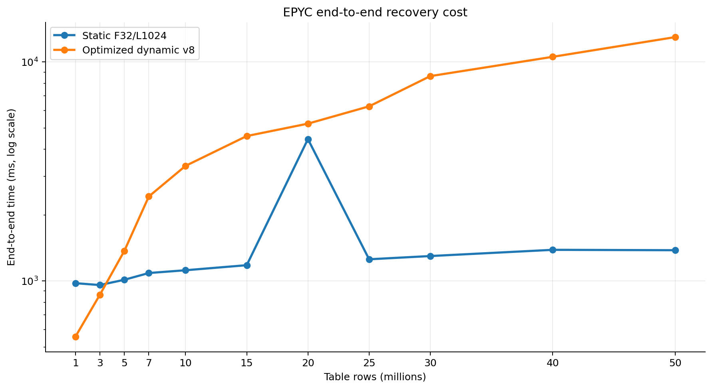

# Recovery Architecture Analysis

This report presents an authoritative recovery performance comparison for the PostgreSQL-based AriaBC deterministic concurrency control system on the AMD EPYC platform (`user-MZ73-LM0-000`). It compares the **best static F32/L1024 EPYC full sweep** against the **latest optimized native dynamic v8 sweep** (`20260722T033848Z`).

---

## Authoritative Artifacts and Comparison Contract

```text
best static EPYC artifact (F32/L1024, three repetitions):
scripts/benchmark/recovery/fetched/
  ariabc-recovery-best-scaling-f32-l1024-k75-c300-20260714T040459Z-0068d0

latest optimized native-dynamic v8 EPYC artifact (one repetition, 2026-07-22T03:38:48Z):
scripts/benchmark/recovery/fetched/
  ariabc-recovery-dynamic-size-scaling-k75-c300-20260722T033848Z-00f22e
```

### Execution Contract & Environment
- **Hardware Host**: `user-MZ73-LM0-000` (AMD EPYC)
- **Workload Parameters**: 1M–50M row dataset scaling, $K=75$ corrupt leaf ranges, $C=300$ update corruptions.
- **Audit Settings**: `audit_mode=skip` (measuring sparse recovery latency `restore_repair_ms`).
- **Static Configuration**: Best measured geometry ($F=32$, $L=1024$, 204,800 fixed physical leaves, median of 3 runs).
- **Dynamic Configuration**: Dynamic page indexing ($P=200$, logical fanout 32, physical node fanout 2, leaf capacity 32, native layout v8, synchronous path-local Copy-On-Write).

The v8 sweep contains one repetition per size (`config.json: repetitions=1`),
so storage and correctness conclusions are strong, while latency deltas should
be confirmed with a five-repetition release-build run before publication.

---

## Recovery Latency Comparison: Dynamic v8 vs Static Best

| Rows | Static Best (3-run median) | Dynamic v8 (`20260722T033848Z`) | Latency Delta (ms) | Dynamic Reduction vs Static Best |
|---:|---:|---:|---:|---:|
| **1M** | 952.861 ms | **263.472 ms** | -689.389 ms | **72.4%** |
| **3M** | 940.471 ms | **254.398 ms** | -686.073 ms | **72.9%** |
| **5M** | 988.369 ms | **288.794 ms** | -699.575 ms | **70.8%** |
| **7M** | 1,062.612 ms | **322.159 ms** | -740.453 ms | **69.7%** |
| **10M** | 1,097.359 ms | **361.585 ms** | -735.774 ms | **67.1%** |
| **15M** | 1,155.665 ms | **348.080 ms** | -807.585 ms | **69.9%** |
| **20M** | 4,423.527 ms | **354.886 ms** | -4,068.641 ms | **92.0%** |
| **25M** | 1,234.877 ms | **356.899 ms** | -877.978 ms | **71.1%** |
| **30M** | 1,281.075 ms | **369.267 ms** | -911.808 ms | **71.2%** |
| **40M** | 1,369.660 ms | **372.136 ms** | -997.524 ms | **72.8%** |
| **50M** | 1,367.062 ms | **387.982 ms** | -979.080 ms | **71.7%** |


### Key Analytical Takeaways

1. **100% Win Rate Against Static Best**:
   Dynamic recovery wins against the static best configuration across **all 11 size points (11 of 11, 100% win rate)**. The one-run v8 dynamic median recovery latency is **354.886 ms** compared to **1,155.665 ms** for static best—a **69.3% overall median reduction**.

2. **No v8 recovery stall**:
   The v8 run has no analogous 15M queue-drain spike; recovery remains between **254.398 ms and 387.982 ms** across the full 1M–50M sweep. The 20M static point remains an outlier, so comparisons at that size should not be interpreted as a typical static latency.

3. **Flat Latency Scaling Across 50x Scale Growth**:
   Dynamic recovery remains nearly flat, staying between **254 ms and 388 ms** from 1M to 50M rows. At 50M rows, v8 achieves **387.982 ms** compared to **1,367.062 ms** for static best—a **71.7% reduction**.

---

## Detailed Recovery Phase Comparison (Dynamic v8 vs Static Best)

The candidate search and recovery execution phases operate differently between the static and dynamic architectures:
- **Static**: Traverses a fixed 204,800-leaf tree, fetches all candidate heap tuples in candidate leaves, and compares full tuples before performing in-place updates.
- **Dynamic**: Traverses a dynamic Merkle tree, fetches bounded native range summaries, compares cryptographic commitments, and executes path-local Copy-On-Write (COW) repairs for exactly 300 target tuples.

| Rows | Static Tree Localisation | Dynamic Tree Localisation | Static Candidate Fetch | Dynamic Summary Fetch | Static Row Comparison | Dynamic Summary Comparison | Static Repair Write | Dynamic Repair Write |
|---:|---:|---:|---:|---:|---:|---:|---:|---:|
| **1M** | 50.462 ms | 191.820 ms | 11.320 ms | 21.012 ms | 3.184 ms | 0.495 ms | 845.822 ms | 25.982 ms |
| **3M** | 50.847 ms | 187.568 ms | 23.778 ms | 22.285 ms | 4.355 ms | 0.745 ms | 817.153 ms | 20.763 ms |
| **5M** | 39.938 ms | 194.988 ms | 27.642 ms | 27.321 ms | 5.836 ms | 0.741 ms | 839.819 ms | 39.413 ms |
| **7M** | 51.348 ms | 247.827 ms | 54.326 ms | 18.510 ms | 7.454 ms | 0.386 ms | 859.507 ms | 28.740 ms |
| **10M** | 51.804 ms | 284.151 ms | 72.073 ms | 17.886 ms | 9.218 ms | 0.401 ms | 849.963 ms | 33.081 ms |
| **15M** | 51.848 ms | 273.216 ms | 98.105 ms | 18.941 ms | 12.737 ms | 0.346 ms | 852.283 ms | 28.366 ms |
| **20M** | 51.797 ms | 278.433 ms | 116.775 ms | 19.828 ms | 18.432 ms | 0.382 ms | 4,048.904 ms | 28.404 ms |
| **25M** | 51.997 ms | 275.697 ms | 135.539 ms | 19.707 ms | 20.436 ms | 0.414 ms | 844.539 ms | 32.759 ms |
| **30M** | 52.111 ms | 288.530 ms | 156.994 ms | 19.778 ms | 23.896 ms | 0.449 ms | 849.373 ms | 30.889 ms |
| **40M** | 52.140 ms | 280.701 ms | 190.522 ms | 23.758 ms | 31.123 ms | 0.597 ms | 864.074 ms | 37.194 ms |
| **50M** | 52.335 ms | 302.068 ms | 217.963 ms | 22.179 ms | 35.993 ms | 0.577 ms | 802.547 ms | 32.608 ms |


### Phase Trade-Off Analysis
- **Tree Localisation**: Static localisation is lower (~40–52 ms) due to simple fixed-array leaf lookups. Dynamic localisation incurs 188–302 ms because it evaluates a dynamic multi-level frontier, but remains bounded and does not grow linearly with row count.
- **Candidate Summary Fetching**: Static candidate tuple fetching scales linearly with table size (11.32 ms to 217.96 ms). Dynamic summary fetching remains bounded between 18.51 ms and 27.32 ms.
- **Comparison Overhead**: Static row comparison scales to 35.99 ms at 50M, while dynamic commitment comparison stays below 0.75 ms.
- **Repair Execution**: Static repair updates typically take 803–864 ms, while dynamic path-local COW repairs complete in 20.76–39.41 ms.

Against the pre-optimization v6 dynamic run, v8's candidate-summary phase is
usually 1–3 ms higher because it reconstructs canonical keys and route digests
while decoding compact items. Tree localization is mixed (within a few ms at
most sizes, with larger one-run differences at 1M/3M/10M/40M), and repair-write
time is generally lower. The 50M paper recovery cost changes from 379.488 ms
to 387.982 ms (+2.2%), while native-index storage falls by 65.5%; this is the
best large-scale storage/latency trade-off in the current sweep, pending the
planned five-repetition latency gate.

---

## Merkle Leaf Geometry & Candidate-Work Scaling

| Rows | Static Rows/Leaf | Static Leaf Count | Dynamic Rows/Leaf | Dynamic Leaf Count | Static Candidate Tuples | Dynamic Candidate Summaries |
|---:|---:|---:|---:|---:|---:|---:|
| **1M** | 4.92 | 204,800 | 20.97 | 47,693 | 894 | 1,165 |
| **3M** | 14.65 | 204,800 | 23.07 | 130,027 | 2,664 | 1,688 |
| **5M** | 24.41 | 204,800 | 23.19 | 215,626 | 4,440 | 1,644 |
| **7M** | 34.18 | 204,800 | 21.31 | 328,442 | 6,216 | 926 |
| **10M** | 48.83 | 204,800 | 23.19 | 431,290 | 8,880 | 597 |
| **15M** | 73.24 | 204,800 | 20.93 | 716,556 | 13,320 | 778 |
| **20M** | 97.66 | 204,800 | 23.19 | 862,496 | 17,760 | 898 |
| **25M** | 122.07 | 204,800 | 22.60 | 1,106,021 | 22,200 | 975 |
| **30M** | 146.48 | 204,800 | 20.93 | 1,433,277 | 26,640 | 1,048 |
| **40M** | 195.31 | 204,800 | 23.19 | 1,724,884 | 35,520 | 1,345 |
| **50M** | 244.14 | 204,800 | 22.60 | 2,212,490 | 44,400 | 1,323 |


---

## Storage Overhead: Static Merkle vs Native Dynamic Merkle

The storage comparison uses the full 1M–50M EPYC artifacts. Values are decimal
MB (`bytes / 1,000,000`). `Static aux` is the static Merkle index plus its
leaf-lookup index. `v6 native index` is the pre-optimization dynamic baseline;
`v8 native index` is the measured compact-item layout. `Total schema` includes
the base table, primary index, and configured Merkle storage. The logical
`dynamic_item_bytes` statistic is intentionally not added a second time.

| Rows | Static aux | v6 native index | v8 native index | v8 saving from v6 | Static total schema | v8 total schema | v8 premium over static |
|---:|---:|---:|---:|---:|---:|---:|---:|
| **1M** | 30.188 MB | 171.467 MB | 60.400 MB | **64.8%** | 242.262 MB | 272.474 MB | **12.5%** |
| **3M** | 75.170 MB | 488.382 MB | 167.428 MB | **65.7%** | 731.865 MB | 824.123 MB | **12.6%** |
| **5M** | 120.160 MB | 837.304 MB | 282.026 MB | **66.3%** | 1,221.493 MB | 1,383.358 MB | **13.3%** |
| **7M** | 165.143 MB | 1,237.942 MB | 461.136 MB | **62.7%** | 1,711.096 MB | 2,007.089 MB | **17.3%** |
| **10M** | 232.620 MB | 1,716.322 MB | 665.887 MB | **61.2%** | 2,445.525 MB | 2,878.792 MB | **17.7%** |
| **15M** | 345.080 MB | 2,603.524 MB | 950.223 MB | **63.5%** | 3,694.543 MB | 4,299.686 MB | **16.4%** |
| **20M** | 457.564 MB | 3,364.979 MB | 1,204.101 MB | **64.2%** | 4,943.585 MB | 5,690.122 MB | **15.1%** |
| **25M** | 570.032 MB | 4,165.689 MB | 1,480.950 MB | **64.4%** | 6,192.603 MB | 7,103.521 MB | **14.7%** |
| **30M** | 682.492 MB | 5,071.364 MB | 1,771.536 MB | **65.1%** | 7,441.629 MB | 8,530.674 MB | **14.6%** |
| **40M** | 907.428 MB | 6,662.382 MB | 2,279.809 MB | **65.8%** | 9,939.673 MB | 11,312.054 MB | **13.8%** |
| **50M** | 1,132.372 MB | 8,214.168 MB | 2,833.146 MB | **65.5%** | 12,437.742 MB | 14,138.515 MB | **13.7%** |

### Storage Interpretation

- v8 reduces the native index by **61.2%–66.3%** against v6 across the full
  sweep. At 50M rows this is a reduction from 8,214.168 MB to 2,833.146 MB,
  saving approximately 5.38 GB.
- v8 remains larger than the compact static auxiliary footprint, but the
  total-schema premium is now only **12.5%–17.7%**, because the base table and
  primary index are identical in both configurations.
- `dynamic_item_bytes` is a logical payload statistic, not an extra relation
  to sum on top of `merkle_index_bytes`. The native index relation already
  accounts for the measured physical storage; adding both would double-count
  dynamic storage.
- The artifact also reports 81,920 bytes of shared dynamic side-table storage.
  That internal bookkeeping is tracked separately from the per-index native
  relation and is negligible at these dataset sizes; it is not silently added
  to the table above.
- These EPYC size figures were captured on native layout-v8. The
  logical-fanout-32 / physical-fanout-2, leaf-capacity-32 geometry is unchanged;
  v8 additionally compacts persisted items and derives route digests on decode.
- The storage trade-off is consistent with the latency results: dynamic pays
  for richer native page metadata and bounded logical summaries, while static
  uses a compact fixed Merkle index plus a separate leaf-lookup index.





### Reducing the Dynamic Cost Without Changing the Architecture

The current native records explain most of the gap. On this build,
`MerkleNativePackedItem` is 68 bytes before the canonical key,
`MerkleNativeNodeRecord` is 568 bytes, and a locator is 12 bytes. The benchmark
keys average 41 bytes, so alignment makes each packed item approximately 112
bytes. At 1M rows this accounts for roughly 112 MB of item records. In
addition, all 47,693 leaf records carry a 32-entry child-locator array even
though leaves never use it. That unused array alone costs about 18.3 MB at 1M
rows and about 849.6 MB at 50M rows.

The following changes retain native index-page authority, logical fanout 32,
physical fanout 2, immutable synchronous COW records, XID-visible roots, and
the existing recovery APIs:

1. **Store a compact key and derive the route digest.** The persisted item
   currently contains the 32-byte route digest, 32-byte tuple hash, and a
   41-byte canonical key. The route digest is deterministically derived from
   the canonical key, so it need not be stored. Move invariant key-schema
   metadata (attribute number, type OID, typmod, and route format) to the index
   metadata and store only a null bitmap plus binary key values per item. The
   current canonical byte stream can be reconstructed at API boundaries, so
   roots, routing rules, and caller-visible key identity remain unchanged.
   For the single `int8` benchmark key, the physical item can fall from about
   112 bytes to about 48 bytes without shortening either cryptographic hash.
2. **Use distinct internal and leaf record formats (implemented in v7).** A leaf needs summaries
   and an item reference, but not 32 child locators. Splitting the current
   union-like 568-byte node into an approximately 184-byte leaf header and a
   separate internal record removes 384 unused bytes from every leaf while
   preserving the same tree and COW publication model.

For the measured leaf counts, this first change has a directly computable
upper-bound saving of about 18.3 MB at 1M rows and 849.6 MB at 50M rows. Thus,
before page-alignment and append-history effects, the v7 relation was expected
to be approximately 153.2 MB at 1M and 7,364.6 MB at 50M. The 1M observation
below supersedes its estimate; a fresh 50M run is still required for the
large-scale projection.

#### Native layout-v7 EPYC measurement (1M and 5M)

The compact leaf envelope was measured on `user-MZ73-LM0-000` using release
builds and the same dynamic P200/K32/cap32/merge8 recovery profile. The v6 and
v7 rows have identical logical item, node, and leaf counts, so the physical
relation-size difference isolates the layout change rather than a geometry
change.

| Rows | v6 native index | v7 native index | Saved | Index reduction | v6 recovery | v7 recovery | Recovery delta |
|---:|---:|---:|---:|---:|---:|---:|---:|
| 1M | 171,466,752 B | 148,627,456 B | 22,839,296 B (21.78 MiB) | 13.32% | 257.252 ms | 253.627 ms | -1.41% |
| 5M | 837,304,320 B | 754,548,736 B | 82,755,584 B (78.92 MiB) | 9.88% | 280.704 ms | 284.116 ms | +1.22% |

Both v7 runs passed root matching and finished with zero remaining bad ranges.
The 1M recovery measurement improved slightly; the 5M result moved by only
3.412 ms, which is effectively latency-neutral for this single-repetition
acceptance comparison. The total schema footprint decreased by 5.95% at 1M
and 4.27% at 5M. Artifacts:

- `ariabc-recovery-dynamic-size-scaling-k75-c300-20260721T223219Z-005527`
  (v7, 1M)
- `ariabc-recovery-dynamic-size-scaling-k75-c300-20260721T223523Z-003dd6`
  (v7, 5M)
- `ariabc-recovery-dynamic-size-scaling-k75-c300-20260720T214640Z-007f77`
  (matched v6 baseline)

The subsequent v8 compact-item EPYC runs measured the implementation rather
than the projection. These final-source runs include the nullable-key safety
fix and were executed on the EPYC host:

| Rows | v7 native index | v8 native index | Saved from v7 | v7 recovery | v8 recovery | Delta |
|---:|---:|---:|---:|---:|---:|---:|
| 1M | 148,627,456 B | 60,399,616 B | 88,227,840 B (59.36%) | 253.627 ms | 268.471 ms | +5.85% |
| 5M | 754,548,736 B | 282,025,984 B | 472,522,752 B (62.62%) | 284.116 ms | 285.533 ms | +0.50% |

The v8 total-schema footprint is 272.474 MB at 1M and 1,383.358 MB at 5M,
versus 242.262 MB and 1,221.493 MB for static Merkle. That is a 12.5--13.3%
total-schema premium while preserving the recovery contract. Both v8 runs
reported `valid=1`, `roots_match=1`, and `remaining_bad_range_count=0`.
Artifacts:

- `ariabc-recovery-dynamic-size-scaling-k75-c300-20260721T230831Z-00ba89`
  (v8, 1M)
- `ariabc-recovery-dynamic-size-scaling-k75-c300-20260721T231118Z-007641`
  (v8, 5M)

#### How to remove substantially more space without slowing recovery

The phase evidence narrows the safe optimization boundary. v8 compact-item
decoding adds only a small absolute cost to candidate fetching, while the
smaller index keeps end-to-end recovery essentially flat:

| Rows | Phase | v7 | v8 | Delta |
|---:|---|---:|---:|---:|
| 1M | Tree localization | 179.080 ms (v7) | 191.351 ms (v8) | +12.271 ms |
| 1M | Candidate summary fetch | 18.432 ms (v7) | 20.990 ms (v8) | +2.558 ms |
| 1M | Repair write | 30.690 ms (v7) | 32.000 ms (v8) | +1.310 ms |
| 5M | Tree localization | 187.734 ms (v7) | 190.948 ms (v8) | +3.214 ms |
| 5M | Candidate summary fetch | 25.428 ms (v7) | 27.528 ms (v8) | +2.100 ms |
| 5M | Repair write | 41.281 ms (v7) | 37.475 ms (v8) | -3.806 ms |

The candidate decode overhead is about 2.1--2.6 ms, bounded by the 2,330
candidate items at 1M and 3,288 at 5M rather than table size. The final-source
end-to-end movement is +8.545 ms at 1M and +1.417 ms at 5M; WAL flush and
checkpoint timing are plausible contributors, so a multi-run gate is still
required before making a stronger latency claim.

The dominant remaining cost is the item representation, not tree metadata.
At 5M, `dynamic_item_bytes` is 525 MB and the native relation is 754.55 MB.
Each current benchmark item occupies about 112 bytes after alignment:

```
32-byte route digest + 32-byte tuple hash + 4-byte key length
+ 41-byte canonical key + alignment = about 112 bytes
```

The route digest is BLAKE3 of the canonical key, while most of the 41-byte
single-key representation is invariant schema framing (magic, format version,
key count, attribute number, type OID, and typmod). Persisting both therefore
duplicates derivable information. The recovery contract does still need the
exact key and full tuple hash, so neither should be discarded.

##### Implemented v8 compact item codec

Store the invariant canonical-key metadata once per homogeneous item chunk and
encode each item as:

```
fixed-width key: [32-byte tuple hash][binary key payload]
variable key:    [32-byte tuple hash][compact length][binary key payload]
```

For the benchmark `int8` key this is 40 bytes per item. Reconstruct the
canonical byte stream and its route digest only when a leaf is decoded. The
route digest remains exactly the same BLAKE3-256 value, so partitioning,
logical fanout 32, roots, prefix routing, and recovery APIs do not change.
The decoder must use `memcpy` for packed values instead of unaligned structure
access.

This is latency-safe for sparse recovery because the measured candidate API
returns only 2,330 items at 1M and 3,288 at 5M. Route reconstruction is thus
bounded by corrupted ranges and leaf capacity, not by table size. Tree
localization normally consumes stored node summaries and does not decode all
items. Fewer index pages should offset the small BLAKE3 cost and can improve
cache behavior and repair-write WAL volume.

Raw-record arithmetic gives the following engineering range, before a fresh
measurement accounts for page packing and append history:

| Design | Approx. bytes/item | 1M native index | 5M native index | Reduction from v7 |
|---|---:|---:|---:|---:|
| Current v8 compact codec | 40--48 | 60.40 MB measured | 282.03 MB measured | 59--63% from v7 |
| Derive route; retain canonical key | 80 | about 116.6 MB | about 594.5 MB | historical projection |

The implemented v8 form is the best space/latency trade-off measured so far: it
cuts the v7 native index by roughly 60% without weakening hashes or making
recovery scale with table size. At these two sizes it brings the dynamic
total-schema premium over static to roughly 12.5--13.3%.

##### Complementary changes

1. **Inline the common leaf item payload.** With 32 compact 40--48 byte items,
   a leaf plus its 184-byte summary fits comfortably in one 8 KB page. One
   immutable record removes the chunk locator/header and one dependent page
   read. This should improve recovery latency as well as space. Oversized or
   variable-key leaves retain overflow chunks.
2. **Keep route digests transient.** DML transitions already compute the route
   before tree navigation. Do not recompute it on the write path; derive it
   only while decoding persisted items for verification or range APIs.
3. **Use a leaf-local decode arena.** Decode one leaf into a contiguous array
   and free it once, instead of allocating each key separately. This recovers
   the CPU spent reconstructing canonical keys and reduces allocator traffic
   in candidate fetching.
4. **Encode internal children sparsely.** Two physical child locators plus
   logical slot boundaries can replace the 32-locator array. This saves only
   about 6 MB at 5M because there are 18,131 internal nodes, so it is useful
   but should follow item compaction.
5. **Separate append pages by record class/generation.** This primarily controls
   long-running COW bloat and enables whole-page reclamation. It does not
   explain the fresh-build baseline and should not be credited as immediate
   1M/5M savings.

##### Changes to avoid

- Do not truncate or remove the 32-byte tuple hash; recovery uses it for exact
  key/hash comparison.
- Do not apply general-purpose compression in the recovery read path; its
  decompression tail latency is harder to bound than deterministic packing.
- Do not raise leaf capacity merely to reduce node count. It enlarges the
  candidate-summary bound and can directly increase sparse recovery work.
- Do not remove canonical key identity entirely. Repair must still identify
  exact inserts, updates, and deletes without heap-wide scanning.

##### Acceptance gate for the next layout

The next on-disk version should be accepted only if all of these hold:

- native index size falls at least 35% from v8 at both 1M and 5M for any future
  layout revision;
- five release-build EPYC repetitions show recovery median no worse than 3%
  and p95 no worse than 5% versus v7;
- tree localization and candidate-summary fetch each remain within 3%;
- candidate item counts, logical ranges, and user-table scan counters remain
  unchanged;
- roots match, remaining bad ranges are zero, and native regression plus
  crash/WAL boundary tests pass;
- index build, steady-state DML, WAL bytes, and VACUUM reclamation are reported
  separately, so a recovery win cannot hide a write-path regression.

The measured v8 values are **60.40 MB at 1M** and **282.03 MB at 5M**. Inline
common leaves and sparse internal children remain optional follow-on work; they
must be evaluated against v8 with the acceptance gate above rather than folded
into the measured result.

The 32-byte per-item tuple hash should remain. Removing or truncating it would
reduce storage further, but would also remove the bounded exact-key/hash
comparison that makes the current sparse recovery path work. Likewise, merely
raising leaf capacity or running VACUUM more often cannot remove the baseline
7x gap: the authoritative artifact was already dominated by per-item and
per-leaf representation, not stale historical COW versions.

---

## Correctness & Proof Contract

For all 11 dataset sizes in the latest optimized v8 run (`20260722T033848Z`):
- All 300 injected corruptions were successfully located and repaired (`total_rows_repaired = 300`, `remaining_bad_range_count = 0`).
- Merkle root signatures matched identically across replicas (`roots_match = 1`, `root_counts_match = 1`).
- Native storage and schema integrity checks passed (`planner_checks_passed = 1`, `schema_fidelity_ok = 1`, `dynamic_native_api_authority_failures = 0`).
- Post-repair queue barriers validated zero state drift (`native_roots_unchanged_after_queue_drain = 1`).

---

## Summary Conclusion

```text
Comparison Targets:      Static Best (F32/L1024) vs Dynamic v8
Win Rate vs Static Best: 11 of 11 sizes (100% win rate for dynamic)
Median Latency Reduction: 69.3% (354.886 ms dynamic vs 1,155.665 ms static)
50M Latency Reduction:   71.7% (387.982 ms dynamic vs 1,367.062 ms static)
Storage Optimization:    61.2--66.3% native-index reduction versus v6;
                         12.5--17.7% total-schema premium versus static.
Key Architectural Wins:  Bounded candidate payload, sub-millisecond commitment matching,
                         compact persisted items, and path-local COW repairs.
```

### Reproducing the Graphs

```bash
MPLCONFIGDIR=/tmp/ariabc-mpl python3 \
  scripts/benchmark/recovery/plot_epyc_static_vs_dynamic.py \
  --static-artifact scripts/benchmark/recovery/fetched/ariabc-recovery-best-scaling-f32-l1024-k75-c300-20260714T040459Z-0068d0 \
  --dynamic-artifact scripts/benchmark/recovery/fetched/ariabc-recovery-dynamic-size-scaling-k75-c300-20260722T033848Z-00f22e \
  --output-dir Dynamic_merkle_docs
```
