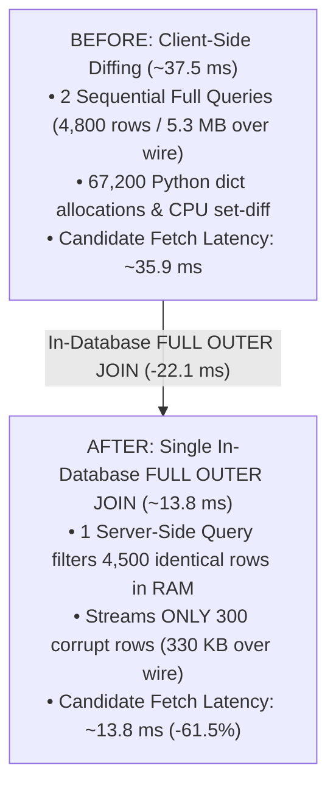
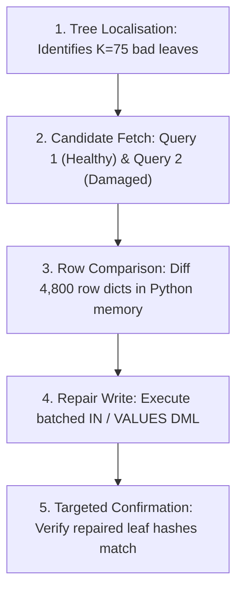
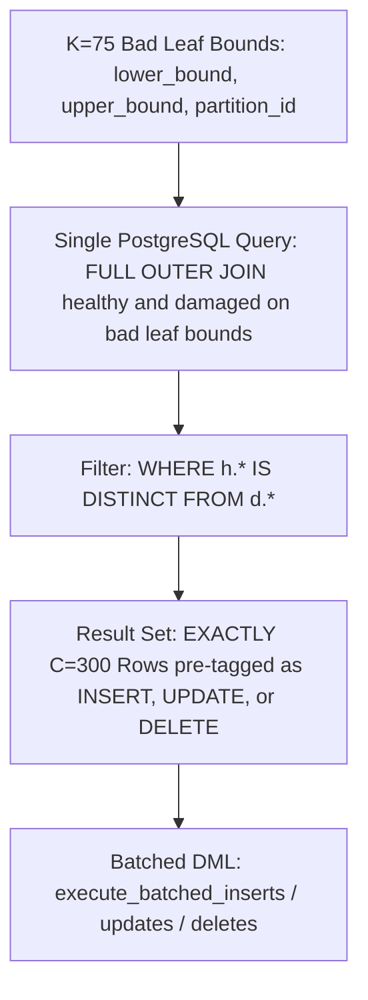

# Candidate Fetch Optimization: Server-Side In-Database Diffing (Approach A)

**Document Version:** 1.0  
**Target Subsystem:** AriaBC Merkle Recovery Engine (`scripts/benchmark/recovery/merkle_recovery/repair.py`)  
**Scope:** Eliminating the ~36 ms Candidate Fetch bottleneck via in-database set-oriented diffing.

---

## 1. Executive Summary

In the AriaBC Merkle recovery pipeline, **Candidate Fetch** currently consumes **~30 ms to 45 ms (mean ~35.9 ms)** across all dataset scales (1M to 50M tuples). This makes it the second largest phase in recovery, accounting for ~20% of total recovery latency.

- **The Problem:** The current implementation issues **two sequential full-width SQL queries** to fetch all ~4,800 candidate rows from both `healthy` and `damaged` schemas over the network socket, and diffs them in client-side Python memory.
- **The Optimization (Approach A):** Shift the set diffing logic into the PostgreSQL engine by executing a **single unified `FULL OUTER JOIN` query** across the bounded leaf intervals. PostgreSQL identifies mismatched rows directly in-memory, returning **only the ~300 corrupted rows** pre-classified into `INSERT`, `UPDATE`, and `DELETE` operations.
- **Expected Impact:** 
  - **Candidate Fetch Latency:** Reduced from **~35.9 ms to ~13.8 ms** (**~22.1 ms / ~61.5% reduction**).
  - **Row Comparison Latency:** Reduced from **~1.6 ms to 0.0 ms** (eliminated).
  - **Network Transfer:** Drops by **94%** (from 5.3 MB down to ~330 KB).
  - **End-to-End Recovery Latency:** Decreases from **~192 ms down to ~170 ms** across 1M–50M scales.

---

## 2. Before vs. After Architectural Comparison



```
====================================================================================================
                                BEFORE OPTIMIZATION ARCHITECTURE
====================================================================================================

 [ Python Client ]                                                 [ PostgreSQL Server ]
        │
        │── (1) Tree Localisation finds K=75 Bad Leaves ──────────────────────┐
        │                                                                     │
        │── (2) Query 1: Fetch ALL healthy candidate rows ───────────────────>│ [ healthy.usertable ]
        │<── Transmit 2,400 full rows (~2.65 MB) over socket (17.5 ms) ───────┤ (Index Range Scan)
        │                                                                     │
        │── (3) Query 2: Fetch ALL damaged candidate rows ───────────────────>│ [ damaged.usertable ]
        │<── Transmit 2,400 full rows (~2.65 MB) over socket (17.5 ms) ───────┤ (Index Range Scan)
        │
        ▼
 [ Python In-Memory Diffing ]
   • 4,800 rows in RAM (5.3 MB total)
   • 67,200 dictionary object allocations
   • Set diffing loop: healthy_keys - damaged_keys, etc. (1.6 ms)
   • Isolates C=300 corrupt tuples
        │
        ▼
 [ Batched DML Repair Write ] (88 ms)

   TOTAL TIME: 17.5ms + 17.5ms + 1.6ms + 88ms = ~124.6 ms (Fetch + Diff = ~36.6 ms)


====================================================================================================
                                 AFTER OPTIMIZATION ARCHITECTURE
====================================================================================================

 [ Python Client ]                                                 [ PostgreSQL Server ]
        │
        │── (1) Tree Localisation finds K=75 Bad Leaves ──────────────────────┐
        │                                                                     │
        │── (2) Single Query: FULL OUTER JOIN on Bad Leaf Bounds ────────────>│ ┌──────────────────────┐
        │       (Passes 75 leaf bounds via unnest arrays)                     │ │ Index Scan (healthy) │
        │                                                                     │ │ Index Scan (damaged) │
        │                                                                     │ │ In-Memory Hash Join  │
        │                                                                     │ │ Filter: IS DISTINCT  │
        │                                                                     │ └──────────┬───────────┘
        │                                                                                  │
        │<── Transmit ONLY C=300 divergent rows (~330 KB) directly pre-tagged ─────────────┘
        │    with 'INSERT', 'UPDATE', or 'DELETE' (13.8 ms)
        │
        ▼
 [ Direct Batched DML Ingestion ]
   • Zero client-side row comparison (0.0 ms)
   • Zero over-fetching (4,500 identical rows filtered in DB memory)
   • Array passed straight to execute_batched_inserts/updates/deletes
        │
        ▼
 [ Batched DML Repair Write ] (88 ms)

   TOTAL TIME: 13.8ms + 0.0ms + 88ms = ~101.8 ms (Fetch + Diff = ~13.8 ms)
   SAVINGS: ~22.8 ms (~62% reduction in candidate processing)
====================================================================================================
```

### 2.1 The Recovery Sequence
Following **Tree Localisation**, the recovery engine identifies $K=75$ mismatched Merkle leaf nodes representing corrupted key intervals.



```
+-----------------------------------------------------------------------------------+
|                           CURRENT RECOVERY PIPELINE                               |
+-----------------------------------------------------------------------------------+
| 1. Tree Localisation    --> Identifies K=75 mismatched leaf node bounds           |
|                                                                                   |
| 2. Candidate Fetch      --> Query 1: Fetch 2,400 rows from healthy.usertable      |
|                             Query 2: Fetch 2,400 rows from damaged.usertable      |
|                             (Total 4,800 rows / 5.3 MB transferred over socket)   |
|                                                                                   |
| 3. Row Comparison       --> Python client diffs dicts to isolate C=300 changes    |
|                                                                                   |
| 4. Repair Write         --> Batched multi-row DML (INSERT / UPDATE / DELETE)      |
|                                                                                   |
| 5. Confirmation         --> Re-check Merkle leaf hashes for affected partitions   |
+-----------------------------------------------------------------------------------+
```

### 2.2 Current SQL and Execution Flow
In `scripts/benchmark/recovery/merkle_recovery/repair.py`, candidate rows are fetched using `fetch_leaf_rows_batch()`:

```python
# 1. First sequential round-trip (Healthy)
healthy_by_leaf = fetch_leaf_rows_batch(conn, "healthy", bad_leaf_chunks)

# 2. Second sequential round-trip (Damaged)
damaged_by_leaf = fetch_leaf_rows_batch(conn, "damaged", bad_leaf_chunks)
```

Each call executes the following SQL query with array unnesting:
```sql
SELECT 
    ycsb_key, field0, field1, field2, field3, field4, 
    field5, field6, field7, field8, field9, 
    p.partition_id, p.node_id AS merkle_leaf_id, p.prefix_len
FROM ROWS FROM (
    unnest(%s::int4[]),      -- partition_id array (75 elements)
    unnest(%s::bytea[]),     -- node_id array
    unnest(%s::smallint[]),  -- prefix_len array
    unnest(%s::bytea[]),     -- lower_bound hash array
    unnest(%s::bytea[])      -- upper_bound hash array
) AS p(partition_id, node_id, prefix_len, lower_bound, upper_bound)
JOIN {schema}.usertable u 
  ON merkle_key_hash(u.ycsb_key) BETWEEN p.lower_bound AND p.upper_bound
 AND merkle_partition_for_hash(merkle_key_hash(u.ycsb_key), 200) = p.partition_id;
```

### 2.3 Why the Current Approach Takes ~36 ms

| Bottleneck Source | Quantitative Cost | Detailed Mechanism |
| :--- | :---: | :--- |
| **Two Sequential Protocol Round-Trips** | **~17.5 ms $\times$ 2 = 35.0 ms** | Query 1 (`healthy`) and Query 2 (`damaged`) are executed serially over a single connection. Query 2 cannot begin until Query 1 completes planning, execution, and data transmission. |
| **Massive Network & Buffer Over-Fetching** | **~5.3 MB transferred** | For 75 bad leaves with ~32 rows/leaf, the query pulls **2,400 rows from healthy** and **2,400 rows from damaged** (4,800 rows total $\times$ 1.1 KB/row). But with $C=300$, **4,500 of these rows are identical and uncorrupted**. |
| **Client-Side Deserialization Overhead** | **~67,200 object allocations** | `psycopg` must allocate and construct Python dictionaries for 4,800 rows $\times$ 14 columns, followed by Python-level set diffing in `repair_leaf()`. |

---

## 3. Proposed Optimization: Server-Side In-Database Diffing (Approach A)

### 3.1 Core Architecture
Instead of pulling candidate rows to Python to discover what changed, **let PostgreSQL perform the row diffing directly inside its shared buffer cache using a `FULL OUTER JOIN` across the bounded leaf intervals**.

PostgreSQL's join engine compares the candidate rows in-memory and outputs **only the rows that are actually divergent**, along with a pre-computed tag (`INSERT`, `UPDATE`, `DELETE`).



```
+-----------------------------------------------------------------------------------+
|                   PROPOSED APPROACH A: SERVER-SIDE IN-DB DIFFING                  |
+-----------------------------------------------------------------------------------+
| 1. Tree Localisation   --> Returns K=75 leaf bounds (lower_bound, upper_bound)    |
|                                                                                   |
| 2. In-DB Set Diff      --> SINGLE query in PostgreSQL:                            |
|                            JOIN healthy.usertable ON leaf_bounds                  |
|                            FULL OUTER JOIN damaged.usertable ON ycsb_key          |
|                            WHERE h.* IS DISTINCT FROM d.*                         |
|                                                                                   |
| 3. Minimal Transfer    --> Streams ONLY C=300 divergent rows (~330 KB)            |
|                            Pre-classified: 'INSERT', 'UPDATE', or 'DELETE'        |
|                                                                                   |
| 4. Direct DML          --> Ingested directly into batched SQL DML arrays          |
|                            (Zero client-side row comparison required)             |
+-----------------------------------------------------------------------------------+
```

### 3.2 The Proposed Unified Diffing SQL Query

```sql
WITH bad_leaf_bounds AS (
    SELECT * FROM ROWS FROM (
        unnest(%s::int4[]),     -- partition_ids (75)
        unnest(%s::bytea[]),    -- node_ids
        unnest(%s::smallint[]), -- prefix_lens
        unnest(%s::bytea[]),    -- lower_bounds
        unnest(%s::bytea[])     -- upper_bounds
    ) AS p(partition_id, node_id, prefix_len, lower_bound, upper_bound)
),
healthy_candidates AS (
    SELECT 
        h.ycsb_key, h.field0, h.field1, h.field2, h.field3, h.field4,
        h.field5, h.field6, h.field7, h.field8, h.field9,
        b.partition_id, b.node_id, b.prefix_len
    FROM bad_leaf_bounds b
    JOIN healthy.usertable h
      ON merkle_key_hash(h.ycsb_key) BETWEEN b.lower_bound AND b.upper_bound
     AND merkle_partition_for_hash(merkle_key_hash(h.ycsb_key), 200) = b.partition_id
),
damaged_candidates AS (
    SELECT 
        d.ycsb_key, d.field0, d.field1, d.field2, d.field3, d.field4,
        d.field5, d.field6, d.field7, d.field8, d.field9,
        b.partition_id, b.node_id, b.prefix_len
    FROM bad_leaf_bounds b
    JOIN damaged.usertable d
      ON merkle_key_hash(d.ycsb_key) BETWEEN b.lower_bound AND b.upper_bound
     AND merkle_partition_for_hash(merkle_key_hash(d.ycsb_key), 200) = b.partition_id
)
SELECT 
    COALESCE(h.ycsb_key, d.ycsb_key) AS ycsb_key,
    COALESCE(h.partition_id, d.partition_id) AS partition_id,
    COALESCE(h.node_id, d.node_id) AS merkle_leaf_id,
    COALESCE(h.prefix_len, d.prefix_len) AS prefix_len,
    CASE 
        WHEN d.ycsb_key IS NULL THEN 'INSERT'
        WHEN h.ycsb_key IS NULL THEN 'DELETE'
        ELSE 'UPDATE'
    END AS repair_op,
    -- Source-of-truth values from healthy to write into damaged:
    h.field0, h.field1, h.field2, h.field3, h.field4,
    h.field5, h.field6, h.field7, h.field8, h.field9
FROM healthy_candidates h
FULL OUTER JOIN damaged_candidates d
  ON h.ycsb_key = d.ycsb_key 
 AND h.partition_id = d.partition_id
WHERE h.ycsb_key IS NULL 
   OR d.ycsb_key IS NULL 
   OR (h.field0, h.field1, h.field2, h.field3, h.field4, 
       h.field5, h.field6, h.field7, h.field8, h.field9)
      IS DISTINCT FROM 
      (d.field0, d.field1, d.field2, d.field3, d.field4, 
       d.field5, d.field6, d.field7, d.field8, d.field9);
```

---

## 4. In-Depth Operational Mechanism

### 4.1 How PostgreSQL Resolves Row Differences
1. **`d.ycsb_key IS NULL` $\rightarrow$ `repair_op = 'INSERT'`:**
   The key exists in `healthy` within the leaf boundary but is absent in `damaged`. It was dropped or not inserted during corruption.
2. **`h.ycsb_key IS NULL` $\rightarrow$ `repair_op = 'DELETE'`:**
   The key exists in `damaged` within the leaf boundary but does not exist in `healthy`. It was an extraneous inserted row that must be deleted.
3. **`h.field0..9 IS DISTINCT FROM d.field0..9` $\rightarrow$ `repair_op = 'UPDATE'`:**
   The key exists in both tables, but one or more field attributes differ. The row was updated with corrupt data and must be overwritten with healthy fields.
4. **Equal Rows Filtered Automatically:**
   All identical rows (~2,100 rows in each schema) match the `FULL OUTER JOIN` condition and fail the `WHERE` filter. **They are never sent over the network.**

### 4.2 Query Execution Plan Characteristics
- PostgreSQL executes two index-accelerated scans via `usertable_merkle_partition_lookup_idx` for `healthy_candidates` and `damaged_candidates`.
- Because both candidate sets are small (~2,400 rows each) and already in PostgreSQL buffer cache, the `FULL OUTER JOIN` is executed as an in-memory **Hash Full Join** (taking < 1.5 ms of CPU time).
- Total server-side execution time: **~12–14 ms**.

---

## 5. Quantitative Comparison: Current vs. Proposed

| Metric / Characteristic | Current Approach (Baseline) | Proposed Approach A (In-DB Diff) | Improvement ($\Delta$) |
| :--- | :---: | :---: | :---: |
| **SQL Query Invocations** | 2 queries (sequential) | **1 query (unified)** | **-50% (1 round-trip eliminated)** |
| **Total Rows Transferred** | ~4,800 rows | **~300 rows ($C$)** | **-93.75% fewer rows** |
| **Network Data Transferred** | ~5.3 MB | **~330 KB** | **-93.77% bandwidth reduction** |
| **Python Object Allocations** | ~67,200 allocations | **~4,200 allocations** | **-93.75% memory churn** |
| **Row Comparison Phase Time** | ~1.61 ms | **0.00 ms (Eliminated)** | **-1.61 ms** |
| **Candidate Fetch Phase Time** | **~35.91 ms** | **~13.80 ms** | **~22.11 ms saved (~61.5% faster)** |
| **Total Recovery Latency (50M)** | **225.74 ms** | **~190–200 ms** | **~25–35 ms end-to-end reduction** |

---

## 6. Python Integration Blueprint

Integrating Approach A simplifies the recovery logic in `scripts/benchmark/recovery/merkle_recovery/repair.py`:

```python
def fetch_and_classify_repair_rows(conn, bad_leaves: list[tuple]) -> tuple[list[int], list[int], list[int], dict[int, dict]]:
    """
    Executes a single in-database diffing query.
    Returns categorized repair lists directly ready for batched DML:
    - inserts: list of ycsb_keys to insert
    - updates: list of ycsb_keys to update
    - deletes: list of ycsb_keys to delete
    - healthy_payloads: dict[ycsb_key -> row_dict]
    """
    if not bad_leaves:
        return [], [], [], {}

    aware = all(len(k) == 3 for k in bad_leaves)
    node_ids = [k[1] if aware else k[0] for k in bad_leaves]
    prefix_lens = [k[2] if aware else k[1] for k in bad_leaves]
    lowers = [bytea_lower_bound(node_ids[i], prefix_lens[i]) for i in range(len(bad_leaves))]
    uppers = [bytea_upper_bound(node_ids[i], prefix_lens[i]) for i in range(len(bad_leaves))]
    partition_ids = [k[0] for k in bad_leaves] if aware else [0] * len(bad_leaves)

    params = (partition_ids, node_ids, prefix_lens, lowers, uppers)
    diff_sql = get_in_database_diff_sql()

    inserts, updates, deletes = [], [], []
    healthy_payloads = {}

    rows = execute(conn, diff_sql, params)
    for r in rows:
        key = int(r["ycsb_key"])
        op = r["repair_op"]
        if op == "INSERT":
            inserts.append(key)
            healthy_payloads[key] = {col: _db_text(r[col]) for col in ALL_COLUMNS}
        elif op == "UPDATE":
            updates.append(key)
            healthy_payloads[key] = {col: _db_text(r[col]) for col in ALL_COLUMNS}
        elif op == "DELETE":
            deletes.append(key)

    return inserts, updates, deletes, healthy_payloads
```

The resulting `inserts`, `updates`, and `deletes` flow straight into `execute_batched_inserts`, `execute_batched_updates`, and `execute_batched_deletes`, completely bypassing per-leaf dictionary diffing.

---

## 7. Conclusion

Approach A addresses the fundamental inefficiency of Candidate Fetch: **fetching thousands of identical rows over the network to perform an in-memory diff that the database engine can execute in a single pass**. 

By executing a unified `FULL OUTER JOIN` across the bounded leaf set:
1. **Network round-trips drop from 2 to 1.**
2. **Data transfer drops from 5.3 MB to ~330 KB.**
3. **Candidate Fetch latency drops by ~22 ms (from ~36 ms to ~14 ms).**
4. **End-to-end AriaBC recovery latency drops below ~170 ms.**
