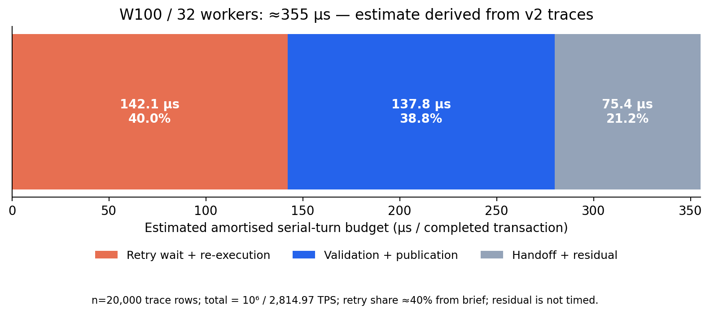
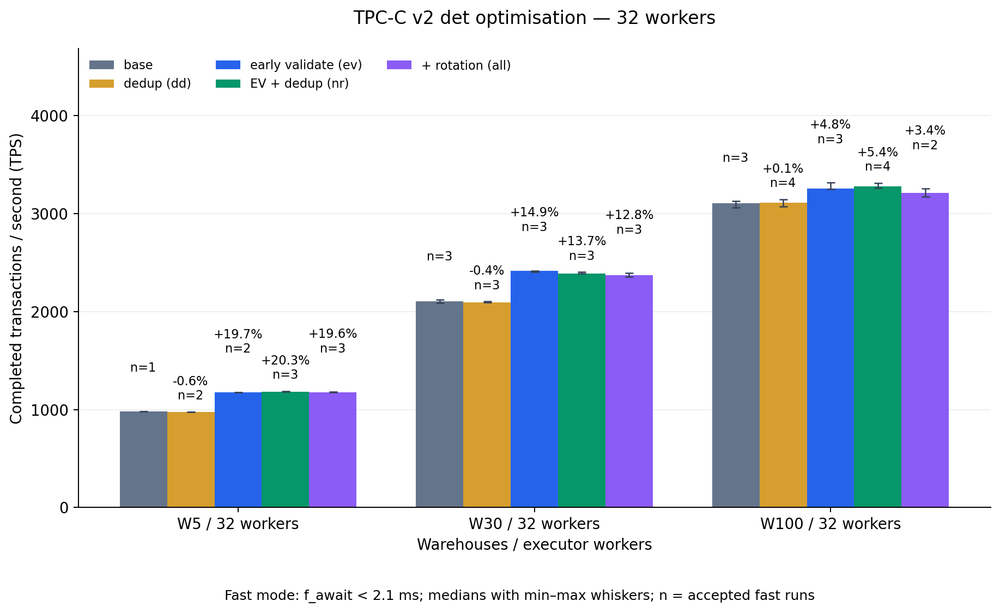
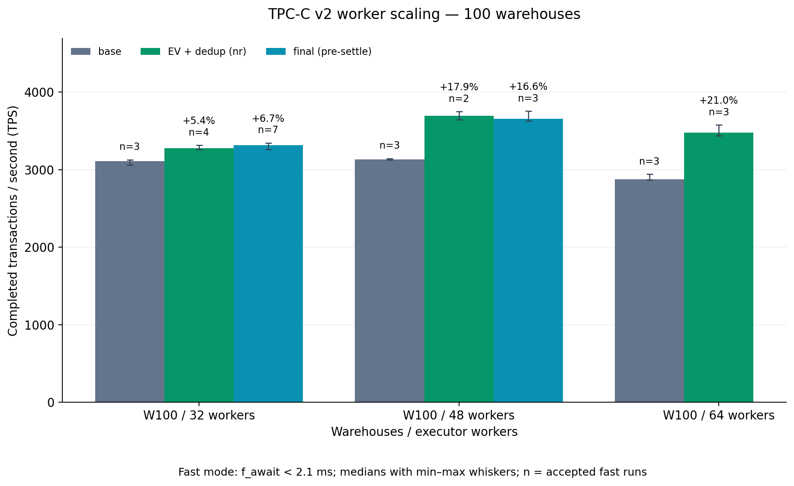
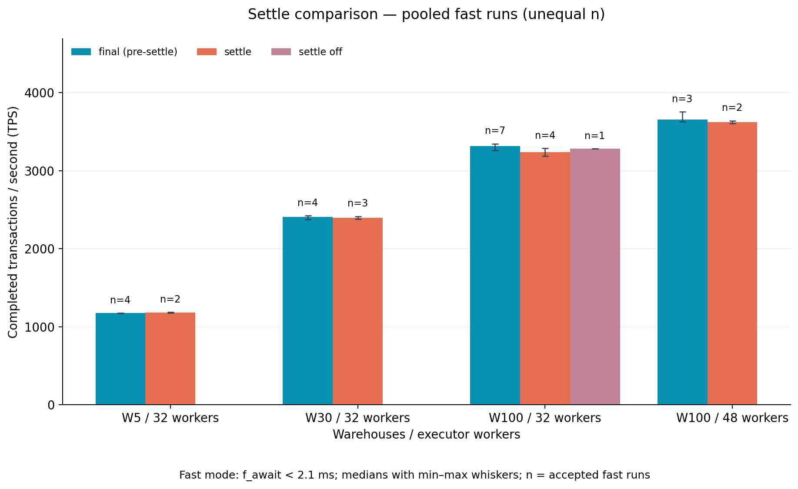
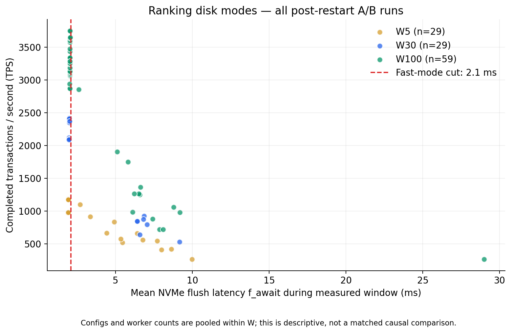
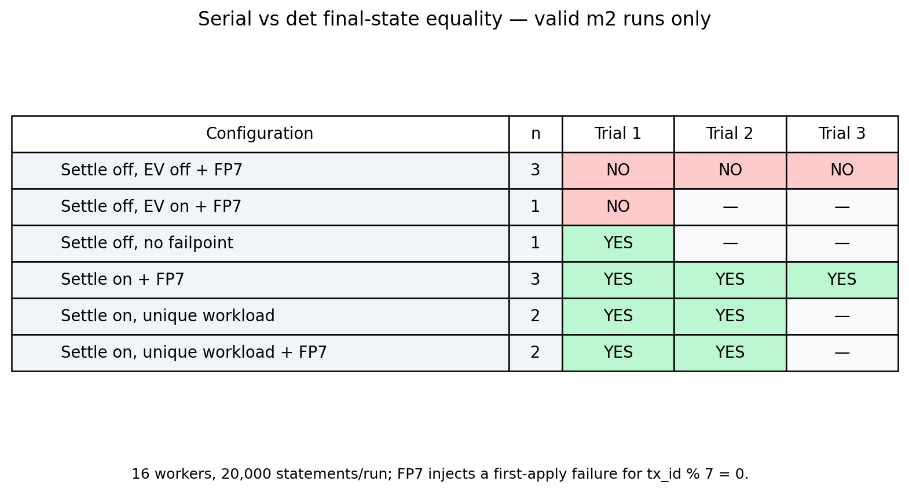
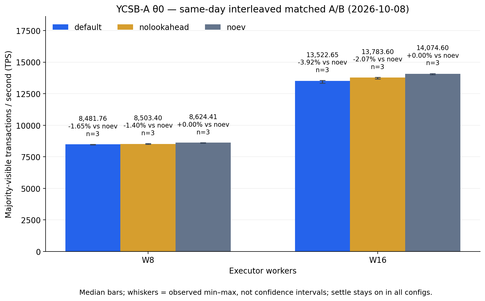
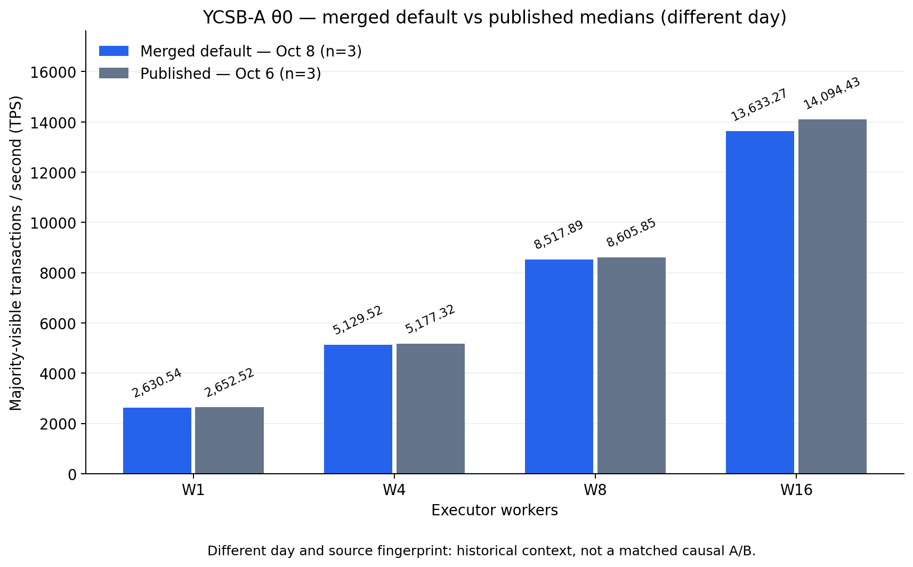

# Det-mode optimisation (2026-10-08)

The measured trade-off is workload-dependent: **single-node contended TPC-C v2 gains about +5% to +21%** for early validation plus dedup in the accepted fast-disk A/B, while **replicated conflict-free YCSB-A loses about 1.6% (W8) to 3.9% (W16)** against `noev` in the same-day matched cluster A/B (exact deltas −1.65% / −3.92%). Disabling lookahead recovers about half the W16 deficit on the 16-core replicas; this estimates its throughput cost, not CPU time. Accepted merged-default TPC-C state checks and completed replicated campaigns held correctness: **0 divergence, 0 permanent failures and equal replica roots where checked**. Recovery C remains unaccepted: its all-three audit never finalises, terminal counters and Phase 8 roots are unavailable, and settle-off unsafe reproducer controls remain unequal as documented below.

**Next levers:**

- Spin for lookahead only when next in line, with a bounded budget.
- Make the 1 ms timed revalidation adaptive or add backoff.
- Retry the gateway audit-thread wait during recovery; its exit-on-timeout path is a pre-existing bug.

Early validation moves conflict detection and resimulation out of the ordered publication turn. Exact tag deduplication reduces redundant probes; trace repairs make timing and transaction identity usable. The post-publication **settle** fix freezes business execution after handoff and repairs unique-index write coverage. These changes were merged into main at `19e8acb2`; commit-set sampling was rejected, and early rotation remains off by default.

The TPC-C tables below are recomputed from [raw A/B status](data/raw/ab_status.txt), using fast-disk runs only. They describe **single-node TPC-C v2**; the cluster section separately imports replicated YCSB and recovery evidence. No current v3 TPC-C result is claimed. Archived branch reports are interim documents: their “not merged”, original digest-ring size, and provisional throughput statements describe their earlier stages. This README records the curated outcome.

## What changed and why



The [review](evidence/det_protocol_review_REPORT.md), [saved trace analysis](evidence/remote_phase_analysis.json), and [shared optimisation brief](evidence/critical_path_source_brief.md) motivate shortening the turn. At historical W100/32, 2,814.97 TPS implies an **amortised budget of 355.24 µs/transaction**. The brief estimates about 40% spent in turn-held retry waiting/re-execution; measured conflict microphases total 114.913 µs and publication 22.849 µs (137.762 µs, about 39%). The figure uses the brief's approximate retry share and assigns the remainder to handoff/other costs. It is an estimate derived from v2 traces, **not a directly timed serial-slot decomposition**. Concurrent per-transaction phase totals do not sum to workload wall time. Historical coarse timing cells affected by overflow are unsuitable for precise attribution.

| Change | Purpose / mechanism | Evidence |
|---|---|---|
| Early validation + delta validation + lookahead | Check while waiting; early conflicts abort before owning the turn; final validation covers every predecessor before publishing | [early_validate report](evidence/early_validate_REPORT.md) |
| Exact tag dedup + cached hashes | Keep read / checked-write / publish-only categories separate; compare full tags; omit reads already checked as writes | [tag_dedup report](evidence/tag_dedup_REPORT.md) |
| Trace repairs | Signed timespec subtraction; cache tx ID before deletion; fine per-probe clocks opt-in | [trace_rot report](evidence/trace_rot_REPORT.md) |
| Settle + all-unique-index write tags | Keep validated deferred writes fixed after release; settle apply failures against committed predecessors; deterministic terminal outcomes | [SETTLE_REPORT](evidence/SETTLE_REPORT.md) |

Traced mechanism observations: W100 in-turn conflict phase falls from **114.64 to 4.33 µs**, and serial-slot wait from **5,773.87 to 3,844.73 µs**. **79.83%** of W100 conflicts and **92.34%** of W5 conflicts are caught early. W5 in-turn conflict time falls from **159.69 to 1.35 µs**, while restarts rise from **14,758 to 32,299**. Extra speculative retries are a cost paid before the turn. These are traced comparisons from the branch report, separate from the trace-off medians below; the later cluster A/B below isolates lookahead for YCSB-A, rather than this TPC-C trace.

## Protocol before / after

**Before (publication gate source 0):**

1. Assign ordered deterministic IDs; execute business SQL speculatively on a PostgreSQL snapshot, recording read/write tags and deferred writes.
2. Wait until predecessor write sets have published; check all read and checked-write tags while owning the turn.
3. On conflict, wait for the committed prefix and rerun SQL; successors remain blocked at the turn.
4. Publish write tags and release the turn; apply deferred writes and commit outside it, overlapping independent transactions.
5. On some apply failures, abort and rerun business SQL on a fresh snapshot **after release**. This can see committed successors and violate the prescribed order.
6. After PostgreSQL commit, publish terminal readiness and advance the contiguous committed prefix; block completion and client delivery follow.

**After (merged defaults):**

1. Execute speculatively and build exact deduplicated tag sets, preserving the three reservation categories.
2. Validate while waiting; on an early conflict, abort, wait for its committed-prefix target, and resimulate before publication.
3. At the turn, validate the unexamined predecessor digest interval, capped at own ID minus one. Missing/reused/overflowed digest history falls back to the original full map check. Publish complete write tags (including additional unique indexes) and the digest; then hand off.
4. Apply and commit outside the turn. **After handoff, never rerun business SQL or take a replacement snapshot.** An apply failure receives quick apply-only retries, then waits for all predecessors and reapplies the same validated writes.
5. Persistent settled errors produce deterministic outcomes: eligible `ON CONFLICT DO NOTHING` is a no-op; otherwise terminal 23505 or a whitelisted deterministic SQLSTATE; unclassified failures produce an invariant warning and terminal BC001.
6. Publish terminal readiness after transaction finish and advance the committed prefix. Database commit, prefix advancement, block readiness, Kafka delivery, and client completion remain distinct events.

## Environment switches

Defaults here were checked against the merged local source. Environment values are cached per backend; changing them requires fresh backend processes. This table covers every switch introduced or discussed by this optimisation campaign, plus its tracing and harness controls.

| Variable | Merged default | Meaning |
|---|---|---|
| `BCDB_DT_EARLY_VALIDATE` | on | Early checks, digest publication and final incremental validation; `0` restores full at-turn validation |
| `BCDB_GATE_LOOKAHEAD` | on | Active only with early validation; signal tx+1 and tx+2, timed waits for distant workers; `0` keeps early validation with the original wait policy |
| `BCDB_DT_TAG_DEDUP` | on | Exact dedup, cached tag hashes and checked-write/read overlap skipping; `0` disables them |
| `BCDB_DT_EARLY_ROTATION` | **off** | Optional guarded off-turn map retirement; explicitly enable with `1` |
| `BCDB_DT_POST_PUBLISH_SETTLE` | **on** | Freeze business execution after publication; `0` restores unsafe historical full-restart branches for reproduction/A/B |
| `BCDB_DT_COMMIT_SET` | **not in merged code** | Rejected branch default was on; pre-snapshot commit sampling and targeted waits |
| `BCDB_PHASE_TRACE` | unset / off | Nonempty path enables phase CSV output; headline A/B uses trace off |
| `BCDB_PHASE_TRACE_FINE` | **off** | Exactly `1` enables per-probe lock/hash clocks when phase tracing is also enabled |
| `BCDB_FAILPOINT_POST_PUBLISH_APPLY` | unset / disabled | Positive N injects a unique failure into first apply calls for IDs divisible by N; reproducer uses 7 |
| `BCDB_DT_SKIP_READONLY_GATE` | **off; unsafe** | Ignored with settle on; skipping validation can let later max-writer entries hide earlier conflicts |
| `SYNC_BEFORE_MEASURE` | harness-specific; A/B sets **1** | Flush dirty state before measurement; not a protocol switch. An unset harness default is not established by the archived local reports |

The merged digest ring is **8192 × 384 × 8 B ≈24 MiB of hash payload**, plus metadata. The early branch originally used 131072 slots / 385 MiB allocation; that is historical. Ring ownership mismatch and wide-transaction overflow retain a full-map fallback. Shared-memory layout changes require a server restart.

## TPC-C v2 results

Ranking (`protectdr@10.129.7.57`) ran the whole pipeline in isolated campaign directories. The summary report specifies **20,000 transactions, seed 42, det window 65536, SERIALIZABLE, fsync on, synchronous_commit on and phase tracing off**. V2 baseline context uses fillfactor 90, prewarming and 32GB buffers. Historical baseline/server settings are described in the preserved review; local raw status lines do not independently re-prove all settings or binary hashes for each A/B attempt.

| cfg | A/B configuration |
|---|---|
| base | main before the work |
| dd | tag dedup only |
| ev | early validation only (including default lookahead) |
| nr | early validation + dedup; rotation off |
| all | nr + early rotation; **not** the merged default |
| off | optimisation binary with the three optimisation switches off |
| final | combined branch before settle, rotation off |
| settle | final + post-publication fix |
| settleoff | settle binary with settle disabled |

Cells show **median TPS (n fast runs)**; percentages are relative to the base median at the same W/workers. Whiskers show observed min–max, not confidence intervals. All accepted fast runs are pooled per cfg/W/workers, including later final/settle queues; counts are unequal. Small samples and sequential queue/build differences limit causal interpretation.

### Warehouse scaling (32 workers)



<!-- BEGIN warehouse -->

| W | base | dd | ev | nr | all |
|---|---|---|---|---|---|
| 5 | 982.72 (1) | 976.55 (2); -0.63% | 1,176.30 (2); +19.70% | 1,182.35 (3); +20.31% | 1,175.44 (3); +19.61% |
| 30 | 2,101.72 (3) | 2,093.39 (3); -0.40% | 2,414.63 (3); +14.89% | 2,390.21 (3); +13.73% | 2,371.56 (3); +12.84% |
| 100 | 3,106.98 (3) | 3,110.72 (4); +0.12% | 3,256.32 (3); +4.81% | 3,274.95 (4); +5.41% | 3,211.95 (2); +3.38% |

<!-- END warehouse -->

### Worker scaling (W100)



<!-- BEGIN workers -->

| Workers (W100) | base | nr | final (pre-settle) |
|---|---|---|---|
| 32 | 3,106.98 (3) | 3,274.95 (4); +5.41% | 3,314.93 (7); +6.69% |
| 48 | 3,133.12 (3) | 3,694.51 (2); +17.92% | 3,652.81 (3); +16.59% |
| 64 | 2,873.90 (3) | 3,476.83 (3); +20.98% | — |

<!-- END workers -->

The accepted base median peaks at 48 workers, and nr also peaks there. The plot omits final at 64 workers because no such observation is available. This campaign does not show that base is slower at 48 than 32; the archived summary's wording overstates that point.

### Settle comparison



<!-- BEGIN settle -->

| W / workers | final | settle | settleoff | settle vs final |
|---|---|---|---|---|
| 5 / 32 | 1,174.14 (4) | 1,181.38 (2) | — | +0.62% |
| 30 / 32 | 2,406.61 (4) | 2,394.00 (3) | — | -0.52% |
| 100 / 32 | 3,314.93 (7) | 3,237.81 (4) | 3,280.17 (1) | -2.33% |
| 100 / 48 | 3,652.81 (3) | 3,621.49 (2) | — | -0.86% |

<!-- END settle -->

Pooled medians include every eligible queue and therefore differ from the interim SETTLE_REPORT table. The only fully fast alternating triple, **W100/32 trial 51**, is final **3,343.15**, settle **3,244.50**, settleoff **3,280.17 TPS**. The settle/settleoff comparison uses one binary, while final/settle also changes the build. Other triples include slow runs and cannot supply matched fast comparisons. This does **not** establish zero settle overhead or attribute the whole final/settle gap to settle. The report's traced settle W100 run had **0 post_publish_settles, 0 terminal_unique and 0 invariant events**; TPC-C has one unique index per table, so the added index coverage creates no extra tags there.

### Disk-noise method and run audit



The root Crucial P3 QLC NVMe alternates between low and high flush latency. The campaign report describes roughly **1.9 ms** fast flushes versus **6–29 ms** slow flushes and TPS drops of **2–3×**; the scatter includes intermediate observations too, rather than claiming a perfect two-cluster distribution. Device behaviour is a recorded association, not an independently verified internal SSD mechanism. Pin/nopin diagnostic TPS values overlap: 987.59 versus 980.80 in fast attempts and 454.86 versus 458.99 in slow attempts ([diagnostic status](data/raw/diag_status.txt)). Pinning alone did not eliminate the variation.

[run_io.py](evidence/run_io.py) averages `nvme0n1` iostat samples whose timestamps fall in the gateway's measured window; [diag_io.py](evidence/diag_io.py) adds vmstat context. The curator reads those saved per-run means; full iostat/gateway logs are not included, so it cannot recompute the window or device averages. `SYNC_BEFORE_MEASURE=1` reduces residual dirty-data confounding but does not eliminate the SSD mode change.

Eligibility is strict: **after the `restart with io capture` marker, f_await < 2.1 ms**, rc=0, matching reference prefix, divergence_count=0 and permanent_failures=0. Missing disk data and f_await ≥2.1 are excluded. Pre-marker completed runs remain in the “every run” CSV with blank disk columns and fast_mode=false; they are excluded from every median and from the disk scatter. No cherry-picking by TPS or trial number is used. `status.txt` supplies supporting trace/branch evidence only.

<!-- BEGIN audit -->

Parsed **120** completed A/B runs: **3** pre-restart runs retained in the run CSV but excluded from analysis; **117** post-restart runs, **84** fast and **33** outside the fast cut. All **120/120** recorded state prefixes match; every A/B line has rc=0, divergence_count=0 and permanent_failures=0. These fields are archived in the CSV for audit.

<!-- END audit -->

## Correctness evidence and bugs found

| W | Required state.hash SHA-256 prefix |
|---|---|
| 5 | `fdb9545f1c588209` |
| 30 | `dcb895e5961ab8e8` |
| 100 | `e82921e1ebb1b7ab` |

A/B lines record only these prefixes. The early-validation report includes independently recomputed full hashes for its own accepted runs, not every later A/B run. This TPC-C state projection is the historical **eight mutable tables' row counts and 64-bit row-hash sums, excluding timestamps and immutable item**. Prefix matches are useful consistency evidence, not complete row-by-row equality, SELECT-result equality or replica-root verification.

The micro reproducer compares the same 20,000 ordered statements run serially through psql versus det with 16 workers on lab `.247`. It exercises `ab_proc` (read acct, derive outt), `bump_proc` (eight hot acct keys), and `uq_proc` (two unique indexes). **Only m2 runs are valid**; garbled concurrent attempts and smoke runs are excluded. The curator compares copied `serial.hash` and `det.hash` bytes and checks matrix values against each copied `result.txt`.



<!-- BEGIN repro -->

| Configuration | n | state_equal (trial order) | Settles / run | Terminal 23505 / run | Serial errors / run |
|---|---|---|---|---|---|
| off_fp7 | 3 | NO, NO, NO | 0 | 0 | 0 |
| offEV_fp7 | 1 | NO | 0 | 0 | 0 |
| off_nofp | 1 | yes | 0 | 0 | 0 |
| on_fp7 | 3 | yes, yes, yes | 2858 | 0 | 0 |
| on_uq | 2 | yes, yes | 1309 | 1309 | 1309 |
| on_uq_fp7 | 2 | yes, yes | 3988 | 1309 | 1309 |

<!-- END repro -->

`offEV_fp7` has early validation on and settle off **after the self-conflict guard fix**; it finishes but remains state-unequal. All valid reproducer runs report divergence_count=0 and permanent_failures=0, including the unequal runs: single-node divergence counters are insufficient. Unique-workload terminal errors match the serial run's **1,309** errors. The underlying comparison hashes all text rows of acct/outt/uq in sorted order with MD5; it is not a per-transaction return-value comparison. The per-run CSV preserves both hash strings.

| Bug / unsafe path | Finding and resolution |
|---|---|
| Post-publication business re-execution | Three apply-failure branches could adopt committed successor values on a new snapshot, even with identical key sets. Four failpoint m2 controls are state-unequal. Settle keeps the validated writes and business snapshot fixed after handoff; see [original analysis](evidence/post_publish_restart_review_REPORT.md) |
| Single-unique-index tagging | Previously only PK or one selected unique index was tagged. Added plain unique-index values get distinct checked tags; NULL keys skip the extra unique tag; partial/expression or more than 8 unique indexes fall back to a conservative relation-wide write tag |
| Early-validation self-conflict deadlock | Old post-publication reruns could scan their own published digest and wait on their own commit (tx 0, last_committed=-1). Cap the scan at own−1; settle also removes the offending full-rerun path |
| Phase duration overflow | Unsigned nanosecond subtraction across a second boundary created enormous durations. Use signed subtraction before conversion; historical invalid cells remain invalid |
| tx_id after delete | Trace emission read a freed/reused shared entry. Cache the ID before deletion. Fixed trace_rot W100 audit has 20,000 rows, 20,000 unique IDs and maximum duration 47,507 µs |
| `BCDB_DT_SKIP_READONLY_GATE` | Unsafe: a successor's max-writer publication can hide an earlier writer before read validation. Leave off; settle ignores it |
| Genuine 23505 in `*_proc` | Historical fast restart could repeatedly rerun the same failing statement forever. Settle produces terminal 23505 where appropriate |

## Tried, rejected, or left off

| Candidate | Observations | Outcome |
|---|---|---|
| Commit-set sampling | W5 off-mode trace: **8/14,804 = 0.0540%** baseline conflicts known committed pre-snapshot; only **4/14,804 = 0.0270%** provably skippable checked-writer candidates. Sampling totals **17,038 µs**, retry waits **55,536,065 µs** | Not merged: little measured eligibility, additional safety assumptions; it exposed the post-publication hazard |
| Early rotation | nr vs all fast medians below quantify the small regression. The separate trace removes off-turn clear stalls of **14,344–34,449 µs** from publication, but the scheduling transaction still bears them before commit | Code retained, default **off**; no demonstrated throughput win |
| Tag dedup | W5 traced OFF→ON read probes **141.10→60.06 (−57.44%)**, read-check time **106.69→62.67 µs (−41.26%)**; published entries **36.17→36.01 (−0.44%)**. Fast dd-only medians are close to base | Kept as reduced probe work; no stable TPS gain established |
| Durability relaxation / dependency scheduling | Explicitly not done in the campaign summary | No performance claim |

Early rotation's direct comparison (`all` versus `nr`) is:

<!-- BEGIN rotation -->

| W (32 workers) | nr median TPS | all median TPS | Rotation change vs nr |
|---|---|---|---|
| 5 | 1,182.35 | 1,175.44 | -0.58% |
| 30 | 2,390.21 | 2,371.56 | -0.78% |
| 100 | 3,274.95 | 3,211.95 | -1.92% |

<!-- END rotation -->

Tag dedup's published-entry saving is much smaller than raw reservation dedup because the baseline already had a recent-prefix duplicate scan. Trace-off `total_restarts=0` in `status.txt` means **unmeasured**, not zero executor retries.

## Website QA

`ARCHITECTURE_EXPLORER.html` tab 04 has new/old protocol selection, early aborts, and post-publication settle. The preserved [QA results](evidence/website_validation/results.txt) record old reruns versus new settles, monotonic publication, early-abort explanation, 0.125× playback, no JS errors and mobile controls fitting the viewport. Three selected screenshots: [new post-publication explanation](evidence/website_validation/postpub_new_explainer.png), [old explanation](evidence/website_validation/postpub_old_explainer.png), [new early-validation gate](evidence/website_validation/random_new_gate.png). These are recorded model/browser checks, not live measurements or a new browser QA run by this curator.

## 4-node Raft/Kafka cluster validation

The saved Oct 8 campaigns used a gateway/controller on `10.129.27.111` and three PostgreSQL/Raft/Kafka replicas on `10.129.148.247/.246/.248` (replica identities `admin123`, `user4`, `utkarsh`). Ordering was `raft-kafka`, completion `majority_async_all3`, with det window 1024, 96 client lanes, 32MB shared buffers, PostgreSQL port 5438 and server port 8000; executor workers, PostgreSQL connections, pool size and BCDB workers all followed W. YCSB-A θ0 and YCSB-D θ0.99 used 20,000 requests and verified cold runs; recovery used the canonical YCSB-A θ0 160,000-request workload at W8. Report 2 used isolated physical pgdata copies; report 3 reproduced recovery failures with canonical scripts and normal restore. This archive imports saved evidence only; no new network, build, database or benchmark execution was performed.

Sources: [initial campaign](evidence/cluster/CLUSTER_REPORT.md), [matched A/B and standalone test](evidence/cluster/CLUSTER_REPORT_2.md), and [canonical recovery diagnosis](evidence/cluster/CLUSTER_REPORT_3.md). The three reports and three raw CSVs were checked for password/credential assignments and credential-bearing command strings before copying; **no redaction was needed**, and copies are byte-for-byte identical. Checksums are in [snapshot_sha256.json](evidence/snapshot_sha256.json). [cluster_runs.csv](data/cluster_runs.csv) retains every source row, including failed prerequisites and earlier NOT RUN entries. Blank terminal metrics mean unknown; `merkle_pass=0` means unpassed/not reached, not a measured root mismatch.

### Correctness and provenance

<!-- BEGIN cluster_correctness -->

| Campaign | Runs | Terminal divergence | Terminal permanent failures | Merkle admin123 / user4 / utkarsh | Phase 8 roots |
|---|---|---|---|---|---|
| Initial YCSB-A θ0, W1/4/8/16 | 12 | 0 | 0 | PASS / PASS / PASS | Equal |
| YCSB-D θ0.99, W16 | 2 | 0 | 0 | PASS / PASS / PASS | Equal |
| Matched YCSB-A θ0, W8/16, all configs | 18 | 0 | 0 | PASS / PASS / PASS | Equal |
| Standalone Merkle | 1 | UNKNOWN | UNKNOWN | PASS / PASS / PASS | Equal test roots; no Phase 8 |
| Recovery A (off), both reports | 2 | 0 | 0 | PASS / PASS / PASS | Equal |
| Recovery C, all attempts | 5 | UNKNOWN | UNKNOWN | NOT RUN | NOT RUN |
| Failed startup prerequisites | 2 | UNKNOWN | UNKNOWN | NOT RUN | NOT RUN |

<!-- END cluster_correctness -->

Every accepted YCSB attempt has valid all-three workload audit **20,000/20,000**, marker visibility on all replicas, matching row counts, roots and data MD5, and independent `merkle_verify=t` on each replica. Recovery A has valid audit and quorum **160,000/160,000**. Initial A Phase 8 roots are `d1b0ffe0b7322cdc2e920e7e32a0712c4c66e399e5b34c733442c2619af7a157` (12,001 rows per replica); D roots are `07723811d1b83698557249077cf1fb33ada16441250640fa047b7a66ff36b5af` (13,025 rows). Matched A/B post-marker roots/data digests and independent native checks are recorded in report 2's audit evidence. Both A recovery runs share root `80566f7114b529dda1e6da732dab5462a8cdbce998afa5fec073e224d0ea6ad5` (12,001 rows). Recovery C did not reach Phase 8, so its repair cut digest is not a final root. Earlier standalone/recovery NOT RUN rows remain in the CSV as historical status, not additional executed trials.

| Campaign | Portable source fingerprint | Identity evidence |
|---|---|---|
| Initial merged-default A/D | `179fbd4a251edc48756ff40a3e27b371b6ce4c404619ffa77d7ace13143a23a8` | `BINARY_PROVENANCE_PASS=1`, `build_manifests_valid=1`; expected/live match on all replicas |
| Same-day matched A/B | `8de79d55eb32ff09bfae6d6befa29ba39437e851f65c6f903a3dd3b760c40576` | Matching source/binary manifests; includes preserved runtime harness path/TMPDIR variants |
| Canonical recovery follow-up | `a1ea2435504a5eda1dab187c1bc5bafc56f0fcf7f572f282d0760f611286f7d3` | Fresh canonical build; provenance passed for every run |
| Oct 6 published A reference | `b9ad5497ed0c526092700d0d1f7f1458eb99fb1410256b470e47708695eb07c5` | Different source identity and day |

The det merge is `19e8acb2`; the opt-in `BCDB_PG_EXTRA_ENV` passthrough is commit `3bde2fdc`. Initial replica source checks found `bcdb_dt_post_publish_settle_enabled` and call sites at worker.c lines 498, 970, 3172 and 3305; all three worker.c SHA256 values were `41867b7e82508727f843505c7babbd7a2f7cb031ec9e5fbc4e6e7afea1f2a286`. Replica git HEAD can be `unknown` because sync excludes `.git`; acceptance uses the source and executable manifests. Postmaster environment samples in reports 2/3 prove the requested switches reached every replica. **Settle stayed default-on throughout.**

Full original evidence remains under `.bench_tmp/detopt_cluster_20261008/`: report 1 uses `full_run_audit.json` and the `scripts/bench_full_results/<run_id>/` artifacts; report 2 uses `2_full_run_audit.json`, `2_runs/<run_id>/` and `2_ab_*/`; report 3 uses `3_runs/<run_id>/`, per-run provenance, watchdog diagnostics and independent Kafka audits. This small archive copies the reports/CSVs, not those full logs.

### Same-day interleaved matched YCSB-A A/B

Each W/config has three trials on the same build. Trial order rotates default → nolookahead → noev, then nolookahead → noev → default, then noev → default → nolookahead; W16 precedes W8 within each trial. Configurations are:

| Config | `BCDB_PG_EXTRA_ENV` | Behavior |
|---|---|---|
| default | unset | Merged defaults |
| nolookahead | `BCDB_GATE_LOOKAHEAD=0` | Early validation and dedup on; lookahead off |
| noev | `BCDB_DT_EARLY_VALIDATE=0 BCDB_DT_TAG_DEDUP=0` | Older validation/tag protocol; lookahead also off through its early-validation prerequisite |



<!-- BEGIN cluster_matched -->

| Workers | Config | n | Median TPS | Min–max TPS | Δ vs noev |
|---|---|---|---|---|---|
| 8 | default | 3 | 8,481.76 | 8,442.38–8,496.18 | -1.65% |
| 8 | nolookahead | 3 | 8,503.40 | 8,485.36–8,554.32 | -1.40% |
| 8 | noev | 3 | 8,624.41 | 8,572.65–8,631.85 | +0.00% |
| 16 | default | 3 | 13,522.65 | 13,333.33–13,559.32 | -3.92% |
| 16 | nolookahead | 3 | 13,783.60 | 13,661.20–13,802.62 | -2.07% |
| 16 | noev | 3 | 14,074.60 | 13,995.80–14,104.37 | +0.00% |

<!-- END cluster_matched -->

Disabling lookahead improves default median TPS **1.93% at W16** and **0.26% at W8**. Its removal accounts for about half the W16 throughput deficit on the 16-core replicas. That is a switch-isolation estimate from TPS, not a direct measurement of CPU stolen by spinning backends. The remaining gap includes early-validation/dedup costs; these trials do not separate those two. Short samples establish this campaign's trade-off, not a universal ranking.

### Historical YCSB-A comparison — different day

Published Oct 6 medians are from `Final_Results/WORKER_THREAD_LATENCY/summary.csv`, as transcribed in report 1. The merged-default Oct 8 campaign has a different fingerprint. These are **different-day references**, not a same-day control or a causal attribution.



<!-- BEGIN cluster_historical -->

| Workers | Oct 8 merged-default median TPS (n=3) | Oct 6 published median TPS (n=3) | Δ (different day) |
|---|---|---|---|
| 1 | 2,630.54 | 2,652.52 | -0.83% |
| 4 | 5,129.52 | 5,177.32 | -0.92% |
| 8 | 8,517.89 | 8,605.85 | -1.02% |
| 16 | 13,633.27 | 14,094.43 | -3.27% |

<!-- END cluster_historical -->

### YCSB-D θ0.99

<!-- BEGIN cluster_d -->

| Workload / workers | Trial 1 TPS | Trial 2 TPS | Median TPS (n=2) | Historical TPS (n=1) | Δ (different day) |
|---|---|---|---|---|---|
| YCSB-D θ0.99 / 16 | 23,557.13 | 24,509.80 | 24,033.47 | 24,213.08 | -0.74% |

<!-- END cluster_d -->

Both new trials passed all-three audit, zero terminal divergence/permanent failures and Merkle verification on every replica. The original workload has **19,072 SELECTs and 928 INSERTs**; the harness materializes version-5 inputs and retains hashes. The reference is the historical **single trial** `cluster4_20260924_061840_f026ce9b` from `Final_Results/YCSB/summary.csv`, with a different source fingerprint. It is not an Oct 6 matched comparison.

### Standalone Merkle

The initial attempt was blocked before Raft startup by a stale `ariabc_kv_test` Merkle index whose node relation was missing. Report 2 dropped that fixture only in the isolated copies; a further skip-restore startup encountered the missing `merkle_node_warehouse` relation, so the successful retry used normal YCSB restore. These prerequisite failures are not det divergence measurements.

`test_merkle_consistency.sh` then **passed on all three replicas**: 50 rows each, root `c531ccbb513259116dea3321af59140d8ebc7e013305acc8c1b65c27aa2cf3b9`, native verification `t`, and updated sentinel `k=10 → val_010_v2`. The fixture was removed afterward. Report 2 retains before/after catalog evidence and checksums showing canonical pgdata was unchanged by its isolated-copy cleanup.

### Recovery A and five C attempts

A means recovery off. C uses recovery `both`, fault node `utkarsh`, 100 modified tuples and a 5-second injection delay. A has two independent same-day observations; report 3's canonical A is **8,823.69 TPS**, with zero empty 100ms steady buckets and maximum completion gap **19.58 ms**. These are single runs, not a three-trial median. Historical published A is **8,850.05 TPS** and C **8,693 TPS**; the latter does not supply a valid TPS for these aborted C runs.

<!-- BEGIN cluster_recovery -->

| Case | Source report | Config | Trial | TPS | repair_ms (live PASS) | Outcome | All-3 audit | Terminal divergence / failures | Phase 8 / roots |
|---|---|---|---|---|---|---|---|---|---|
| A | CLUSTER_REPORT_2.md | default | 1 | 8,824.18 | — | PASS | valid; 160000/160000 | 0 / 0 | PASS / PASS / PASS; equal |
| C | CLUSTER_REPORT_2.md | default | 1 | UNKNOWN | 54764 | FAIL / exit 143 | Not finalised | UNKNOWN / UNKNOWN | NOT RUN |
| C | CLUSTER_REPORT_3.md | default | 1 | UNKNOWN | 55328 | FAIL / exit 143 | Not finalised | UNKNOWN / UNKNOWN | NOT RUN |
| C | CLUSTER_REPORT_3.md | noev | 1 | UNKNOWN | 54083 | FAIL / exit 143 | Not finalised | UNKNOWN / UNKNOWN | NOT RUN |
| C | CLUSTER_REPORT_3.md | default | 2 | UNKNOWN | 54867 | FAIL / exit 143 | Not finalised | UNKNOWN / UNKNOWN | NOT RUN |
| C | CLUSTER_REPORT_3.md | noev | 2 | UNKNOWN | 53763 | FAIL / exit 143 | Not finalised | UNKNOWN / UNKNOWN | NOT RUN |
| A | CLUSTER_REPORT_3.md | default | 1 | 8,823.69 | — | PASS | valid; 160000/160000 | 0 / 0 | PASS / PASS / PASS; equal |

<!-- END cluster_recovery -->

Each C has an observed live repair PASS, client completions reach 160,000, and all replicas reach committed txid 159999, but the gateway never finalises its all-three audit. In the four canonical report-3 runs, independent Kafka reads establish **160,000 unique requests, 480,000 unique node/request results, zero duplicates, and 3/3 results for every request**; no request above the repair boundary has mismatched hashes. This independent coverage is not a completed gateway audit. Report 2's earlier C lacked this independent Kafka coverage check. C's raw observed divergence is 1 (the deliberate injection) and last observed permanent failures are 0; final normalised divergence, permanent failures, TPS, latency buckets and Phase 8 roots remain **UNKNOWN / NOT RUN**, not zero.

**Pre-existing gateway audit-thread failure path:** `ariabc_pg_gateway.cxx` around lines 2671/2740 uses a 30-second empty-ready-queue wait; the consumer at 6244 exits on its false return, while `drain_async_all3_audit` around 6350 waits for counters without checking consumer liveness. Long repair exhausts the wait, so later replay votes cannot advance the exited consumer's audit counters. Report 3 traces this behavior to older commits and records an empty gateway-file diff for merge `19e8acb2`. This is a source-backed diagnosis consistent with the runtime trace; no audit-thread stack or internal pending-counter snapshot was captured.

Default C fails **2/2** and noev C fails **2/2** in the canonical matrix, plus report 2's earlier default C failure. Thus early-validation/dedup/lookahead switch-off does not resolve it. **Settle was never disabled in C**, so the experiment does not rule out its effect on recovery duration. Repair takes roughly **54 seconds with donor user4** (53,763–55,328 ms in the canonical trials), versus **59 ms with donor admin123** in the published C (total recovery 10,824 ms). The donor difference and repair slowdown remain **unexplained**; these observations do not establish that every merged change is exonerated or that recovery is accepted.


## Risks / not tested

- Single-node v2 TPC-C state projections and the small deferred-write reproducer do not prove general prescribed-order correctness, returned-result equality or replicated/recovery safety. V2 differs from v3 workload semantics; no v3 speedup claim follows.
- Not covered by these acceptance campaigns: OOM, general replay/ledger safety, Merkle in the reproducer, backend-fatal post-publication exceptions, crash recovery, comprehensive terminal-error SQLSTATE cases, digest overflow/reuse, or adversarial ring-wrap schedules. Secondary unique-index empty-read/phantom coverage remains on existing read tags and is outside the settle fix.
- Early validation can increase retries and CPU/set work. Wide transactions and old history fall back to full checking. The cluster A/B isolates lookahead throughput cost on YCSB-A; its CPU mechanism and independent TPC-C effect remain unmeasured. Dedup expands list-record storage and performs extra process-local hashing even when reducing probes.
- Early rotation is opt-in and can delay commit-prefix advancement; baseline map-retention assumptions and error/recovery handling remain relevant. Switch-off timings are not identical to a separate baseline binary's layout.
- The `.247` reproducer used Oct 6 server/gateway binaries because the host lacked a C++ compiler; the settle report identifies later C++ changes as gateway pacing. This curator verifies saved files, not those remote binaries.
- Unequal fast-run sample sizes, disk-mode selection and build/run ordering preclude broad causal or confidence claims. The settle path did not trigger in the saved TPC-C trace; the reproducer supplies its direct evidence.

## Files and regeneration

- [Every cluster source row](data/cluster_runs.csv), [matched cluster medians](data/cluster_matched_summary.csv), [historical comparison](data/cluster_historical_summary.csv), and [published reference values transcribed from report 1](data/cluster_published_reference.csv).
- [Every parsed A/B run](data/tpcc_ab_runs.csv), [fast medians and spreads](data/tpcc_ab_summary.csv), [reproducer results](data/repro_results.csv), and [critical-path estimate](data/critical_path_estimate.csv).
- `data/raw/` holds untouched status snapshots plus small per-m2 results, environment settings and state hashes. CSVs include requested columns plus audit fields (rc, counters, state prefix, restart-marker eligibility, original line number).
- `evidence/` holds the reports, trace-analysis summary, shared critical-path brief, I/O analysis scripts and selected website QA; [snapshot checksums](evidence/snapshot_sha256.json) verify every copied input. No large traces/logs are included.

From the repository root, regenerate locally without network, database, build or benchmark processes:

```bash
python3 Final_Results/DET_OPTIMIZATION/scripts/regenerate.py
```

Requires Python 3, matplotlib, numpy and pandas. The script uses frozen local copies by default, validates source hashes and reproducer matrix consistency, and rewrites all CSVs, figures and marked numerical README tables. `--refresh-local` explicitly replaces the curated input copies from the named local `.bench_tmp` files; it never edits those originals. Historical remote harness commands are documented in [COMMANDS.md](../COMMANDS.md#det-mode-optimisation-2026-10-08).

<details>
<summary>All accepted fast-mode medians, counts and min–max TPS</summary>

<!-- BEGIN all_summary -->

| cfg | W | workers | n fast | Median TPS | Min TPS | Max TPS |
|---|---|---|---|---|---|---|
| base | 5 | 32 | 1 | 982.72 | 982.72 | 982.72 |
| dd | 5 | 32 | 2 | 976.55 | 975.61 | 977.48 |
| ev | 5 | 32 | 2 | 1,176.30 | 1,175.08 | 1,177.53 |
| nr | 5 | 32 | 3 | 1,182.35 | 1,179.98 | 1,187.30 |
| all | 5 | 32 | 3 | 1,175.44 | 1,173.85 | 1,179.87 |
| final | 5 | 32 | 4 | 1,174.14 | 1,173.80 | 1,176.32 |
| settle | 5 | 32 | 2 | 1,181.38 | 1,177.28 | 1,185.49 |
| base | 30 | 32 | 3 | 2,101.72 | 2,088.00 | 2,120.19 |
| dd | 30 | 32 | 3 | 2,093.39 | 2,092.98 | 2,103.81 |
| ev | 30 | 32 | 3 | 2,414.63 | 2,402.58 | 2,418.37 |
| nr | 30 | 32 | 3 | 2,390.21 | 2,388.16 | 2,403.04 |
| all | 30 | 32 | 3 | 2,371.56 | 2,352.80 | 2,392.27 |
| final | 30 | 32 | 4 | 2,406.61 | 2,371.45 | 2,422.86 |
| settle | 30 | 32 | 3 | 2,394.00 | 2,381.94 | 2,413.35 |
| base | 100 | 32 | 3 | 3,106.98 | 3,058.71 | 3,126.93 |
| dd | 100 | 32 | 4 | 3,110.72 | 3,072.14 | 3,146.58 |
| ev | 100 | 32 | 3 | 3,256.32 | 3,251.99 | 3,314.82 |
| nr | 100 | 32 | 4 | 3,274.95 | 3,258.43 | 3,312.63 |
| all | 100 | 32 | 2 | 3,211.95 | 3,170.55 | 3,253.36 |
| off | 100 | 32 | 1 | 3,099.76 | 3,099.76 | 3,099.76 |
| final | 100 | 32 | 7 | 3,314.93 | 3,257.82 | 3,343.15 |
| settle | 100 | 32 | 4 | 3,237.81 | 3,185.99 | 3,284.59 |
| settleoff | 100 | 32 | 1 | 3,280.17 | 3,280.17 | 3,280.17 |
| base | 100 | 48 | 3 | 3,133.12 | 3,125.30 | 3,142.89 |
| nr | 100 | 48 | 2 | 3,694.51 | 3,641.06 | 3,747.96 |
| final | 100 | 48 | 3 | 3,652.81 | 3,627.13 | 3,752.49 |
| settle | 100 | 48 | 2 | 3,621.49 | 3,602.88 | 3,640.11 |
| base | 100 | 64 | 3 | 2,873.90 | 2,872.28 | 2,941.48 |
| nr | 100 | 64 | 3 | 3,476.83 | 3,435.03 | 3,574.15 |

<!-- END all_summary -->

</details>
