# Recovery Run Report: `ariabc-recovery-size-scaling-k75-c300-20260924T053957Z-0031ee`

> **Generated**: 2026-09-24T10:08:30Z
> **Profile**: `size-scaling-k75-c300` | Fanout F=32 | Split 32 | Merge 8 | K=75 bad leaves | C=300 corruptions | Audit: `full`
> **Dynamic Artifact**: `scripts/benchmark/recovery/fetched/ariabc-recovery-size-scaling-k75-c300-20260924T053957Z-0031ee`

---

## Contract Verification

| Metric | Value |
|:---|:---|
| Total Runs | `110` |
| Valid Runs | `110/110` ✅ |
| `legacy_merkle_pending_rows_after_corruption` | `0` ✅ |
| `legacy_merkle_pending_rows_after_repair` | `0` ✅ |
| Scale Points Covered | `11` (1M, 3M, 5M, 7M, 10M, 15M, 20M, 25M, 30M, 40M, 50M) |

---

## Depth Verification

The capacity column is `ceil(log_F(leaf_count))`; it is only a lower bound. Measured depth is the maximum `prefix_len / bits_per_split` from the native `ariabc_internal.merkle_node` catalog, and measured height includes the root.
This run contains the native catalog-derived depth and height.

| Scale | Capacity lower bound | Measured depth | Measured height | Selected leaf prefix lengths | Selected leaf heights |
|:---|---:|---:|---:|:---|:---|
| **1M** | 4 | 2 | 3 | 10 | 3 |
| **3M** | 4 | 3 | 4 | 10 | 3 |
| **5M** | 4 | 3 | 4 | 10, 15 | 3, 4 |
| **7M** | 5 | 3 | 4 | 10, 15 | 3, 4 |
| **10M** | 5 | 3 | 4 | 10, 15 | 3, 4 |
| **15M** | 5 | 3 | 4 | 15 | 4 |
| **20M** | 5 | 3 | 4 | 15 | 4 |
| **25M** | 5 | 3 | 4 | 15 | 4 |
| **30M** | 5 | 3 | 4 | 15 | 4 |
| **40M** | 5 | 3 | 4 | 15 | 4 |
| **50M** | 5 | 3 | 4 | 15 | 4 |

**Conclusion for this run:** the native catalog measures 1M depth 2 (height 3), 3M depth 3 (height 4), 5M depth 3 (height 4), 7M depth 3 (height 4), 10M depth 3 (height 4), 15M depth 3 (height 4), 20M depth 3 (height 4), 25M depth 3 (height 4), 30M depth 3 (height 4), 40M depth 3 (height 4), 50M depth 3 (height 4).

---

## 1. Total Recovery Latency

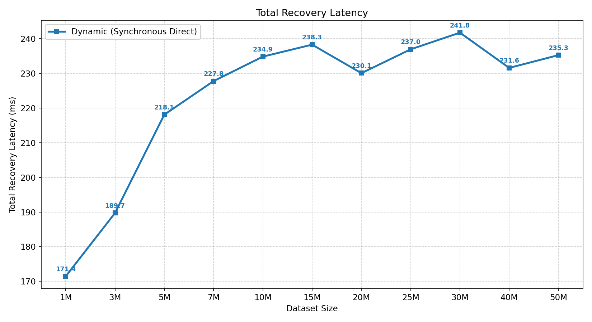

---

## 2. Phase Breakdown and Composition

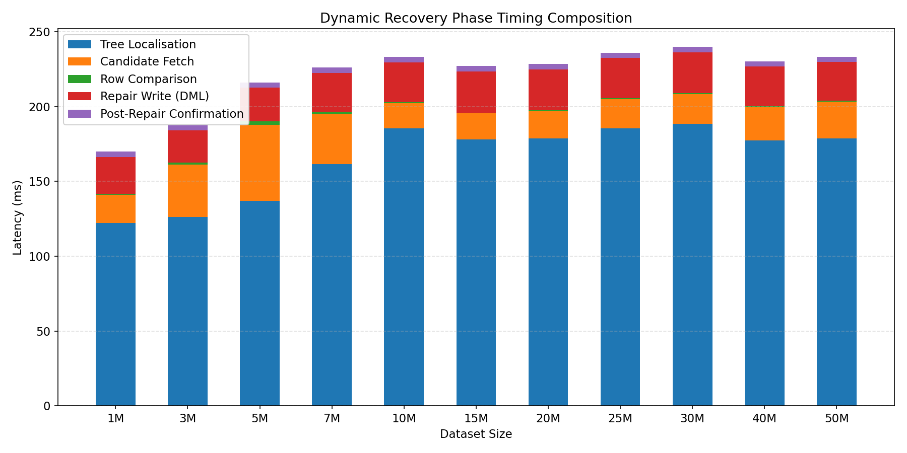

---

## 3. Tree Localisation Phase

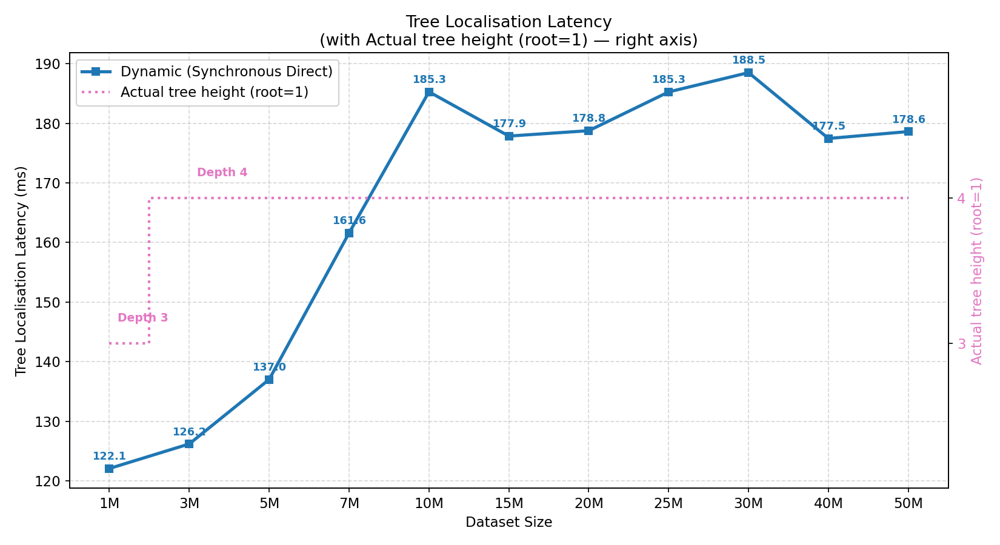

---

## 4. Candidate Fetch Phase

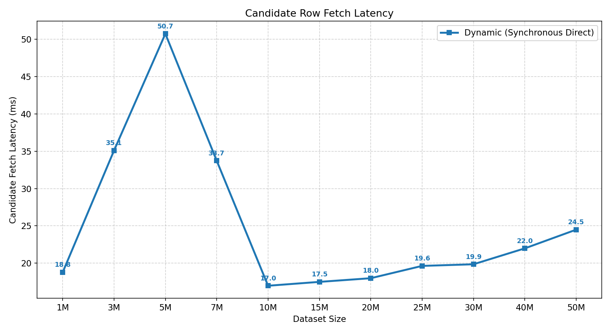

---

## 5. Row Comparison Phase

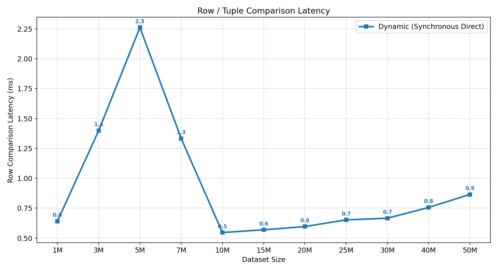

---

## 6. Repair Write Phase

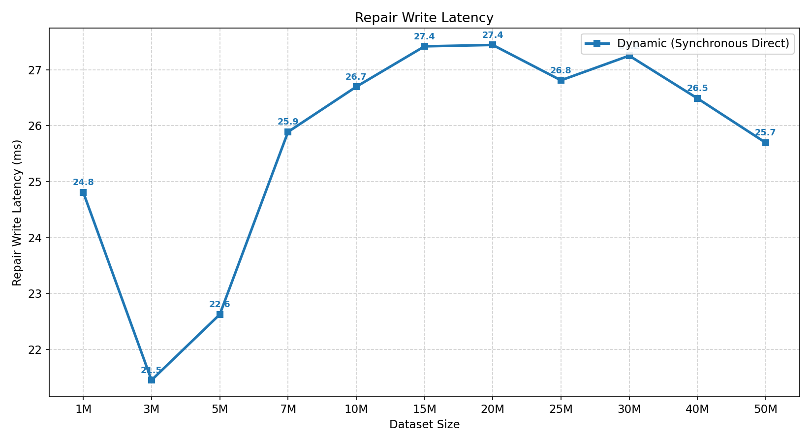

---

## 7. Post-Repair Confirmation Phase

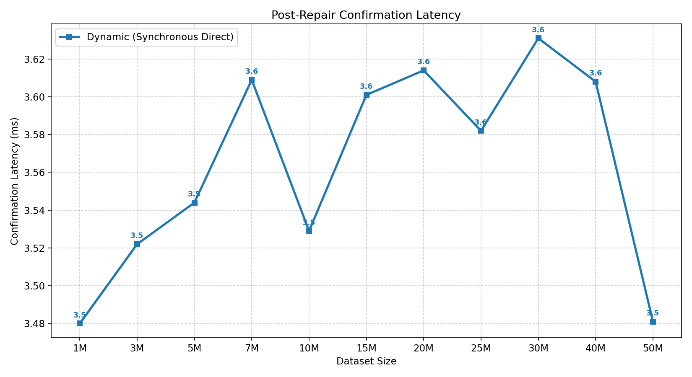

---

## 8. Leaf Occupancy Scaling

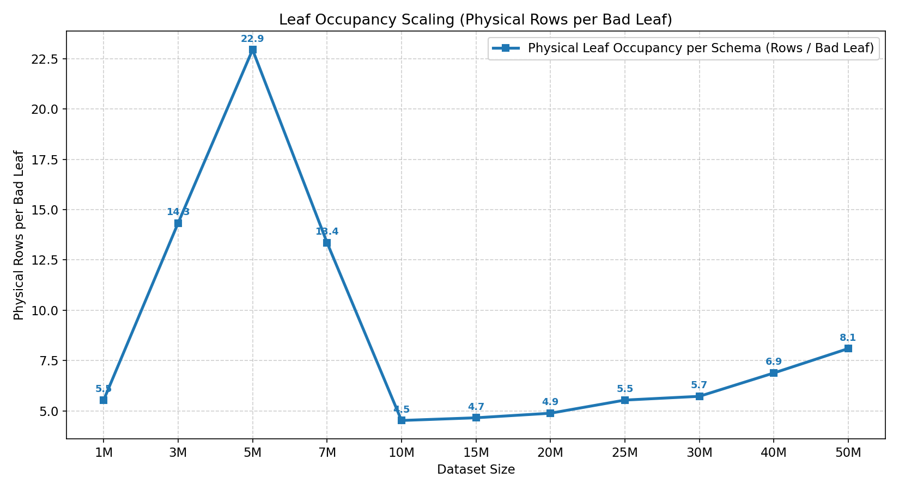

---

## 9. Coefficient of Variation (CV%) per Scale

> CV = σ/μ × 100% computed across **all** repetitions of `restore_repair_ms` per scale point.
> Bars above the 20% threshold (orange line) indicate high variance — likely from checkpoint/WAL interference.

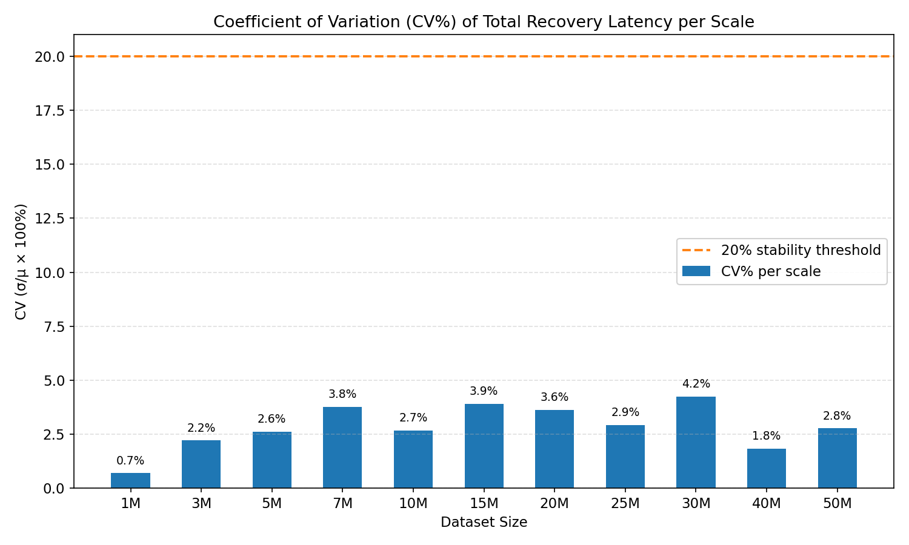

---

## 10. Dataset Construction & Incremental Expansion Latency

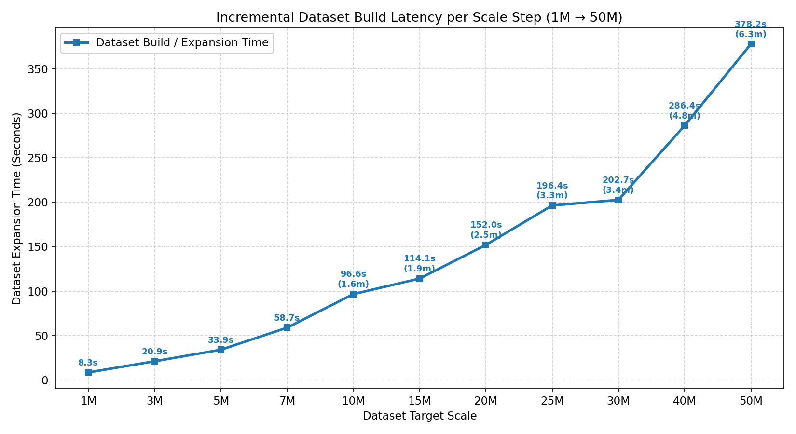

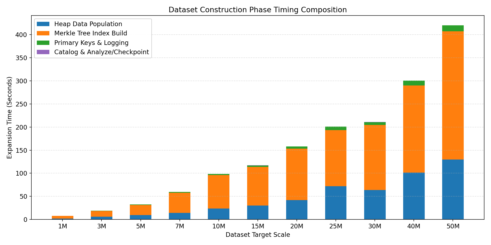

### 10.1 Step-by-Step Incremental Dataset Expansion Time & Phase Composition

| Scale | Appended Tuples | Setup Mode | Heap Population (s) | Merkle Tree Build (s) | PK & Catalog (s) | Step Total (s) | Step Total (min) | Cumulative Time |
|:---|:---|:---|---:|---:|---:|---:|---:|---:|
| **1M** | 1M | `bulk-logged` | 1.70 s | 6.04 s | 0.33 s | 8.33 s | 0.14 min | 8.33 s (0.14 m) |
| **3M** | 3M | `bulk-logged` | 5.80 s | 12.75 s | 0.74 s | 20.90 s | 0.35 min | 29.23 s (0.49 m) |
| **5M** | 5M | `bulk-logged` | 9.71 s | 21.61 s | 1.17 s | 33.89 s | 0.56 min | 63.12 s (1.05 m) |
| **7M** | 7M | `bulk-logged` | 14.31 s | 43.66 s | 1.74 s | 58.74 s | 0.98 min | 121.86 s (2.03 m) |
| **10M** | 10M | `bulk-logged` | 24.02 s | 72.05 s | 2.65 s | 96.57 s | 1.61 min | 218.43 s (3.64 m) |
| **15M** | 15M | `bulk-logged` | 30.38 s | 83.28 s | 3.40 s | 114.06 s | 1.90 min | 332.49 s (5.54 m) |
| **20M** | 20M | `bulk-logged` | 41.94 s | 111.51 s | 4.64 s | 151.97 s | 2.53 min | 484.45 s (8.07 m) |
| **25M** | 25M | `bulk-logged` | 72.05 s | 121.34 s | 7.78 s | 196.41 s | 3.27 min | 680.86 s (11.35 m) |
| **30M** | 30M | `bulk-logged` | 63.69 s | 140.58 s | 6.57 s | 202.66 s | 3.38 min | 883.52 s (14.73 m) |
| **40M** | 40M | `bulk-logged` | 101.68 s | 188.43 s | 10.33 s | 286.41 s | 4.77 min | 1169.93 s (19.50 m) |
| **50M** | 50M | `bulk-logged` | 129.76 s | 277.38 s | 12.81 s | 378.21 s | 6.30 min | 1548.14 s (25.80 m) |

### 10.2 Component Breakdown Details (ms)

Exact millisecond telemetry for each dataset creation sub-phase:

| Scale | Healthy Heap (ms) | Damaged Heap (ms) | Healthy Merkle Index (ms) | Damaged Merkle Index (ms) | Primary Keys (ms) | Analyze / Catalog (ms) | Total Step (ms) |
|:---|---:|---:|---:|---:|---:|---:|---:|
| **1M** | 1,703.14 | 0.06 | 3,058.89 | 2,983.90 | 232.66 | 98.73 | **8,331.06 ms** |
| **3M** | 5,804.33 | 0.06 | 6,390.24 | 6,361.93 | 639.51 | 102.99 | **20,895.41 ms** |
| **5M** | 9,705.46 | 0.06 | 10,709.21 | 10,898.80 | 1,036.51 | 134.21 | **33,894.52 ms** |
| **7M** | 14,306.44 | 0.06 | 21,862.66 | 21,799.81 | 1,522.12 | 219.03 | **58,741.39 ms** |
| **10M** | 24,020.28 | 0.04 | 36,200.59 | 35,851.86 | 2,446.02 | 206.58 | **96,565.98 ms** |
| **15M** | 30,377.51 | 0.06 | 41,766.37 | 41,509.15 | 3,182.83 | 219.45 | **114,057.11 ms** |
| **20M** | 41,942.37 | 0.06 | 55,882.48 | 55,630.48 | 4,423.35 | 215.46 | **151,968.55 ms** |
| **25M** | 72,049.13 | 0.06 | 60,337.49 | 61,007.20 | 7,561.96 | 219.25 | **196,407.13 ms** |
| **30M** | 63,687.97 | 0.05 | 70,869.28 | 69,713.37 | 6,354.54 | 219.50 | **202,656.50 ms** |
| **40M** | 101,679.55 | 0.06 | 94,160.47 | 94,264.78 | 10,119.04 | 214.47 | **286,413.18 ms** |
| **50M** | 129,759.56 | 0.06 | 139,939.27 | 137,443.89 | 12,582.77 | 227.90 | **378,205.40 ms** |

### 10.3 Cumulative Dataset Construction Time Progression

| Target Scale | Step Time (s) | Cumulative Elapsed (s) | Cumulative Elapsed (min) | % of Total Build Time |
|:---|---:|---:|---:|---:|
| **1M** | 8.33 s | 8.33 s | 0.14 min | 0.5% |
| **3M** | 20.90 s | 29.23 s | 0.49 min | 1.9% |
| **5M** | 33.89 s | 63.12 s | 1.05 min | 4.1% |
| **7M** | 58.74 s | 121.86 s | 2.03 min | 7.9% |
| **10M** | 96.57 s | 218.43 s | 3.64 min | 14.1% |
| **15M** | 114.06 s | 332.49 s | 5.54 min | 21.5% |
| **20M** | 151.97 s | 484.45 s | 8.07 min | 31.3% |
| **25M** | 196.41 s | 680.86 s | 11.35 min | 44.0% |
| **30M** | 202.66 s | 883.52 s | 14.73 min | 57.1% |
| **40M** | 286.41 s | 1169.93 s | 19.50 min | 75.6% |
| **50M** | 378.21 s | 1548.14 s | 25.80 min | 100.0% |

---

## Full Phase Recovery Matrix

Values are warm-repetition medians (rep ≥ 1) in milliseconds.

| Scale | Tree Localisation | Cand. Fetch | Row Cmp | Repair Write | Post-Repair Conf | **Total Recovery** |
|:---|---:|---:|---:|---:|---:|---:|
| **1M** | 122.08 | 18.78 | 0.64 | 24.81 | 3.48 | **171.43 ms** |
| **3M** | 126.20 | 35.08 | 1.40 | 21.45 | 3.52 | **189.70 ms** |
| **5M** | 137.02 | 50.72 | 2.26 | 22.63 | 3.54 | **218.10 ms** |
| **7M** | 161.59 | 33.72 | 1.33 | 25.89 | 3.61 | **227.78 ms** |
| **10M** | 185.28 | 16.98 | 0.55 | 26.70 | 3.53 | **234.85 ms** |
| **15M** | 177.85 | 17.50 | 0.57 | 27.42 | 3.60 | **238.31 ms** |
| **20M** | 178.76 | 17.99 | 0.60 | 27.44 | 3.61 | **230.08 ms** |
| **25M** | 185.26 | 19.64 | 0.65 | 26.81 | 3.58 | **236.96 ms** |
| **30M** | 188.50 | 19.86 | 0.67 | 27.25 | 3.63 | **241.77 ms** |
| **40M** | 177.45 | 21.99 | 0.76 | 26.49 | 3.61 | **231.60 ms** |
| **50M** | 178.61 | 24.49 | 0.86 | 25.70 | 3.48 | **235.28 ms** |

---

## Leaf Occupancy Breakdown

> **Note on Leaf Occupancy**:
> - **Physical Rows / Bad Leaf (Per Schema)**: The true physical row count per leaf bucket in PostgreSQL (bounded by $T_{\text{split}} = 32$ and $T_{\text{merge}} = 8$).
> - **Combined Candidate Rows (Healthy + Damaged)**: Total rows fetched across both replicas ($2 \times \text{physical rows}$).

| Scale | Physical Rows / Bad Leaf (Per Schema) | Combined Candidate Rows (Healthy + Damaged) | Total Candidate Rows Fetched ($K=75$) |
|:---|---:|---:|---:|
| **1M** | 5.53 rows/leaf | 11.07 rows/leaf | 830 rows |
| **3M** | 14.33 rows/leaf | 28.67 rows/leaf | 2,150 rows |
| **5M** | 22.95 rows/leaf | 45.89 rows/leaf | 3,442 rows |
| **7M** | 13.36 rows/leaf | 26.72 rows/leaf | 2,004 rows |
| **10M** | 4.52 rows/leaf | 9.04 rows/leaf | 678 rows |
| **15M** | 4.65 rows/leaf | 9.31 rows/leaf | 698 rows |
| **20M** | 4.88 rows/leaf | 9.76 rows/leaf | 732 rows |
| **25M** | 5.53 rows/leaf | 11.07 rows/leaf | 830 rows |
| **30M** | 5.72 rows/leaf | 11.44 rows/leaf | 858 rows |
| **40M** | 6.88 rows/leaf | 13.76 rows/leaf | 1,032 rows |
| **50M** | 8.09 rows/leaf | 16.19 rows/leaf | 1,214 rows |

---

## Repetition Stability (`restore_repair_ms`)

| Scale | Rep 0 | Rep 1 | Rep 2 | Rep 3 | Rep 4 | Rep 5 | Rep 6 | Rep 7 | Rep 8 | Rep 9 | Warm Median | CV% |
|:---|---:|---:|---:|---:|---:|---:|---:|---:|---:|---:|---:|---:|
| 1M | 170.85 | 171.35 | 171.65 | 171.38 | 171.57 | 169.85 | 173.36 | 170.97 | 173.99 | 171.43 | **171.43** | `0.7%` |
| 3M | 188.78 | 195.03 | 189.70 | 188.21 | 189.36 | 188.96 | 191.98 | 188.85 | 201.54 | 194.59 | **189.70** | `2.2%` |
| 5M | 225.41 | 215.40 | 218.98 | 215.81 | 218.54 | 214.53 | 218.10 | 221.36 | 210.21 | 230.25 | **218.10** | `2.6%` |
| 7M | 254.81 | 226.43 | 226.86 | 226.72 | 227.78 | 226.99 | 229.14 | 230.28 | 236.24 | 234.87 | **227.78** | `3.8%` |
| 10M | 233.64 | 240.28 | 239.22 | 242.83 | 234.85 | 231.59 | 230.52 | 222.79 | 231.35 | 242.30 | **234.85** | `2.7%` |
| 15M | 242.69 | 225.55 | 242.28 | 227.09 | 238.31 | 227.20 | 245.36 | 247.64 | 248.86 | 228.77 | **238.31** | `3.9%` |
| 20M | 232.79 | 237.67 | 228.55 | 229.28 | 229.58 | 228.87 | 253.22 | 241.05 | 245.93 | 230.08 | **230.08** | `3.6%` |
| 25M | 236.60 | 235.87 | 258.30 | 235.28 | 236.96 | 236.95 | 244.50 | 235.99 | 237.96 | 240.11 | **236.96** | `2.9%` |
| 30M | 225.90 | 241.92 | 225.04 | 240.37 | 241.25 | 241.77 | 260.86 | 248.42 | 238.89 | 241.99 | **241.77** | `4.2%` |
| 40M | 241.31 | 230.99 | 241.17 | 232.09 | 231.21 | 231.60 | 230.49 | 230.39 | 232.34 | 236.63 | **231.60** | `1.8%` |
| 50M | 234.47 | 244.36 | 247.94 | 234.81 | 247.62 | 233.73 | 233.76 | 233.99 | 248.17 | 235.28 | **235.28** | `2.8%` |

---

## Artifact Provenance

| Field | Value |
|:---|:---|
| Run ID | `ariabc-recovery-size-scaling-k75-c300-20260924T053957Z-0031ee` |
| Generated | `2026-09-24T10:08:30Z` |
| Dynamic Dir | `scripts/benchmark/recovery/fetched/ariabc-recovery-size-scaling-k75-c300-20260924T053957Z-0031ee` |
| Reference Doc | `Dynamic_merkle_docs/RECOVERY_ARCHITECTURE_ANALYSIS.md` |
