# Dynamic Recovery Comparison: Aug 24 Baseline (F=4) vs New Campaign Run (F=32)

> **Generated**: 2026-09-24T10:31:24Z
> **Aug 24 Baseline (F=4)**: `ariabc-recovery-size-scaling-k75-c300-20260824T151600Z-00dad3`
> **New Campaign Run (F=32)**: `ariabc-recovery-size-scaling-k75-c300-20260924T053957Z-0031ee`

---

## 1. Executive Summary & Key Highlights

This report provides a side-by-side comparison of **Aug 24 Baseline (F=4)** vs **New Campaign Run (F=32)** recovery benchmark runs across all scales (1M to 50M tuples).

---

## 2. Total Recovery Latency Comparison

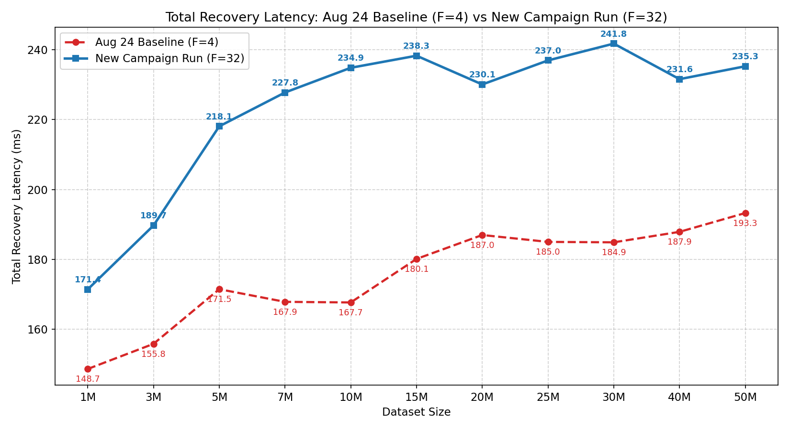

| Scale | Aug 24 Baseline (F=4) (ms) | New Campaign Run (F=32) (ms) | Delta (ms) | Speedup / Change |
|:---|---:|---:|---:|---:|
| **1M** | 148.65 | 171.43 | +22.78 | +15.3% |
| **3M** | 155.84 | 189.70 | +33.86 | +21.7% |
| **5M** | 171.49 | 218.10 | +46.61 | +27.2% |
| **7M** | 167.87 | 227.78 | +59.91 | +35.7% |
| **10M** | 167.69 | 234.85 | +67.16 | +40.0% |
| **15M** | 180.14 | 238.31 | +58.16 | +32.3% |
| **20M** | 186.99 | 230.08 | +43.09 | +23.0% |
| **25M** | 185.03 | 236.96 | +51.93 | +28.1% |
| **30M** | 184.90 | 241.77 | +56.87 | +30.8% |
| **40M** | 187.90 | 231.60 | +43.70 | +23.3% |
| **50M** | 193.29 | 235.28 | +42.00 | +21.7% |

---

## 3. Phase-by-Phase Detailed Matrix (Warm Medians, ms)

| Scale | Arch | Tree Localisation | Cand. Fetch | Row Cmp | Repair Write | Post-Repair Conf | **Total Recovery** |
|:---|:---|---:|---:|---:|---:|---:|---:|
| **1M** | Aug 24 Baseline (F=4) | 36.05 | 41.35 | 1.80 | 63.90 | 2.76 | **148.65 ms** |
| | New Campaign Run (F=32) | 122.08 | 18.78 | 0.64 | 24.81 | 3.48 | **171.43 ms** |
| **3M** | Aug 24 Baseline (F=4) | 46.07 | 34.52 | 1.41 | 68.40 | 2.78 | **155.84 ms** |
| | New Campaign Run (F=32) | 126.20 | 35.08 | 1.40 | 21.45 | 3.52 | **189.70 ms** |
| **5M** | Aug 24 Baseline (F=4) | 48.44 | 46.66 | 2.06 | 69.28 | 2.74 | **171.49 ms** |
| | New Campaign Run (F=32) | 137.02 | 50.72 | 2.26 | 22.63 | 3.54 | **218.10 ms** |
| **7M** | Aug 24 Baseline (F=4) | 53.45 | 33.36 | 1.37 | 74.46 | 2.85 | **167.87 ms** |
| | New Campaign Run (F=32) | 161.59 | 33.72 | 1.33 | 25.89 | 3.61 | **227.78 ms** |
| **10M** | Aug 24 Baseline (F=4) | 56.58 | 30.89 | 1.24 | 74.04 | 2.81 | **167.69 ms** |
| | New Campaign Run (F=32) | 185.28 | 16.98 | 0.55 | 26.70 | 3.53 | **234.85 ms** |
| **15M** | Aug 24 Baseline (F=4) | 57.81 | 42.06 | 1.79 | 73.56 | 2.80 | **180.14 ms** |
| | New Campaign Run (F=32) | 177.85 | 17.50 | 0.57 | 27.42 | 3.60 | **238.31 ms** |
| **20M** | Aug 24 Baseline (F=4) | 61.08 | 42.75 | 1.82 | 76.35 | 2.86 | **186.99 ms** |
| | New Campaign Run (F=32) | 178.76 | 17.99 | 0.60 | 27.44 | 3.61 | **230.08 ms** |
| **25M** | Aug 24 Baseline (F=4) | 64.31 | 35.39 | 1.46 | 79.51 | 2.81 | **185.03 ms** |
| | New Campaign Run (F=32) | 185.26 | 19.64 | 0.65 | 26.81 | 3.58 | **236.96 ms** |
| **30M** | Aug 24 Baseline (F=4) | 67.17 | 29.66 | 1.17 | 81.23 | 2.84 | **184.90 ms** |
| | New Campaign Run (F=32) | 188.50 | 19.86 | 0.67 | 27.25 | 3.63 | **241.77 ms** |
| **40M** | Aug 24 Baseline (F=4) | 69.05 | 31.57 | 1.24 | 81.17 | 2.87 | **187.90 ms** |
| | New Campaign Run (F=32) | 177.45 | 21.99 | 0.76 | 26.49 | 3.61 | **231.60 ms** |
| **50M** | Aug 24 Baseline (F=4) | 70.64 | 35.28 | 1.43 | 81.04 | 2.87 | **193.29 ms** |
| | New Campaign Run (F=32) | 178.61 | 24.49 | 0.86 | 25.70 | 3.48 | **235.28 ms** |

---

## 4. Phase Timing Composition

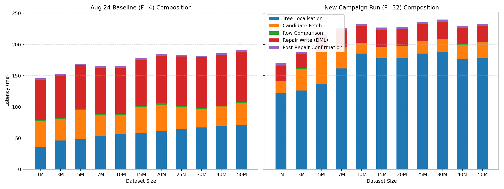

---

## 5. Sub-Phase Latency Graphs

### 5.1 Tree Localisation Phase
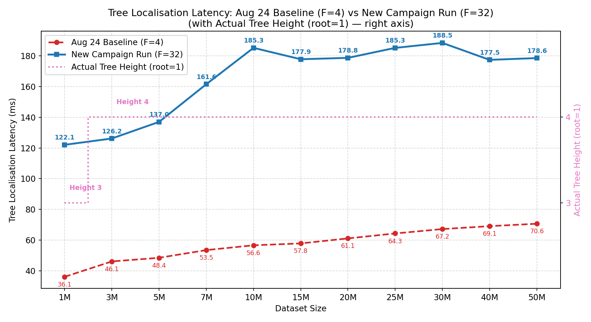

### 5.2 Candidate Fetch Phase
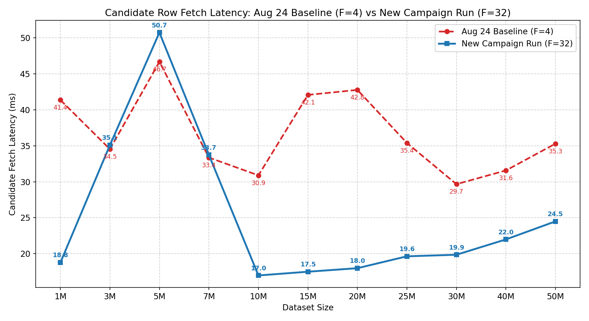

### 5.3 Row Comparison Phase
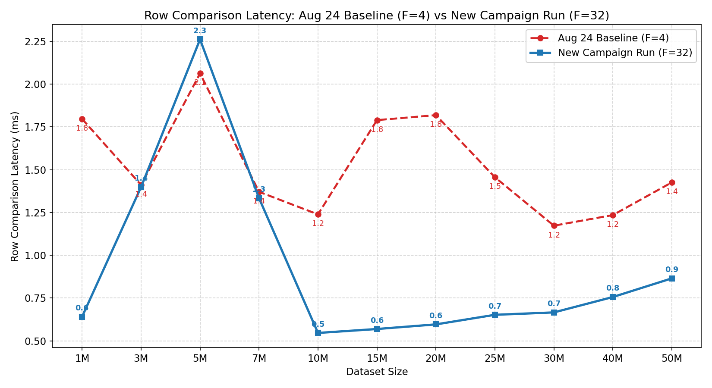

### 5.4 Repair Write Phase
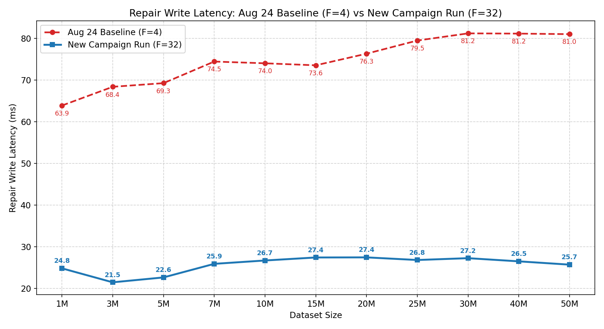

#### Detailed Repair Write Sub-Phase Breakdown:

| Scale | Aug 24 Baseline (F=4) Total `repair_write` | Aug 24 Baseline (F=4) `dml_wire` | Aug 24 Baseline (F=4) `commit_wire` | New Campaign Run (F=32) Total `repair_write` | New Campaign Run (F=32) `dml_wire` | New Campaign Run (F=32) `commit_wire` | `COMMIT` Delta (ms) |
|:---|---:|---:|---:|---:|---:|---:|---:|
| **1M** | 63.90 ms | 17.62 ms | 45.57 ms | 24.81 ms | 16.76 ms | 7.28 ms | -38.29 ms |
| **3M** | 68.40 ms | 17.65 ms | 49.66 ms | 21.45 ms | 17.04 ms | 3.66 ms | -46.00 ms |
| **5M** | 69.28 ms | 17.86 ms | 50.08 ms | 22.63 ms | 17.71 ms | 4.09 ms | -45.99 ms |
| **7M** | 74.46 ms | 17.89 ms | 55.61 ms | 25.89 ms | 17.25 ms | 7.91 ms | -47.70 ms |
| **10M** | 74.04 ms | 17.75 ms | 55.49 ms | 26.70 ms | 17.04 ms | 8.88 ms | -46.61 ms |
| **15M** | 73.56 ms | 18.12 ms | 54.59 ms | 27.42 ms | 17.37 ms | 9.30 ms | -45.29 ms |
| **20M** | 76.35 ms | 18.11 ms | 57.17 ms | 27.44 ms | 17.31 ms | 9.32 ms | -47.84 ms |
| **25M** | 79.51 ms | 18.22 ms | 60.20 ms | 26.81 ms | 17.24 ms | 8.79 ms | -51.41 ms |
| **30M** | 81.23 ms | 18.46 ms | 61.86 ms | 27.25 ms | 17.27 ms | 9.27 ms | -52.59 ms |
| **40M** | 81.17 ms | 18.47 ms | 61.73 ms | 26.49 ms | 17.39 ms | 8.30 ms | -53.42 ms |
| **50M** | 81.04 ms | 18.46 ms | 61.82 ms | 25.70 ms | 17.38 ms | 7.55 ms | -54.27 ms |

### 5.5 Post-Repair Confirmation Phase
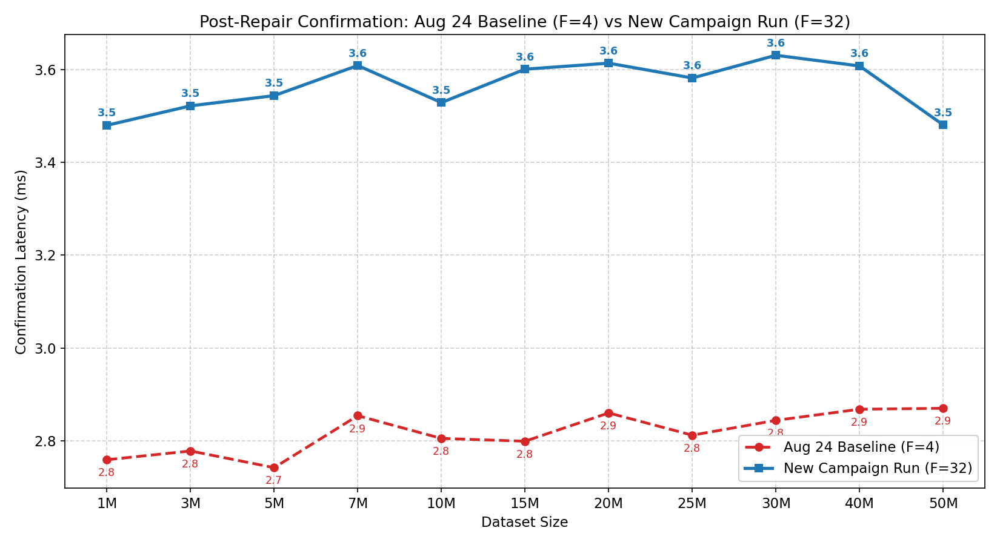

---

## 6. Leaf Occupancy & Repetition Stability

### 6.1 Leaf Occupancy Comparison
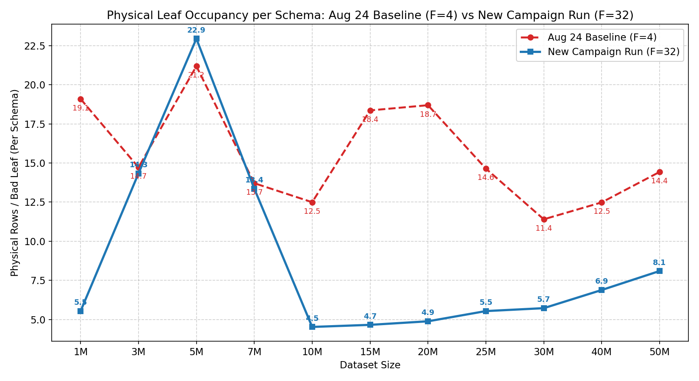

> **Note on Leaf Occupancy**:
> - **Physical Rows / Bad Leaf (Per Schema)**: The true physical row count per leaf bucket in PostgreSQL (bounded by $T_{\text{split}} = 32$ and $T_{\text{merge}} = 8$).
> - **Combined Candidate Rows (Healthy + Damaged)**: Total rows fetched across both replicas ($2 \times \text{physical rows}$).

| Scale | Aug 24 Baseline (F=4) (Rows/Leaf per Schema) | New Campaign Run (F=32) (Rows/Leaf per Schema) | Aug 24 Baseline (F=4) Cand. Rows ($K=75$) | New Campaign Run (F=32) Cand. Rows ($K=75$) |
|:---|---:|---:|---:|---:|
| **1M** | 19.09 rows/leaf | 5.53 rows/leaf | 2,864 rows | 830 rows |
| **3M** | 14.72 rows/leaf | 14.33 rows/leaf | 2,208 rows | 2,150 rows |
| **5M** | 21.19 rows/leaf | 22.95 rows/leaf | 3,178 rows | 3,442 rows |
| **7M** | 13.71 rows/leaf | 13.36 rows/leaf | 2,056 rows | 2,004 rows |
| **10M** | 12.49 rows/leaf | 4.52 rows/leaf | 1,874 rows | 678 rows |
| **15M** | 18.36 rows/leaf | 4.65 rows/leaf | 2,754 rows | 698 rows |
| **20M** | 18.69 rows/leaf | 4.88 rows/leaf | 2,804 rows | 732 rows |
| **25M** | 14.64 rows/leaf | 5.53 rows/leaf | 2,196 rows | 830 rows |
| **30M** | 11.40 rows/leaf | 5.72 rows/leaf | 1,710 rows | 858 rows |
| **40M** | 12.48 rows/leaf | 6.88 rows/leaf | 1,872 rows | 1,032 rows |
| **50M** | 14.43 rows/leaf | 8.09 rows/leaf | 2,164 rows | 1,214 rows |

### 6.2 Variance (CV%) Comparison
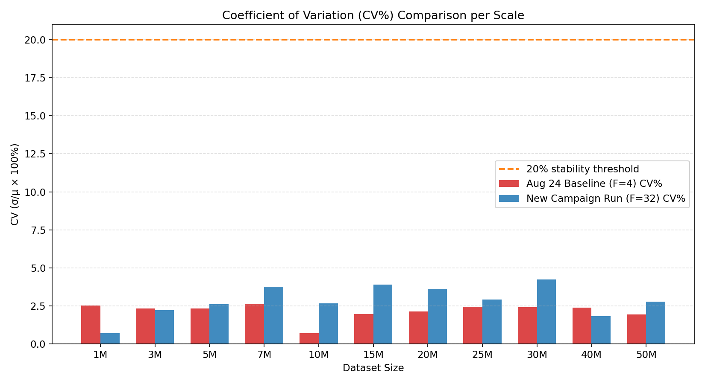

---

## 7. Dataset Construction Latency Comparison (1M → 50M)

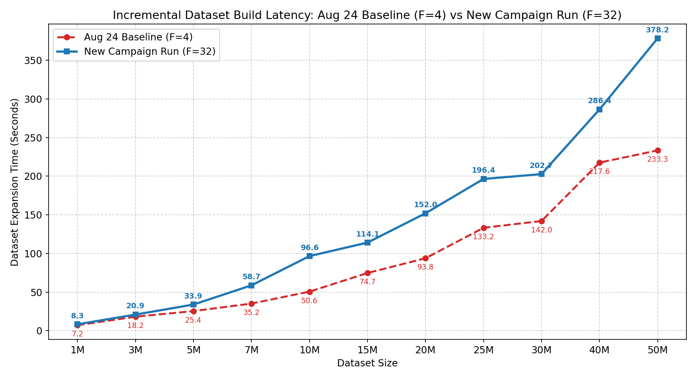

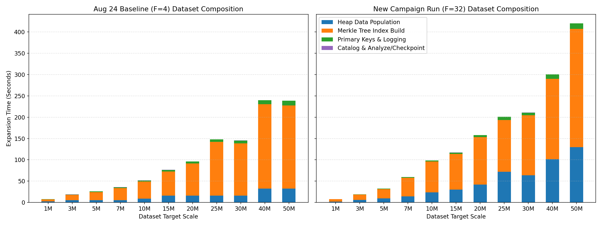

### 7.1 Step-by-Step Incremental Dataset Expansion Time

| Scale | Appended Tuples | Setup Mode | Aug 24 Baseline (F=4) (s) | New Campaign Run (F=32) (s) | Delta (s) | Speedup / Change |
|:---|:---|:---|---:|---:|---:|---:|
| **1M** | 1M | `bulk-logged` | 7.16 s (0.12 m) | 8.33 s (0.14 m) | +1.17 s | +16.4% |
| **3M** | +2M | `bulk-logged` | 18.19 s (0.30 m) | 20.90 s (0.35 m) | +2.70 s | +14.9% |
| **5M** | +2M | `bulk-logged` | 25.42 s (0.42 m) | 33.89 s (0.56 m) | +8.47 s | +33.3% |
| **7M** | +2M | `bulk-logged` | 35.17 s (0.59 m) | 58.74 s (0.98 m) | +23.57 s | +67.0% |
| **10M** | +3M | `bulk-logged` | 50.57 s (0.84 m) | 96.57 s (1.61 m) | +45.99 s | +90.9% |
| **15M** | +5M | `bulk-logged` | 74.69 s (1.24 m) | 114.06 s (1.90 m) | +39.37 s | +52.7% |
| **20M** | +5M | `bulk-logged` | 93.78 s (1.56 m) | 151.97 s (2.53 m) | +58.19 s | +62.0% |
| **25M** | +5M | `bulk-logged` | 133.19 s (2.22 m) | 196.41 s (3.27 m) | +63.22 s | +47.5% |
| **30M** | +5M | `bulk-logged` | 142.00 s (2.37 m) | 202.66 s (3.38 m) | +60.66 s | +42.7% |
| **40M** | +10M | `bulk-logged` | 217.56 s (3.63 m) | 286.41 s (4.77 m) | +68.85 s | +31.6% |
| **50M** | +10M | `bulk-logged` | 233.32 s (3.89 m) | 378.21 s (6.30 m) | +144.89 s | +62.1% |

### 7.2 Cumulative Benchmark Dataset Preparation Time

| Target Scale | Aug 24 Baseline (F=4) Cum. Time | New Campaign Run (F=32) Cum. Time | Cumulative Savings |
|:---|---:|---:|---:|
| **1M** | 7.16 s (0.12 m) | 8.33 s (0.14 m) | +1.17 s (+0.02 m) |
| **3M** | 25.35 s (0.42 m) | 29.23 s (0.49 m) | +3.88 s (+0.06 m) |
| **5M** | 50.77 s (0.85 m) | 63.12 s (1.05 m) | +12.35 s (+0.21 m) |
| **7M** | 85.94 s (1.43 m) | 121.86 s (2.03 m) | +35.92 s (+0.60 m) |
| **10M** | 136.52 s (2.28 m) | 218.43 s (3.64 m) | +81.91 s (+1.37 m) |
| **15M** | 211.21 s (3.52 m) | 332.49 s (5.54 m) | +121.28 s (+2.02 m) |
| **20M** | 304.99 s (5.08 m) | 484.45 s (8.07 m) | +179.47 s (+2.99 m) |
| **25M** | 438.18 s (7.30 m) | 680.86 s (11.35 m) | +242.68 s (+4.04 m) |
| **30M** | 580.17 s (9.67 m) | 883.52 s (14.73 m) | +303.34 s (+5.06 m) |
| **40M** | 797.73 s (13.30 m) | 1169.93 s (19.50 m) | +372.20 s (+6.20 m) |
| **50M** | 1031.05 s (17.18 m) | 1548.14 s (25.80 m) | +517.08 s (+8.62 m) |

### 7.3 Detailed Sub-Phase Breakdown per Scale (ms)

| Scale | Arch | Healthy Heap (ms) | Damaged Heap (ms) | Healthy Merkle Index (ms) | Damaged Merkle Index (ms) | Primary Keys (ms) | Analyze / Catalog (ms) | Total Step (ms) |
|:---|:---|---:|---:|---:|---:|---:|---:|---:|
| **1M** | Aug 24 Baseline (F=4) | 2,583.61 | 0.13 | 2,497.60 | 2,461.03 | 209.96 | 61.99 | **7,157.24 ms** |
| | New Campaign Run (F=32) | 1,703.14 | 0.06 | 3,058.89 | 2,983.90 | 232.66 | 98.73 | **8,331.06 ms** |
| **3M** | Aug 24 Baseline (F=4) | 2,949.63 | 2,682.19 | 6,117.33 | 5,984.66 | 913.77 | 222.25 | **18,190.55 ms** |
| | New Campaign Run (F=32) | 5,804.33 | 0.06 | 6,390.24 | 6,361.93 | 639.51 | 102.99 | **20,895.41 ms** |
| **5M** | Aug 24 Baseline (F=4) | 2,808.05 | 2,805.29 | 9,433.47 | 9,468.86 | 1,366.12 | 335.06 | **25,424.74 ms** |
| | New Campaign Run (F=32) | 9,705.46 | 0.06 | 10,709.21 | 10,898.80 | 1,036.51 | 134.21 | **33,894.52 ms** |
| **7M** | Aug 24 Baseline (F=4) | 2,739.79 | 2,840.35 | 14,194.70 | 14,200.11 | 1,832.39 | 381.19 | **35,168.66 ms** |
| | New Campaign Run (F=32) | 14,306.44 | 0.06 | 21,862.66 | 21,799.81 | 1,522.12 | 219.03 | **58,741.39 ms** |
| **10M** | Aug 24 Baseline (F=4) | 4,515.14 | 4,292.78 | 20,078.03 | 20,177.74 | 2,538.89 | 328.52 | **50,574.70 ms** |
| | New Campaign Run (F=32) | 24,020.28 | 0.04 | 36,200.59 | 35,851.86 | 2,446.02 | 206.58 | **96,565.98 ms** |
| **15M** | Aug 24 Baseline (F=4) | 8,816.58 | 7,115.93 | 28,403.92 | 28,231.02 | 3,653.91 | 331.12 | **74,690.74 ms** |
| | New Campaign Run (F=32) | 30,377.51 | 0.06 | 41,766.37 | 41,509.15 | 3,182.83 | 219.45 | **114,057.11 ms** |
| **20M** | Aug 24 Baseline (F=4) | 8,832.07 | 7,381.47 | 37,094.04 | 37,879.28 | 4,784.53 | 282.71 | **93,781.10 ms** |
| | New Campaign Run (F=32) | 41,942.37 | 0.06 | 55,882.48 | 55,630.48 | 4,423.35 | 215.46 | **151,968.55 ms** |
| **25M** | Aug 24 Baseline (F=4) | 8,729.97 | 7,432.79 | 61,435.93 | 64,512.37 | 5,836.71 | 198.63 | **133,191.05 ms** |
| | New Campaign Run (F=32) | 72,049.13 | 0.06 | 60,337.49 | 61,007.20 | 7,561.96 | 219.25 | **196,407.13 ms** |
| **30M** | Aug 24 Baseline (F=4) | 8,847.99 | 7,400.73 | 60,847.68 | 61,177.30 | 6,978.08 | 198.78 | **141,995.58 ms** |
| | New Campaign Run (F=32) | 63,687.97 | 0.05 | 70,869.28 | 69,713.37 | 6,354.54 | 219.50 | **202,656.50 ms** |
| **40M** | Aug 24 Baseline (F=4) | 18,257.81 | 14,572.36 | 99,644.33 | 97,682.93 | 9,380.01 | 121.97 | **217,558.30 ms** |
| | New Campaign Run (F=32) | 101,679.55 | 0.06 | 94,160.47 | 94,264.78 | 10,119.04 | 214.47 | **286,413.18 ms** |
| **50M** | Aug 24 Baseline (F=4) | 18,194.45 | 14,195.18 | 97,394.60 | 97,349.95 | 11,363.42 | 120.91 | **233,320.38 ms** |
| | New Campaign Run (F=32) | 129,759.56 | 0.06 | 139,939.27 | 137,443.89 | 12,582.77 | 227.90 | **378,205.40 ms** |

---

## Provenance

- **Old Run ID**: `ariabc-recovery-size-scaling-k75-c300-20260824T151600Z-00dad3`
- **New Run ID**: `ariabc-recovery-size-scaling-k75-c300-20260924T053957Z-0031ee`
- **Report Path**: `/work/ARIABC/AriaBC/Final_Results/reruns/20260923T153000Z_campaign/Recovery/comparison_vs_aug24/DYNAMIC_COMPARISON_REPORT_ariabc-recovery-size-scaling-k75-c300-20260824T151600Z-00dad3_VS_ariabc-recovery-size-scaling-k75-c300-20260924T053957Z-0031ee.md`