# Dynamic Recovery Comparison: Sep 19 Latest (F=4) vs New Campaign Run (F=32)

> **Generated**: 2026-09-24T10:31:33Z
> **Sep 19 Latest (F=4)**: `ariabc-recovery-size-scaling-k75-c300-20260919T125919Z-004587`
> **New Campaign Run (F=32)**: `ariabc-recovery-size-scaling-k75-c300-20260924T053957Z-0031ee`

---

## 1. Executive Summary & Key Highlights

This report provides a side-by-side comparison of **Sep 19 Latest (F=4)** vs **New Campaign Run (F=32)** recovery benchmark runs across all scales (1M to 50M tuples).

---

## 2. Total Recovery Latency Comparison

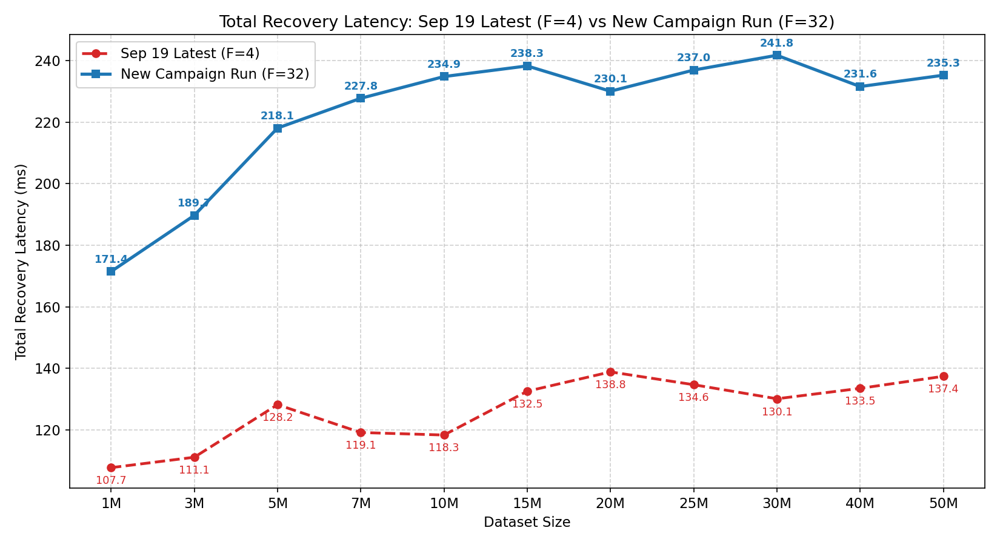

| Scale | Sep 19 Latest (F=4) (ms) | New Campaign Run (F=32) (ms) | Delta (ms) | Speedup / Change |
|:---|---:|---:|---:|---:|
| **1M** | 107.67 | 171.43 | +63.76 | +59.2% |
| **3M** | 111.06 | 189.70 | +78.64 | +70.8% |
| **5M** | 128.16 | 218.10 | +89.94 | +70.2% |
| **7M** | 119.10 | 227.78 | +108.68 | +91.3% |
| **10M** | 118.28 | 234.85 | +116.57 | +98.6% |
| **15M** | 132.51 | 238.31 | +105.79 | +79.8% |
| **20M** | 138.81 | 230.08 | +91.27 | +65.8% |
| **25M** | 134.64 | 236.96 | +102.32 | +76.0% |
| **30M** | 130.07 | 241.77 | +111.69 | +85.9% |
| **40M** | 133.46 | 231.60 | +98.14 | +73.5% |
| **50M** | 137.38 | 235.28 | +97.90 | +71.3% |

---

## 3. Phase-by-Phase Detailed Matrix (Warm Medians, ms)

| Scale | Arch | Tree Localisation | Cand. Fetch | Row Cmp | Repair Write | Post-Repair Conf | **Total Recovery** |
|:---|:---|---:|---:|---:|---:|---:|---:|
| **1M** | Sep 19 Latest (F=4) | 36.94 | 40.41 | 1.75 | 22.52 | 3.44 | **107.67 ms** |
| | New Campaign Run (F=32) | 122.08 | 18.78 | 0.64 | 24.81 | 3.48 | **171.43 ms** |
| **3M** | Sep 19 Latest (F=4) | 45.49 | 33.29 | 1.42 | 25.09 | 3.43 | **111.06 ms** |
| | New Campaign Run (F=32) | 126.20 | 35.08 | 1.40 | 21.45 | 3.52 | **189.70 ms** |
| **5M** | Sep 19 Latest (F=4) | 48.28 | 45.34 | 2.03 | 26.02 | 3.47 | **128.16 ms** |
| | New Campaign Run (F=32) | 137.02 | 50.72 | 2.26 | 22.63 | 3.54 | **218.10 ms** |
| **7M** | Sep 19 Latest (F=4) | 51.70 | 32.33 | 1.36 | 27.61 | 3.46 | **119.10 ms** |
| | New Campaign Run (F=32) | 161.59 | 33.72 | 1.33 | 25.89 | 3.61 | **227.78 ms** |
| **10M** | Sep 19 Latest (F=4) | 54.82 | 29.75 | 1.23 | 26.49 | 3.44 | **118.28 ms** |
| | New Campaign Run (F=32) | 185.28 | 16.98 | 0.55 | 26.70 | 3.53 | **234.85 ms** |
| **15M** | Sep 19 Latest (F=4) | 55.86 | 40.65 | 1.76 | 26.47 | 3.50 | **132.51 ms** |
| | New Campaign Run (F=32) | 177.85 | 17.50 | 0.57 | 27.42 | 3.60 | **238.31 ms** |
| **20M** | Sep 19 Latest (F=4) | 58.88 | 41.67 | 1.81 | 28.39 | 3.47 | **138.81 ms** |
| | New Campaign Run (F=32) | 178.76 | 17.99 | 0.60 | 27.44 | 3.61 | **230.08 ms** |
| **25M** | Sep 19 Latest (F=4) | 62.03 | 34.12 | 1.45 | 28.68 | 3.47 | **134.64 ms** |
| | New Campaign Run (F=32) | 185.26 | 19.64 | 0.65 | 26.81 | 3.58 | **236.96 ms** |
| **30M** | Sep 19 Latest (F=4) | 64.15 | 28.38 | 1.14 | 30.33 | 3.49 | **130.07 ms** |
| | New Campaign Run (F=32) | 188.50 | 19.86 | 0.67 | 27.25 | 3.63 | **241.77 ms** |
| **40M** | Sep 19 Latest (F=4) | 66.33 | 30.85 | 1.23 | 28.81 | 3.50 | **133.46 ms** |
| | New Campaign Run (F=32) | 177.45 | 21.99 | 0.76 | 26.49 | 3.61 | **231.60 ms** |
| **50M** | Sep 19 Latest (F=4) | 67.18 | 34.06 | 1.39 | 28.48 | 3.46 | **137.38 ms** |
| | New Campaign Run (F=32) | 178.61 | 24.49 | 0.86 | 25.70 | 3.48 | **235.28 ms** |

---

## 4. Phase Timing Composition

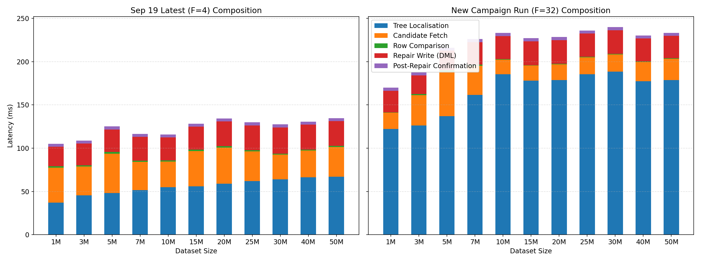

---

## 5. Sub-Phase Latency Graphs

### 5.1 Tree Localisation Phase
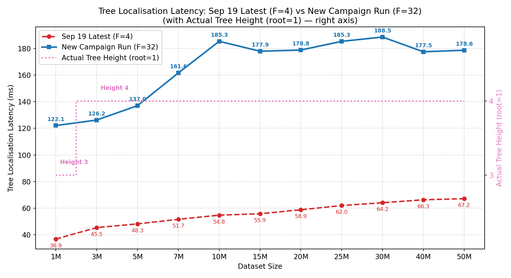

### 5.2 Candidate Fetch Phase
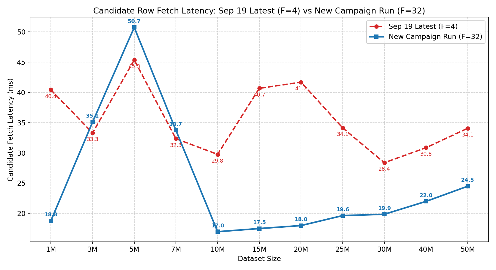

### 5.3 Row Comparison Phase
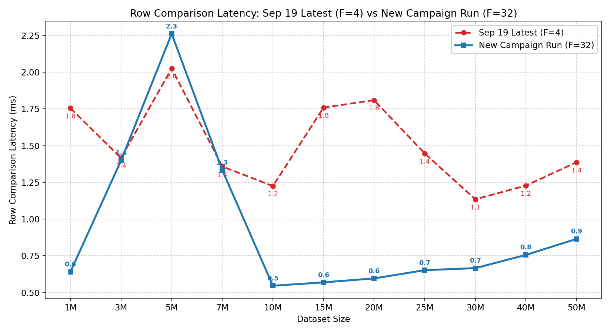

### 5.4 Repair Write Phase
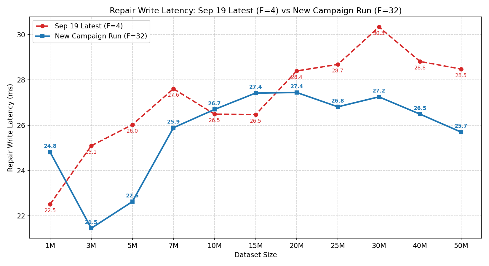

#### Detailed Repair Write Sub-Phase Breakdown:

| Scale | Sep 19 Latest (F=4) Total `repair_write` | Sep 19 Latest (F=4) `dml_wire` | Sep 19 Latest (F=4) `commit_wire` | New Campaign Run (F=32) Total `repair_write` | New Campaign Run (F=32) `dml_wire` | New Campaign Run (F=32) `commit_wire` | `COMMIT` Delta (ms) |
|:---|---:|---:|---:|---:|---:|---:|---:|
| **1M** | 22.52 ms | 17.50 ms | 4.28 ms | 24.81 ms | 16.76 ms | 7.28 ms | +3.00 ms |
| **3M** | 25.09 ms | 17.70 ms | 6.63 ms | 21.45 ms | 17.04 ms | 3.66 ms | -2.98 ms |
| **5M** | 26.02 ms | 17.97 ms | 7.21 ms | 22.63 ms | 17.71 ms | 4.09 ms | -3.12 ms |
| **7M** | 27.61 ms | 17.65 ms | 9.16 ms | 25.89 ms | 17.25 ms | 7.91 ms | -1.25 ms |
| **10M** | 26.49 ms | 17.68 ms | 8.06 ms | 26.70 ms | 17.04 ms | 8.88 ms | +0.82 ms |
| **15M** | 26.47 ms | 18.01 ms | 7.69 ms | 27.42 ms | 17.37 ms | 9.30 ms | +1.61 ms |
| **20M** | 28.39 ms | 18.09 ms | 9.54 ms | 27.44 ms | 17.31 ms | 9.32 ms | -0.22 ms |
| **25M** | 28.68 ms | 17.93 ms | 10.01 ms | 26.81 ms | 17.24 ms | 8.79 ms | -1.22 ms |
| **30M** | 30.33 ms | 18.18 ms | 11.45 ms | 27.25 ms | 17.27 ms | 9.27 ms | -2.19 ms |
| **40M** | 28.81 ms | 18.05 ms | 10.01 ms | 26.49 ms | 17.39 ms | 8.30 ms | -1.71 ms |
| **50M** | 28.48 ms | 18.04 ms | 9.67 ms | 25.70 ms | 17.38 ms | 7.55 ms | -2.12 ms |

### 5.5 Post-Repair Confirmation Phase
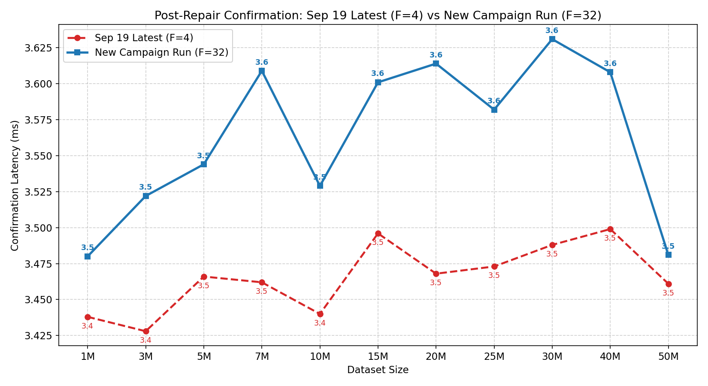

---

## 6. Leaf Occupancy & Repetition Stability

### 6.1 Leaf Occupancy Comparison
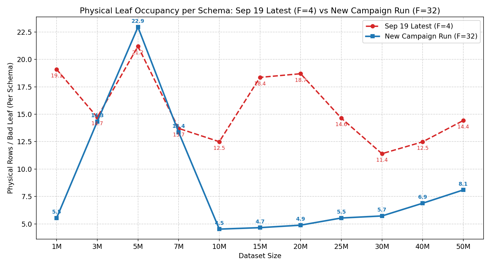

> **Note on Leaf Occupancy**:
> - **Physical Rows / Bad Leaf (Per Schema)**: The true physical row count per leaf bucket in PostgreSQL (bounded by $T_{\text{split}} = 32$ and $T_{\text{merge}} = 8$).
> - **Combined Candidate Rows (Healthy + Damaged)**: Total rows fetched across both replicas ($2 \times \text{physical rows}$).

| Scale | Sep 19 Latest (F=4) (Rows/Leaf per Schema) | New Campaign Run (F=32) (Rows/Leaf per Schema) | Sep 19 Latest (F=4) Cand. Rows ($K=75$) | New Campaign Run (F=32) Cand. Rows ($K=75$) |
|:---|---:|---:|---:|---:|
| **1M** | 19.09 rows/leaf | 5.53 rows/leaf | 2,864 rows | 830 rows |
| **3M** | 14.72 rows/leaf | 14.33 rows/leaf | 2,208 rows | 2,150 rows |
| **5M** | 21.19 rows/leaf | 22.95 rows/leaf | 3,178 rows | 3,442 rows |
| **7M** | 13.71 rows/leaf | 13.36 rows/leaf | 2,056 rows | 2,004 rows |
| **10M** | 12.49 rows/leaf | 4.52 rows/leaf | 1,874 rows | 678 rows |
| **15M** | 18.36 rows/leaf | 4.65 rows/leaf | 2,754 rows | 698 rows |
| **20M** | 18.69 rows/leaf | 4.88 rows/leaf | 2,804 rows | 732 rows |
| **25M** | 14.64 rows/leaf | 5.53 rows/leaf | 2,196 rows | 830 rows |
| **30M** | 11.40 rows/leaf | 5.72 rows/leaf | 1,710 rows | 858 rows |
| **40M** | 12.48 rows/leaf | 6.88 rows/leaf | 1,872 rows | 1,032 rows |
| **50M** | 14.43 rows/leaf | 8.09 rows/leaf | 2,164 rows | 1,214 rows |

### 6.2 Variance (CV%) Comparison
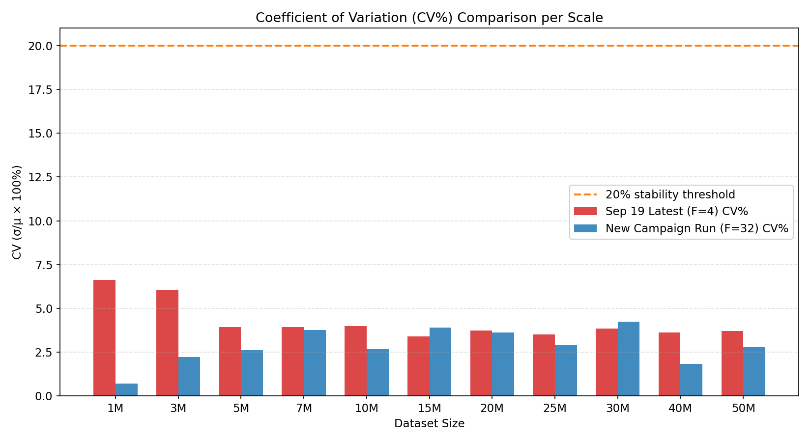

---

## 7. Dataset Construction Latency Comparison (1M → 50M)

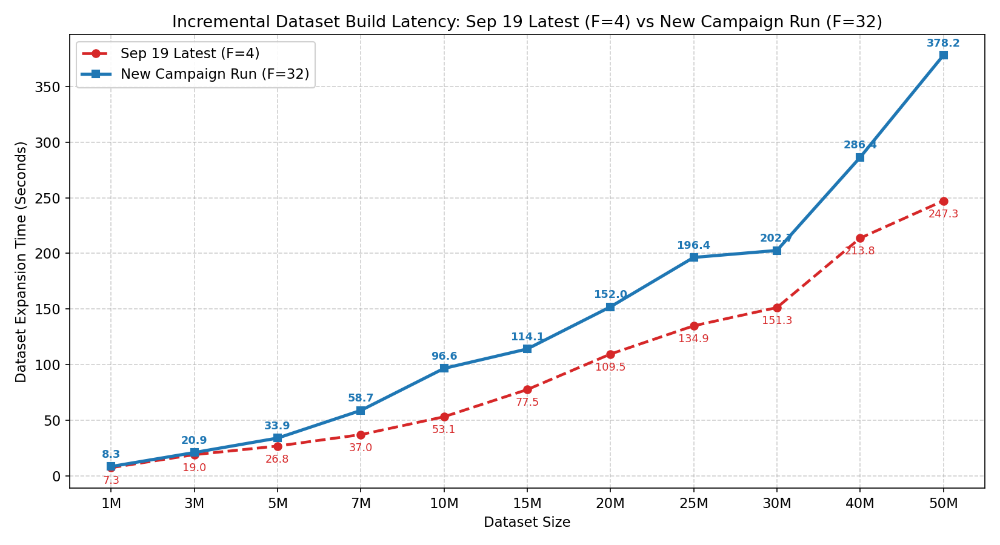

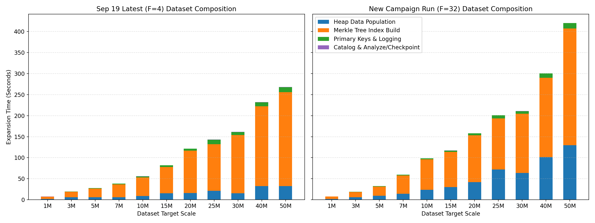

### 7.1 Step-by-Step Incremental Dataset Expansion Time

| Scale | Appended Tuples | Setup Mode | Sep 19 Latest (F=4) (s) | New Campaign Run (F=32) (s) | Delta (s) | Speedup / Change |
|:---|:---|:---|---:|---:|---:|---:|
| **1M** | 1M | `bulk-logged` | 7.31 s (0.12 m) | 8.33 s (0.14 m) | +1.02 s | +14.0% |
| **3M** | +2M | `bulk-logged` | 18.99 s (0.32 m) | 20.90 s (0.35 m) | +1.90 s | +10.0% |
| **5M** | +2M | `bulk-logged` | 26.76 s (0.45 m) | 33.89 s (0.56 m) | +7.13 s | +26.7% |
| **7M** | +2M | `bulk-logged` | 37.01 s (0.62 m) | 58.74 s (0.98 m) | +21.73 s | +58.7% |
| **10M** | +3M | `bulk-logged` | 53.07 s (0.88 m) | 96.57 s (1.61 m) | +43.49 s | +81.9% |
| **15M** | +5M | `bulk-logged` | 77.51 s (1.29 m) | 114.06 s (1.90 m) | +36.55 s | +47.2% |
| **20M** | +5M | `bulk-logged` | 109.48 s (1.82 m) | 151.97 s (2.53 m) | +42.49 s | +38.8% |
| **25M** | +5M | `bulk-logged` | 134.89 s (2.25 m) | 196.41 s (3.27 m) | +61.52 s | +45.6% |
| **30M** | +5M | `bulk-logged` | 151.28 s (2.52 m) | 202.66 s (3.38 m) | +51.37 s | +34.0% |
| **40M** | +10M | `bulk-logged` | 213.77 s (3.56 m) | 286.41 s (4.77 m) | +72.65 s | +34.0% |
| **50M** | +10M | `bulk-logged` | 247.34 s (4.12 m) | 378.21 s (6.30 m) | +130.86 s | +52.9% |

### 7.2 Cumulative Benchmark Dataset Preparation Time

| Target Scale | Sep 19 Latest (F=4) Cum. Time | New Campaign Run (F=32) Cum. Time | Cumulative Savings |
|:---|---:|---:|---:|
| **1M** | 7.31 s (0.12 m) | 8.33 s (0.14 m) | +1.02 s (+0.02 m) |
| **3M** | 26.30 s (0.44 m) | 29.23 s (0.49 m) | +2.92 s (+0.05 m) |
| **5M** | 53.06 s (0.88 m) | 63.12 s (1.05 m) | +10.06 s (+0.17 m) |
| **7M** | 90.07 s (1.50 m) | 121.86 s (2.03 m) | +31.79 s (+0.53 m) |
| **10M** | 143.15 s (2.39 m) | 218.43 s (3.64 m) | +75.28 s (+1.25 m) |
| **15M** | 220.65 s (3.68 m) | 332.49 s (5.54 m) | +111.83 s (+1.86 m) |
| **20M** | 330.14 s (5.50 m) | 484.45 s (8.07 m) | +154.32 s (+2.57 m) |
| **25M** | 465.02 s (7.75 m) | 680.86 s (11.35 m) | +215.84 s (+3.60 m) |
| **30M** | 616.31 s (10.27 m) | 883.52 s (14.73 m) | +267.21 s (+4.45 m) |
| **40M** | 830.08 s (13.83 m) | 1169.93 s (19.50 m) | +339.85 s (+5.66 m) |
| **50M** | 1077.42 s (17.96 m) | 1548.14 s (25.80 m) | +470.72 s (+7.85 m) |

### 7.3 Detailed Sub-Phase Breakdown per Scale (ms)

| Scale | Arch | Healthy Heap (ms) | Damaged Heap (ms) | Healthy Merkle Index (ms) | Damaged Merkle Index (ms) | Primary Keys (ms) | Analyze / Catalog (ms) | Total Step (ms) |
|:---|:---|---:|---:|---:|---:|---:|---:|---:|
| **1M** | Sep 19 Latest (F=4) | 1,854.96 | 0.07 | 2,707.79 | 2,682.91 | 236.94 | 86.37 | **7,308.59 ms** |
| | New Campaign Run (F=32) | 1,703.14 | 0.06 | 3,058.89 | 2,983.90 | 232.66 | 98.73 | **8,331.06 ms** |
| **3M** | Sep 19 Latest (F=4) | 2,936.07 | 2,906.32 | 6,724.36 | 6,427.04 | 716.31 | 102.09 | **18,993.19 ms** |
| | New Campaign Run (F=32) | 5,804.33 | 0.06 | 6,390.24 | 6,361.93 | 639.51 | 102.99 | **20,895.41 ms** |
| **5M** | Sep 19 Latest (F=4) | 2,834.03 | 3,020.98 | 10,405.89 | 10,439.63 | 1,253.88 | 116.35 | **26,761.84 ms** |
| | New Campaign Run (F=32) | 9,705.46 | 0.06 | 10,709.21 | 10,898.80 | 1,036.51 | 134.21 | **33,894.52 ms** |
| **7M** | Sep 19 Latest (F=4) | 2,782.81 | 3,087.45 | 15,220.24 | 15,626.54 | 1,843.39 | 152.81 | **37,008.60 ms** |
| | New Campaign Run (F=32) | 14,306.44 | 0.06 | 21,862.66 | 21,799.81 | 1,522.12 | 219.03 | **58,741.39 ms** |
| **10M** | Sep 19 Latest (F=4) | 4,629.02 | 4,358.94 | 21,926.23 | 22,260.92 | 2,497.11 | 177.34 | **53,073.86 ms** |
| | New Campaign Run (F=32) | 24,020.28 | 0.04 | 36,200.59 | 35,851.86 | 2,446.02 | 206.58 | **96,565.98 ms** |
| **15M** | Sep 19 Latest (F=4) | 8,740.79 | 7,044.52 | 31,197.82 | 31,190.18 | 3,616.44 | 177.14 | **77,508.76 ms** |
| | New Campaign Run (F=32) | 30,377.51 | 0.06 | 41,766.37 | 41,509.15 | 3,182.83 | 219.45 | **114,057.11 ms** |
| **20M** | Sep 19 Latest (F=4) | 8,805.27 | 7,222.76 | 49,647.75 | 50,784.03 | 4,860.02 | 212.04 | **109,480.44 ms** |
| | New Campaign Run (F=32) | 41,942.37 | 0.06 | 55,882.48 | 55,630.48 | 4,423.35 | 215.46 | **151,968.55 ms** |
| **25M** | Sep 19 Latest (F=4) | 10,718.93 | 10,702.84 | 55,526.45 | 54,821.35 | 10,947.58 | 241.21 | **134,889.39 ms** |
| | New Campaign Run (F=32) | 72,049.13 | 0.06 | 60,337.49 | 61,007.20 | 7,561.96 | 219.25 | **196,407.13 ms** |
| **30M** | Sep 19 Latest (F=4) | 8,534.73 | 7,221.70 | 67,793.27 | 70,132.83 | 7,446.91 | 244.74 | **151,284.41 ms** |
| | New Campaign Run (F=32) | 63,687.97 | 0.05 | 70,869.28 | 69,713.37 | 6,354.54 | 219.50 | **202,656.50 ms** |
| **40M** | Sep 19 Latest (F=4) | 18,255.63 | 14,152.73 | 95,833.23 | 93,612.46 | 9,742.17 | 246.43 | **213,768.16 ms** |
| | New Campaign Run (F=32) | 101,679.55 | 0.06 | 94,160.47 | 94,264.78 | 10,119.04 | 214.47 | **286,413.18 ms** |
| **50M** | Sep 19 Latest (F=4) | 18,072.36 | 14,435.51 | 111,636.44 | 111,327.11 | 12,210.18 | 248.70 | **247,342.87 ms** |
| | New Campaign Run (F=32) | 129,759.56 | 0.06 | 139,939.27 | 137,443.89 | 12,582.77 | 227.90 | **378,205.40 ms** |

---

## Provenance

- **Old Run ID**: `ariabc-recovery-size-scaling-k75-c300-20260919T125919Z-004587`
- **New Run ID**: `ariabc-recovery-size-scaling-k75-c300-20260924T053957Z-0031ee`
- **Report Path**: `/work/ARIABC/AriaBC/Final_Results/reruns/20260923T153000Z_campaign/Recovery/comparison_vs_sep19/DYNAMIC_COMPARISON_REPORT_ariabc-recovery-size-scaling-k75-c300-20260919T125919Z-004587_VS_ariabc-recovery-size-scaling-k75-c300-20260924T053957Z-0031ee.md`