# Dynamic Recovery Comparison: Sep 22 Previous (F=32, 001754) vs Sep 24 Campaign (F=32, 0031ee)

> **Generated**: 2026-09-24T10:31:45Z
> **Sep 22 Previous (F=32, 001754)**: `ariabc-recovery-size-scaling-k75-c300-20260922T134115Z-001754`
> **Sep 24 Campaign (F=32, 0031ee)**: `ariabc-recovery-size-scaling-k75-c300-20260924T053957Z-0031ee`

---

## 1. Executive Summary & Key Highlights

This report provides a side-by-side comparison of **Sep 22 Previous (F=32, 001754)** vs **Sep 24 Campaign (F=32, 0031ee)** recovery benchmark runs across all scales (1M to 50M tuples).

---

## 2. Total Recovery Latency Comparison

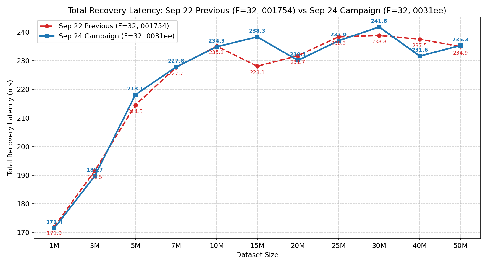

| Scale | Sep 22 Previous (F=32, 001754) (ms) | Sep 24 Campaign (F=32, 0031ee) (ms) | Delta (ms) | Speedup / Change |
|:---|---:|---:|---:|---:|
| **1M** | 171.93 | 171.43 | -0.49 | **-0.3%** ⚡ |
| **3M** | 191.51 | 189.70 | -1.81 | **-0.9%** ⚡ |
| **5M** | 214.47 | 218.10 | +3.63 | +1.7% |
| **7M** | 227.67 | 227.78 | +0.11 | +0.0% |
| **10M** | 235.05 | 234.85 | -0.20 | **-0.1%** ⚡ |
| **15M** | 228.06 | 238.31 | +10.25 | +4.5% |
| **20M** | 231.73 | 230.08 | -1.64 | **-0.7%** ⚡ |
| **25M** | 238.34 | 236.96 | -1.38 | **-0.6%** ⚡ |
| **30M** | 238.79 | 241.77 | +2.98 | +1.2% |
| **40M** | 237.50 | 231.60 | -5.90 | **-2.5%** ⚡ |
| **50M** | 234.94 | 235.28 | +0.34 | +0.1% |

---

## 3. Phase-by-Phase Detailed Matrix (Warm Medians, ms)

| Scale | Arch | Tree Localisation | Cand. Fetch | Row Cmp | Repair Write | Post-Repair Conf | **Total Recovery** |
|:---|:---|---:|---:|---:|---:|---:|---:|
| **1M** | Sep 22 Previous (F=32, 001754) | 121.80 | 18.90 | 0.64 | 25.08 | 3.46 | **171.93 ms** |
| | Sep 24 Campaign (F=32, 0031ee) | 122.08 | 18.78 | 0.64 | 24.81 | 3.48 | **171.43 ms** |
| **3M** | Sep 22 Previous (F=32, 001754) | 126.70 | 35.23 | 1.42 | 21.72 | 3.49 | **191.51 ms** |
| | Sep 24 Campaign (F=32, 0031ee) | 126.20 | 35.08 | 1.40 | 21.45 | 3.52 | **189.70 ms** |
| **5M** | Sep 22 Previous (F=32, 001754) | 133.48 | 50.81 | 2.25 | 22.68 | 3.52 | **214.47 ms** |
| | Sep 24 Campaign (F=32, 0031ee) | 137.02 | 50.72 | 2.26 | 22.63 | 3.54 | **218.10 ms** |
| **7M** | Sep 22 Previous (F=32, 001754) | 160.62 | 33.81 | 1.35 | 25.94 | 3.56 | **227.67 ms** |
| | Sep 24 Campaign (F=32, 0031ee) | 161.59 | 33.72 | 1.33 | 25.89 | 3.61 | **227.78 ms** |
| **10M** | Sep 22 Previous (F=32, 001754) | 184.96 | 17.19 | 0.54 | 26.88 | 3.48 | **235.05 ms** |
| | Sep 24 Campaign (F=32, 0031ee) | 185.28 | 16.98 | 0.55 | 26.70 | 3.53 | **234.85 ms** |
| **15M** | Sep 22 Previous (F=32, 001754) | 177.10 | 17.59 | 0.57 | 27.41 | 3.58 | **228.06 ms** |
| | Sep 24 Campaign (F=32, 0031ee) | 177.85 | 17.50 | 0.57 | 27.42 | 3.60 | **238.31 ms** |
| **20M** | Sep 22 Previous (F=32, 001754) | 180.42 | 18.16 | 0.59 | 27.30 | 3.59 | **231.73 ms** |
| | Sep 24 Campaign (F=32, 0031ee) | 178.76 | 17.99 | 0.60 | 27.44 | 3.61 | **230.08 ms** |
| **25M** | Sep 22 Previous (F=32, 001754) | 185.93 | 19.59 | 0.67 | 27.04 | 3.58 | **238.34 ms** |
| | Sep 24 Campaign (F=32, 0031ee) | 185.26 | 19.64 | 0.65 | 26.81 | 3.58 | **236.96 ms** |
| **30M** | Sep 22 Previous (F=32, 001754) | 185.62 | 19.96 | 0.67 | 27.43 | 3.59 | **238.79 ms** |
| | Sep 24 Campaign (F=32, 0031ee) | 188.50 | 19.86 | 0.67 | 27.25 | 3.63 | **241.77 ms** |
| **40M** | Sep 22 Previous (F=32, 001754) | 182.11 | 22.36 | 0.76 | 26.55 | 3.58 | **237.50 ms** |
| | Sep 24 Campaign (F=32, 0031ee) | 177.45 | 21.99 | 0.76 | 26.49 | 3.61 | **231.60 ms** |
| **50M** | Sep 22 Previous (F=32, 001754) | 179.23 | 24.18 | 0.87 | 25.72 | 3.47 | **234.94 ms** |
| | Sep 24 Campaign (F=32, 0031ee) | 178.61 | 24.49 | 0.86 | 25.70 | 3.48 | **235.28 ms** |

---

## 4. Phase Timing Composition

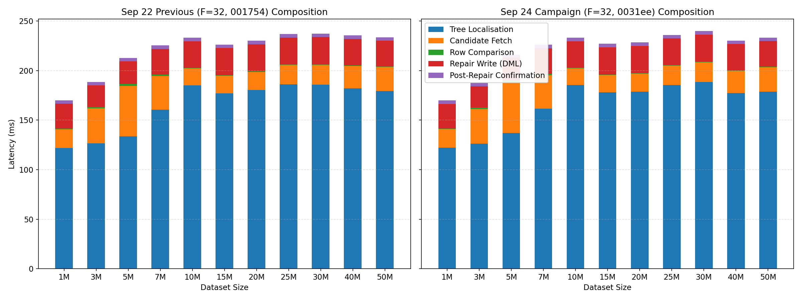

---

## 5. Sub-Phase Latency Graphs

### 5.1 Tree Localisation Phase
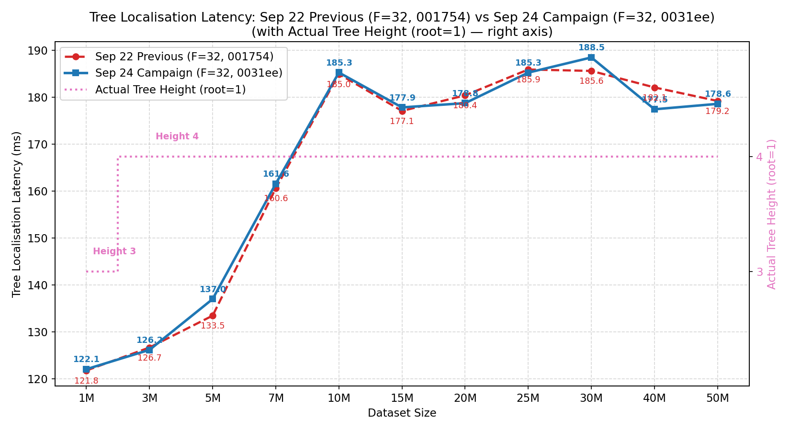

### 5.2 Candidate Fetch Phase
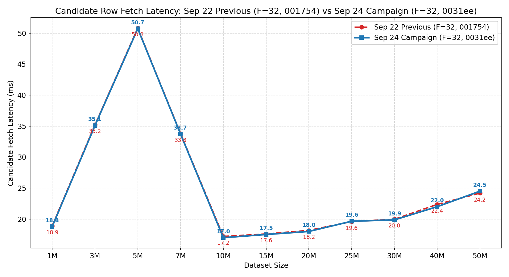

### 5.3 Row Comparison Phase
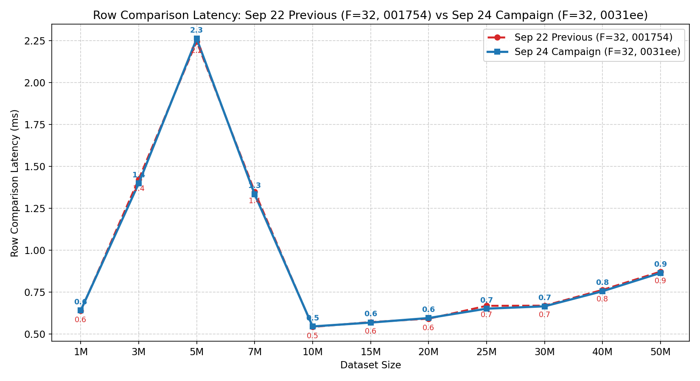

### 5.4 Repair Write Phase
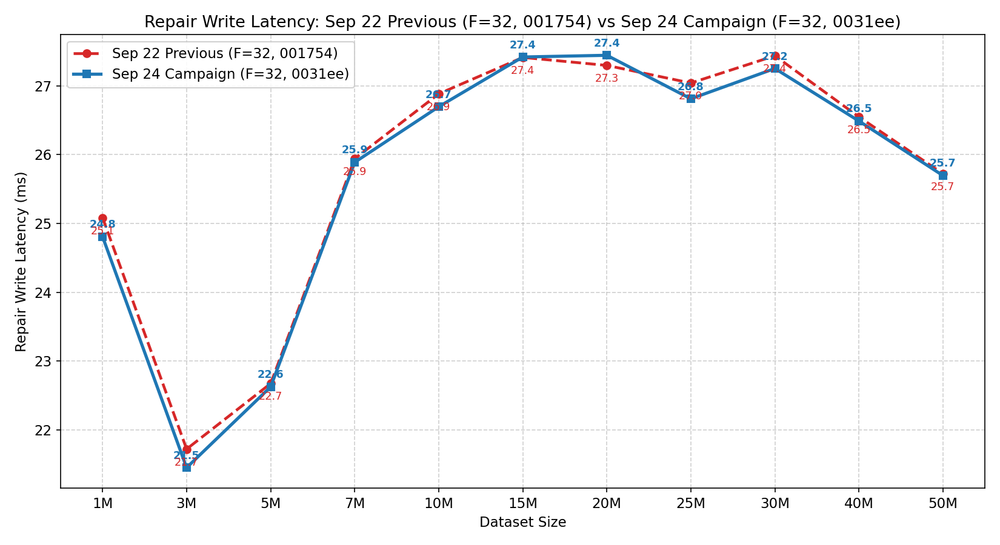

#### Detailed Repair Write Sub-Phase Breakdown:

| Scale | Sep 22 Previous (F=32, 001754) Total `repair_write` | Sep 22 Previous (F=32, 001754) `dml_wire` | Sep 22 Previous (F=32, 001754) `commit_wire` | Sep 24 Campaign (F=32, 0031ee) Total `repair_write` | Sep 24 Campaign (F=32, 0031ee) `dml_wire` | Sep 24 Campaign (F=32, 0031ee) `commit_wire` | `COMMIT` Delta (ms) |
|:---|---:|---:|---:|---:|---:|---:|---:|
| **1M** | 25.08 ms | 17.03 ms | 7.34 ms | 24.81 ms | 16.76 ms | 7.28 ms | -0.06 ms |
| **3M** | 21.72 ms | 17.21 ms | 3.70 ms | 21.45 ms | 17.04 ms | 3.66 ms | -0.04 ms |
| **5M** | 22.68 ms | 17.76 ms | 4.09 ms | 22.63 ms | 17.71 ms | 4.09 ms | -0.00 ms |
| **7M** | 25.94 ms | 17.23 ms | 7.91 ms | 25.89 ms | 17.25 ms | 7.91 ms | -0.00 ms |
| **10M** | 26.88 ms | 17.13 ms | 9.00 ms | 26.70 ms | 17.04 ms | 8.88 ms | -0.12 ms |
| **15M** | 27.41 ms | 17.26 ms | 9.34 ms | 27.42 ms | 17.37 ms | 9.30 ms | -0.04 ms |
| **20M** | 27.30 ms | 17.21 ms | 9.37 ms | 27.44 ms | 17.31 ms | 9.32 ms | -0.04 ms |
| **25M** | 27.04 ms | 17.45 ms | 8.88 ms | 26.81 ms | 17.24 ms | 8.79 ms | -0.09 ms |
| **30M** | 27.43 ms | 17.43 ms | 9.28 ms | 27.25 ms | 17.27 ms | 9.27 ms | -0.01 ms |
| **40M** | 26.55 ms | 17.47 ms | 8.33 ms | 26.49 ms | 17.39 ms | 8.30 ms | -0.02 ms |
| **50M** | 25.72 ms | 17.36 ms | 7.58 ms | 25.70 ms | 17.38 ms | 7.55 ms | -0.03 ms |

### 5.5 Post-Repair Confirmation Phase
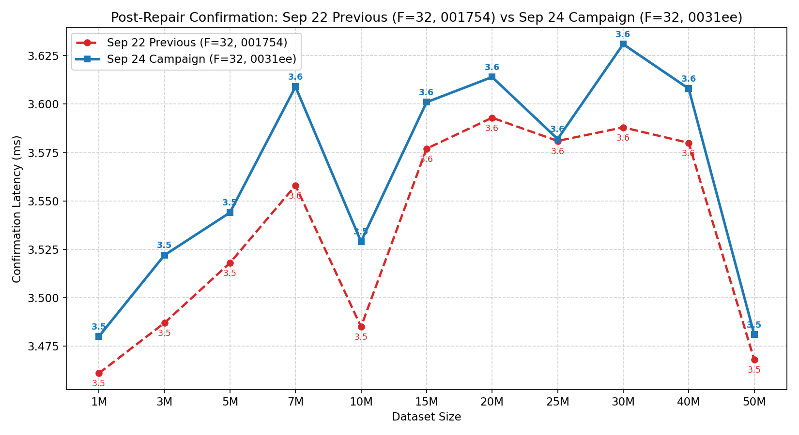

---

## 6. Leaf Occupancy & Repetition Stability

### 6.1 Leaf Occupancy Comparison
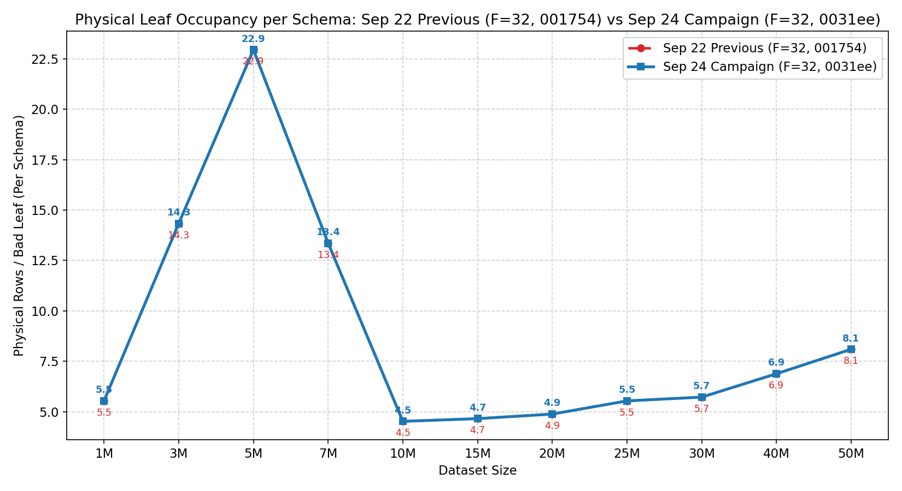

> **Note on Leaf Occupancy**:
> - **Physical Rows / Bad Leaf (Per Schema)**: The true physical row count per leaf bucket in PostgreSQL (bounded by $T_{\text{split}} = 32$ and $T_{\text{merge}} = 8$).
> - **Combined Candidate Rows (Healthy + Damaged)**: Total rows fetched across both replicas ($2 \times \text{physical rows}$).

| Scale | Sep 22 Previous (F=32, 001754) (Rows/Leaf per Schema) | Sep 24 Campaign (F=32, 0031ee) (Rows/Leaf per Schema) | Sep 22 Previous (F=32, 001754) Cand. Rows ($K=75$) | Sep 24 Campaign (F=32, 0031ee) Cand. Rows ($K=75$) |
|:---|---:|---:|---:|---:|
| **1M** | 5.53 rows/leaf | 5.53 rows/leaf | 830 rows | 830 rows |
| **3M** | 14.33 rows/leaf | 14.33 rows/leaf | 2,150 rows | 2,150 rows |
| **5M** | 22.95 rows/leaf | 22.95 rows/leaf | 3,442 rows | 3,442 rows |
| **7M** | 13.36 rows/leaf | 13.36 rows/leaf | 2,004 rows | 2,004 rows |
| **10M** | 4.52 rows/leaf | 4.52 rows/leaf | 678 rows | 678 rows |
| **15M** | 4.65 rows/leaf | 4.65 rows/leaf | 698 rows | 698 rows |
| **20M** | 4.88 rows/leaf | 4.88 rows/leaf | 732 rows | 732 rows |
| **25M** | 5.53 rows/leaf | 5.53 rows/leaf | 830 rows | 830 rows |
| **30M** | 5.72 rows/leaf | 5.72 rows/leaf | 858 rows | 858 rows |
| **40M** | 6.88 rows/leaf | 6.88 rows/leaf | 1,032 rows | 1,032 rows |
| **50M** | 8.09 rows/leaf | 8.09 rows/leaf | 1,214 rows | 1,214 rows |

### 6.2 Variance (CV%) Comparison
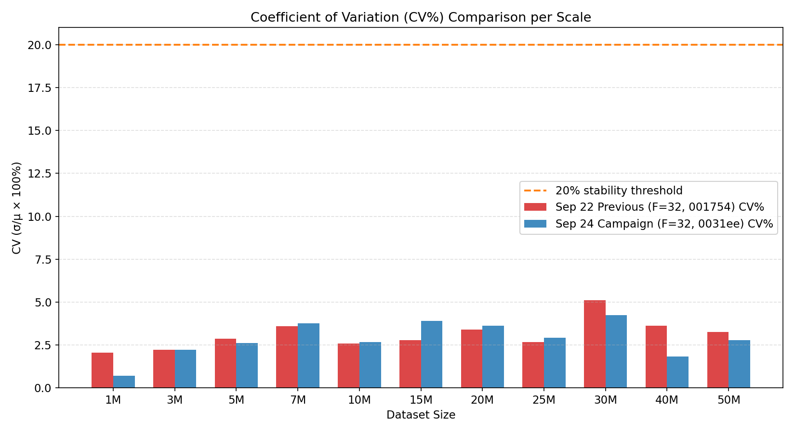

---

## 7. Dataset Construction Latency Comparison (1M → 50M)

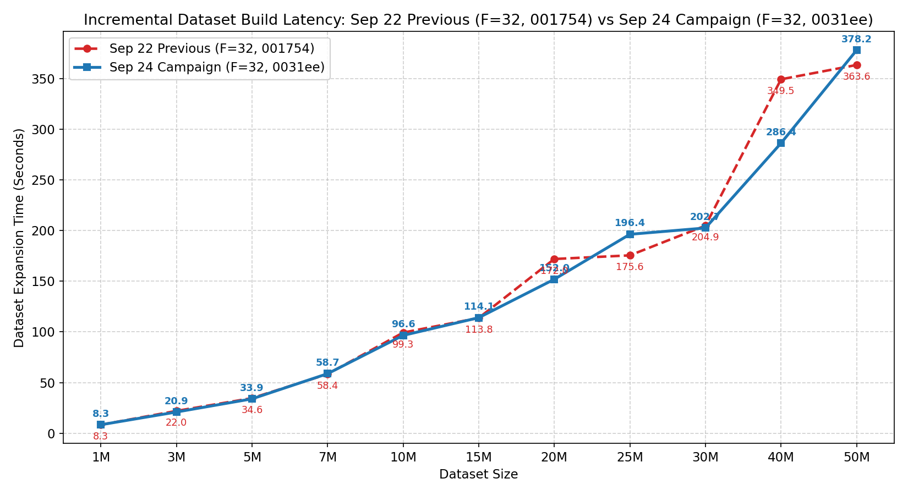

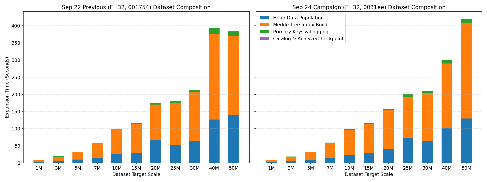

### 7.1 Step-by-Step Incremental Dataset Expansion Time

| Scale | Appended Tuples | Setup Mode | Sep 22 Previous (F=32, 001754) (s) | Sep 24 Campaign (F=32, 0031ee) (s) | Delta (s) | Speedup / Change |
|:---|:---|:---|---:|---:|---:|---:|
| **1M** | 1M | `bulk-logged` | 8.32 s (0.14 m) | 8.33 s (0.14 m) | +0.01 s | +0.2% |
| **3M** | 3M | `bulk-logged` | 21.97 s (0.37 m) | 20.90 s (0.35 m) | -1.08 s | **-4.9%** ⚡ |
| **5M** | 5M | `bulk-logged` | 34.60 s (0.58 m) | 33.89 s (0.56 m) | -0.71 s | **-2.0%** ⚡ |
| **7M** | 7M | `bulk-logged` | 58.36 s (0.97 m) | 58.74 s (0.98 m) | +0.39 s | +0.7% |
| **10M** | 10M | `bulk-logged` | 99.33 s (1.66 m) | 96.57 s (1.61 m) | -2.77 s | **-2.8%** ⚡ |
| **15M** | 15M | `bulk-logged` | 113.80 s (1.90 m) | 114.06 s (1.90 m) | +0.26 s | +0.2% |
| **20M** | 20M | `bulk-logged` | 172.02 s (2.87 m) | 151.97 s (2.53 m) | -20.05 s | **-11.7%** ⚡ |
| **25M** | 25M | `bulk-logged` | 175.60 s (2.93 m) | 196.41 s (3.27 m) | +20.80 s | +11.8% |
| **30M** | 30M | `bulk-logged` | 204.91 s (3.42 m) | 202.66 s (3.38 m) | -2.26 s | **-1.1%** ⚡ |
| **40M** | 40M | `bulk-logged` | 349.49 s (5.82 m) | 286.41 s (4.77 m) | -63.08 s | **-18.0%** ⚡ |
| **50M** | 50M | `bulk-logged` | 363.63 s (6.06 m) | 378.21 s (6.30 m) | +14.57 s | +4.0% |

### 7.2 Cumulative Benchmark Dataset Preparation Time

| Target Scale | Sep 22 Previous (F=32, 001754) Cum. Time | Sep 24 Campaign (F=32, 0031ee) Cum. Time | Cumulative Savings |
|:---|---:|---:|---:|
| **1M** | 8.32 s (0.14 m) | 8.33 s (0.14 m) | +0.01 s (+0.00 m) |
| **3M** | 30.29 s (0.50 m) | 29.23 s (0.49 m) | -1.06 s (-0.02 m) |
| **5M** | 64.89 s (1.08 m) | 63.12 s (1.05 m) | -1.77 s (-0.03 m) |
| **7M** | 123.25 s (2.05 m) | 121.86 s (2.03 m) | -1.39 s (-0.02 m) |
| **10M** | 222.58 s (3.71 m) | 218.43 s (3.64 m) | -4.15 s (-0.07 m) |
| **15M** | 336.38 s (5.61 m) | 332.49 s (5.54 m) | -3.90 s (-0.06 m) |
| **20M** | 508.40 s (8.47 m) | 484.45 s (8.07 m) | -23.95 s (-0.40 m) |
| **25M** | 684.00 s (11.40 m) | 680.86 s (11.35 m) | -3.14 s (-0.05 m) |
| **30M** | 888.91 s (14.82 m) | 883.52 s (14.73 m) | -5.40 s (-0.09 m) |
| **40M** | 1238.40 s (20.64 m) | 1169.93 s (19.50 m) | -68.47 s (-1.14 m) |
| **50M** | 1602.03 s (26.70 m) | 1548.14 s (25.80 m) | -53.90 s (-0.90 m) |

### 7.3 Detailed Sub-Phase Breakdown per Scale (ms)

| Scale | Arch | Healthy Heap (ms) | Damaged Heap (ms) | Healthy Merkle Index (ms) | Damaged Merkle Index (ms) | Primary Keys (ms) | Analyze / Catalog (ms) | Total Step (ms) |
|:---|:---|---:|---:|---:|---:|---:|---:|---:|
| **1M** | Sep 22 Previous (F=32, 001754) | 1,724.43 | 0.05 | 3,055.28 | 2,982.10 | 222.87 | 108.66 | **8,318.30 ms** |
| | Sep 24 Campaign (F=32, 0031ee) | 1,703.14 | 0.06 | 3,058.89 | 2,983.90 | 232.66 | 98.73 | **8,331.06 ms** |
| **3M** | Sep 22 Previous (F=32, 001754) | 6,042.37 | 0.05 | 6,052.70 | 6,616.30 | 640.72 | 135.31 | **21,972.28 ms** |
| | Sep 24 Campaign (F=32, 0031ee) | 5,804.33 | 0.06 | 6,390.24 | 6,361.93 | 639.51 | 102.99 | **20,895.41 ms** |
| **5M** | Sep 22 Previous (F=32, 001754) | 10,154.33 | 0.06 | 10,944.69 | 10,820.17 | 1,126.90 | 135.65 | **34,602.04 ms** |
| | Sep 24 Campaign (F=32, 0031ee) | 9,705.46 | 0.06 | 10,709.21 | 10,898.80 | 1,036.51 | 134.21 | **33,894.52 ms** |
| **7M** | Sep 22 Previous (F=32, 001754) | 13,799.63 | 0.06 | 21,949.04 | 21,691.56 | 1,474.18 | 212.92 | **58,355.76 ms** |
| | Sep 24 Campaign (F=32, 0031ee) | 14,306.44 | 0.06 | 21,862.66 | 21,799.81 | 1,522.12 | 219.03 | **58,741.39 ms** |
| **10M** | Sep 22 Previous (F=32, 001754) | 26,661.91 | 0.03 | 36,067.31 | 35,040.80 | 2,427.32 | 207.50 | **99,334.30 ms** |
| | Sep 24 Campaign (F=32, 0031ee) | 24,020.28 | 0.04 | 36,200.59 | 35,851.86 | 2,446.02 | 206.58 | **96,565.98 ms** |
| **15M** | Sep 22 Previous (F=32, 001754) | 29,477.61 | 0.09 | 41,949.20 | 41,978.20 | 3,249.56 | 218.33 | **113,798.12 ms** |
| | Sep 24 Campaign (F=32, 0031ee) | 30,377.51 | 0.06 | 41,766.37 | 41,509.15 | 3,182.83 | 219.45 | **114,057.11 ms** |
| **20M** | Sep 22 Previous (F=32, 001754) | 67,983.57 | 0.07 | 50,854.54 | 51,757.92 | 4,255.83 | 218.13 | **172,018.79 ms** |
| | Sep 24 Campaign (F=32, 0031ee) | 41,942.37 | 0.06 | 55,882.48 | 55,630.48 | 4,423.35 | 215.46 | **151,968.55 ms** |
| **25M** | Sep 22 Previous (F=32, 001754) | 53,124.51 | 0.06 | 60,690.86 | 60,957.86 | 5,531.86 | 221.55 | **175,603.46 ms** |
| | Sep 24 Campaign (F=32, 0031ee) | 72,049.13 | 0.06 | 60,337.49 | 61,007.20 | 7,561.96 | 219.25 | **196,407.13 ms** |
| **30M** | Sep 22 Previous (F=32, 001754) | 64,567.69 | 0.08 | 71,640.94 | 69,648.79 | 6,446.32 | 224.31 | **204,911.84 ms** |
| | Sep 24 Campaign (F=32, 0031ee) | 63,687.97 | 0.05 | 70,869.28 | 69,713.37 | 6,354.54 | 219.50 | **202,656.50 ms** |
| **40M** | Sep 22 Previous (F=32, 001754) | 127,002.93 | 0.04 | 122,821.17 | 124,695.77 | 17,553.81 | 218.51 | **349,488.81 ms** |
| | Sep 24 Campaign (F=32, 0031ee) | 101,679.55 | 0.06 | 94,160.47 | 94,264.78 | 10,119.04 | 214.47 | **286,413.18 ms** |
| **50M** | Sep 22 Previous (F=32, 001754) | 139,194.29 | 0.27 | 115,911.36 | 115,015.55 | 12,805.03 | 211.08 | **363,630.49 ms** |
| | Sep 24 Campaign (F=32, 0031ee) | 129,759.56 | 0.06 | 139,939.27 | 137,443.89 | 12,582.77 | 227.90 | **378,205.40 ms** |

---

## Provenance

- **Old Run ID**: `ariabc-recovery-size-scaling-k75-c300-20260922T134115Z-001754`
- **New Run ID**: `ariabc-recovery-size-scaling-k75-c300-20260924T053957Z-0031ee`
- **Report Path**: `/work/ARIABC/AriaBC/Final_Results/reruns/20260923T153000Z_campaign/Recovery/comparison_vs_sep22_f32/DYNAMIC_COMPARISON_REPORT_ariabc-recovery-size-scaling-k75-c300-20260922T134115Z-001754_VS_ariabc-recovery-size-scaling-k75-c300-20260924T053957Z-0031ee.md`