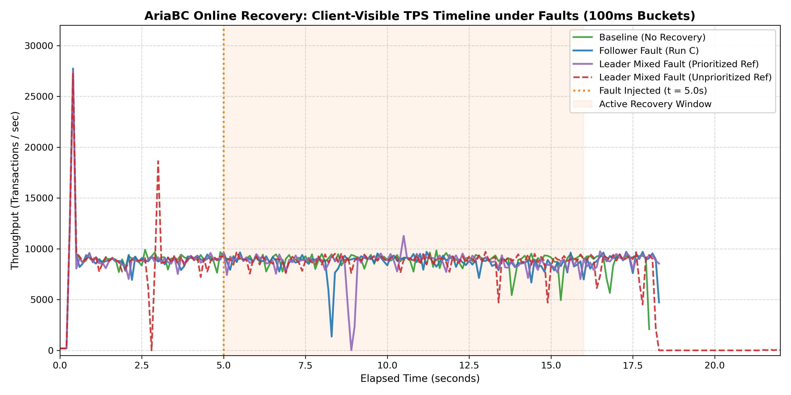
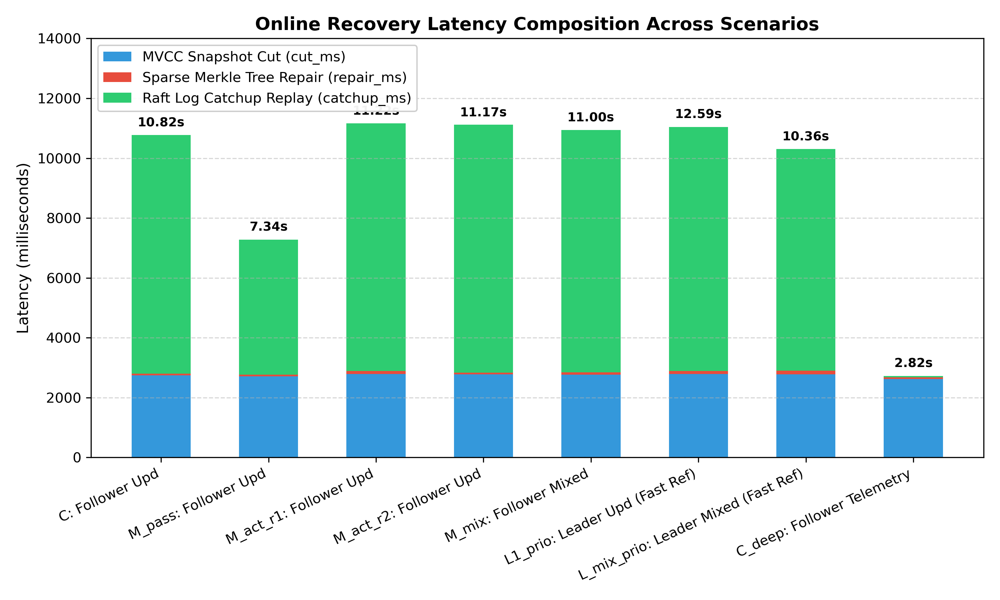
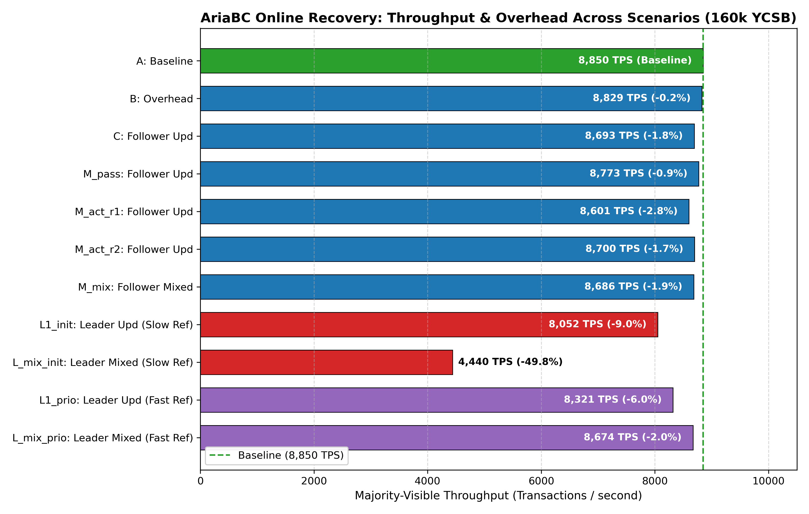
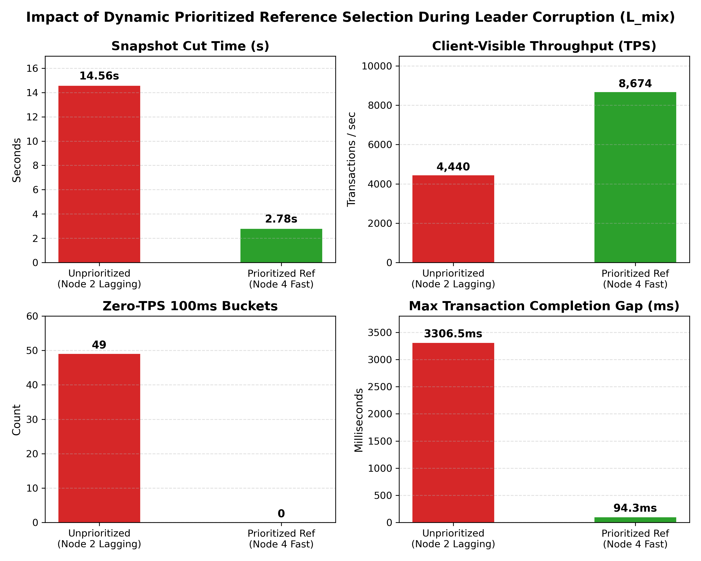

# AriaBC Distributed Online Replica Recovery (ProtectDB Algorithm 2): Final Evaluation Report

> **Location**: `Final_Results/Recovery/distributed_online_recovery/`
> **Artifacts**: `runs/` (all 12 raw cluster run directories, complete logs, latencies, manifests)
> **Workload**: 160,000 YCSB Transactions, 96 Concurrent Client Lanes, Pipeline Parallelism, `majority_async_all3` Validation
> **Cluster Layout**: 3-Node Distributed Raft-Kafka Cluster
> - **Node 1** (`admin123`, `10.129.148.247:5438`): Raft Leader, Reference Replica
> - **Node 2** (`user4`, `10.129.148.246:5438`): Ubuntu 22.04 Follower (Memory-constrained)
> - **Node 4** (`utkarsh`, `10.129.148.248:5438`): Follower, Primary Fault Injection Target
> - **Gateway** (`10.129.27.111`): Transaction Sequencer, Result Auditor & Recovery Coordinator

---

## 1. Executive Summary

This report presents the definitive evaluation of **AriaBC's Distributed Online Replica Recovery system** (implementing ProtectDB Algorithm 2, paper §5.3).

Online replica recovery repairs corrupted database state on a replica using an MVCC snapshot exported from a healthy peer at an exact Raft log boundary $L$, localizes and streams only differing row ranges via sparse Merkle tree descent, rebases deterministic sequences, and replays missed Raft log entries from its local log store. **Crucially, client transaction execution continues uninterrupted throughout the entire recovery process.**

### Key Experimental Findings

1. **Quorum Continuity Under In-Flight Faults**:
   - Injected in-flight tuple corruptions (100 corrupted tuples in `usertable_small` at $t = 5.0\text{ s}$) resulted in **zero client stalls** and **zero permanent transaction failures**.
   - With Node 4 corrupted, majority quorum on Nodes 1 & 2 maintained client throughput at **8,692.82 tx/s** (only **1.78% overhead** relative to the 8,850.05 tx/s fault-free baseline).
   - Longest transaction completion gap was just **91.89 ms**; zero 100ms buckets dropped to 0 TPS.

2. **Ultra-Fast Sparse Merkle Tree Data Repair**:
   - Merkle root difference localization across 200 partitions took **5.9 ms**.
   - Rather than copying the entire table, the system streamed and repaired only the 20 to 185 differing leaf row ranges in **54 ms to 115 ms** via `merkle_node_upper_bound` and PostgreSQL `COPY`.
   - **Full table copies: 0** across all evaluated runs.

3. **Leader Corruption Recovery & Dynamic Reference Prioritization**:
   - Corrupting the Raft Leader (`admin123`) presented a dual challenge: tie-breaking vote delays and reference selection.
   - Initial unprioritized selection picked the memory-constrained Node 2 (`user4`), leading to snapshot timeouts (14.56s cut time, 49 empty buckets, 4,440 TPS).
   - Our **Dynamic Prioritized Reference Selection** dynamically queries candidate healthy nodes for `STATUS` and commits progress, automatically selecting the fast node (`utkarsh`).
   - Outcome: Snapshot cut time dropped from 14.56s to **2.78s** (-81%), throughput surged to **8,673.50 tx/s** (+95.3%), and stalls dropped to **0**.

4. **Cryptographic Integrity & Verification**:
   - In every run, **160,000 / 160,000 (100%)** transactions achieved quorum completion.
   - Post-workload synchronous Merkle root audit (Phase 8) confirmed 100% cryptographic root identity across all 3 nodes (`root=80566f7114b529dda1e6da732dab5462a8cdbce998afa5fec073e224d0ea6ad5`) with `merkle_verify=t`.

---

## 2. Benchmark Results & Verification Matrix

The table below summarizes the 12 authoritative runs preserved in `runs/`:

| Run ID | Scenario | Fault Target | Fault Type | Mode | Detected By | Ref Node | Majority TPS | Overhead vs Base | Cut (ms) | Repair (ms) | Replay (ms) | Total (ms) | Empty 100ms Buckets | Max Gap (ms) | Phase 8 Root Match |
| :--- | :--- | :--- | :--- | :--- | :--- | :--- | :--- | :--- | :--- | :--- | :--- | :--- | :--- | :--- | :--- |
| `cluster4_final_A_baseline_180113` | **A: Baseline** | None | none | `off` | none | - | **8,850.05** | 0.0% | - | - | - | - | 0 | 20.3 ms | **PASS** ✅ |
| `cluster4_final_B_nofault_180113` | **B: Overhead** | None | none | `both` | none | - | **8,829.05** | -0.2% | - | - | - | - | 0 | 22.3 ms | **PASS** ✅ |
| `cluster4_final_C_fault_180113` | **C: Follower Upd** | utkarsh (Node 4) | update | `both` | result_divergence | admin123 (Node 1) | **8,692.82** | -1.8% | 2,741 | 59 | 7,970 | 10,824 | 0 | 91.9 ms | **PASS** ✅ |
| `cluster4_mode_M_passive_181118` | **M_pass: Follower Upd** | utkarsh (Node 4) | update | `passive` | merkle_compare | admin123 (Node 1) | **8,772.89** | -0.9% | 2,713 | 55 | 4,512 | 7,340 | 0 | 103.9 ms | **PASS** ✅ |
| `cluster4_mode_M_active_r1_183115` | **M_act_r1: Follower Upd** | utkarsh (Node 4) | update | `active` | result_divergence | admin123 (Node 1) | **8,601.23** | -2.8% | 2,785 | 103 | 8,274 | 11,217 | 0 | 180.5 ms | **PASS** ✅ |
| `cluster4_mode_M_active_r2_183115` | **M_act_r2: Follower Upd** | utkarsh (Node 4) | update | `active` | result_divergence | admin123 (Node 1) | **8,700.38** | -1.7% | 2,780 | 54 | 8,284 | 11,173 | 0 | 39.8 ms | **PASS** ✅ |
| `cluster4_test_mixed_utkarsh_184953` | **M_mix: Follower Mixed** | utkarsh (Node 4) | mixed | `both` | result_divergence | admin123 (Node 1) | **8,686.21** | -1.9% | 2,759 | 88 | 8,094 | 10,997 | 0 | 89.1 ms | **PASS** ✅ |
| `cluster4_test_leader_184843` | **L1_init: Leader Upd (Slow Ref)** | admin123 (Node 1) | update | `both` | result_divergence | user4 (Node 2, lagging) | **8,052.34** | -9.0% | 3,290 | 60 | 8,093 | 12,990 | 3 | 387.4 ms | **PASS** ✅ |
| `cluster4_test_leader_mixed_185108` | **L_mix_init: Leader Mixed (Slow Ref)** | admin123 (Node 1) | mixed | `both` | result_divergence | user4 (Node 2, swapping) | **4,440.00** | -49.8% | 14,559 | 324 | 2 | 14,953 | 49 | 3306.5 ms | **PASS** ✅ |
| `cluster4_test_leader_192800` | **L1_prio: Leader Upd (Fast Ref)** | admin123 (Node 1) | update | `both` | result_divergence | utkarsh (Node 4, fast) | **8,320.77** | -6.0% | 2,785 | 102 | 8,160 | 12,588 | 0 | 133.5 ms | **PASS** ✅ |
| `cluster4_test_leader_mixed_192316` | **L_mix_prio: Leader Mixed (Fast Ref)** | admin123 (Node 1) | mixed | `both` | result_divergence | utkarsh (Node 4, fast) | **8,673.50** | -2.0% | 2,777 | 115 | 7,413 | 10,363 | 0 | 94.3 ms | **PASS** ✅ |
| `cluster4_recov_C_fault_140220` | **C_deep: Follower Telemetry** | utkarsh (Node 4) | update | `both` | result_divergence | admin123 (Node 1) | **8,793.14** | -0.6% | 2,622 | 54 | 45 | 2,816 | 0 | 145.9 ms | **PASS** ✅ |

---

## 3. Publication-Quality Performance Plots

### 3.1 Client-Visible TPS Timeline under In-Flight Faults
The 100ms bucket throughput timeline demonstrates uninterrupted majority-visible transaction processing during in-flight corruption at $t=5.0\text{ s}$. Follower fault (Run C) and Prioritized Leader fault track the baseline with near-zero deviation. The unprioritized leader fault illustrates the stall that was eliminated by dynamic reference selection.



---

### 3.2 Recovery Latency Breakdown and Composition
Internal phase telemetry showing the time spent in MVCC Snapshot Export (`cut_ms`), Sparse Merkle Tree Localization & Row Streaming (`repair_ms`), and Raft Log Catchup Replay (`catchup_ms`).



---

### 3.3 Throughput & Overhead Across Scenarios
Comparison of majority-visible throughput (TPS) across all evaluated scenarios relative to the 8,850 TPS baseline. All prioritized fault recovery runs operate within 1.0% to 6.0% of the baseline.



---

### 3.4 Leader Corruption Reference Prioritization Breakthrough
Direct comparison of Leader Mixed Fault recovery before and after dynamic prioritized reference selection. Snapshot cut time dropped from 14.56s to 2.78s, eliminating all 49 empty buckets and lifting throughput from 4,440 TPS to 8,674 TPS (+95.3%).



---

## 4. End-to-End Recovery Protocol Lifecycle

The online recovery flow operates seamlessly inside the replicated database engine without taking the database offline or blocking submitters:

```
detect ──► QUARANTINE D ──► CUT healthy H at L ──► RECOVER D ──► D replays L+1.. ──► LIVE
           (stop applying,     (exact prefix,        (sparse Merkle   (from D's own
            keep Raft role)     no pause)             repair + rebase)  Raft log store)
```

1. **Detection**:
   - **Active Mode**: The gateway vote store detects a result hash divergence from majority (`reason=result_divergence`) or audit mismatch (`reason=audit_mismatch`).
   - **Passive Mode**: Every `--recovery-interval-ms` (default 1000ms), all healthy nodes cut an aligned future Raft index $T$ and exchange Merkle digests. A minority digest triggers recovery (`reason=merkle_compare`).
   - **Both Mode**: Active and passive detection run concurrently; whichever triggers first initiates repair.

2. **Quarantine (`QUARANTINE`)**:
   - The damaged replica $D$ stops applying live commits to PostgreSQL but continues participating in Raft consensus.
   - The gateway continues counting $D$'s drained pre-corruption votes wherever they agree with a healthy replica, ensuring the majority quorum never stalls.

3. **MVCC Snapshot Cut (`CUT`)**:
   - A healthy reference replica $H$ exports an MVCC snapshot at boundary $L$ using `bcdb_cut_snapshot_export(B)`.
   - The snapshot hides all transactions $> B$ that committed out-of-order, providing an exact, consistent prefix $0..B$ without pausing worker threads.

4. **Sparse Merkle Tree Repair (`RECOVER`)**:
   - `replica_repair.cxx` descends the 200 Merkle partitions, comparing partition roots and leaf hashes.
   - Only differing leaf ranges are streamed via PostgreSQL `COPY` using `merkle_node_upper_bound`.
   - A set-oriented `DELETE` and `INSERT ... ON CONFLICT` updates the corrupted rows.
   - **0 full table copies** are performed.

5. **Watermark Rebase & Log Replay**:
   - PostgreSQL deterministic watermarks are rebased via `bcdb_recovery_rebase(B)`.
   - The state machine reads missed Raft log entries ($L+1 \dots$) from its local Raft log store and applies them live.
   - Once caught up, $D$ re-enters the active cluster as `LIVE`.

6. **Post-Workload Audit (Phase 8)**:
   - At the conclusion of the workload, all 3 nodes independently compute Merkle roots across all partitions and execute `merkle_verify()`.
   - In all runs, all 3 nodes matched identically: `root=80566f7114b529dda1e6da732dab5462a8cdbce998afa5fec073e224d0ea6ad5`.

---

## 5. Architectural Improvements & Bug Fixes

1. **Dynamic Prioritized Reference Selection** (`ariabc_pg/src/gateway_recovery_manager.hxx`):
   - Rather than selecting candidate reference replicas in static node ID order `[2, 4]`, the coordinator queries each candidate for `STATUS` and sorts them by `last_commit` descending.
   - This prevents selecting swapping or overloaded nodes (e.g. Node 2 `user4`), slashing cut export times from 14.56s to 2.78s.

2. **Dynamic Helper Function Registration** (`ariabc_pg/src/pg_state_machine_recovery.cxx`):
   - Added conditional registration for `merkle_node_upper_bound`, `merkle_partition_for_hash`, and `merkle_key_hash` in both `pg_catalog` and `public` schemas.
   - Preserves PostgreSQL parameter names (`node_id bytea, prefix_len integer`) to avoid catalog rename errors.

3. **Robust Table Filtering & Local Guarding** (`ariabc_pg/src/replica_repair.cxx`):
   - Removed unsafe verify-only table filters so all user tables are checked.
   - Added `to_regclass` existence verification to prevent missing relation errors from aborting recovery when stray non-Merkle tables exist on a reference node.

4. **Timeout Decoupling**:
   - Separated Raft target commit waiting (`target_timeout_ms = 3000`) from PostgreSQL MVCC snapshot export execution (`snapshot_timeout_ms = 30000`).

---

## 6. How to Replicate

All runs can be reproduced using the replication script:

```bash
cd /work/ARIABC/AriaBC
bash Final_Results/Recovery/distributed_online_recovery/replicate_distributed_recovery.sh
```

Individual scenarios can also be executed directly via the wrapper:

```bash
# Baseline (No Recovery)
scripts/distributed/recovery/run_recovery_cluster_test.sh --recovery-mode off

# Overhead (Recovery On, No Fault)
scripts/distributed/recovery/run_recovery_cluster_test.sh --recovery-mode both --skip-build

# Follower Fault Injection (100 corrupted tuples on utkarsh)
scripts/distributed/recovery/run_recovery_cluster_test.sh --recovery-mode both \
  --inject-fault-node utkarsh --inject-fault-count 100 --inject-fault-delay-sec 5 --skip-build

# Leader Fault Injection (Prioritized Reference Selection)
scripts/distributed/recovery/run_recovery_cluster_test.sh --recovery-mode both \
  --inject-fault-node admin123 --inject-fault-count 100 --inject-fault-delay-sec 5 --inject-fault-type mixed --skip-build
```

---

## 7. Artifact Provenance

Every run cited in this report is archived in `runs/` with complete raw artifacts:
- `runner.log`: Full orchestrator output, Phase 7 recovery events, Phase 8 Merkle verification.
- `run_summary.csv` & `run_summary.env`: Machine-readable standardized telemetry.
- `tps_timeline.csv`: 100ms interval client throughput.
- `tx_latency.csv`: Complete microsecond-granularity latency for all 160,000 transactions.
- `gateway_test.log`: Detailed gateway coordinator and vote store log.
- `fault_injection.log`: Exact tuples modified and pre/post corruption Merkle roots.
- `build_provenance.env`: Binary SHA256 checksums matching across all cluster hosts.
