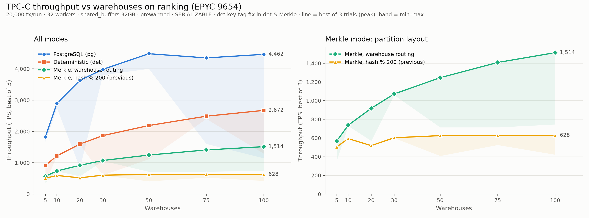
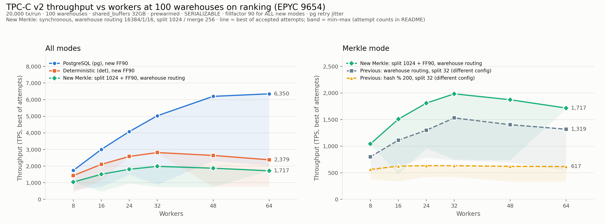
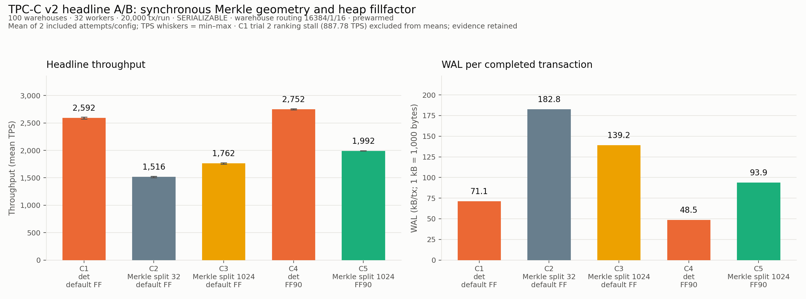
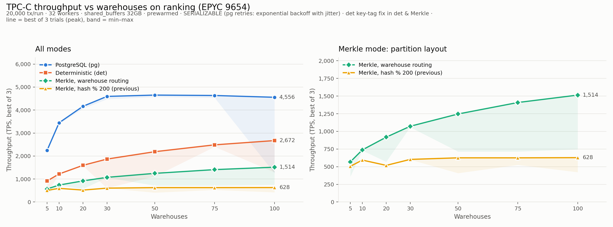
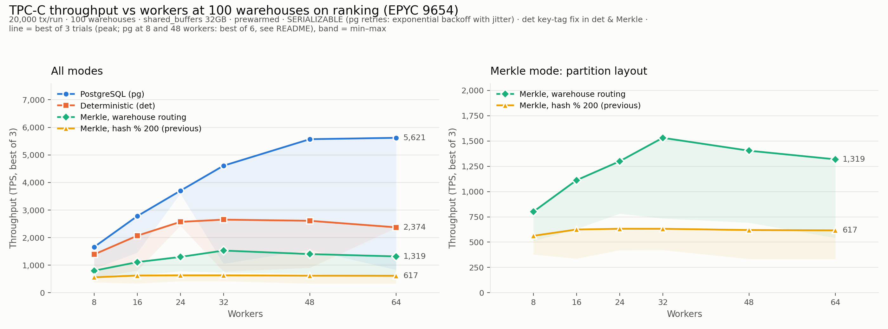

# TPC-C v2 scaling results (ranking, 2026-10-02)

The two primary scaling figures now use the completed v2 campaign: **all new modes use fillfactor 90, SERIALIZABLE, prewarming and 32GB shared buffers**. PostgreSQL uses `dbType 0` with client-executor serialization retries and exponential backoff/full jitter; det uses deterministic execution; Merkle adds synchronous integrity indexes on all nine TPC-C tables. The right panels retain the previously published warehouse-routing split-32 and hash-%-200 observations as **different-configuration references**, not v2 controls.





## Configuration and provenance

All work ran on ranking (`protectdr@10.129.7.57`), including PostgreSQL, server, gateway and driver, in isolated `~/claude_checks` directories. The measured PostgreSQL install is `install_v2`, built from the working tree including the uncommitted Merkle changes. Frozen source diffs, binary hashes, harness copies and continuation changes are in [headline provenance](v2_20261002/headline_ab/provenance/) and [sweep provenance](v2_20261002/sweeps/provenance/).

| Mode | New sweep configuration |
|---|---|
| pg | AriaBC PostgreSQL path, `dbType 0`; SERIALIZABLE; serialization failures retried by the client executor with jitter; fillfactor 90 |
| det | Deterministic execution; fillfactor 90 |
| Merkle | det plus synchronous Merkle on 9 tables; fanout 32, partitions 16384, partition-key columns 1, subpartitions 16; split 1024 / merge 256; fillfactor 90 |

Every leaf and ancestor through the partition root remains updated inside the user transaction and exact at commit (`merkle_apply_synchronous_direct=on`). Canonical row-hash bytes and recovery semantics are unchanged by this publication. Logged tables, fsync, synchronous commit and full-page writes are enabled. Every measured attempt uses 20,000 transactions. The server SHA-256 is `cc02e6df017f5d1dbbb181ac39ecf2b8a29b971a4c53c72d17cdf52695ca2a17`; PostgreSQL SHA-256 is `8f132d4d1891bc8e43972b98fc3c11b06895408560f202335babf1c81885b3bb` (recorded in `provenance/binaries.sha256`).

## Reporting method and stalls

The sweep ran one initial pass with automatic stall reruns, a full second pass in reverse order with stall reruns, then two extra attempts each for det W20/32 workers, Merkle W100/16 workers, and det W100/64 workers. **Lines plot the best of all accepted attempts per point; bands show min–max across those attempts, including slow attempts.** Tables report best / median / minimum TPS and the exact accepted attempt count. This follows the previous publication's peak-throughput convention, with unequal attempt counts made explicit; it is not a stable median ranking or an equal-budget comparison.

Ranking's intermittent stalls affected many individual attempts even when host load was low. The cause is unknown; NUMA placement is a suspected explanation, not an established cause. The apparent pg W5 regression was a stall: its third attempt matched the previous publication. Failed setup attempts and smoke runs are excluded from scaling tables. Only the headline C1 trial 2 stall is excluded from headline means as specified below. Raw observations remain intact.

The remote `sweeps/summary.md` still says "one initial trial"; it is archived unchanged. The completed `status_history.txt`, accepted JSON records and all-runs CSV establish the actual two-pass method and extras used here. `stall_flags.json` is the saved flag snapshot, not an exhaustive classifier of all slow attempts.

There are **89 accepted measured sweep attempts over 36 distinct mode/W/worker points**. W100/32-worker attempts appear in both sweep tables and are counted once in this total. The headline has 11 accepted measured attempts, of which 10 enter the means. Three separate 2,000-transaction smoke attempts remain in the archive and are excluded.

## Warehouse scaling (32 workers)

Source: [all sweep attempts](v2_20261002/sweeps/all_runs.csv), [warehouse source CSV](v2_20261002/sweeps/warehouses_w32/all_runs.csv), [derived summary](v2_20261002/analysis/warehouses_w32.csv). Each mode cell is **best / median / min TPS (attempts)**. Ratios use new best TPS divided by new best TPS.

| Warehouses | pg: best / median / min (n) | det: best / median / min (n) | Merkle: best / median / min (n) | Merkle/det | Merkle/pg |
|---:|---:|---:|---:|---:|---:|
| 5 | 2,274.18 / 767.75 / 764.37 (3) | 905.92 / 902.24 / 898.56 (2) | 664.71 / 663.78 / 662.85 (2) | 0.7337 | 0.2923 |
| 10 | 3,432.72 / 2,155.42 / 878.12 (2) | 1,196.65 / 1,191.93 / 1,187.22 (2) | 879.79 / 870.11 / 860.43 (2) | 0.7352 | 0.2563 |
| 20 | 4,360.22 / 3,796.35 / 3,232.47 (2) | 1,578.57 / 1,024.66 / 687.99 (4) | 1,137.75 / 1,137.52 / 483.51 (3) | 0.7207 | 0.2609 |
| 30 | 4,682.93 / 2,820.69 / 958.44 (2) | 1,892.93 / 1,892.55 / 1,892.16 (2) | 1,343.32 / 1,339.74 / 1,336.15 (2) | 0.7097 | 0.2869 |
| 50 | 4,858.92 / 2,615.04 / 1,764.21 (3) | 2,202.43 / 1,792.05 / 1,381.66 (2) | 1,578.02 / 1,572.25 / 1,566.48 (2) | 0.7165 | 0.3248 |
| 75 | 4,997.49 / 3,205.00 / 1,412.51 (2) | 2,622.14 / 2,608.64 / 2,595.15 (2) | 1,810.00 / 1,803.85 / 1,797.70 (2) | 0.6903 | 0.3622 |
| 100 | 5,028.05 / 2,952.47 / 876.88 (2) | 2,814.97 / 2,782.10 / 2,749.24 (2) | 1,984.35 / 1,157.86 / 749.25 (3) | 0.7049 | 0.3947 |

## Worker scaling (100 warehouses)

Source: [worker source CSV](v2_20261002/sweeps/workers_w100/all_runs.csv), [derived summary](v2_20261002/analysis/workers_w100.csv). Cells and ratios follow the same rule as the warehouse table.

| Workers | pg: best / median / min (n) | det: best / median / min (n) | Merkle: best / median / min (n) | Merkle/det | Merkle/pg |
|---:|---:|---:|---:|---:|---:|
| 8 | 1,740.14 / 1,733.67 / 593.21 (4) | 1,430.62 / 901.52 / 422.14 (4) | 1,041.21 / 1,041.00 / 1,040.79 (2) | 0.7278 | 0.5983 |
| 16 | 3,004.75 / 1,869.60 / 734.44 (2) | 2,104.38 / 1,623.35 / 1,142.32 (2) | 1,507.57 / 1,313.53 / 469.89 (4) | 0.7164 | 0.5017 |
| 24 | 4,075.96 / 2,781.53 / 1,487.11 (2) | 2,579.25 / 2,579.14 / 2,579.04 (2) | 1,809.26 / 1,384.73 / 960.20 (2) | 0.7015 | 0.4439 |
| 32 | 5,028.05 / 2,952.47 / 876.88 (2) | 2,814.97 / 2,782.10 / 2,749.24 (2) | 1,984.35 / 1,157.86 / 749.25 (3) | 0.7049 | 0.3947 |
| 48 | 6,197.14 / 4,259.80 / 2,322.46 (2) | 2,641.76 / 1,707.31 / 772.86 (2) | 1,873.09 / 1,855.78 / 736.53 (3) | 0.7090 | 0.3023 |
| 64 | 6,349.55 / 4,189.46 / 2,029.37 (2) | 2,378.97 / 955.99 / 760.14 (6) | 1,717.03 / 1,710.65 / 1,704.28 (2) | 0.7218 | 0.2704 |

## Headline A/B: W100, 32 workers



Source: [all headline observations](v2_20261002/headline_ab/all_runs.csv), per-run `accepted.json`, `tabstats.csv` and `result.txt`; [derived A/B summary](v2_20261002/analysis/headline_ab.csv). Means use two included attempts per configuration. C1 has three accepted attempts; **trial 2 (887.78 TPS) was a ranking stall and is excluded from both its TPS and WAL means**, while its evidence is retained. C4 trial 2 also has a saved failed stop-timeout setup directory, followed by the successful continuation; the failed setup contributes no measurement. The archived upstream headline summary includes C1's stall in pooled/paired calculations and must not be read as the filtered means below. All C2/C3/C5 Merkle configurations use warehouse routing 16384/1/16 with fanout 32.

The headline C4/C5 fillfactor change applies to the **eight mutable tables**; immutable `item` retains its default fillfactor, as recorded in `restore_relations.csv`. The subsequent scaling sweeps explicitly set fillfactor 90 on all nine tables. The headline and sweep therefore should not be treated as identical physical configurations.

| Config | Configuration | Included trials / accepted attempts | TPS per included trial | Mean TPS | Mean WAL bytes/tx | Mean WAL kB/tx |
|---|---|---|---|---:|---:|---:|
| C1 | det, default fillfactor | 1, 3 / 3 | 2,573.34 / 2,610.28 | 2,591.81 | 71,087.6 | 71.09 |
| C2 | Merkle split 32 / merge 8, default fillfactor | 1, 2 / 2 | 1,530.10 / 1,501.16 | 1,515.63 | 182,766.6 | 182.77 |
| C3 | Merkle split 1024 / merge 256, default fillfactor | 1, 2 / 2 | 1,773.84 / 1,751.16 | 1,762.50 | 139,152.0 | 139.15 |
| C4 | det, fillfactor 90 | 1, 2 / 2 | 2,763.19 / 2,741.23 | 2,752.21 | 48,455.5 | 48.46 |
| C5 | Merkle split 1024 / merge 256, fillfactor 90 | 1, 2 / 2 | 1,988.47 / 1,994.61 | 1,991.54 | 93,929.7 | 93.93 |

WAL uses decimal kB (1,000 bytes), measured WAL bytes divided by 20,000 completed transactions, then averaged over included attempts. TPS uses gateway workload wall time; overlapping phase-counter sums are not elapsed time.

HOT fractions below pool table-update counters over the same included attempts.

| Config | Stock HOT | Stock non-HOT | Customer HOT | Customer non-HOT |
|---|---:|---:|---:|---:|
| C1 | 9.2406% | 90.7594% | 2.3644% | 97.6356% |
| C2 | 9.2125% | 90.7875% | 2.3766% | 97.6234% |
| C3 | 9.2186% | 90.7814% | 2.3766% | 97.6234% |
| C4 | 100.0000% | 0.0000% | 99.9939% | 0.0061% |
| C5 | 100.0000% | 0.0000% | 99.9939% | 0.0061% |

Comparing C3 with C5, stock non-HOT updates fall from 90.7814% to 0.0000%; customer non-HOT updates fall from 97.6234% to 0.0061%. The latter is near zero, not exactly zero. C3/C2 mean TPS = 1.1629; C5/C3 = 1.1300; matched-FF90 Merkle/det (C5/C4) = 0.7236. These small repeated samples do not establish a general causal ranking.

## Correctness and evidence audit

- All 89 measured sweep attempts and 11 measured headline attempts completed **20,000 terminal successes**, gateway exit 0, divergence 0 and permanent failures 0. The excluded C1 stall passed correctness checks too.
- All 29 sweep Merkle attempts and 6 headline Merkle attempts recorded **`merkle_verify=9:true`**. Saved settings confirm SERIALIZABLE, synchronous Merkle maintenance and durability enabled. Every new sweep's nine restored tables have fillfactor 90.
- det and Merkle have identical `state.hash` SHA-256 per warehouse count, across worker counts and attempts; W100 also matches the headline campaign. This is the published **eight-mutable-table row-count plus 64-bit row-hash-sum projection, with timestamps excluded**. The immutable item table is omitted. It is not a full row-by-row equality proof, a three-replica root comparison, or recovery validation.
- Within each warehouse count, all accepted sweep attempts record the same workload SHA-256. Summary counts and best/median/min values were independently recomputed from per-run CSVs and checked against the accepted JSON records and raw terminal logs.
- 1730 fetched evidence files (87,743,209 bytes) were checked against hashes calculated on ranking before transfer. [Audit JSON](v2_20261002/analysis/audit.json) records per-W state/workload checksums and the headline exclusion.

Evidence is in [sweeps](v2_20261002/sweeps/) and [headline A/B](v2_20261002/headline_ab/), each with `FETCH_MANIFEST.json` and `SHA256SUMS`. Fetches include compact result/configuration/statistics files, gateway logs, small PostgreSQL logs, scripts and provenance. No pgdata, ptrace trees, server bulk logs or PostgreSQL logs larger than 5 MiB were copied. The sweep source had no `failures.jsonl` at fetch time; the absence is recorded in the audit, not treated as proof that no setup was ever retried. Previous PNGs and the original README are retained under [previous/](previous/).

## Regenerating the publication (existing files only)

From the repository root:

```bash
python3 scripts/distributed/tpcc_v2/publish_v2.py --validate-only
(cd Final_Results/TPCC/v2_20261002/sweeps && sha256sum -c SHA256SUMS)
(cd Final_Results/TPCC/v2_20261002/headline_ab && sha256sum -c SHA256SUMS)
MPLCONFIGDIR=$HOME/.cache/ariabc-matplotlib python3 scripts/distributed/tpcc_v2/publish_v2.py
```

These are saved-evidence analysis/publication commands, with no builds or benchmarks. Original plot scripts are unchanged and can regenerate previous figures into a separate output directory; see [COMMANDS.md](../COMMANDS.md). The fetch script deliberately refuses to overwrite an existing evidence snapshot.

## Previous results

The following is the previous README content. Its measurements, interpretation and reproduction commands refer to the September configuration; its figures below link to the preserved PNGs. Historical numbers are not v2 controls.

# TPC-C scaling results (ranking, 2026-09-28; pg rerun 2026-09-29)

This directory replaces the earlier TPC-C campaign (runs of 2026-09-20 to 2026-09-25) completely. Those results came from code with two defects that are fixed here:

- **Coarse det conflict tags.** Det-mode conflict tags hashed only column 1 of a row or index key. For TPC-C that column is the warehouse id, so any two writes to the same warehouse counted as a conflict.
- **Merkle partitions ignored warehouses.** The Merkle index split rows into partitions by a hash of the full key modulo 200, so warehouse count had no effect on how writes clashed on partition rows.

Both fixes are in the working tree and are not yet committed (see [Code under test](#code-under-test)).

**pg was rerun on 2026-09-29** with the corrected retry policy (exponential backoff with full jitter). See [pg rerun](#pg-rerun-2026-09-29). det and both Merkle layouts are unchanged from 2026-09-28.





## Configurations

| Label | Engine mode | Merkle layout |
|---|---|---|
| **pg** | PostgreSQL path of the AriaBC build (`--dbType 0`), SERIALIZABLE, serialization failures retried with exponential backoff and full jitter, capped at 100 ms (`ARIABC_PG_MAX_RETRIES=100`) | none |
| **det** | Deterministic execution (`--dbType 1 --safedb 1`) | none |
| **Merkle, hash % 200** | det plus synchronous Merkle indexes on all 9 tables | `partitions=200`: the previous layout |
| **Merkle, warehouse routing** | det plus synchronous Merkle indexes on all 9 tables | `partitions=16384, partition_key_columns=1, subpartitions=16`: each warehouse is confined to its own group of 16 partitions |

## How points are reported

Each point is the **best of 3 trials** (peak throughput). This rule is applied to every point of both sweeps, and no trial was picked by hand. The reason is that ranking is shared, and interference there can only slow a run down: slow trials show the same restart count, with the run stalled for part of its duration. The median and minimum of each point are in `summary.csv` next to the best value, every trial is in `all_runs.csv`, and the charts shade the min–max band.

## Warehouse scaling (32 workers)

Best-of-3 TPS. Per-run results are in `warehouses_w32/all_runs.csv`, and `warehouses_w32/summary.csv` has the best, median and min per point.

| Warehouses | pg | det | Merkle, warehouse routing | Merkle, hash % 200 |
|---:|---:|---:|---:|---:|
| 5 | 2,250 | 916 | 568 | 505 |
| 10 | 3,447 | 1,219 | 737 | 594 |
| 20 | 4,164 | 1,596 | 918 | 519 |
| 30 | 4,595 | 1,867 | 1,072 | 603 |
| 50 | 4,652 | 2,189 | 1,246 | 626 |
| 75 | 4,634 | 2,487 | 1,409 | 625 |
| 100 | 4,556 | 2,672 | 1,514 | 628 |

## Worker scaling (100 warehouses)

Best-of-3 TPS. Per-run results are in `workers_w100/all_runs.csv`, and `workers_w100/summary.csv` has the best, median and min per point.

| Workers | pg | det | Merkle, warehouse routing | Merkle, hash % 200 |
|---:|---:|---:|---:|---:|
| 8 | 1,657 ‡ | 1,390 | 800 | 563 |
| 16 | 2,778 | 2,069 | 1,112 | 625 |
| 24 | 3,700 | 2,572 | 1,299 | 633 |
| 32 | 4,609 | 2,653 | 1,531 | 632 |
| 48 | 5,571 ‡ | 2,611 | 1,404 † | 620 |
| 64 | 5,621 | 2,374 | 1,319 | 617 |

‡ pg at 8 and 48 workers has 6 trials. In each case two of the first three trials hit ranking's intermittent slowdown (see Caveats), so three more were run (`scripts/pg_jitter_extra.sh`). At 8 workers, 4 of the 6 trials ran at about 1,650 TPS; at 48 workers, 3 of the 6 ran at 5,358–5,571 TPS. Serialization-failure counts were normal in the slow runs. The point reports the best of all 6.

† Merkle with warehouse routing at 48 workers has 6 trials. The original three all hit the intermittent mid-run slowdown described under Caveats: about 1,100 TPS for 5 s, then about 300 TPS from 10 to 20 s, finishing at 733, 721 and 693 TPS. A rerun of three more trials (`scripts/rerun_k48.sh`, `runs/merkle_wh16_k48_s{1,2,3}_w100`) ran steadily at 1,404, 1,391 and 1,355 TPS with the same restart count (about 2,800). The point reports the best of all 6.

## Correctness evidence (all 165 runs)

- **Clean completion.** No run had a permanent failure or a divergence. Every run completed and validated all 20,000 transactions.
- **Merkle verification.** `merkle_verify_index` passed on all 9 Merkle indexes in every Merkle run (87 runs).
- **Identical final state across det and Merkle.** For each trial and each warehouse or worker count, the final table contents of det, Merkle with hash % 200 and Merkle with warehouse routing were identical. The comparison uses a row count and a 64-bit row-hash sum per table, with the `CURRENT_TIMESTAMP` columns excluded. All 42 + 36 comparisons matched.

## What the results show

- **pg** reaches about 4,600 TPS from 30 warehouses on and keeps scaling with workers, to 5,620 TPS at 64. Serialization failures are frequent under SERIALIZABLE, and the table below gives the median per run of 20,000 transactions. Jittered retries keep them from limiting throughput as they did before the rerun.

  | Warehouses (32 workers) | 5 | 10 | 20 | 30 | 50 | 75 | 100 |
  |---|---:|---:|---:|---:|---:|---:|---:|
  | Serialization failures | 51,908 | 23,171 | 14,925 | 7,065 | 4,706 | 3,221 | 2,368 |

  | Workers (100 warehouses) | 8 | 16 | 24 | 32 | 48 | 64 |
  |---|---:|---:|---:|---:|---:|---:|
  | Serialization failures | 308 | 772 | 1,434 | 2,357 | 4,310 | 6,075 |
- **det** now keeps scaling with warehouse count, reaching 2,672 TPS at 100 warehouses (the earlier campaign got 1,750). That comes from row-level conflict tags. Median restarts at 32 workers:

  | Warehouses | Restarts |
  |---:|---:|
  | 5 | 14,776 |
  | 30 | 4,591 |
  | 100 | 1,495 |

  At 100 warehouses 7.5% of transactions restart, which matches the real row-conflict rate of the workload. Across worker counts det levels off at about 2,600 TPS from 24 workers, which is the ordered-commit ceiling.
- **Merkle, hash % 200** does not scale with warehouse count or worker count, staying between about 500 and 630 TPS. With 200 fixed partitions per table, the partition root rows are hot for every transaction, so contention does not fall as warehouses are added. The trees also get deeper as data grows: `order_line` reaches 4 levels by 20 warehouses and `stock` by 100.
- **Merkle, warehouse routing** scales with warehouse count, reaching 1,514 TPS at 100 warehouses (2.4× the old layout). Tree depth stays constant, at 3.0 levels for `stock` and about 3.5 for `order_line`. Merkle updates remain synchronous, so every partition root is exact at commit and recovery by comparing snapshot roots is unchanged.

## pg rerun (2026-09-29)

The original pg runs retried serialization failures with exponential backoff **without jitter**. Retries on the same hot row then collided in lockstep. The server was rebuilt on ranking with only the retry-jitter patch applied (`ariabc_pg_server` sha256 `cc02e6df…`). The old binary is kept as `ariabc_pg_server.bak_pre_jitter_20260929`. pg was then rerun with the unchanged `merkle_run.sh` flags, as runs `pg_jit_*` (`scripts/pg_jitter_rerun.sh`).

- **det reproduces on the rebuilt server.** The patch only changes pg's retry path. Three trials each of det at W=100 and W=5 (32 workers) ran at 2,524–2,548 and 886–887 TPS, against 2,562–2,672 and 910–916 originally. Restart counts matched (about 1,506 and 14,760). These verification runs are archived outside Final_Results.
- **pg improved most where contention is highest:**

  | Warehouses | 5 | 10 | 20 | 30 |
  |---|---:|---:|---:|---:|
  | Change in best TPS | +23% | +19% | +15% | +15% |

  From 50 warehouses on, the change is +2% to +7%. In the worker sweep the change is within noise (−3% to +5%), except at 64 workers (+15%), where retries are most frequent. Serialization-failure counts were essentially unchanged: conflicts still happen, but less time is lost to them.
- **Checks on every pg run (45):** 20,000/20,000 transactions validated, no divergence or permanent failure, no PostgreSQL FATAL/PANIC, correct server binary. The superseded pg runs are archived outside Final_Results.

## Method

Everything ran on **ranking** (10.129.7.57, EPYC 9654, 192 cores, 251 GB) in an isolated directory, `~/claude_checks`, using its own ports (55439, 18100 and 19100). The DB, `ariabc_pg_server`, the gateway and the workload driver all ran on the same host, and no other machine was involved.

Every run started from a fresh `initdb` and followed these steps:

1. **Configure the cluster.** Settings match the canonical ranking cluster (`single_node_pgdata`):
   - `shared_buffers=32GB`, `max_connections=832`
   - `default_transaction_isolation=serializable`, `enable_seqscan=off`
   - `max_locks_per_transaction=4012`, `max_pred_locks_per_transaction=4012`, `max_pred_locks_per_page=512`
   - `synchronous_commit`, `fsync` and `full_page_writes` on; `autovacuum` off
   - the BCDB settings enforced by the harness: conflict tracking on, 2048 ring slots, `bcdb_advance_commit_watermark=on`, `merkle_apply_synchronous_direct=on`
2. **Restore the data.** Use the same steps as `run_all_modes_gateway_sweep.py` (`restore_tpcc_db`): load the dump, scale it with UNLOGGED inserts, switch to LOGGED, run `restore_tpcc_procs.sql`, then `ANALYZE`.
3. **Checkpoint.** Run `CHECKPOINT` so no checkpoint of the restore's WAL lands during measurement. The harness gets the same effect from the PostgreSQL restart in its cold reset.
4. **Prewarm.** Prewarm every `public` and `ariabc_internal` relation with `pg_prewarm`.
5. **Run the workload.**
   - Workload: 20,000 transactions, seed 42, 15% remote payments, 1% remote new-orders. The standard mix is 45% NewOrder, 43% Payment, 4% OrderStatus, 4% Delivery and 4% StockLevel.
   - Server and gateway flags are identical to the TPC-C sweep harness, with `--bcdbInitBlockSize` set to the worker count.

Trials were run trial-outer: all configurations for trial 1, then all for trial 2, then trial 3.

### Caveats

- **Ranking is shared with other users.** Some trials came in at about half speed. The lines are the best of 3 trials and the bands show the min–max.
- **Some configurations are bimodal.** The same configuration sometimes landed at about 2,500 or about 800 TPS (det at 32 workers). Slow runs spend their first ~15 s at a low rate with the same number of restarts. The suspected cause is NUMA placement on the two-socket EPYC, but this has not been confirmed (`numactl --interleave=all` is untested). All three original trials of the 48-worker Merkle warehouse-routing point were slow runs, and a three-trial rerun ran at full speed (see †). One hypothesis was ruled out: OS writeback of the post-restore checkpoint was not the cause, because dirty memory was already near 0 when measurement started. The cause of the slowdown is still unknown.
- **No cold-cache reset.** Dropping OS caches needs root. Measurements are prewarmed and in memory, as in the earlier `--tpcc-prewarm` campaign.

## Code under test

These changes are uncommitted in the working tree at the time of these runs. Both builds (PostgreSQL and `ariabc_pg`) were compiled on ranking from that tree.

- **Det key tags** (`src/backend/bcdb/shm_transaction.c`, `executor/nodeModifyTable.c`, `storage/lmgr/predicate.c`, `access/nbtree/nbtsearch.c`, `bcdb/worker.c`):
  - Conflict tags hash the relation's key: its primary key, else its replica identity index, else its narrowest plain unique index. Each column is hashed with its type's hash function.
  - Writes also publish key-prefix tags that are never checked. B-tree scans reserve the tag of the key prefix they bind, so range reads still conflict with concurrent inserts in their range.
- **Merkle leading-key routing** (`src/backend/access/merkle/*`, `scripts/restore_tpcc_procs.sql`, `scripts/restore_usertable_small.sql`, `ariabc_pg/src/replica_repair.cxx`):
  - Two new index options, `partition_key_columns` and `subpartitions`, stored on the index metapage. Leaving them at 0 keeps the old hash(key) % partitions behaviour.
  - A new SQL function, `merkle_key_hash_routed()`.
  - `run_all_modes_gateway_sweep.py` exposes them as `--tpcc-merkle-partition-key-columns` and `--tpcc-merkle-subpartitions`.

## Reproducing

pg rerun: `scripts/pg_jitter_rerun.sh` (det verification plus both pg sweeps) and `scripts/pg_jitter_extra.sh` (the extra 8- and 48-worker trials). Charts: `python3 scripts/plot_warehouses.py --csv warehouses_w32/all_runs.csv --summary warehouses_w32/summary.csv --out tpcc_warehouses_scaling.png`, and likewise `plot_workers.py` for `workers_w100`.


The scripts are in `scripts/`. They expect the layout on ranking: sources in `~/claude_checks/src`, installed into `~/claude_checks/install`, with `ariabc_pg` built in `~/claude_checks/src/ariabc_pg/build`.

```bash
# one run: <label> <warehouses> <tx> <workers> <partitions> <partition_key_columns> <subpartitions> <pg|det|merkle>
scripts/merkle_run.sh wh16 100 20000 32 16384 1 16 merkle
scripts/chart_sweep.sh     # warehouse sweep, 84 runs
scripts/workers_sweep.sh   # worker sweep at W=100, 72 runs
~/claude_checks/venv/bin/python scripts/plot_warehouses.py   # reads ~/claude_checks/chart/results.csv
~/claude_checks/venv/bin/python scripts/plot_workers.py      # reads ~/claude_checks/chart/workers_results.csv
```

`warehouses_w32/runs/` and `workers_w100/runs/` hold the evidence for each run: `result.txt`, the gateway log, the final-state hash and the server stderr. The full PostgreSQL and server logs (about 420 MB) remain on ranking under `~/claude_checks/chart/`.
