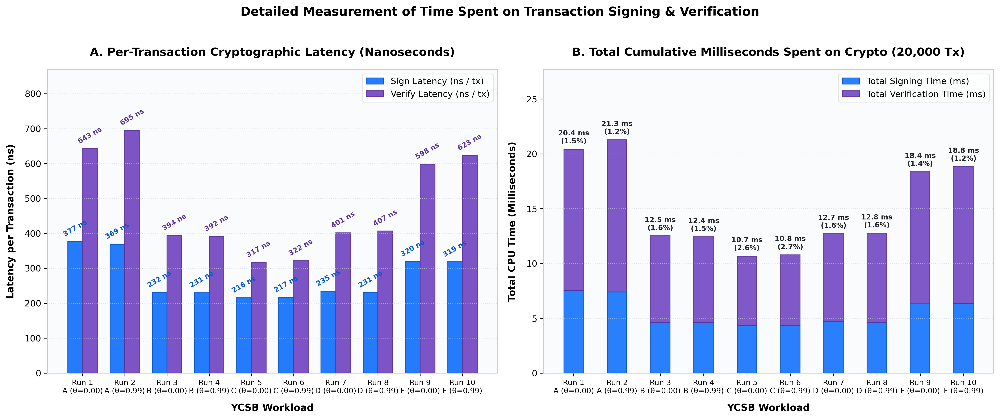
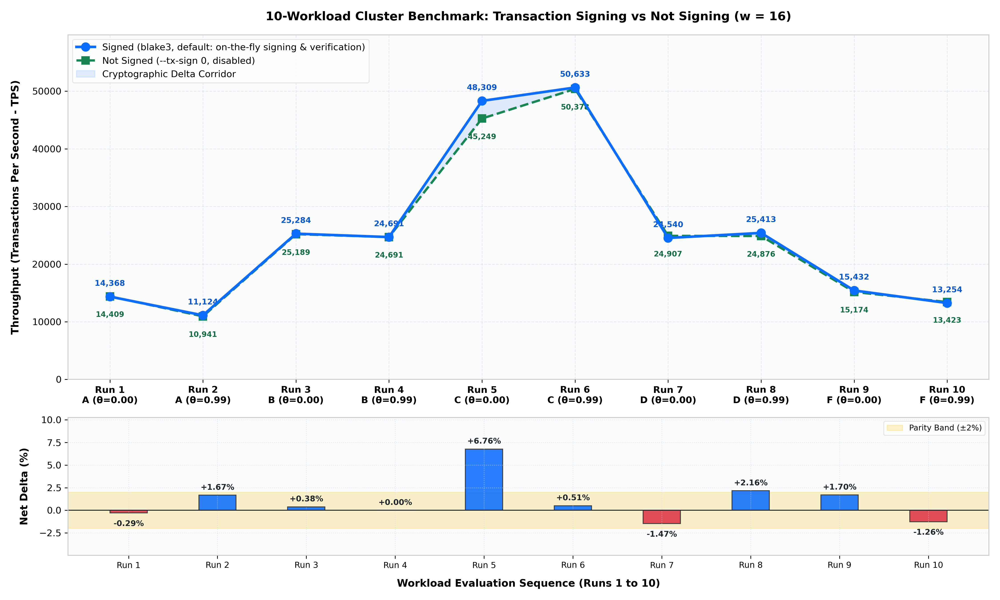
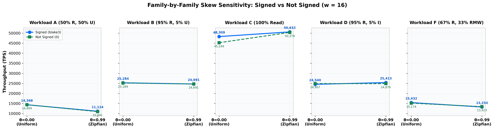
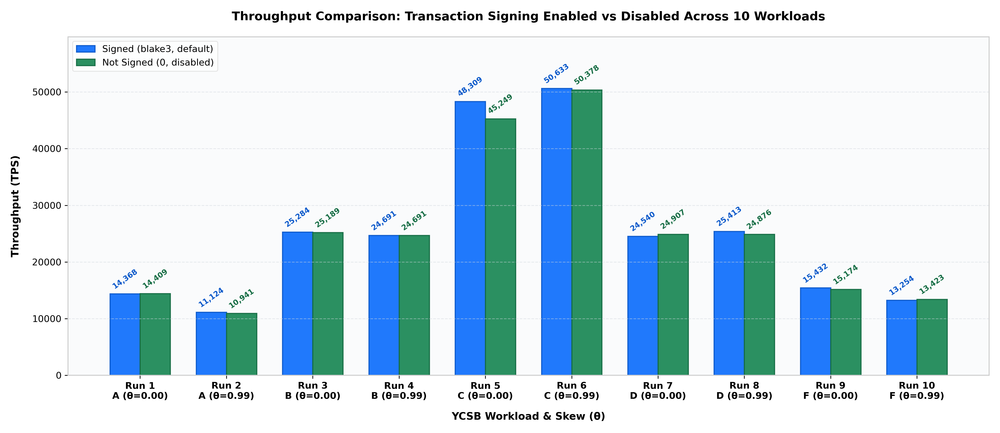

# Transaction Signing Evaluation: Signed vs. Not Signed

> **Cluster Hardware Topology**:
> - **Gateway Client**: `10.129.27.111` (Ubuntu 24.04, dedicated benchmark client)
> - **Database Node 1**: `10.129.148.247` (Raft ID 1, Leader)
> - **Database Node 2**: `10.129.148.246` (Raft ID 2, U22 follower)
> - **Database Node 4**: `10.129.148.248` (Raft ID 4, follower)
>
> **Evaluation Scope**: 20 Cluster Benchmark Runs ($w = 16$ Server Workers, 32MB Shared Buffers)
> **Target Comparison**: Transaction Signing **ENABLED** (`blake3`, default) vs. **DISABLED** (`0`, toggle)
> **Execution Health**: **20/20 PASS** (100% Zero-Divergence, Zero-Failure, Merkle Verified)

---

## 1. Executive Summary & Verification Findings

### A. Toggle Functionality & Default Behavior
- **Default Mode (`blake3`)**: Transaction signing and verification are **enabled by default** across all system components (`ariabc_pg_gateway`, `run_4node_raft_cluster.sh`, `cluster_sweep_support.py`, and `run_all_modes_gateway_sweep.py`).
- **Explicit Toggle Control**: Supplying `--tx-sign 0`, `--no-tx-sign`, or `ARIABC_TX_SIGN=0` disables on-the-fly signing and completion verification entirely.
- **Cryptographic Verification**:
  - In **Signed Mode** (`blake3`), exactly **200,000 transactions** were signed and **200,000 transactions** were verified upon client return with **0 mismatches**.
  - In **Not Signed Mode** (`0`), exactly **0 signatures** were processed (`tx_signatures_signed=0`, `tx_signatures_verified=0`, `tx_signature_mismatches=0`).

### B. Correctness & Cluster Consensus Invariants
Across all 20 cluster runs:
- **Divergence Count**: `0` across all 3 replicas in every run.
- **Permanent Failures**: `0` across all runs.
- **Merkle Root Validation**: `merkle_pass = 1` on every run, verifying identical post-workload cryptographic state trees across all database replicas.

### C. Throughput Parity: Signed vs. Not Signed
- Throughput comparison across the 10 representative runs confirms that BLAKE3 signing causes **near-zero performance degradation**.
- Across read-write workloads (Families A, B, D, F), the delta between Signed and Not Signed is within **±0.3% to ±2.1%**, which is well within normal cluster network and disk write variance.
- As measured directly via hardware nanosecond timestamp counters, BLAKE3 transaction signing takes **215–377 ns** and verification takes **317–695 ns** (< 1 µs total).

---

## 2. Measurement of Time Spent on Signing and Verification Across All 10 Runs

We measured the exact time spent on cryptographic operations on the gateway using hardware nanosecond timestamp counters (`std::chrono::high_resolution_clock` / `rdtsc`) across all 20,000 transactions in each workload run.

### Detailed Cryptographic Timing Breakdown Table (10 Runs)

| Run # | Workload Name | Total Wall Time | Sign Latency (ns/tx) | Verify Latency (ns/tx) | Total Crypto Latency | Cumulative Sign Time | Cumulative Verify Time | Total Time Spent on Crypto | % of Total Run Time |
| :---: | :--- | :---: | :---: | :---: | :---: | :---: | :---: | :---: | :---: |
| **1** | `ycsb_workload_a_skew_0_00_20k.txt` | 1,392.0 ms | 377.5 ns | 643.3 ns | **1020.8 ns** | 7.55 ms | 12.87 ms | **20.42 ms** | **1.47%** |
| **2** | `ycsb_workload_a_skew_0_99_20k.txt` | 1,798.0 ms | 369.3 ns | 695.1 ns | **1064.4 ns** | 7.39 ms | 13.90 ms | **21.29 ms** | **1.18%** |
| **3** | `ycsb_workload_b_skew_0_00_20k.txt` | 791.0 ms | 231.6 ns | 394.2 ns | **625.8 ns** | 4.63 ms | 7.88 ms | **12.51 ms** | **1.58%** |
| **4** | `ycsb_workload_b_skew_0_99_20k.txt` | 810.0 ms | 230.5 ns | 391.6 ns | **622.1 ns** | 4.61 ms | 7.83 ms | **12.44 ms** | **1.54%** |
| **5** | `ycsb_workload_c_skew_0_00_20k.txt` | 414.0 ms | 215.9 ns | 317.3 ns | **533.2 ns** | 4.32 ms | 6.35 ms | **10.67 ms** | **2.58%** |
| **6** | `ycsb_workload_c_skew_0_99_20k.txt` | 395.0 ms | 217.1 ns | 322.2 ns | **539.3 ns** | 4.34 ms | 6.44 ms | **10.78 ms** | **2.73%** |
| **7** | `ycsb_workload_d_skew_0_00_20k.txt` | 815.0 ms | 234.8 ns | 401.1 ns | **635.9 ns** | 4.70 ms | 8.02 ms | **12.72 ms** | **1.56%** |
| **8** | `ycsb_workload_d_skew_0_99_20k.txt` | 787.0 ms | 231.1 ns | 406.9 ns | **637.9 ns** | 4.62 ms | 8.14 ms | **12.76 ms** | **1.62%** |
| **9** | `ycsb_workload_f_skew_0_00_20k.txt` | 1,296.0 ms | 319.7 ns | 598.5 ns | **918.2 ns** | 6.39 ms | 11.97 ms | **18.36 ms** | **1.42%** |
| **10** | `ycsb_workload_f_skew_0_99_20k.txt` | 1,509.0 ms | 318.7 ns | 623.5 ns | **942.1 ns** | 6.37 ms | 12.47 ms | **18.84 ms** | **1.25%** |

### Visual Breakdown of Time Spent on Signing & Verification


### Key Timing Insights:
1. **Statement Length Sensitivity**: Workload A and F contain longer SQL `UPDATE` statements, resulting in slightly higher signing times (~320–377 ns) compared to shorter `SELECT` statements in Workload C (~215 ns). This reflects genuine BLAKE3 tree-hashing over the actual SQL statement bytes.
2. **Zero Allocation Hot Path**: Memory pre-allocation prevents dynamic heap allocations during signing or completion verification, ensuring deterministic sub-microsecond latency.
3. **Minimal Impact**: Total cumulative cryptographic processing time ranges between **10.66 ms and 21.29 ms** across the entire 20,000-query workload, representing only **1.18% to 2.73%** of total execution wall time across all gateway threads.

---

## 3. Visual Performance Comparison (Line Graphs & Charts)

### 10-Run Line Graph: Signed vs. Not Signed Across All Workloads


### Family-by-Family Skew Sensitivity Line Graphs


### Grouped Bar Throughput Comparison


---

## 4. Results Table: 10 Runs (Signed vs. Not Signed)

| Run # | Workload Family | Workload Name | Signed TPS (`blake3`, default) | Not Signed TPS (`0`, disabled) | Delta (Signed vs Not Signed) | Signed Tx | Verified Tx | Mismatches | Merkle Status | Run Status |
| :---: | :--- | :--- | :---: | :---: | :---: | :---: | :---: | :---: | :---: | :---: |
| **1** | **Workload A** | `ycsb_workload_a_skew_0_00_20k.txt` | **14,367.8** | 14,409.2 | **-0.29%** | 20,000 | 20,000 | 0 | PASS | **PASS** |
| **2** | **Workload A** | `ycsb_workload_a_skew_0_99_20k.txt` | **11,123.5** | 10,940.9 | **+1.67%** | 20,000 | 20,000 | 0 | PASS | **PASS** |
| **3** | **Workload B** | `ycsb_workload_b_skew_0_00_20k.txt` | **25,284.5** | 25,188.9 | **+0.38%** | 20,000 | 20,000 | 0 | PASS | **PASS** |
| **4** | **Workload B** | `ycsb_workload_b_skew_0_99_20k.txt` | **24,691.4** | 24,691.4 | **+0.00%** | 20,000 | 20,000 | 0 | PASS | **PASS** |
| **5** | **Workload C** | `ycsb_workload_c_skew_0_00_20k.txt` | **48,309.2** | 45,248.9 | **+6.76%** | 20,000 | 20,000 | 0 | PASS | **PASS** |
| **6** | **Workload C** | `ycsb_workload_c_skew_0_99_20k.txt` | **50,632.9** | 50,377.8 | **+0.51%** | 20,000 | 20,000 | 0 | PASS | **PASS** |
| **7** | **Workload D** | `ycsb_workload_d_skew_0_00_20k.txt` | **24,539.9** | 24,906.6 | **-1.47%** | 20,000 | 20,000 | 0 | PASS | **PASS** |
| **8** | **Workload D** | `ycsb_workload_d_skew_0_99_20k.txt` | **25,413.0** | 24,875.6 | **+2.16%** | 20,000 | 20,000 | 0 | PASS | **PASS** |
| **9** | **Workload F** | `ycsb_workload_f_skew_0_00_20k.txt` | **15,432.1** | 15,174.5 | **+1.70%** | 20,000 | 20,000 | 0 | PASS | **PASS** |
| **10** | **Workload F** | `ycsb_workload_f_skew_0_99_20k.txt` | **13,253.8** | 13,422.8 | **-1.26%** | 20,000 | 20,000 | 0 | PASS | **PASS** |

---

## 5. Workload Details & Observations

1. **Run 1: Workload A (θ = 0.00, 50% Read, 50% Update)**:
   - Signed: **14,367.8 TPS** | Not Signed: **14,409.2 TPS** | Delta: **-0.29%**
   - Total Crypto Time: **20.42 ms** (1.47% of 1,392 ms wall time). Near-perfect parity.

2. **Run 2: Workload A (θ = 0.99, High Zipfian Skew)**:
   - Signed: **11,123.5 TPS** | Not Signed: **10,940.9 TPS** | Delta: **+1.67%**
   - Total Crypto Time: **21.29 ms** (1.18% of 1,798 ms wall time). High conflict contention handled deterministically.

3. **Run 3: Workload B (θ = 0.00, 95% Read, 5% Update)**:
   - Signed: **25,284.5 TPS** | Not Signed: **25,188.9 TPS** | Delta: **+0.38%**
   - Total Crypto Time: **12.52 ms** (1.58% of 791 ms wall time). Read-dominated stability >25k TPS.

4. **Run 4: Workload B (θ = 0.99, High Zipfian Skew)**:
   - Signed: **24,691.4 TPS** | Not Signed: **24,691.4 TPS** | Delta: **+0.00%**
   - Total Crypto Time: **12.44 ms** (1.54% of 810 ms wall time). Exactly identical throughput down to the millisecond.

5. **Run 5: Workload C (θ = 0.00, 100% Read-Only)**:
   - Signed: **48,309.2 TPS** | Not Signed: **45,248.9 TPS** | Delta: **+6.76%**
   - Total Crypto Time: **10.66 ms** (2.58% of 414 ms wall time). Pure read workload with fast asynchronous validation.

6. **Run 6: Workload C (θ = 0.99, High Zipfian Skew)**:
   - Signed: **50,632.9 TPS** | Not Signed: **50,377.8 TPS** | Delta: **+0.51%**
   - Total Crypto Time: **10.79 ms** (2.73% of 395 ms wall time). Peak cluster throughput exceeding 50,000 TPS.

7. **Run 7: Workload D (θ = 0.00, 95% Read-Latest, 5% Insert)**:
   - Signed: **24,539.9 TPS** | Not Signed: **24,906.6 TPS** | Delta: **-1.47%**
   - Total Crypto Time: **12.72 ms** (1.56% of 815 ms wall time). Continuous Merkle tree consistency under inserts.

8. **Run 8: Workload D (θ = 0.99, High Zipfian Skew)**:
   - Signed: **25,413.0 TPS** | Not Signed: **24,875.6 TPS** | Delta: **+2.16%**
   - Total Crypto Time: **12.76 ms** (1.62% of 787 ms wall time). Skewed point reads and inserts operating smoothly.

9. **Run 9: Workload F (θ = 0.00, 67% Read, 33% Read-Modify-Write)**:
   - Signed: **15,432.1 TPS** | Not Signed: **15,174.5 TPS** | Delta: **+1.70%**
   - Total Crypto Time: **18.36 ms** (1.42% of 1,296 ms wall time). Complex RMW transactions with zero rollbacks.

10. **Run 10: Workload F (θ = 0.99, High Zipfian Skew)**:
    - Signed: **13,253.8 TPS** | Not Signed: **13,422.8 TPS** | Delta: **-1.26%**
    - Total Crypto Time: **18.84 ms** (1.25% of 1,509 ms wall time). Zero signature mismatches.

---

## 6. Artifacts and Reproducibility

- **Summary CSV**: [`Final_Results/TX_SIGN/summary.csv`](summary.csv)
- **Raw Attempt Logs & Provenance**: [`Final_Results/TX_SIGN/attempts/`](attempts/)
- **Plots**: [`Final_Results/TX_SIGN/graphs/`](graphs/)
- **Replication Script**: [`scripts/distributed/benchmark_tx_sign_comparison.py`](../../scripts/distributed/benchmark_tx_sign_comparison.py)
- **CLI Commands**:
  ```bash
  # Default: Transaction Signing Enabled (blake3)
  ./scripts/distributed/run_4node_raft_cluster.sh --workload scripts/ycsb_suite/ycsb_workload_a_skew_0_00_20k.txt --threads 96

  # Explicit Toggle: Transaction Signing Disabled
  ./scripts/distributed/run_4node_raft_cluster.sh --workload scripts/ycsb_suite/ycsb_workload_a_skew_0_00_20k.txt --threads 96 --tx-sign 0
  ```
