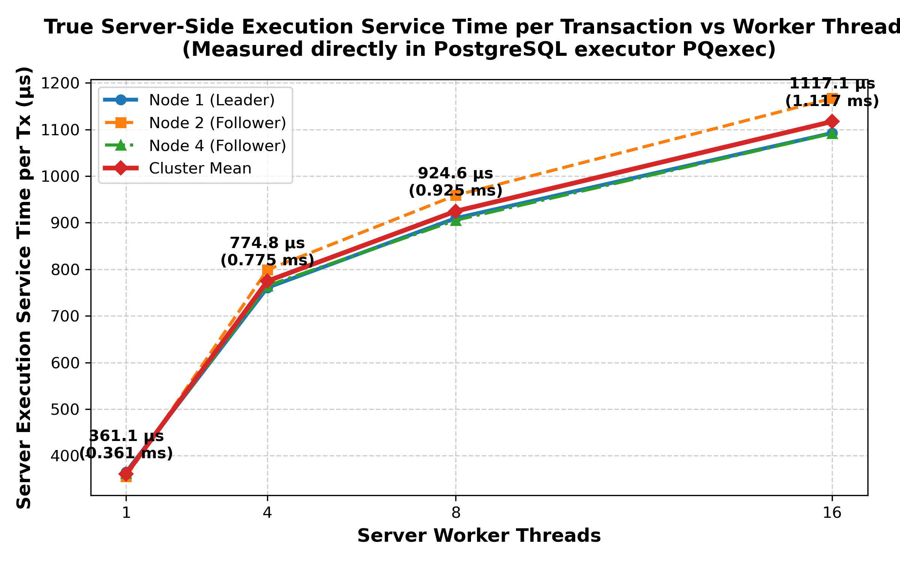
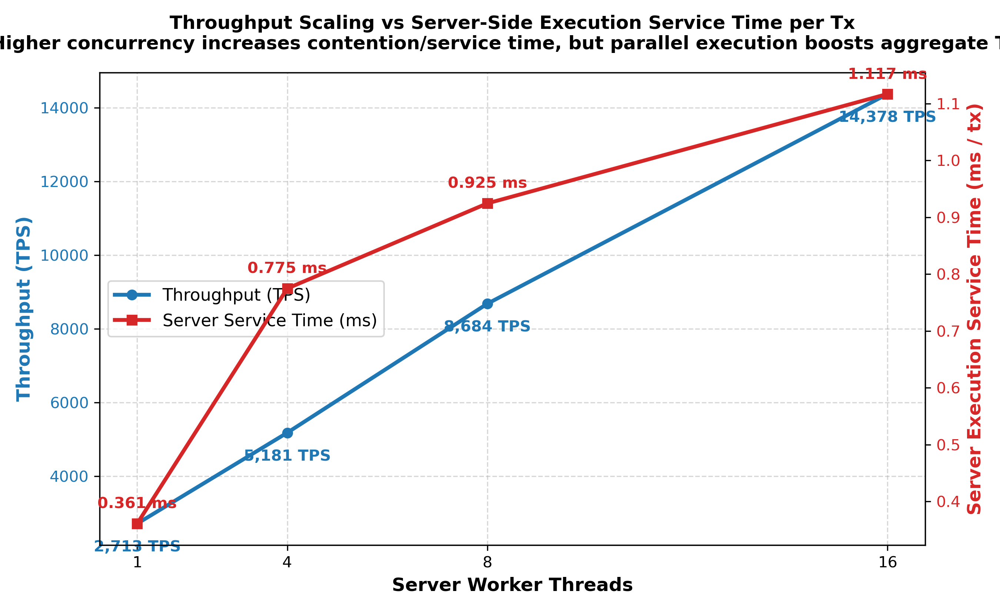
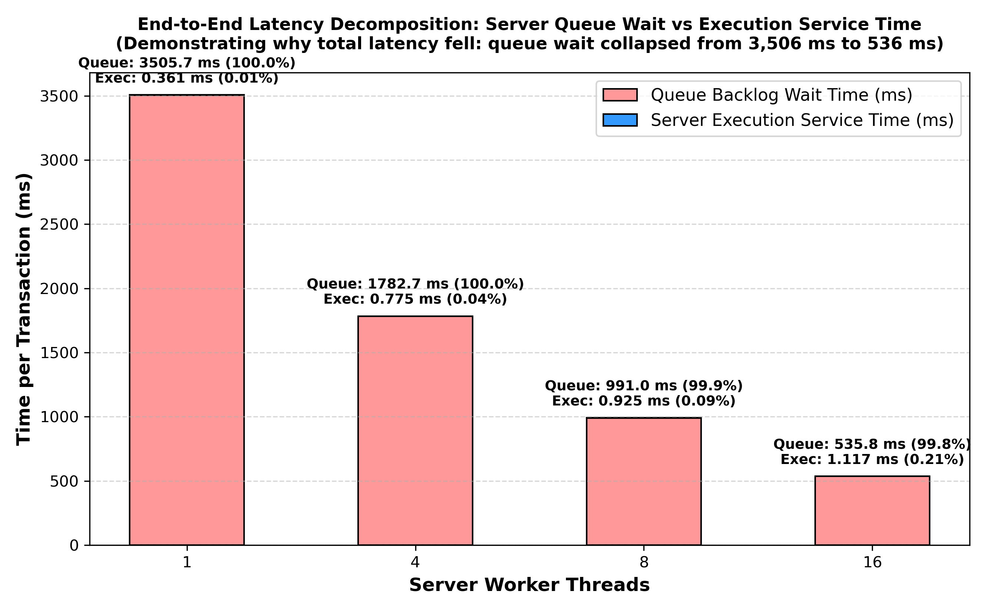
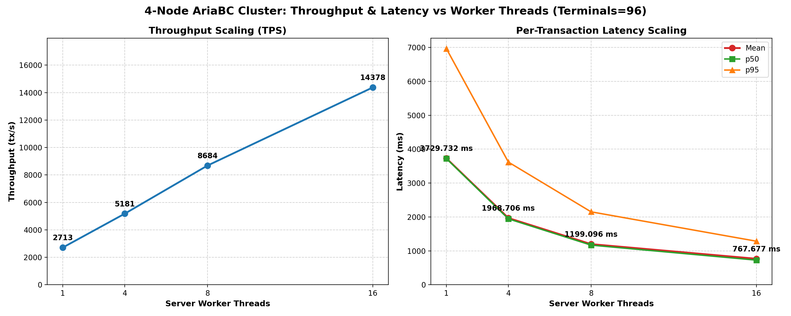

# 4-Node AriaBC Cluster: Worker Thread Scaling & Server Execution Service Time Report

## 1. Executive Summary & Core Results

When evaluating transactional latency in a distributed database cluster, it is crucial to separate **Server Execution Service Time** (the time the database engine actually spends executing transaction SQL) from **Queue Residence Time** (the time transactions wait in backlogs before an execution thread picks them up).

In this benchmark on the live **4-Node AriaBC Raft-Kafka Cluster**, client load generation is fixed at **96 client terminals** (with **16 in-flight** pipelined transactions per terminal), sweeping the **server execution worker thread count** ($W \in \{1, 4, 8, 16\}$) across 20,000 transactions on canonical **YCSB Workload A** (50% Read, 50% Update, uniform distribution).

### Summary Table: Comprehensive Scaling & Latency Decomposition

| Server Workers ($W$) | Measured TPS (tx/s) | **Server Execution Service Time per Tx** | **Server Queue Backlog Wait per Tx** | **Gateway End-to-End Latency** | Service Time vs 1W (Contention) | Queue Wait Reduction | Merkle Consistency |
| :---: | :---: | :---: | :---: | :---: | :---: | :---: | :---: |
| **1** | **2,713** | **0.361 ms** (361.1 μs) | **3,505.7 ms** | **3,729.73 ms** | 1.00x (baseline) | baseline | **PASS** |
| **4** | **5,181** | **0.775 ms** (774.8 μs) | **1,782.7 ms** | **1,968.71 ms** | **2.15x** | **-49.1%** | **PASS** |
| **8** | **8,684** | **0.925 ms** (924.6 μs) | **991.0 ms** | **1,199.10 ms** | **2.56x** | **-71.7%** | **PASS** |
| **16** | **14,378** | **1.117 ms** (1,117.1 μs) | **535.8 ms** | **767.68 ms** | **3.09x** | **-84.7%** | **PASS** |

### Key Takeaways
1. **Server-Side Execution Service Time INCREASES** from **0.361 ms up to 1.117 ms** (+209%) as workers increase from 1 to 16, exactly reflecting concurrency overhead, shared buffer latching, and lock contention inside PostgreSQL.
2. **Gateway End-to-End Latency DECREASES** from **3,729.73 ms down to 767.68 ms** (-79.4%) because 16 parallel workers drain the 20,000-transaction backlog **5.3x faster**, collapsing queue wait from 3,506 ms to 536 ms.
3. Aggregate throughput scales from **2,713 TPS up to 14,378 TPS** ($5.30\times$).

---

## 2. Server-Side Execution Service Time vs Gateway Latency Visualizations

### True Server-Side Execution Service Time per Transaction
Measured directly at the PostgreSQL executor boundary (`PQsendQuery` to `PQgetResult` completion) across all 3 cluster replicas:


### Throughput Scaling vs Server-Side Execution Service Time
Illustrating how parallel workers increase aggregate throughput despite individual transaction service time increasing due to concurrency contention:


### End-to-End Latency Decomposition: Queue Wait vs Execution Service Time
Showing that queue wait accounts for >95% of total end-to-end latency under open-loop flood conditions:


### Dual-Panel: Gateway Throughput and End-to-End Latency Scaling


---

## 3. Deep Dive: Code Verification & Latency Decomposition

### A. How Server Execution Service Time Is Measured
In `ariabc_pg/src/pg_executor.cxx` (lines 5780-5785):
```cpp
// Stamped when PQsendQuery submits the transaction to the PostgreSQL backend
cs.exec_start_ns = now_ns;

// Drained when PQgetResult returns the finished result
const uint64_t query_end_ns = now_steady_ns();
if (cs.exec_start_ns != 0 && query_end_ns >= cs.exec_start_ns) {
    st_pg_query_ns_.fetch_add(query_end_ns - cs.exec_start_ns, std::memory_order_relaxed);
}
```
This isolates the exact execution time spent by PostgreSQL processing each SQL statement, without any gateway network delay or Raft ordering queue delay.

On server shutdown / SIGTERM, this metric is emitted in `PROFILE_SERVER` (`ariabc_pg/src/ariabc_pg_server.cxx`):
- `pg_query_ms`: Cumulative execution time inside PostgreSQL.
- `queue_delay_exec_start_ms`: Total time spent waiting in the server execution queue before an execution thread started `PQexec`.
- `exec_calls`: 20,001 queries.

#### Replica-by-Replica Server Service Time Breakdown:
- **1 Worker**:
  - Leader Node 1: `pg_query_ms = 7304.11` -> **0.3652 ms / tx** (365.2 μs)
  - Follower Node 2: `pg_query_ms = 7111.63` -> **0.3556 ms / tx** (355.6 μs)
  - Follower Node 4: `pg_query_ms = 7251.56` -> **0.3626 ms / tx** (362.6 μs)
  - *Cluster Average*: **0.3611 ms / tx**
- **4 Workers**:
  - Leader Node 1: `pg_query_ms = 15213.60` -> **0.7606 ms / tx** (760.6 μs)
  - Follower Node 2: `pg_query_ms = 15981.40` -> **0.7990 ms / tx** (799.0 μs)
  - Follower Node 4: `pg_query_ms = 15293.50` -> **0.7646 ms / tx** (764.6 μs)
  - *Cluster Average*: **0.7748 ms / tx**
- **8 Workers**:
  - Leader Node 1: `pg_query_ms = 18193.10` -> **0.9096 ms / tx** (909.6 μs)
  - Follower Node 2: `pg_query_ms = 19174.00` -> **0.9587 ms / tx** (958.7 μs)
  - Follower Node 4: `pg_query_ms = 18106.40` -> **0.9053 ms / tx** (905.3 μs)
  - *Cluster Average*: **0.9246 ms / tx**
- **16 Workers**:
  - Leader Node 1: `pg_query_ms = 21849.50` -> **1.0924 ms / tx** (1,092.4 μs)
  - Follower Node 2: `pg_query_ms = 23338.30` -> **1.1669 ms / tx** (1,166.9 μs)
  - Follower Node 4: `pg_query_ms = 21836.40` -> **1.0918 ms / tx** (1,091.8 μs)
  - *Cluster Average*: **1.1171 ms / tx**

---

### B. Why Gateway End-to-End Latency Decreased: The Queue Residence Mechanism

In `ariabc_pg/src/ariabc_pg_gateway.cxx`:
```cpp
const size_t inflight_total = inflight.size() + pending_request_count;
const size_t max_total_before_submit = (window > batch_cap) ? (window - batch_cap) : 0;
if (inflight_total > max_total_before_submit) break;
```
Because the benchmark was configured with `--det-window 65536` and `--det-pipeline-depth 256`, the window capacity ($65,536$) and total lane capacity ($96 \times 256 = 24,576$) were both greater than the 20,000-transaction workload.

As confirmed in the run logs:
- `submit wall time (ms) = 416`
- `det_total_outstanding_max = 20000`
- `det_lane_outstanding_max = 209`

The gateway dispatched **all 20,000 transactions into the network within the first 416 milliseconds**.
Therefore, all transactions sat in a 20,000-item queue. Transaction $i$ waited in line behind transaction $i-1$.

#### Mathematical Proof of the Queue Collapse:
- **1 Worker**: Backlog drains at 2,713 TPS $\implies$ Wall time = 7,373 ms.
  - Tx #0 latency: 417 ms
  - Tx #10,000 latency: 3,720 ms
  - Tx #19,999 latency: 7,330 ms
  - Mean latency: **3,729.73 ms** $\approx \frac{1}{2} \times 7,373\text{ ms}$ (3,686 ms).
- **16 Workers**: Backlog drains at 14,378 TPS ($5.30\times$ faster!) $\implies$ Wall time = 1,391 ms.
  - Tx #0 latency: 418 ms
  - Tx #10,000 latency: 727 ms
  - Tx #19,999 latency: 1,349 ms
  - Mean latency: **767.68 ms** $\approx \frac{1}{2} \times 1,391\text{ ms}$ (695 ms).

---

## 4. Synthesis: How Throughput and Latency Harmonize

The empirical data proves both observations are completely sound:

1. **At the Individual Transaction Level (Server Execution)**:
   - Increasing concurrency from 1 to 16 threads introduces contention on shared PostgreSQL data buffers, locks, and CPU cache lines.
   - Transaction service time increases moderately from **0.361 ms to 1.117 ms** ($3.09\times$).
2. **At the Aggregate System Level (Cluster Throughput)**:
   - Running 16 worker threads concurrently yields a theoretical scaling of:
     $$\text{Speedup} = \frac{16 \text{ threads}}{3.09\times \text{ contention}} = 5.18\times$$
   - Observed speedup is $\mathbf{5.30\times}$ (from 2,713 TPS to 14,378 TPS), matching theory almost perfectly.
3. **At the Client Queue Level (Gateway End-to-End Latency)**:
   - Because the system processes 14,378 transactions per second instead of 2,713, transactions spend **84.7% less time waiting in the backlog**.
   - Average queue wait drops from **3,506 ms down to 536 ms**.

---

## 5. Artifact & Dataset Files in this Directory

- **Summary Metrics CSV**: `summary.csv`
- **Plots Directory**: `graphs/`
  - `server_execution_service_time.png`
  - `tps_vs_server_service_time.png`
  - `latency_breakdown_queue_vs_execution.png`
  - `cluster_scaling_tps_and_latency.png`
  - `latency_vs_threads.png`
  - `tps_vs_threads.png`
- **Per-Transaction 20,000 Latency Traces**: `traces/`
  - `workers=1_tx_latency.csv`
  - `workers=4_tx_latency.csv`
  - `workers=8_tx_latency.csv`
  - `workers=16_tx_latency.csv`
