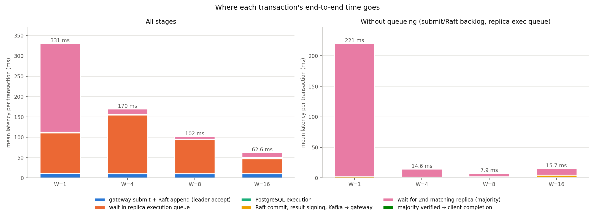
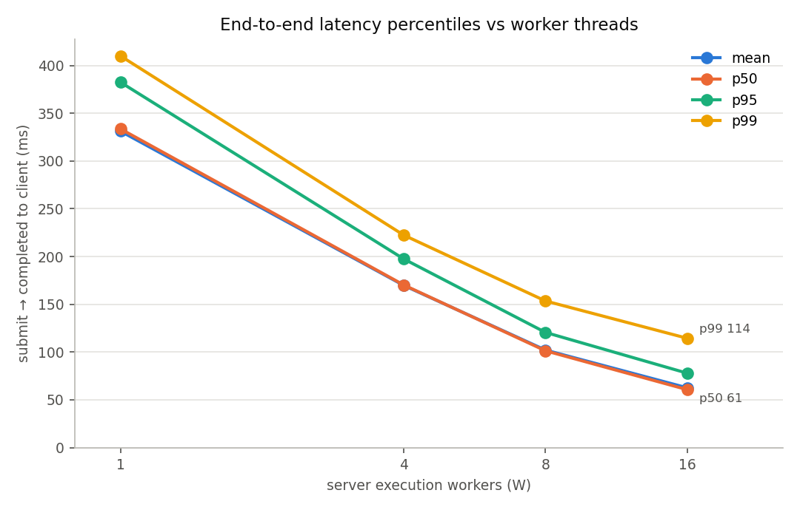
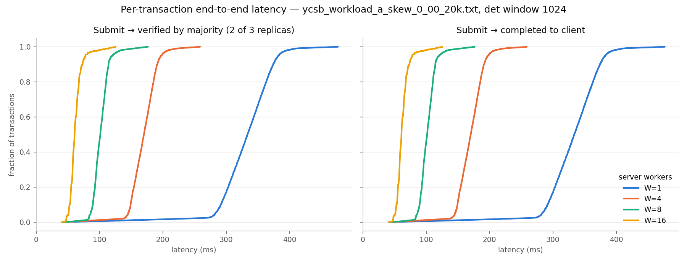
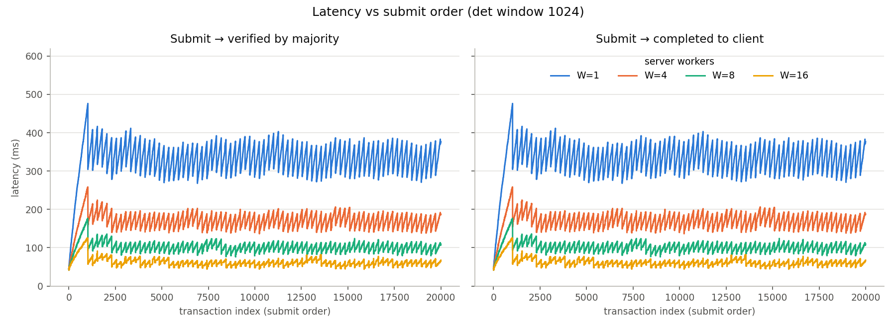
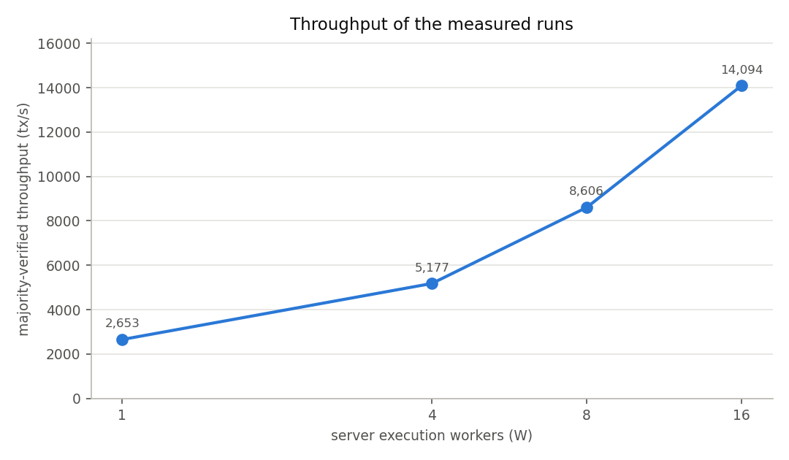
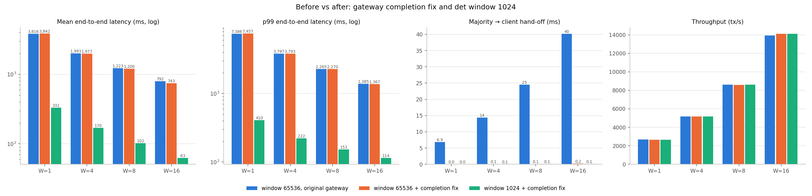
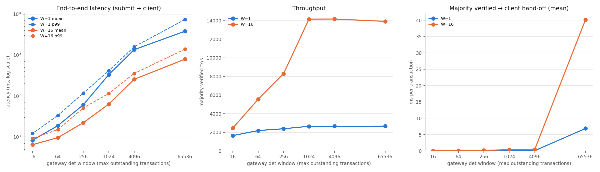
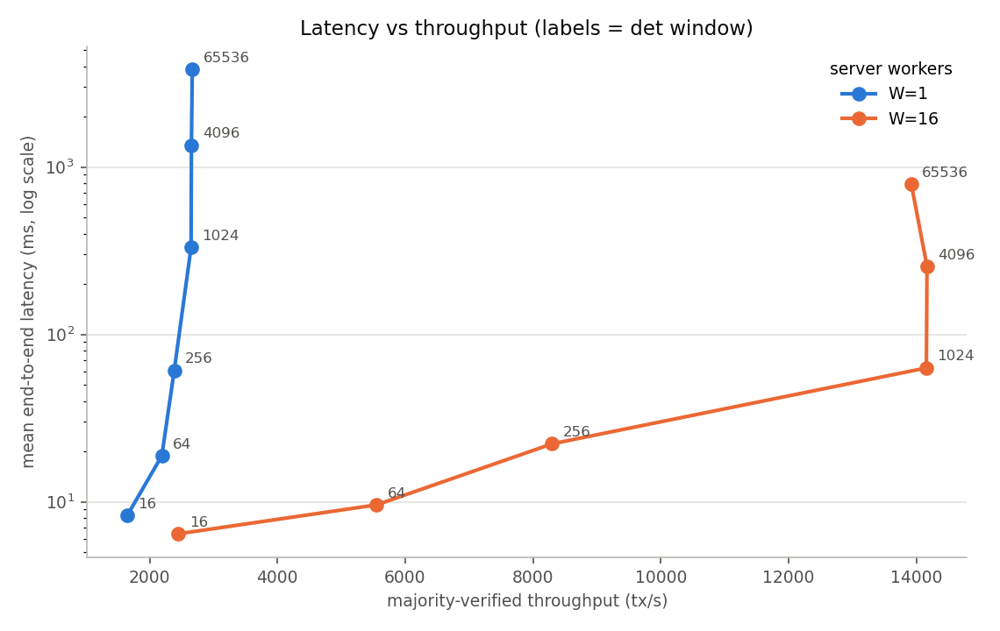
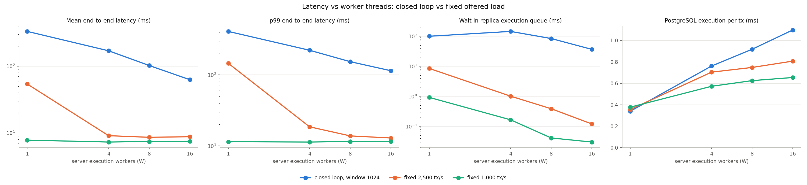

# Per-Transaction End-to-End Latency vs Worker Threads (3-replica AriaBC cluster)

Every transaction is timed individually. The clock starts when the gateway
submits it and stops when its result has been **verified by a majority of
replicas** and handed back to the client as complete.

Measured 2026-10-06 on the live cluster:
- Replicas: node 1 admin123 .247 (Raft leader), node 2 user4 .246, node 4 utkarsh .248.
- Gateway: .111.

## Headline (det window 1024, fixed gateway, median of 3 trials)

| W | TPS (3 trials) | Mean e2e | p50 | p95 | p99 | Max | Min |
|---:|---:|---:|---:|---:|---:|---:|---:|
| 1 | 2,653 (2,646–2,657) | **331 ms** (330.6–331.7) | 334 | 382 | 410 | 476 | 44 |
| 4 | 5,177 (5,175–5,195) | **170 ms** (169.2–169.9) | 170 | 197 | 222 | 258 | 41 |
| 8 | 8,606 (8,554–8,621) | **102 ms** (102.1–102.6) | 101 | 121 | 153 | 176 | 42 |
| 16 | 14,094 (14,094–14,164) | **63 ms** (62.3–63.2) | 61 | 78 | 114 | 125 | 42 |

The percentiles and the min/max come from the representative trial, which is
the median-TPS trial of each W. The ranges in brackets span all 3 trials.

All 12 runs passed with Merkle PASS, 0 divergences, 0 failures, and all 3
replica results received for all 20,000 transactions.

Throughput is the same as the original 65,536-window configuration, mean
latency is 11.5–12.7× lower, and p99 is 12–18× lower. See [Before vs after](#before-vs-after).

## Configuration

Runs use the `Final_Results/YCSB` cluster command (`../YCSB/command.txt`),
with three changes:
- cluster mode only
- one workload: YCSB-A (50% read / 50% update), uniform keys, 20,000 transactions
- det window 1024 (the YCSB campaign used 65,536). 1024 is now the default in the gateway and in every benchmark script; the runs below set it explicitly via `CLUSTER_DET_WINDOW=1024`.

`run_final.sh` is the exact driver:

```
CLUSTER_DET_WINDOW=1024 python3 -u scripts/distributed/run_all_modes_gateway_sweep.py --benchmark ycsb \
  --gateway-host 10.129.27.111 --gateway-user neel --gateway-repo /home/neel/ARIABC/AriaBC \
  --db-host 10.129.148.247 --db-user neel --db-port 5438 --server-port 8000 \
  --workloads scripts/ycsb_suite/ycsb_workload_a_skew_0_00_20k.txt --workers 1,4,8,16 \
  --modes cluster --run-cluster --db-shared-buffers 32MB --cold-runs --order-seed 42 --trials 3 --out-dir <dir>
```

Every case otherwise uses the YCSB settings:
- **Ordering and completion:** raft-kafka ordering, leader-assigned Raft batching (64 entries / 1 ms linger), `majority_async_all3` completion.
- **Client:** 96 terminals × 16 in-flight, 256-tx det batches.
- **Server:** `server-exec-workers = pool = bcdb-workers = W`, Merkle index on, BLAKE3 tx signing, 32MB shared buffers, cold restart per case.

The gateway binary includes the completion fix described below.

## How each transaction is timed

The gateway stamps every transaction on its own steady clock. No cross-machine
clocks are involved.

| Stamp | Meaning |
|---|---|
| submit | gateway submits the transaction to the Raft leader |
| accept | leader's ACK read back (Raft append accepted) |
| first result | first replica's signed result consumed from Kafka |
| **majority verified** | 2nd replica's result with a matching signed hash arrives → majority (2 of 3) verified |
| all results | 3rd replica's result (asynchronous audit, not on the client path) |
| **client completion** | gateway marks the transaction complete to the client |

**End-to-end latency** runs from submit to client completion.

Two stages come from the replicas' own `PROFILE_SERVER` counters, measured on
each node's own clock and averaged per transaction:
- the replica execution-queue wait
- PostgreSQL execution time

The breakdown uses the fastest replica, which is the one that delivers the
first result. "Raft commit, result signing, Kafka → gateway" is what remains of
the accept → first-result interval after subtracting those two.

## Where the time goes (mean per transaction, representative trial)

| Stage | W=1 | W=4 | W=8 | W=16 |
|---|---:|---:|---:|---:|
| gateway submit + Raft append (leader accept) | 11.0 | 10.5 | 10.5 | 10.4 |
| wait in replica execution queue (fastest replica) | 99.7 | 144.7 | 83.7 | 36.5 |
| PostgreSQL execution | 0.34 | 0.76 | 0.92 | 1.10 |
| Raft commit, result signing, Kafka → gateway | 1.5 | 0.8 | 1.0 | 3.4 |
| wait for 2nd matching replica (majority) | 218.7 | 13.0 | 5.9 | 11.1 |
| majority verified → client completion | 0.05 | 0.06 | 0.09 | 0.13 |
| **end-to-end** | **331.3** | **169.7** | **102.1** | **62.6** |

Replica execution-queue wait per transaction, by node (ms):

| W | node 1 (leader) | node 2 | node 4 |
|---:|---:|---:|---:|
| 1 | 318 | 100 | 645 |
| 4 | 155 | 145 | 231 |
| 8 | 86 | 84 | 129 |
| 16 | 48 | 37 | 182 |







### Reading the results

- **Queueing still dominates, but it is bounded.**
  - With at most 1,024 transactions outstanding, Little's law gives latency ≈ 1024 / TPS: 386 / 198 / 119 / 73 ms predicted, against 331 / 170 / 102 / 63 ms measured.
  - Adding workers raises the drain rate, so latency falls 5.3× from W=1 to W=16.
  - Throughput scales 5.3× over the same range.
- **The transaction's own work is a few milliseconds.** PostgreSQL execution takes 0.3–1.1 ms; it grows with W through contention. Raft commit, result signing and the Kafka hop together take 1–3 ms.
- **The majority waits for the second-fastest replica.**
  - At W=1 the replicas drain at different speeds: node 2 has 100 ms of queue, node 1 has 318 ms, node 4 has 645 ms. The quorum therefore waits about 219 ms for node 1.
  - At W ≥ 4 the second matching result arrives 6–13 ms after the first.
  - Node 4 (utkarsh) is the slowest replica at every W, and the majority never needs it.
- **The hand-off to the client is now 0.05–0.13 ms** at every W (p99 ≤ 0.56 ms, max < 2 ms).
- **Startup ramp:** the first ~1,024 transactions are admitted at once. Their latency ramps up to the steady-state band and then settles into a sawtooth that follows the 256-tx det batches (`e2e_latency_vs_queue_position.png`). The first verified result arrives 41–44 ms after submit.

## Before vs after

Same workload and W, YCSB config. Window 65,536 was the original YCSB setting.

| Config | W | TPS | Mean e2e | p99 e2e | Majority → client |
|---|---:|---:|---:|---:|---:|
| window 65,536, original gateway | 1 | 2,668 | 3,816 ms | 7,386 ms | 6.9 ms |
| | 4 | 5,167 | 1,993 ms | 3,797 ms | 14.3 ms |
| | 8 | 8,606 | 1,223 ms | 2,265 ms | 24.5 ms |
| | 16 | 13,918 | 792 ms | 1,385 ms | 40.1 ms |
| window 65,536 + completion fix | 1 | 2,643 | 3,842 ms | 7,457 ms | 0.04 ms |
| | 4 | 5,171 | 1,977 ms | 3,793 ms | 0.06 ms |
| | 8 | 8,569 | 1,200 ms | 2,270 ms | 0.09 ms |
| | 16 | 14,094 | 743 ms | 1,367 ms | 0.18 ms |
| **window 1,024 + completion fix** | 1 | 2,653 | **331 ms** | **410 ms** | 0.05 ms |
| | 4 | 5,177 | **170 ms** | **222 ms** | 0.06 ms |
| | 8 | 8,606 | **102 ms** | **153 ms** | 0.09 ms |
| | 16 | 14,094 | **63 ms** | **114 ms** | 0.13 ms |



There are two separate effects.

1. **The completion fix removes the hand-off delay.**
   - The original gateway sent all 20,000 transactions in 39 ms, then spent until about 418 ms blocked reading leader ACKs, one batch at a time. Only after that did it hand any verified result back to the client.
   - At W=16, about 4,500 transactions were already verified during that time and waited about 175 ms each, which produced the 40 ms average.
   - The fixed gateway does two things differently. It hands back already-verified results on every submit/ACK-loop iteration (`harvest_ready_majorities`, a non-blocking `vote_store::try_pop_any_majority_batch`). It also polls rather than blocks on leader ACKs once nothing is left to submit.
   - Result: the hand-off drops to 0.04–0.18 ms, and the first client completion arrives at about 42 ms instead of about 418 ms.
   - Mean latency barely changes at 65,536, because the queue still dominates there.
2. **Window 1,024 removes the excess queue.** It keeps the same throughput and cuts mean latency 11.5–12.7× and p99 12–18×.

## Window sweep (how 1,024 was chosen)

YCSB-A θ=0 at W=1 and W=16, with windows 16 … 65,536, one trial each.
Everything else is the YCSB config. These runs used the gateway before the
completion fix. That only affects the 65,536 point: below the workload size,
the window itself forces timely completion, and the hand-off was already
≤ 0.4 ms there.

| W | Window | TPS | Mean e2e | p99 e2e |
|---:|---:|---:|---:|---:|
| 16 | 65,536 | 13,918 | 792 ms | 1,385 ms |
| 16 | 4,096 | 14,164 | 255 ms | 355 ms |
| 16 | **1,024** | **14,154** | **63 ms** | **115 ms** |
| 16 | 256 | 8,299 | 22 ms | 51 ms |
| 16 | 64 | 5,551 | 9.6 ms | 15 ms |
| 16 | 16 | 2,449 | 6.4 ms | 9.2 ms |
| 1 | 65,536 | 2,668 | 3,816 ms | 7,386 ms |
| 1 | 4,096 | 2,655 | 1,351 ms | 1,590 ms |
| 1 | **1,024** | **2,649** | **331 ms** | **411 ms** |
| 1 | 256 | 2,385 | 61 ms | 117 ms |
| 1 | 64 | 2,192 | 19 ms | 34 ms |
| 1 | 16 | 1,648 | 8.3 ms | 12 ms |




- Above about 1,024 outstanding, a larger window only lengthens the queue. Latency ≈ outstanding / TPS, with no throughput gain.
- Below about 1,024, throughput drops: W=16 loses 41% at window 256 and keeps 17% at window 16. Too few transactions are in flight to fill the Raft batches, the 256-tx det blocks and 16 workers.
- 1,024 is the knee: full throughput at every W, with the lowest latency that keeps it. The floor for a single in-flight trickle is about 6–8 ms end-to-end (window 16).

Design conclusion:
- Admitting the whole workload (window 65,536 ≥ 20,000 transactions) is a throughput-only benchmark setting. It inflates latency without adding throughput.
- The right design bounds outstanding transactions near the knee: target throughput × target latency, about 1,024 here, ideally adapted at runtime.
- The gateway must hand back verified results continuously. It now does.
- The YCSB throughput results remain valid, since window 1,024 matches them. Latency should be quoted from the bounded-window runs in this folder.

## Why does latency fall as worker threads increase?

The intuition is that more worker threads mean more contention, so each
transaction should get slower. That is correct for the work a transaction
does. It is not what the headline numbers measure.

**1. Per-transaction work does get slower with more workers.** PostgreSQL
execution time per transaction rises with W in every load shape. The cause is
contention: concurrent transactions share buffers, locks and CPU caches.

| PostgreSQL execution per tx | W=1 | W=4 | W=8 | W=16 |
|---|---:|---:|---:|---:|
| closed loop, window 1024 | 0.34 ms | 0.76 ms | 0.92 ms | 1.10 ms |
| fixed 2,500 tx/s | 0.36 ms | 0.70 ms | 0.75 ms | 0.81 ms |
| fixed 1,000 tx/s | 0.38 ms | 0.57 ms | 0.63 ms | 0.65 ms |

**2. In the benchmark, end-to-end latency is mostly queueing, and more workers shorten the queue.**
- The YCSB harness is a *closed-loop* benchmark: the gateway keeps up to 1,024 transactions outstanding and sends a new one as each completes.
- Little's law then fixes the latency: latency = outstanding / throughput.
- W=16 is 3.2× slower per transaction than W=1, but runs 16 transactions at once. Throughput rises 5.3× (2,653 → 14,094 tx/s), so each transaction waits 5.3× less (331 → 63 ms).
- 76–96% of the closed-loop latency is waiting (W=16 to W=1): in the replica execution queue, or for the second replica's matching result.

**3. With the queue removed, latency no longer falls with W.** To check this,
the same YCSB config was rerun with a *fixed offered load*. Every W receives
exactly the same arrival rate (open loop, `--targetTps`). Each transaction is
timed from its scheduled arrival, so any wait to be sent is counted.

| Load | W=1 | W=4 | W=8 | W=16 |
|---|---:|---:|---:|---:|
| closed loop, window 1024: mean / p99 | 331 / 410 ms | 170 / 222 ms | 102 / 153 ms | 63 / 114 ms |
| fixed 2,500 tx/s: mean / p99 | 53.9 / 146 ms | 9.1 / 18.5 ms | 8.6 / 13.8 ms | 8.8 / 12.9 ms |
| fixed 1,000 tx/s: mean / p99 | 7.8 / 11.4 ms | 7.3 / 11.3 ms | 7.4 / 11.5 ms | 7.5 / 11.5 ms |



- **At 1,000 tx/s**, every W is far below capacity. Latency is flat at about 7.5 ms. From W=4 to W=16 it rises slightly (7.29 → 7.48 ms), which matches the contention in PostgreSQL execution (+0.08 ms) and the second replica's slower response (+0.19 ms). W=1 is a little higher (7.78 ms) because at 38% load it still queues about 0.9 ms.
- **At 2,500 tx/s**, W=1 is at 94% of its capacity and queues heavily (54 ms mean, 146 ms p99). W ≥ 4 runs at 18–48% load and stays at about 9 ms. More workers help only by adding capacity, which lowers utilization.
- **At a fixed, unsaturated load, the per-transaction cost of about 7.5 ms is:**
  - about 4.2 ms gateway → Raft leader accept (this includes an average 2.5 ms wait for the 5 ms send tick)
  - 0.4–0.65 ms PostgreSQL execution
  - about 2 ms Raft commit, result signing and the Kafka hop to the gateway
  - 0.2–0.6 ms for the second replica
  - 0.06 ms hand-off to the client

**Conclusion.** Both views are right, but about different quantities.
- Per-transaction execution time rises with worker threads, through contention.
- In a closed-loop throughput benchmark, end-to-end latency falls with worker threads, because it is dominated by queueing, and queueing time = outstanding ÷ throughput.
- At a fixed load that every configuration can handle, end-to-end latency is essentially flat, about 7.5 ms. It rises only slightly with W at this contention level (uniform keys, 50% updates).
- Latency would rise clearly with W in two cases:
  - contention-heavy workloads (skewed hot keys), where execution time grows faster than throughput;
  - more workers than the replicas can run in parallel.

Fixed-load data: `fixed_load/fixed_load_summary.csv` and `fixed_load/run_fixed_load.sh`.
- One trial per point.
- All 8 runs passed with Merkle PASS, 0 divergences and 0 failures.
- They achieved 999.9 and 2,498–2,499 tx/s respectively.
- Maximum send lag behind schedule was ≤ 6.1 ms (about the 5 ms send tick).

## Files

| Path | Content |
|---|---|
| `summary.csv` | One row per W (representative trial) plus min/median/max across trials. Columns: TPS, majority and e2e min/mean/p50/p95/p99/max, every stage mean, per-node exec-queue wait and PostgreSQL time, Merkle/divergence/failure status, run id. |
| `trials.csv` | The same metrics for every one of the 12 trials. |
| `comparison.csv` | Before vs after: 65,536 original, 65,536 + fix, 1,024 + fix. |
| `traces/workers=W_tx_latency.csv.gz` | All 20,000 transactions of each representative run. Columns: `latency_ms` (e2e); `finish_ms` and `submit_ms` (relative to the first submit); `accept_ms`, `first_result_ms`, `majority_ms` and `all_results_ms` (relative to the transaction's own submit); `first_node`, `majority_node`, `last_node`, `replies`. |
| `graphs/` | The figures above. |
| `window_sweep/` | Window sweep summary, graphs and driver (`run_window_sweep.sh`). |
| `logs/` | Harness logs for the three configurations. Full per-run artifacts are under `scripts/bench_full_results/<run_id>/`. |
| `run_final.sh` | Driver for the final window-1024 and window-65,536 runs. |

Tooling:
- **Gateway** (`ariabc_pg/src/ariabc_pg_gateway.cxx`):
  - the `tx_latency_tracker` per-tx timeline and the `vote_store::set_reply_observer` hook
  - the completion fix (`harvest_ready_majorities`, `vote_store::try_pop_any_majority_batch`, non-blocking ACK poll)
  - self-tests via `--selfTestEarlyReadyRace 1`
- **Harness:**
  - `scripts/distributed/cluster_sweep_support.py` reads `CLUSTER_DET_WINDOW` (default 1024) and `GATEWAY_TARGET_TPS` (fixed offered load).
  - `run_4node_raft_cluster.sh` passes `GATEWAY_TARGET_TPS` to the gateway as `--targetTps`.
- **Fixed-load analysis:** `scripts/distributed/e2e_fixed_load_report.py` regenerates `fixed_load/`.
- **Regeneration:**
  - `scripts/distributed/e2e_latency_final_results.py` regenerates the main results and the comparison.
  - `scripts/distributed/e2e_window_sweep_report.py` regenerates `window_sweep/`.
  - `scripts/distributed/e2e_latency_report.py` gives a quick summary of any `tx_latency.csv`.
