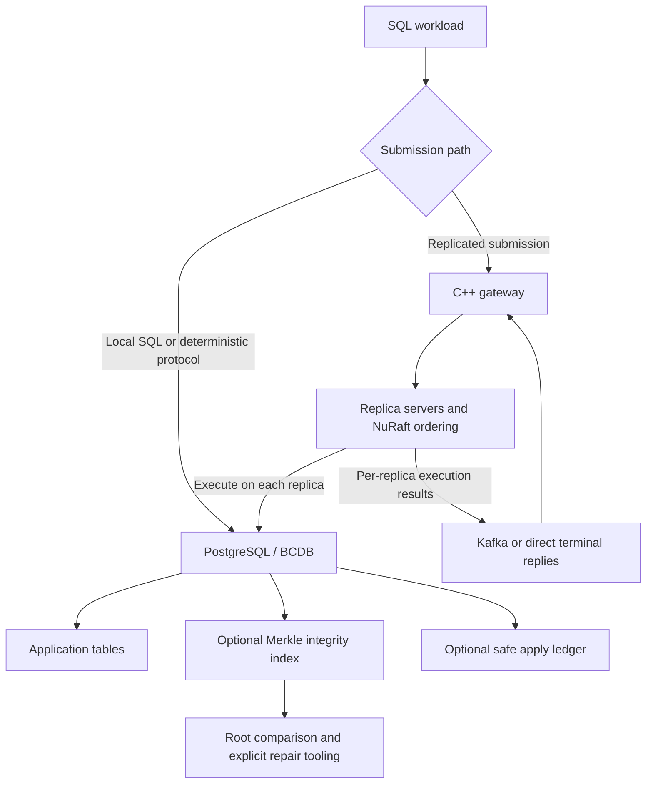

# AriaBC

AriaBC is a PostgreSQL fork with deterministic transaction execution, a native
Merkle integrity index, and an optional C++ Raft/Kafka replication layer. The
source tree identifies its PostgreSQL base as **13devel** in
[configure.in](configure.in); use the binaries built from this repository.

Documentation reviewed against the working tree on **2026-09-23**, including
local changes. Defaults below describe source behavior, not the configuration
or health of a running cluster.

## How the pieces fit together



The PostgreSQL box represents one database in local mode and a separate local
database on each server in replicated mode. Raft orders commands; PostgreSQL
executes them. Kafka carries execution results when that transport is enabled.

| Component | What it does |
|---|---|
| PostgreSQL / BCDB | Runs ordinary SQL or deterministic transactions with ordered conflict handling and commit publication |
| Merkle index | Routes keys into dynamic partition trees and maintains XOR aggregates of canonical BLAKE3 row hashes |
| Gateway and server | Submit requests, replicate command batches, execute them locally, and track terminal results |
| Safe apply ledger | Optional PostgreSQL records for validating and replaying committed Raft work across restart |
| Recovery tooling | Compares trees, localizes differences, repairs rows from a reference dataset, and audits the result |

Merkle is an **index access method**, not a table storage engine or a query
lookup index. Its current format is **10**, with nodes in ordinary PostgreSQL
tables. Heap changes and Merkle changes commit together. Keep normal B-tree
indexes for query access and uniqueness.

## Choose the execution path

These are separate choices: submission transport, deterministic execution,
Merkle maintenance, and safe-ledger recovery. A benchmark mode name does not
fully specify all four.

| Path | Scope |
|---|---|
| Ordinary PostgreSQL SQL | Direct local execution; a Merkle index can also be attached to a logged table |
| Direct BCDB deterministic execution | Local deterministic protocol or block submission; no Raft/Kafka is required |
| Replicated gateway/server execution | NuRaft orders work for replica databases; executor, completion transport, and ledger policy are configurable |
| Sparse recovery benchmark | Compares reference and damaged schemas in one PostgreSQL database and repairs logical row differences |

In particular, the `pg`, `bcdb_det`, and `bcdb_merkle` cases in the direct
all-nodes runner are independent per-host workloads. They are not a replicated
Raft cluster. See the [distributed diagrams](DISTRIBUTED_ARCHITECTURE_DIAGRAM.md)
for request and completion boundaries.

## Repository map

| Path | Contents |
|---|---|
| [src/backend/bcdb](src/backend/bcdb/) | Deterministic execution, shared transaction state, and apply ledger |
| [src/backend/access/merkle](src/backend/access/merkle/) | Merkle build, hashing, transaction staging, maintenance, and verification |
| [src/include/bcdb](src/include/bcdb/) and [merkle.h](src/include/access/merkle.h) | Backend interfaces and Merkle format definitions |
| [ariabc_pg](ariabc_pg/) | C++ gateway, replica server, executor, wire protocol, and durable Raft storage |
| [NuRaft](NuRaft/) | Raft library used by the server |
| [scripts/distributed](scripts/distributed/) | Cluster setup, workload runners, validation, and ledger bootstrap |
| [scripts/benchmark/recovery](scripts/benchmark/recovery/) | Python sparse-repair benchmark and audit tooling |
| [src/test/regress](src/test/regress/) | PostgreSQL and Merkle regression tests |
| [dynamic_merkle_visualizer](dynamic_merkle_visualizer/) | Live UI over the current PostgreSQL Merkle index, plus an isolated real-server demo |
| [Dynamic_merkle_docs](Dynamic_merkle_docs/) | Recovery architecture and reports |

Generated benchmark output belongs in the runner's artifact directory, such as
`scripts/bench_full_results/` or `.bench_tmp/`. A report describes its own run;
it is not a performance guarantee for other workloads or configurations.

## Build

Use a Linux C/C++ toolchain, GNU Make, PostgreSQL build dependencies such as
Readline and zlib, and CMake 3.16 or newer for the C++ layer. Flex/Bison are
needed when regenerating parser sources. The gateway/server uses C++11, libpq,
NuRaft, and normally librdkafka; see [CMakeLists.txt](ariabc_pg/CMakeLists.txt)
for dependency discovery and optional features. `KAFKA_OPTIONAL` permits stub
builds and does not provide a functioning Kafka transport.

Run from the repository root:

```bash
./configure --prefix=/work/ARIABC/install
make -j"$(nproc)"
make install

cmake -S ariabc_pg -B ariabc_pg/build -DCMAKE_BUILD_TYPE=Release
cmake --build ariabc_pg/build \
  --target ariabc_pg_gateway ariabc_pg_server -j"$(nproc)"
```

The C++ binaries are `ariabc_pg/build/bin/ariabc_pg_gateway` and
`ariabc_pg/build/bin/ariabc_pg_server`. Configure libpq discovery to use the
intended installation when multiple PostgreSQL installations are present.

Recovery scripts require Python **3.10+** and **psycopg 3**, as specified in the
[Python dependency contract](scripts/benchmark/recovery/python_requirements_contract.json).
Individual plotting and orchestration tools may have additional dependencies.

## Try the Merkle index

Use a disposable database served by the custom PostgreSQL binary. The bootstrap
registers internal SQL wrappers and creates the internal schema; it requires a
database administrator and must run against the intended database. From the
repository root, replace `aria_demo` with that database's name:

```bash
/work/ARIABC/install/bin/psql -X -v ON_ERROR_STOP=1 -d aria_demo \
  -f scripts/distributed/sql/raft_apply_ledger_schema.sql
/work/ARIABC/install/bin/psql -X -v ON_ERROR_STOP=1 -d aria_demo
```

Then run in `psql` with its default autocommit enabled:

```sql
CREATE TABLE public.merkle_demo (id bigint PRIMARY KEY, payload text);
CREATE INDEX merkle_demo_idx ON public.merkle_demo USING merkle (id);
INSERT INTO public.merkle_demo VALUES (1, 'hello'), (2, 'world');
UPDATE public.merkle_demo SET payload = 'updated' WHERE id = 1;

SELECT merkle_verify('public.merkle_demo'::regclass);
SELECT merkle_root_hash('public.merkle_demo'::regclass);
SELECT merkle_tree_stats('public.merkle_demo'::regclass)::json;
```

Read roots after committing writes. The verifier recomputes the full heap's
row-hash aggregate and compares it with stored partition roots. It does not
validate every internal node or provide a cryptographic membership proof.
The [Merkle quickstart](README_MERKLE.md) includes transaction and audit examples.

## Validation and workload entry points

After configuring/building the PostgreSQL tree, the focused Merkle regressions
can be selected with:

```bash
make -C src/test/regress check-tests \
  TESTS="merkle_functional_index merkle_mc split_merge"
```

These are the tests in [merkle_schedule](src/test/regress/merkle_schedule).
`make check` runs the broader PostgreSQL regression suite. Use a test database
for installed-server checks; do not aim regression tools at application data.

| Entry point | Purpose |
|---|---|
| [run_4node_raft_cluster.sh](scripts/distributed/run_4node_raft_cluster.sh) | Configurable gateway plus replica-server cluster workload |
| [run_parallel_ycsb_all_nodes.sh](scripts/distributed/run_parallel_ycsb_all_nodes.sh) | Direct per-host YCSB comparison across execution modes |
| [test_merkle_consistency.sh](scripts/distributed/test_merkle_consistency.sh) | Distributed Merkle consistency checks |
| [run_merkle_recovery_benchmark.py](scripts/benchmark/recovery/run_merkle_recovery_benchmark.py) | Sparse logical-repair benchmark and audit artifacts |

Inspect each runner's options and host configuration before starting a campaign.
For distributed correctness claims, retain process exit status, per-node logs,
final workload/executor counters, `divergence_count=0`,
`permanent_failures=0`, and post-marker/Merkle PASS evidence. An `ACCEPTED`
response or majority result alone does not establish that all replicas finished.

## Architecture guides

- [Merkle quickstart](README_MERKLE.md): supported SQL, defaults, and verification.
- [Live Merkle inspector](dynamic_merkle_visualizer/README.md): browse native
  nodes and rows, check roots, and issue guarded transactions against PostgreSQL.
- [Merkle implementation reference](MERKLE_INDEX_COMPLETE_DETAILS.md): storage,
  canonical hashing, DML hooks, transaction behavior, and compatibility APIs.
- [Distributed diagrams](DISTRIBUTED_ARCHITECTURE_DIAGRAM.md): topology, command
  flow, completion, and restart boundaries.
- [Gateway/server architecture](ariabc_pg/ARIABC_PG_ARCHITECTURE.md): ordering,
  executor profiles, durable storage, Kafka, and safe-ledger startup.
- [BCDB and Merkle execution flow](ARIABC_BCNDB_MERKLE_FLOW.md): backend
  transaction lifecycle and publication watermarks.
- [Recovery architecture](Dynamic_merkle_docs/RECOVERY_ARCHITECTURE_ANALYSIS.md):
  sparse repair, timing boundaries, and full audit semantics.

See [COPYRIGHT](COPYRIGHT) for the PostgreSQL license and copyright notice, and
component-specific notices for bundled dependencies.
