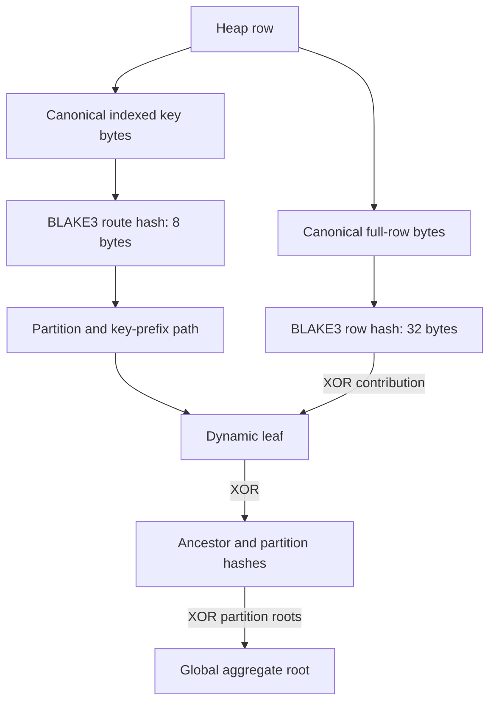
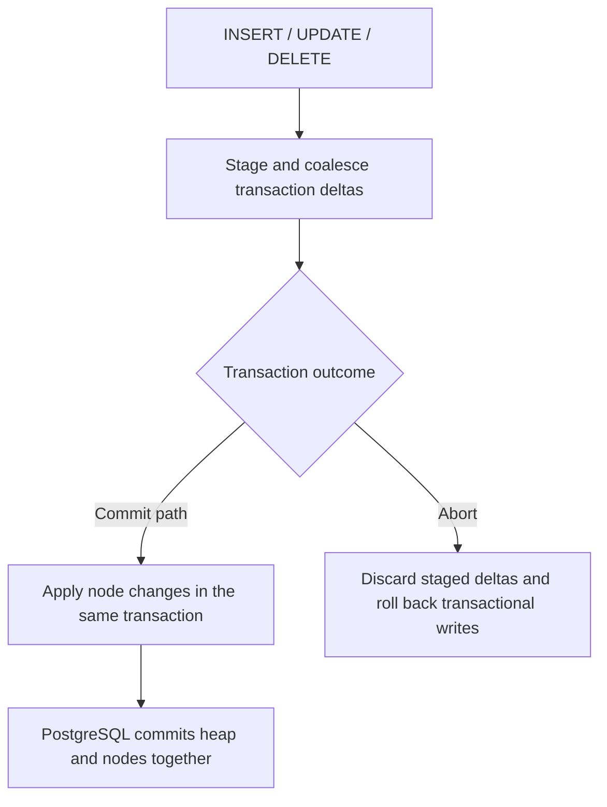

# Native Merkle index: quickstart and operating model

Reviewed against the working tree on **2026-09-22**. The native `merkle` index
maintains partitioned, dynamic trees over a logged PostgreSQL table. Keys choose
where a row belongs; **all live row attributes** contribute to its BLAKE3-256
hash. Tree hashes are XOR aggregates of those row hashes.

Use this guide for SQL and verification. The
[implementation reference](MERKLE_INDEX_COMPLETE_DETAILS.md) explains the source,
storage layout, and transaction hooks; the
[recovery guide](Dynamic_merkle_docs/RECOVERY_ARCHITECTURE_ANALYSIS.md) describes
selective row repair.

## What is stored



The index metapage stores format and geometry. Actual nodes live in
`ariabc_internal.merkle_node_<index_oid>`, an ordinary PostgreSQL relation with
MVCC and WAL. Current versions are **index format 10**, **routing format 4**, and
**row-hash format 1**. There are no immutable copy-on-write node pages or retained
Merkle root journals in this implementation.

Merkle does not support query scans, uniqueness enforcement, or inclusion
proofs. Keep a primary key or ordinary index for lookups. XOR is order independent,
but equal duplicate contributions cancel; matching roots alone are not a proof
against adversarial changes or a substitute for exact row comparison.

## Create an index

Use this repository's PostgreSQL build. On a disposable database named
`aria_demo`, run the current bootstrap as a database administrator from the
repository root:

```bash
/work/ARIABC/install/bin/psql -X -v ON_ERROR_STOP=1 -d aria_demo \
  -f scripts/distributed/sql/raft_apply_ledger_schema.sql
/work/ARIABC/install/bin/psql -X -v ON_ERROR_STOP=1 -d aria_demo
```

The bootstrap installs SQL wrappers and internal tables. Installing it does not
by itself enable safe-ledger mode in a replica server.

In `psql`, with autocommit enabled:

```sql
CREATE TABLE public.merkle_demo (
    id bigint PRIMARY KEY,
    payload text,
    revision integer NOT NULL DEFAULT 0
);

CREATE INDEX merkle_demo_idx ON public.merkle_demo USING merkle (id)
WITH (fanout = 4, split_threshold = 32, merge_threshold = 8, partitions = 200);

INSERT INTO public.merkle_demo (id, payload)
SELECT n, 'value-' || n FROM generate_series(1, 1000) AS g(n);

SELECT merkle_verify('public.merkle_demo'::regclass);
SELECT merkle_tree_stats('public.merkle_demo'::regclass)::json;
```

| Reloption | Source default | Meaning |
|---|---:|---|
| `fanout` | 4 | Branching geometry for key-prefix descent |
| `split_threshold` | 32 | Occupancy trigger for splitting a leaf |
| `merge_threshold` | 8 | Threshold used when merging eligible leaf children |
| `partitions` | 200 | Number of independent top-level partitions |

These defaults come from [merkle.h](src/include/access/merkle.h). Benchmark
profiles may choose different values. Use `merge_threshold < split_threshold`.
Depth limits and shared routing prefixes mean a split threshold is not an
unconditional maximum leaf size. There is no `dynamic` or
`leaves_per_partition` option.

Multi-column routing is supported, for example `USING merkle (tenant_id, id)`.
Only one Merkle index per table is supported. Use permanent logged tables;
TEMP and UNLOGGED tables are rejected. Merkle concurrent index DDL is rejected,
and guarded ALTER TABLE operations require removing/rebuilding the Merkle index
around the schema change. See the reference before changing table structure.

## Writes and transactions



The ordinary SQL path applies staged deltas at PRE_COMMIT. BCDB workers have an
explicit synchronous apply point before their transaction commits, with the
transaction callback as a fallback. A payload-only update changes the row hash
even when the routing key and ordinary indexes do not change.

```sql
BEGIN;
UPDATE public.merkle_demo SET payload = 'changed', revision = revision + 1
WHERE id = 1;
DELETE FROM public.merkle_demo WHERE id = 2;
INSERT INTO public.merkle_demo (id, payload) VALUES (1001, 'new');
COMMIT;

SELECT merkle_verify('public.merkle_demo'::regclass);
```

Read roots **after COMMIT**: fresh-root helpers reject reads while the current
transaction has staged deltas. `merkle_apply_synchronous_direct=off` does not
create an asynchronous maintenance mode; the PRE_COMMIT fallback still applies
staged work. Disabling `enable_merkle_index` is not a supported way to bypass
maintenance on an indexed table: relevant DML paths fail rather than silently
accepting untracked writes.

Rollback and savepoint abort discard their staged changes. PostgreSQL rollback
also handles any node writes already made in that transaction; there is no
separate XOR undo replay. Synchronous maintenance refers to transaction ordering;
WAL flush durability still depends on PostgreSQL settings.

## Supported inspection and verification

| SQL call | Result / scope |
|---|---|
| `merkle_verify(table::regclass)` | Boolean comparison of the visible heap aggregate with stored partition-root aggregate |
| `merkle_verify_index(index::regclass)` | Same verification for a specified Merkle index |
| `merkle_root_hash(table::regclass)` | Global aggregate as hexadecimal text |
| `merkle_root_hash_index(index::regclass)` | Global aggregate for a specified index |
| `merkle_get_partition_root_hashes(index_or_table::regclass)` | Rows containing partition number and hexadecimal hash |
| `merkle_get_partition_root_hash(index_or_table::regclass, partition)` | One partition's hash |
| `merkle_tree_stats(table::regclass)` | JSON text describing geometry, node counts, and format metadata |
| `merkle_key_hash(value)` / `merkle_tuple_hash(record)` | Canonical 8-byte route hash / 32-byte row hash |

For an audit while other sessions may write, acquire a table lock before taking
the verification snapshot:

```sql
BEGIN;
LOCK TABLE public.merkle_demo IN SHARE MODE;
SELECT merkle_verify('public.merkle_demo'::regclass) AS heap_matches_roots;
SELECT merkle_root_hash_index('public.merkle_demo_idx'::regclass) AS root;
SELECT * FROM merkle_get_partition_root_hashes('public.merkle_demo_idx'::regclass)
ORDER BY partition;
COMMIT;
```

This checks the heap aggregate against roots; it does not reconstruct and verify
every intermediate node or tuple count. Across replicas, compare at a common
completed workload boundary with compatible schema, hashing format, and routing
configuration. Use exact row comparison when the claim is full dataset equality.

The catalog retains old fixed-tree helpers such as `merkle_node_hash`,
`merkle_leaf_tuples`, and `merkle_leaf_id`, but they raise unsupported-operation
errors for dynamic trees. Use the supported root APIs and dedicated node tables;
the [reference](MERKLE_INDEX_COMPLETE_DETAILS.md) lists the remaining stubs.

`merkle_recovery_status()` currently reports compatibility READY/zero-lag
values, and `merkle_apply_until()` returns its requested sequence. They do not
measure or drain a background queue. Likewise, the legacy `crash_recovery`
label in `merkle_tree_stats()` does not describe an active delta replay engine.
`BCDB_MERKLE_ROOTS` notices are diagnostics, not final replica verification.

## Rebuild, repair, and tests

`REINDEX INDEX public.merkle_demo_idx` rebuilds metadata from the **current heap**.
It can repair the index representation, but it cannot restore lost or altered
application rows. Logical repair needs a trusted reference dataset. The current
[recovery benchmark](scripts/benchmark/recovery/run_merkle_recovery_benchmark.py)
compares two schemas in one database, descends mismatching partitions, repairs
candidate rows in a transaction, and then performs the configured audit.
It is not an automatic Kafka-triggered repair service or a physical page-repair
protocol.

The focused regression selection, after building the repository, is:

```bash
make -C src/test/regress check-tests \
  TESTS="merkle_functional_index merkle_mc split_merge"
```

See [merkle_functional_index.sql](src/test/regress/sql/merkle_functional_index.sql),
[merkle_mc.sql](src/test/regress/sql/merkle_mc.sql), and
[split_merge.sql](src/test/regress/sql/split_merge.sql) for executable coverage.
For backend execution details read
[BCDB/Merkle flow](ARIABC_BCNDB_MERKLE_FLOW.md); for replicated completion and
restart semantics read the [distributed diagrams](DISTRIBUTED_ARCHITECTURE_DIAGRAM.md).
