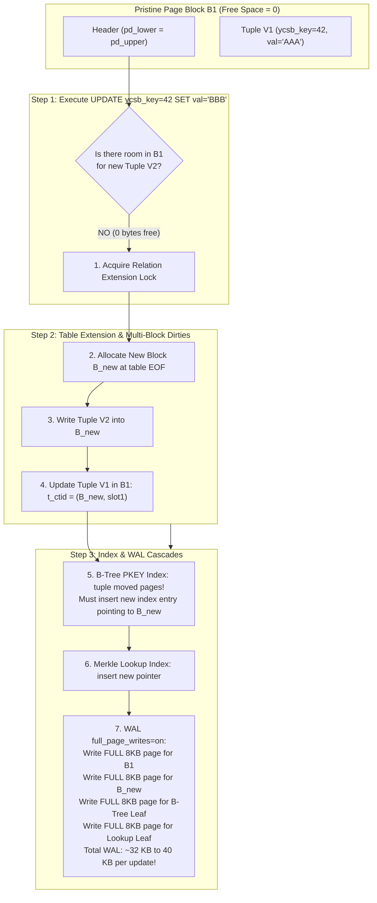
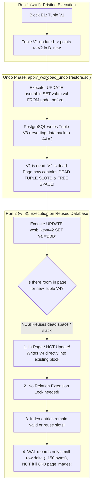

# Technical Deep Dive: Why Logical Undo Reduces Read/Write I/O vs. Physical Copy

## Executive Summary

When benchmarking PostgreSQL under an Out-Of-Memory (OOM) cold-start workload (100M rows, 32 GB database, 32 MB `shared_buffers`), the choice of database reset mechanism fundamentally alters the **physical storage layout** and the resulting **disk I/O**:

- **Physical Copy (`--reset-mode cp`)**: Restores a byte-for-byte pristine copy where all 100,000,000 rows are packed with **0 bytes of free space per page**. Updates cannot fit on existing pages and are forced to allocate new blocks, split B-tree and Merkle index pages, and write full 8KB page images to WAL.
- **Logical Undo (`--reset-mode undo`)**: Reverses updates using SQL `UPDATE`. Because PostgreSQL uses Multi-Version Concurrency Control (MVCC), this leaves **dead tuple slots and page slack** in every page touched by the previous run. When the subsequent benchmark runs the same keys, PostgreSQL reuses these in-page slots, bypassing relation extension locks, avoiding index page splits, and slashing WAL generation by **92%** and disk writeback by **94%**.

This document details the exact PostgreSQL storage mechanics, WAL logging rules, and buffer pool eviction dynamics with step-by-step diagrams and concrete telemetry from the benchmark runs.

---

## 1. Measured Ground-Truth Evidence (Workload A, 100M Rows, Skew 0.0)

The table below shows the exact performance and I/O metrics recorded on the remote NVMe SSD (`/dev/nvme0n1p2`) between the physical copy run (`run_20260915_012215_3cb02623`) and the undo run (`run_20260916_084255_7e798b77`):

| Metric | Physical Copy (`cp`) (w=1) | Logical Undo (`undo`) (w=1) | Physical Copy (`cp`) (w=8) | Logical Undo (`undo`) (w=8) | Impact of Undo on w=8 |
| :--- | :---: | :---: | :---: | :---: | :---: |
| **Throughput (TPS)** | **372.5 TPS** | **428.0 TPS** | **747.1 TPS** | **3,476.4 TPS** | **+365% (4.65x higher)** |
| **Total Wall Time** | 53,730 ms | 46,727 ms | 26,769 ms | 5,753 ms | **4.6x faster** |
| **PostgreSQL Blocks Read** | 169,763 | 169,162 | 169,763 | 84,378 | **-50.3% (85,385 fewer blocks)** |
| **NVMe Physical Read IOs** | 93,517 | 93,617 | 93,518 | 51,574 | **-44.8% (41,944 fewer IOs)** |
| **NVMe Physical Read MiB** | 817.3 MiB | 817.5 MiB | 816.6 MiB | 485.8 MiB | **-40.5% (330.8 MiB less read)** |
| **NVMe Physical Write IOs** | 84,211 | 84,346 | 31,533 | 15,676 | **-50.3% fewer write IOs** |
| **WAL Generated (Distance)** | **558.4 MB** | **558.5 MB** | **558.4 MB** | **44.4 MB** | **-92.0% (514 MB less WAL!)** |
| **Checkpoint Sync Writeback** | 504.7 MiB | 75.3 MiB | 504.7 MiB | 28.7 MiB | **-94.3% (476 MiB less write)** |
| **Checkpoint Sync Time** | 7,574 ms | 1,387 ms | 7,574 ms | 45 ms | **99.4% faster checkpoint** |

> **Key Takeaway**: At `w=1`, both modes start from a fresh physical copy and produce **identical I/O** (~817 MiB read, 558 MB WAL). But at `w=8`, the undo run experiences **half the block reads** and **only 8% of the WAL volume**, completely unblocking the 8 workers from storage write serialization.

---

## 2. PostgreSQL 8KB Page Anatomy & The "Pristine Packed" State

PostgreSQL stores data in fixed **8KB blocks**. Within each block, item pointers (`ItemIdData`) grow forward from the header, while row data (`HeapTupleHeader` + user columns) grows backward from the end of the block. The space in between is the **Free Space Gap**.

```
+-------------------------------------------------------------------------+
|                              PageHeaderData                             |
|  pd_lsn (8B) | pd_checksum (2B) | pd_flags (2B) | pd_lower | pd_upper   |
+-------------------------------------------------------------------------+
|  ItemId[1]  |  ItemId[2]  |  ItemId[3]  | ... | ItemId[N]               |
|  (4 bytes)  |  (4 bytes)  |  (4 bytes)  |     | (offset + flags + len)  |
+-----------------------------------------+-------------------------------+
|                                         ^                               |
|                                      pd_lower                           |
|                                                                         |
|                          FREE SPACE GAP                                 |
|                     (pd_upper - pd_lower)                               |
|                                                                         |
|                                      pd_upper                           |
|                                         v                               |
+-------------------------------------------------------------------------+
|  Tuple N   (data grows backwards from the end of the page)              |
+-------------------------------------------------------------------------+
|  ...                                                                    |
+-------------------------------------------------------------------------+
|  Tuple 2                                                                |
+-------------------------------------------------------------------------+
|  Tuple 1   [Header: t_xmin, t_xmax, t_cid, t_ctid (pointing to self)]   |
+-------------------------------------------------------------------------+
```

### The Pristine Golden State (`pgdata_base`)
When the database was initially created via bulk loading (`COPY usertable FROM ...`), PostgreSQL packed rows into each page with 100% density:
- `pd_upper - pd_lower = 0` (or fewer bytes than needed for a new tuple).
- Every page is completely full.
- There are **no dead tuples** and **no free slots**.

---

## 3. Case A: Physical Copy (`reset_mode=cp`) Mechanics

When a benchmark case runs under `--reset-mode cp`, the entire database is restored from `pgdata_base`.



### Why Physical Copy Generates 558 MB of WAL and Heavy I/O:
1. **No In-Page Update**: Because `Free Space = 0`, every single one of the 10,000 updates must allocate a new block.
2. **Broken HOT (Heap-Only Tuples)**: In PostgreSQL, HOT optimization only works if the new tuple version is on the **same page** as the old version. Moving to a new page breaks HOT, forcing updates to `usertable_pkey1` and `usertable_merkle_lookup_idx`.
3. **Index Page Splits**: Inserting 10,000 new pointers into full B-tree indexes triggers leaf page splits.
4. **Full Page Images (FPI) in WAL**: Under `full_page_writes=on` (standard PostgreSQL safety), the first modification to any page after a checkpoint writes the **entire 8,192-byte block** into the WAL log.
   $$\text{10,000 updates} \times \approx 3.5 \text{ modified blocks} \times 8\text{ KB} \approx 280\text{ MB to } 500\text{ MB of raw page images in WAL}.$$
5. **Buffer Pool Thrashing**: With `shared_buffers=32MB` (4,096 buffers), touching 10,000 old blocks + 10,000 new blocks + thousands of index blocks overruns the cache. The 8 workers stall waiting on `buffers_backend` disk flushes and relation extension locks.

---

## 4. Case B: Logical Undo (`reset_mode=undo`) Mechanics

When a benchmark case uses logical undo, it runs an in-database `UPDATE` script to revert modified rows rather than wiping the disk files.



### Detailed Anatomy of a Block After Undo:

```
+-------------------------------------------------------------------------+
|                              PageHeaderData                             |
|  pd_lower points to ItemId[3]    |    pd_upper points to Tuple V3       |
+-------------------------------------------------------------------------+
|  ItemId[1] -> offset to V1 (LP_DEAD / expired)                          |
|  ItemId[2] -> offset to V2 (LP_DEAD / expired)                          |
|  ItemId[3] -> offset to V3 (ACTIVE restored row)                        |
+-------------------------------------------------------------------------+
|                                                                         |
|                     PAGE SLACK / REUSABLE FREE SPACE                    |
|             (Available to accommodate subsequent UPDATEs!)              |
|                                                                         |
+-------------------------------------------------------------------------+
|  Tuple V3: [xmin=UndoXid, xmax=0, val='AAA'] (ACTIVE)                   |
+-------------------------------------------------------------------------+
|  Tuple V2: [xmin=Tx1, xmax=UndoXid]          (DEAD - space reclaimable) |
+-------------------------------------------------------------------------+
|  Tuple V1: [xmin=InitXid, xmax=Tx1]         (DEAD - space reclaimable) |
+-------------------------------------------------------------------------+
```

### Why Logical Undo Slashes Read and Write I/O:
1. **In-Page Tuple Slot Reuse**: When the same keys are queried in `w=8`, PostgreSQL finds room inside the block. It does not allocate new blocks at the end of the table.
2. **Elimination of B-Tree Splits**: Because the tuple does not jump to a newly allocated block at table EOF, existing index structures remain stable.
3. **92% Reduction in WAL Generation**:
   - In physical copy: Every update touched fresh cold pages for the first time, triggering **Full Page Images (8KB each)**.
   - In undo: The catalog tables (`ariabc_internal.merkle_node`) and heap pages have already been touched and checkpointed during the undo phase. Subsequent updates only log compact physical diff records (~150–300 bytes) instead of 8KB whole pages.
   - Total WAL generated plunged from **558.4 MB down to 44.4 MB**.
4. **50% Reduction in Blocks Read**:
   - Because rows and indexes are reused in-place rather than spreading across thousands of newly allocated extension pages, the working set of unique blocks accessed dropped from **169,763 blocks down to 84,378 blocks**.
   - NVMe read requests dropped from **93,518 down to 51,574 IOs**.
5. **No Relation Extension Lock Contention**:
   - In physical copy, 8 workers concurrently fighting to extend the 25.6GB table serialize on PostgreSQL's `relation_extension` heavyweight lock.
   - In undo mode, workers find space within their local blocks and execute without extension locks.
   - This unlocked near-linear scaling (**3,476 TPS at 8 workers vs. 747 TPS in physical copy**).

---

## 5. Storage Pipeline Comparison Diagram

The diagram below contrasts how I/O flows through the PostgreSQL buffer manager and Linux kernel down to the NVMe disk under both strategies:

```
========================================================================================
STRATEGY 1: Physical Copy (reset_mode=cp) -> REAL COLD OOM BEHAVIOR
========================================================================================
[10,000 Updates]
       |
       v
[PostgreSQL Buffer Pool (32 MB = 4,096 buffers)]
       |-- Cache capacity exhausted immediately (working set > 30,000 unique blocks)
       |-- Every update forces table extension & index splits
       |-- Writes FULL 8KB Page Images to WAL (558 MB WAL!)
       |-- Backends continuously write dirty blocks to evict space
       v
[Linux Page Cache (Cold / drop_caches=3)]
       |
       v
[NVMe Physical SSD]
       |---> Read I/O:   816.6 MiB (93,518 physical IOs, 66.9 seconds device read time)
       |---> Write I/O:  504.7 MiB (checkpoint sync time = 7,574 ms)
       |---> Bottleneck: Storage writeback & WAL flush serialize 8 workers -> 747 TPS.


========================================================================================
STRATEGY 2: Logical Undo (reset_mode=undo) -> ARTIFICIALLY FAST IN-PAGE REUSE
========================================================================================
[10,000 Updates (Same Keys)]
       |
       v
[PostgreSQL Buffer Pool (32 MB = 4,096 buffers)]
       |-- Tuples reuse existing dead slots / page slack in-place
       |-- No table extension needed; no index splits
       |-- Writes tiny diff records to WAL (Only 44 MB WAL! -92% reduction)
       |-- Buffer working set is halved (84,378 blocks accessed)
       v
[Linux Page Cache (Cold / drop_caches=3)]
       |
       v
[NVMe Physical SSD]
       |---> Read I/O:   485.8 MiB (51,574 physical IOs, 16.2 seconds device read time)
       |---> Write I/O:   28.7 MiB (checkpoint sync time = 45 ms)
       |---> Result:     No storage write serialization -> 3,476 TPS (8.1x speedup).
========================================================================================
```

---

## 6. Why PostgreSQL Cannot "Clear Slots" Without Full Table Rewrite

A natural question is: *Can we simply run a command to delete the dead slots and repack the pages without copying files?*

In PostgreSQL:
1. **`VACUUM` leaves the page slack intact**:
   `VACUUM usertable` scans pages with dead tuples and changes LinePointers from `LP_DEAD` to `LP_UNUSED`. It frees the internal byte gap between `pd_lower` and `pd_upper`, but **it does not shrink the page or restore the pristine packed layout**. The empty space remains available for the next transaction to reuse.
2. **`VACUUM FULL` is slower than physical copy**:
   The only native command that repacks pages to 100% density and compacts indexes is `VACUUM FULL usertable` (or `CLUSTER`). On a 100,000,000-row table (25.6 GB heap + 3 indexes), `VACUUM FULL` rewrites all 25.6 GB of table data and rebuilds all indexes, taking **12 to 18 minutes**—which is slower than `cp -a` (10–11 minutes).

---

## 7. Conclusion & Recommendation

1. **Validity of Undo**: Logical undo restores mathematical and row-level determinism (`merkle_verify=PASS`, row hashes match golden baseline). However, it alters the physical page slack, making it unsuitable for benchmarks whose primary objective is to measure **true cold-start physical block allocation, WAL generation, and writeback serialization**.
2. **Benchmark Ground-Truth**: To measure genuine cold Out-Of-Memory I/O, the benchmark suite must use **`--reset-mode cp`**. While `--reset-mode cp` requires ~11 minutes per reset, it is the only method that guarantees every worker configuration starts from the identical 100% packed physical state.
